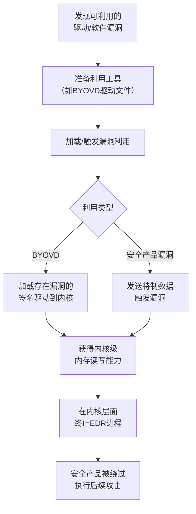

# 利用漏洞削弱防御 (T1687)

## 一句话通俗理解

> **利用漏洞削弱防御就是找到保安系统的漏洞并利用它** -- 不直接关掉监控，而是利用监控系统的漏洞让它"失明"，或者用合法的假监控摄像头替换真摄像头。

## 难度等级

- ⭐⭐⭐ 高级（需要深入技术知识）

需要深入理解操作系统内核机制、驱动漏洞、内核权限提升等底层技术。

## 技术描述

利用漏洞削弱防御（Exploitation for Defense Impairment，T1687）是MITRE ATT&CK框架中防御削弱战术的一种高级技术。

> 📚 **打个比方**：就像你家智能安防系统有一个设计缺陷——用特定方式敲三下门，系统就误以为在测试模式自动关闭所有警报——利用漏洞削弱防御就是攻击者利用安全产品本身的软件漏洞（如BYOVD）绕过防护，而不需要暴力关停它。

**通俗解释：**
想象你家的智能安防系统有一个设计缺陷：如果用特定的方式敲门三次，安防系统就会误以为是在测试模式而自动关闭所有警报。这就是利用漏洞削弱防御 -- 攻击者找到安全产品本身的漏洞，利用这个漏洞绕过它的防护，而不需要暴力地关掉它。

**技术原理：**
与直接禁用安全产品（使用`net stop`或`taskkill`）不同，利用漏洞的方法更加隐蔽。攻击者利用操作系统、驱动程序或安全产品自身的软件漏洞来绕过或削弱防护：

1. **BYOVD（自带漏洞驱动）**：攻击者使用有合法数字签名但存在漏洞的内核驱动程序，利用该驱动的漏洞获取内核级权限。例如，加载RTcore64.sys（存在任意内存读写漏洞的签名驱动），然后通过内核级读写能力终止EDR进程
2. **安全产品漏洞利用**：安全产品本身也是软件，可能存在缓冲区溢出、权限绕过等漏洞。攻击者利用这些漏洞使安全产品失效或绕过检测
3. **竞态条件利用**：利用安全产品扫描或更新的时间窗口，在扫描间隙执行恶意操作

**用途与影响：**
这种方式的核心优势是隐蔽性 -- 攻击者不需要执行`net stop`、`kill`或卸载操作，而是利用漏洞自然绕过防御。安全产品可能报告"正常运行"，但实际上已经被绕过。

## 子技术列表

**该技术没有子技术。**

T1687利用漏洞削弱防御是单一技术，没有定义子技术。它与T1068（利用漏洞提权）的区别在于：T1687的目的是削弱防御本身，而T1067的目的是获得更高权限。

## 攻击流程

### 典型攻击流程

```
发现可利用漏洞 --> 准备利用工具 --> 加载/触发利用 --> 绕过安全控制 --> 执行攻击操作
```



**步骤详解：**

1. **发现可利用漏洞**
   - 通俗描述：攻击者找到一个可以用来绕过安全产品的软件漏洞
   - 技术细节：从公开漏洞库（CVE、Exploit-DB）或LOLDrivers数据库查找可用于BYOVD的漏洞驱动
   - 常用工具：LOLDrivers数据库、CVE搜索引擎

2. **准备利用工具**
   - 通俗描述：下载或编写利用漏洞的工具/驱动文件
   - 技术细节：下载存在漏洞的签名驱动文件（如RTCore64.sys）或编写漏洞利用代码
   - 常用工具：漏洞驱动下载、自定义exploit代码

3. **加载/触发漏洞利用**
   - 通俗描述：在目标系统上安装或运行利用工具
   - 技术细节：通过服务安装接口加载驱动（`sc create` + `sc start`），或通过安全产品的攻击面触发漏洞
   - 常用工具：`sc`命令、自定义loader

4. **获得内核级访问**
   - 通俗描述：利用漏洞获得操作系统的最高权限
   - 技术细节：通过驱动的任意内存读写接口操作内核地址空间
   - 常用工具：自定义内核工具

5. **绕过安全产品**
   - 通俗描述：在高权限下关闭安全软件
   - 技术细节：直接在内核内存中修改安全产品进程的状态或hook系统调用隐藏恶意活动
   - 常用工具：EDR Killers（EDRKillShifter、Terminator等）

## 真实案例

### 案例1：RansomHub使用EDRKillShifter BYOVD禁用EDR（2024-2025年）

- **时间**: 2024-2025年
- **目标**: 全球医疗、制造、金融等行业
- **攻击组织**: RansomHub（勒索软件即服务）
- **手法**: RansomHub操作员使用BYOVD技术加载存在漏洞但已签名的内核驱动（RTCore64.sys），利用驱动中的CVE-2019-16098漏洞获得内核级内存读写能力。攻击者通过驱动程序在内核空间执行任意代码，直接终止EDR进程。RansomHub还专门开发了EDRKillShifter工具，实现了自动化加载漏洞驱动和终止安全产品的流程。该工具后来被Medusa、BianLian、Play等其他勒索软件团伙借鉴使用。
- **影响**: 全球数百家企业遭受勒索软件攻击，部分攻击成功加密并索要赎金
- **参考链接**: [CISA - RansomHub Advisory (2024)](https://www.cisa.gov/news-events/cybersecurity-advisories/aa24-295a)

### 案例2：Qilin和Warlock使用BYOVD攻击（2025-2026年）

- **时间**: 2025-2026年
- **目标**: 全球企业（制造业、金融服务）
- **攻击组织**: Qilin RaaS / Warlock (Water Manaul)
- **手法**: 2025-2026年，Qilin和Warlock两个勒索软件团伙独立部署了BYOVD技术来终止300多个EDR驱动，覆盖所有主流安全厂商的产品。Qilin使用DLL sideloading技术加载`msimg32.dll`，经过四阶段loader最终安装两个未签名的内核驱动（rwdrv.sys和hlpdrv.sys）来清除EDR保护。Warlock则利用Active Directory组策略（GPO）将勒索软件分发到整个域，在受控系统上部署BYOVD驱动NSecKrnl.sys。攻击者在部署勒索软件之前在受害者的网络中停留长达15天，完成了数据窃取和定位。
- **影响**: 多个大型企业遭受严重勒索软件攻击，造成重大经济损失
- **参考链接**: [Cybersec Sentinel - BYOVD Ransomware](https://cybersecsentinel.com/byovd-ransomware-attacks-now-capable-of-defeating-every-major-edr-product)

### 案例3：TrickBot利用驱动漏洞禁用安全工具（2020年）

- **时间**: 2020年
- **目标**: 金融机构
- **攻击组织**: TrickBot组织
- **手法**: TrickBot银行木马利用已知的驱动程序漏洞（包括RTCore64.sys各种版本的漏洞）从内核层禁用端点保护。攻击者使用BYOVD技术加载存在漏洞的驱动，然后利用驱动中的内存操作接口，在内核地址空间中查找并修改安全产品相关进程的内存，使其终止或进入失效状态。由于操作在内核层执行，用户态的EDR进程无法检测到这种行为，且系统日志不会记录安全产品被"停止"的事件。
- **影响**: 大量银行用户遭受金融欺诈和凭证窃取
- **参考链接**: [Microsoft - TrickBot Analysis](https://www.microsoft.com/en-us/security/blog/2020/10/15/trickbot-banking-malware-evolves-with-new-modules-and-techniques/)

### 案例4：Turla利用VirtualBox驱动漏洞绕过防御（2020年）

- **时间**: 2020年
- **目标**: 政府机构、外交部门
- **攻击组织**: Turla APT组织
- **手法**: Turla APT组织利用VirtualBox驱动程序（VBoxDrv.sys）中的漏洞来绕过端点安全产品的监控。攻击者部署了经过Oracle签名的合法VirtualBox驱动，并利用其中的漏洞执行内核级操作。通过利用该驱动，Turla能够从内核层隐藏其恶意进程、文件和网络连接，使用户态的安全产品无法检测到其存在。这种方式使Turla在多个受害者的网络中长期未被发现。
- **影响**: 多个政府机构遭受长期间谍活动，敏感外交信息泄露
- **参考链接**: [ESET - Turla Rootkit Analysis](https://www.welivesecurity.com/2020/08/06/turla-crru-entropy/)

### 案例5：Agenda勒索软件使用BYOVD技术部署Linux变种（2025年）

- **时间**: 2025年
- **目标**: Windows系统企业
- **攻击组织**: Agenda勒索软件
- **手法**: Agenda勒索软件在2025年展示了创新的BYOVD攻击方法，通过远程管理工具和BYOVD技术的结合，将Linux变种部署在Windows系统上实现跨平台攻击。攻击者首先利用BYOVD技术禁用Windows系统的EDR保护，然后通过远程管理工具下载并运行其Linux变种的容器镜像，在一个Windows环境中运行完整的Linux加密器。这种跨平台的混合攻击策略使传统的Windows端点保护完全失效。
- **影响**: 受影响的企业同时被Windows和Linux恶意软件感染
- **参考链接**: [Trend Micro - Agenda Ransomware](https://www.trendmicro.com/en_us/research/25/j/agenda-ransomware-deploys-linux-variant-on-windows-systems.html)

## 红队视角

> ⚠️ **免责声明**：以下内容仅用于合法的安全测试、渗透测试和教育目的。未经授权对他人系统进行测试是违法行为。

### 实战技巧

1. **BYOVD优先策略**
   BYOVD是获取内核权限的最便捷方式。先从LOLDrivers数据库查找目标环境中可用的漏洞驱动。优先选择那些有合法签名的驱动，因为它们不会被安全产品拦截。

2. **漏洞驱动的选择性**
   并不是所有漏洞驱动都适合所有目标。需要根据目标系统的Windows版本、已安装的安全产品选择最合适的驱动和漏洞利用方法。

3. **链式利用**
   如果BYOVD不可行，可以考虑利用安全产品自身的漏洞。安全产品为了获得系统级监控能力，通常有很高的权限和较大的攻击面。

### 常用工具

| 工具名称 | 用途 | 平台 | 链接 |
|----------|------|------|------|
| EDRKillShifter | 自动化BYOVD EDR终止工具 | Windows | 暗网/闭源 |
| Terminator | EDR终止工具 | Windows | 暗网/闭源 |
| EDRSandblast | EDR沙箱逃逸工具 | Windows | [GitHub](https://github.com/wavestone-cdt/EDRSandblast) |
| LOLDrivers | 漏洞驱动数据库 | 网站 | [官网](https://www.loldrivers.io/) |
| CVE-Mitre | CVE漏洞数据库 | 网站 | [官网](https://cve.mitre.org/) |

### 注意事项

- BYOVD攻击需要管理员权限来加载驱动
- 某些EDR有内核级完整性检查，检测SSDT hook
- 加载的漏洞驱动可能被安全产品的驱动黑名单阻止
- Microsoft持续更新Windows Defender Vulnerable Driver Blocklist

## 蓝队视角

### 检测要点

1. **漏洞驱动加载检测**
   - 日志来源：Sysmon事件ID 6（驱动加载），Windows事件ID 7045
   - 关注字段：驱动名称、文件路径、发布者信息
   - 异常特征：已知漏洞驱动的加载（如RTCore64.sys、zam64.sys、gdrv.sys）

2. **非标准驱动加载**
   - 日志来源：Windows事件日志
   - 关注字段：驱动签名状态、驱动文件的原始文件名
   - 异常特征：非标准来源的驱动加载、驱动文件名与实际服务名称不匹配

3. **EDR进程异常行为**
   - 日志来源：EDR自身日志、系统进程监控
   - 关注字段：EDR进程退出代码、服务状态变化
   - 异常特征：EDR服务非预期的停止且无正常的卸载日志

### 监控建议

- 启用Windows Defender Vulnerable Driver Blocklist
- 使用Sysmon事件ID 6监控所有内核驱动加载事件
- 对已知漏洞驱动创建告警规则
- 监控EDR代理的心跳信号，心跳停止立即触发告警
- 启用HVCI（Hypervisor-protected Code Integrity）

## 检测建议

### 网络层检测

**检测方法：** BYOVD攻击的网络特征主要出现在驱动文件下载阶段

**具体规则/命令示例：**
```
# 监控已知漏洞驱动文件的HTTP/SMB下载
```

### 主机层检测

**检测方法：** 监控驱动加载和安全产品行为

**Windows事件ID：**
- 事件ID 7045：新服务安装（驱动加载）
- Sysmon事件ID 6：驱动加载事件
- Sysmon事件ID 11：文件创建（可检测漏洞驱动文件写入）

**具体命令示例：**
```powershell
# 检查已加载的驱动中是否存在已知漏洞驱动
driverquery /v | findstr "RTCore64 zam64 gdrv aswArPot"

# 使用Sysinternals Sigcheck检查所有驱动的签名
sigcheck -w -e C:\Windows\System32\drivers

# 检查Windows Defender漏洞驱动黑名单状态
Get-MpPreference | Select-Object -Property VulnerableDriverBlocklist*
```

### 应用层检测

**Sigma规则示例：**
```yaml
title: Known Vulnerable Driver Load Attempt
status: experimental
description: Detects loading of known vulnerable drivers used in BYOVD attacks
logsource:
    category: driver_load
    product: windows
detection:
    selection:
        ImageLoaded|endswith:
            - '\RTCore64.sys'
            - '\zam64.sys'
            - '\gdrv.sys'
            - '\aswArPot.sys'
            - '\VBoxDrv.sys'
    condition: selection
level: critical
tags:
    - attack.t1687
```

## 缓解措施

### 优先级1：关键措施

**措施名称：** 启用漏洞驱动黑名单和HVCI

**具体实施步骤：**
1. 启用Windows Defender Vulnerable Driver Blocklist
2. 启用HVCI（Hypervisor-Protected Code Integrity）保护
3. 配置WDAC（Windows Defender Application Control）限制驱动加载
4. 确保Secure Boot和TPM已启用

**配置示例：**
```powershell
# 检查HVCI状态
Get-ComputerInfo -Property "DeviceGuard*"

# 启用WDAC
# 参考Microsoft官方文档配置WDAC策略
```

### 优先级2：重要措施

**措施名称：** 限制驱动安装权限

**具体实施步骤：**
1. 限制谁有权在系统上安装和加载驱动程序
2. 使用GPO配置驱动加载限制
3. 定期更新Windows Defender安全智能

### 优先级3：建议措施

**措施名称：** EDR防篡改保护

**具体实施步骤：**
1. 启用EDR/AV的防篡改保护功能（如Windows Defender Tamper Protection）
2. 使用PPL（Protected Process Light）保护EDR进程
3. 部署多层防护，不止依赖单一EDR产品

### MITRE ATT&CK缓解措施映射

| 缓解措施ID | 缓解措施名称 | 适用性 | 说明 |
|------------|-------------|--------|------|
| M1051 | 更新软件 | 适用 | 及时修补已知漏洞驱动 |
| M1047 | 审计 | 适用 | 监控驱动加载事件 |
| M1045 | 代码签名 | 适用 | 验证驱动签名完整性 |
| M1026 | 特权账户管理 | 适用 | 限制驱动安装权限 |
| M1018 | 用户账户管理 | 适用 | 最小权限原则 |

## 动手实验

> ⚠️ **重要提示**：所有实验必须在隔离的实验室环境中进行，禁止对未授权的真实系统进行测试。

### 实验环境准备

**推荐靶场/实验平台：**

| 平台名称 | 类型 | 难度 | 链接 |
|----------|------|------|------|
| Windows 10/11虚拟机 | 虚拟化 | 初级 | 使用Hyper-V或VMware |
| FLARE VM | 恶意分析环境 | 中级 | [GitHub](https://github.com/mandiant/flare-vm) |

**所需工具：**
- Windows 10/11虚拟机（管理员权限）
- Sysinternals Suite
- Process Monitor

**环境搭建：**
```powershell
# 安装Sysinternals
winget install Microsoft.Sysinternals

# 启用驱动加载审计
auditpol /set /subcategory:"Kernel Object" /success:enable /failure:enable
```

### 实验1：查看已加载驱动和安全配置（初级）

**实验目标：** 学习查看当前系统已加载的驱动和安全配置状态

**实验步骤：**
1. 以管理员身份打开命令提示符
2. 运行 `driverquery /v` 查看所有已加载的内核驱动列表
3. 使用 `sigcheck -w` 查看系统驱动签名信息
4. 运行 `Get-MpPreference | Select VulnerableDriverBlocklist*` 检查漏洞驱动黑名单状态
5. 运行 `Get-ComputerInfo -Property "DeviceGuard*"` 检查HVCI状态

**预期结果：** 了解系统的驱动加载和安全机制配置状态

**学习要点：** 熟悉驱动管理和安全配置检查方法

### 实验2：使用Sysmon监控驱动加载事件（中级）

**实验目标：** 配置Sysmon监控内核驱动加载并分析日志

**实验步骤：**
1. 下载Sysmon配置文件（使用SwiftOnSecurity的默认配置）
2. 安装Sysmon：`sysmon64.exe -accepteula -i sysmon-config.xml`
3. 查看Sysmon驱动加载事件：`Get-WinEvent -FilterHashtable @{LogName="Microsoft-Windows-Sysmon/Operational"; ID=6} | Select-Object -First 10 -Property TimeCreated, Message`
4. 加载一个测试驱动（使用Windows自带驱动如`disk.sys`示例），观察日志记录
5. 分析驱动加载事件的详细信息（文件路径、签名状态）

**预期结果：** Sysmon记录每次驱动加载事件的详细信息

**学习要点：** 掌握Sysmon用于检测BYOVD攻击的方法

### 实验3：模拟漏洞驱动检测实验（高级）

**实验目标：** 模拟检测已知漏洞驱动并验证防护措施

**实验步骤：**
1. 下载LOLDrivers项目中的已知漏洞驱动列表
2. 编写PowerShell脚本检查本地系统是否存在已知漏洞驱动
3. 启用Windows Defender Vulnerable Driver Blocklist
4. 尝试加载一个测试用的漏洞驱动（使用VMware或VirtualBox驱动的模拟版本）
5. 验证漏洞驱动块列表是否成功阻止加载

**预期结果：** 通过脚本检测到已知漏洞驱动，验证Windows Defender的阻止效果

**学习要点：** 理解和实践BYOVD攻击的检测和防御

## 术语解释

| 术语 | 英文原名 | 通俗解释 |
|------|----------|----------|
| BYOVD | Bring Your Own Vulnerable Driver | 自带漏洞驱动，攻击者加载有合法签名的漏洞驱动来获取内核权限 |
| 内核驱动 | Kernel Driver | 运行在操作系统核心层的软件，有最高权限 |
| HVCI | Hypervisor-protected Code Integrity | Hypervisor保护的代码完整性，防止内核执行未签名代码 |
| PPL | Protected Process Light | Windows的进程保护机制，阻止非授权进程终止受保护的进程 |
| EDR | Endpoint Detection and Response | 端点检测与响应，监控终端活动的安全产品 |
| CVE | Common Vulnerabilities and Exposures | 通用漏洞披露，公开的漏洞编号系统 |
| SSDT | System Service Dispatch Table | 系统服务调度表，内核系统调用的入口表 |
| LOLDrivers | Living Off the Land Drivers | 生存于土地的驱动程序，指那些存在漏洞的合法签名驱动 |

## 参考资料

### 官方文档

- [MITRE ATT&CK - T1687 Exploitation for Defense Impairment](https://attack.mitre.org/techniques/T1687/)

### 安全报告

- [CISA - RansomHub Advisory (2024)](https://www.cisa.gov/news-events/cybersecurity-advisories/aa24-295a)
- [Microsoft - BYOVD Mitigations](https://docs.microsoft.com/en-us/windows/security/threat-protection/windows-defender-application-control/use-windows-defender-application-control-to-block-vulnerable-drivers)
- [CVE-2019-16098 - RTCore64.sys](https://cve.mitre.org/cgi-bin/cvename.cgi?name=CVE-2019-16098)
- [ESET - Turla Rootkit Analysis](https://www.welivesecurity.com/2020/08/06/turla-crru-entropy/)
- [The Register - EDR Killers in 2024-2025](https://www.theregister.com/special-features/2025/03/31/ransomware-crews-add-edr-killers-to-their-arsenal/660730)

### 工具与资源

- [LOLDrivers - 漏洞驱动数据库](https://www.loldrivers.io/)
- [EDRSandblast - EDR绕过工具](https://github.com/wavestone-cdt/EDRSandblast)
- [Windows Defender Vulnerable Driver Blocklist](https://docs.microsoft.com/en-us/windows/security/threat-protection/windows-defender-application-control/microsoft-recommended-driver-block-rules)

### 学习资料

- [BYOVD攻击原理和防御策略](https://www.halcyon.ai/blog/understanding-byovd-attacks-and-mitigation-strategies)
- [Windows内核驱动开发基础](https://docs.microsoft.com/en-us/windows-hardware/drivers/getting-started/)
