# 凭证访问 (TA0006)

## 一句话理解

**凭证访问就像偷钥匙——攻击者想方设法拿到你的登录密码、令牌或证书，然后冒充你进入系统。**

## 战术概述

凭证访问（Credential Access）是MITRE ATT&CK框架中第九个战术，编号为TA0006。

**通俗解释：**
如果把企业网络比作一栋大楼，初始访问（Initial Access）是撬开了大门，那么凭证访问就是偷到了大楼里每个房间的钥匙。攻击者可以像正常员工一样走来走去，保安（安全设备）很难分辨谁是合法用户、谁是入侵者。攻击者通过转储系统内存中的密码、在网络上嗅探认证流量、暴力破解弱密码、伪造数字证书等方式获取凭证。

**在攻击中的作用：**
凭证访问是横向移动和权限提升的关键前置步骤。没有凭证，攻击者只能控制最初入侵的那一台机器；有了凭证，整个域都可能沦陷。凭证访问通常发生在攻击者获得初始访问之后、进行横向移动之前。根据Recorded Future 2025年报告，凭证窃取是最主要的初始访问向量，2025年被盗凭证达19.5亿条。

**包含的技术类型：**
- 操作系统凭证转储（从内存/数据库中提取密码哈希）
- 网络嗅探与中间人攻击（拦截传输中的凭证）
- 暴力破解与密码喷射（猜测密码）
- 凭证伪造（伪造Kerberos票据、SAML断言、证书）
- 凭证存储提取（从浏览器/密码管理器/配置文件中提取）
- 认证流程篡改（修改认证系统本身）

## 战术在攻击链中的位置

### 攻击链全景图

```mermaid
graph LR
    A["侦察<br/>TA0043"] --> B["资源开发<br/>TA0042"]
    B --> C["初始访问<br/>TA0001"]
    C --> D["执行<br/>TA0002"]
    D --> E["持久化<br/>TA0003"]
    E --> F["权限提升<br/>TA0004"]
    F --> G["隐蔽<br/>TA0005"]
    G --> H["防御削弱<br/>TA0112"]
    H --> I["凭证访问<br/>TA0006"]
    I --> J["发现<br/>TA0007"]
    J --> K["横向移动<br/>TA0008"]
    K --> L["收集<br/>TA0009"]
    L --> M["命令与控制<br/>TA0011"]
    M --> N["数据窃取<br/>TA0010"]
    N --> O["影响<br/>TA0040"]

    style I fill:#ff6b6b,stroke:#333,stroke-width:3px,color:#fff
```

### 当前战术的角色

凭证访问位于攻击链的中期阶段，连接"防御削弱"与"发现"战术。攻击者必须先拿到有效凭证，才能在内网中自由移动、发现更多目标、窃取数据。没有凭证访问这一步，攻击者会被限制在最初入侵的单一系统上，无法扩大战果。

### 前置战术

- **防御削弱（TA0112）**：攻击者先关闭杀毒软件、禁用日志记录，然后执行凭证访问才能不被发现
- **权限提升（TA0004）**：获取管理员权限后才能执行某些凭证转储操作（如LSASS内存读取）
- **初始访问（TA0001）**：需要在目标系统上有执行代码的能力才能开始凭证收集

### 后续战术

- **发现（TA0007）**：用窃取的凭证登录系统，了解网络环境
- **横向移动（TA0008）**：用窃取的凭证跳转到更多机器
- **收集（TA0009）**：用合法凭证访问敏感数据而不触发告警

## 技术索引表

| 技术ID | 中文名称 | 难度 | 子技术数 | 一句话理解 | 文档状态 |
|--------|----------|:----:|:--------:|------------|:--------:|
| [T1003](./T1003-OS-Credential-Dumping.md) | 操作系统凭证转储 | ⭐⭐ | 8 | 从系统内存和数据库中把密码哈希"倒"出来 | ✅ 已完成 |
| [T1040](./T1040-Network-Sniffing.md) | 网络嗅探 | ⭐ | 0 | 在网络上"偷听"传输中的密码 | ✅ 已完成 |
| [T1056](./T1056-Input-Capture.md) | 输入捕获 | ⭐⭐ | 4 | 记录你键盘敲了什么、屏幕点了什么 | ✅ 已完成 |
| [T1110](./T1110-Brute-Force.md) | 暴力破解 | ⭐ | 4 | 一个一个试密码，总能试对 | ✅ 已完成 |
| [T1111](./T1111-Multi-Factor-Authentication-Interception.md) | 多因素认证拦截 | ⭐⭐⭐ | 0 | 连你的手机验证码也一起偷走 | ✅ 已完成 |
| [T1141](./T1141-Input-Prompt.md) | 输入提示 | ⭐⭐ | 0 | 弹个假的登录框骗你输密码 | ✅ 已完成 |
| [T1187](./T1187-Forced-Authentication.md) | 强制认证 | ⭐⭐ | 0 | 逼你的电脑自动把密码发给攻击者 | ✅ 已完成 |
| [T1212](./T1212-Exploitation-for-Credential-Access.md) | 凭证访问漏洞利用 | ⭐⭐⭐ | 0 | 利用软件漏洞直接偷密码 | ✅ 已完成 |
| [T1503](./T1503-Credentials-from-Web-Browsers.md) | 浏览器凭证窃取 | ⭐ | 0 | 从浏览器记住的密码里提取明文 | ✅ 已完成 |
| [T1528](./T1528-Steal-Application-Access-Token.md) | 窃取应用访问令牌 | ⭐⭐ | 0 | 偷走OAuth令牌，不用密码也能登录 | ✅ 已完成 |
| [T1539](./T1539-Steal-Web-Session-Cookie.md) | 窃取Web会话Cookie | ⭐⭐ | 0 | 偷走浏览器的"登录凭证小纸条" | ✅ 已完成 |
| [T1550](./T1550-Use-Alternate-Authentication-Material.md) | 使用替代认证材料 | ⭐⭐⭐ | 4 | 不用密码，拿哈希或票据直接登录 | ✅ 已完成 |
| [T1552](./T1552-Unsecured-Credentials.md) | 不安全的凭证 | ⭐ | 8 | 在配置文件、脚本里找到别人留下的密码 | ✅ 已完成 |
| [T1555](./T1555-Credentials-from-Password-Stores.md) | 密码存储凭证提取 | ⭐⭐ | 6 | 从密码管理器和系统保险箱里偷密码 | ✅ 已完成 |
| [T1556](./T1556-Modify-Authentication-Process.md) | 修改认证流程 | ⭐⭐⭐ | 9 | 改掉门锁的结构，让自己的钥匙能开门 | ✅ 已完成 |
| [T1557](./T1557-Adversary-in-the-Middle.md) | 中间人攻击 | ⭐⭐ | 4 | 夹在你和服务器之间偷看通信内容 | ✅ 已完成 |
| [T1558](./T1558-Steal-or-Forge-Kerberos-Tickets.md) | 窃取或伪造Kerberos票据 | ⭐⭐⭐ | 4 | 伪造域认证的"通行证" | ✅ 已完成 |
| [T1606](./T1606-Forge-Web-Credentials.md) | 伪造Web凭证 | ⭐⭐⭐ | 2 | 伪造SAML/OAuth令牌冒充任何用户 | ✅ 已完成 |
| [T1649](./T1649-Steal-Authentication-Certificate.md) | 窃取或伪造认证证书 | ⭐⭐⭐ | 0 | 偷走数字证书的私钥 | ✅ 已完成 |

## 子技术索引

| 子技术ID | 名称 | 难度 | 一句话理解 | 文档状态 |
|----------|------|:----:|-----------|:--------:|
| [T1003.001](./T1003/T1003.001-LSASS-Memory-Dump.md) | LSASS内存转储 | ⭐⭐ | 从系统内存中提取正在使用的密码哈希 | ✅ 已完成 |
| [T1003.002](./T1003/T1003.002-Security-Account-Manager.md) | SAM注册表 | ⭐⭐ | 从本地账户数据库中提取密码哈希 | ✅ 已完成 |
| [T1003.003](./T1003/T1003.003-NTDS-Database.md) | NTDS数据库 | ⭐⭐ | 从域控制器中提取所有域用户的密码哈希 | ✅ 已完成 |
| [T1003.004](./T1003/T1003.004-LSA-Secrets-LSA-Secrets.md) | LSA Secrets | ⭐⭐ | 提取系统服务账户的密码 | ✅ 已完成 |
| [T1003.005](./T1003/T1003.005-Cached-Domain-Credentials.md) | 缓存域凭证 | ⭐⭐ | 提取缓存的域登录凭证 | ✅ 已完成 |
| [T1003.006](./T1003/T1003.006-DCSync-DCSync.md) | DCSync | ⭐⭐ | 模拟域控制器"复制"所有域凭证 | ✅ 已完成 |
| [T1003.007](./T1003/T1003.007--proc-Filesystem-.md) | /proc文件系统 | ⭐⭐ | 从Linux进程内存中提取凭证 | ✅ 已完成 |
| [T1003.008](./T1003/T1003.008--etc-passwd-and--etc-shadow--etc-passwd和-etc-shadow.md) | /etc/passwd和/etc/shadow | ⭐⭐ | 读取Linux密码文件并离线破解 | ✅ 已完成 |
| [T1056.001](./T1056/T1056.001-Web-Portal-Capture.md) | Web门户捕获 | ⭐⭐ | 创建假的登录页面骗取真实密码 | ✅ 已完成 |
| [T1056.002](./T1056/T1056.002-GUI-Input-Capture.md) | GUI输入捕获 | ⭐⭐ | 用键盘记录器记录所有按键 | ✅ 已完成 |
| [T1056.003](./T1056/T1056.003-Web-Credential-API.md) | Web凭证API | ⭐⭐ | 利用浏览器API窃取保存的凭证 | ✅ 已完成 |
| [T1056.004](./T1056/T1056.004-Credential-API-Hooking.md) | 凭证API钩子 | ⭐⭐ | 拦截系统认证函数的调用 | ✅ 已完成 |
| [T1110.001](./T1110/T1110.001-Password-Guessing.md) | 密码猜测 | ⭐ | 根据目标信息（生日、公司名）猜测可能的密码 | ✅ 已完成 |
| [T1110.002](./T1110/T1110.002-Password-Cracking.md) | 密码破解 | ⭐ | 离线破解已获取的密码哈希 | ✅ 已完成 |
| [T1110.003](./T1110/T1110.003-Password-Spraying.md) | 密码喷射 | ⭐ | 用少数常见密码对大量账户尝试 | ✅ 已完成 |
| [T1110.004](./T1110/T1110.004-Credential-Stuffing.md) | 凭证填充 | ⭐ | 用泄露的密码库直接尝试登录 | ✅ 已完成 |
| [T1550.001](./T1550/T1550.001-Application-Access-Token-Application-Access-Token.md) | Application Access Token | ⭐⭐⭐ | 用偷来的OAuth令牌访问云API | ✅ 已完成 |
| [T1550.002](./T1550/T1550.002-Pass-the-Hash-Pass-the-Hash.md) | Pass the Hash | ⭐⭐⭐ | 用密码哈希代替密码登录Windows系统 | ✅ 已完成 |
| [T1550.003](./T1550/T1550.003-Pass-the-Ticket-Pass-the-Ticket.md) | Pass the Ticket | ⭐⭐⭐ | 用Kerberos票据代替密码登录域资源 | ✅ 已完成 |
| [T1550.004](./T1550/T1550.004-Web-Session-Cookie-Web-Session-Cookie.md) | Web Session Cookie | ⭐⭐⭐ | 用偷来的会话Cookie登录Web应用 | ✅ 已完成 |
| [T1552.001](./T1552/T1552.001-Credentials-in-Files-Credentials-in-Files.md) | Credentials in Files | ⭐ | 在配置文件和脚本中找到明文密码 | ✅ 已完成 |
| [T1552.002](./T1552/T1552.002-Credentials-in-Registry-Credentials-in-Registry.md) | Credentials in Registry | ⭐ | 从Windows注册表里提取保存的密码 | ✅ 已完成 |
| [T1552.003](./T1552/T1552.003-Bash-History-Bash-History.md) | Bash History | ⭐ | 从命令行历史记录中翻出输入过的密码 | ✅ 已完成 |
| [T1552.004](./T1552/T1552.004-Certificates-Certificates.md) | Certificates | ⭐ | 窃取数字证书的私钥 | ✅ 已完成 |
| [T1552.005](./T1552/T1552.005-Cloud-Instance-Metadata-API-Cloud-Instance-Metadata-API.md) | Cloud Instance Metadata API | ⭐ | 从云服务器"元数据"接口获取临时凭证 | ✅ 已完成 |
| [T1552.006](./T1552/T1552.006-Group-Policy-Preferences-Group-Policy-Preferences.md) | Group Policy Preferences | ⭐ | 从域策略文件中解密管理员密码 | ✅ 已完成 |
| [T1552.007](./T1552/T1552.007-Container-Credentials-Container-Credentials.md) | Container Credentials | ⭐ | 从容器环境中提取硬编码密钥 | ✅ 已完成 |
| [T1552.008](./T1552/T1552.008-Chat-Platform-Credentials-Chat-Platform-Credentials.md) | Chat Platform Credentials | ⭐ | 从聊天记录里找到不小心发出的密码 | ✅ 已完成 |
| [T1555.001](./T1555/T1555.001-Keychain-Keychain.md) | Keychain | ⭐⭐ | 窃取macOS系统钥匙串中的所有密码 | ✅ 已完成 |
| [T1555.002](./T1555/T1555.002-Securityd-Securityd.md) | Securityd | ⭐⭐ | 直接从macOS安全服务进程内存中提取密码 | ✅ 已完成 |
| [T1555.003](./T1555/T1555.003-Web-Browsers-Web-Browsers.md) | Web Browsers | ⭐⭐ | 从Chrome/Firefox/Edge保存的密码中提取明文 | ✅ 已完成 |
| [T1555.004](./T1555/T1555.004-Windows-Credential-Manager-Windows-Credential-Manager.md) | Windows Credential Manager | ⭐⭐ | 提取Windows凭据管理器中保存的登录信息 | ✅ 已完成 |
| [T1555.005](./T1555/T1555.005-Password-Managers-Password-Managers.md) | Password Managers | ⭐⭐ | 从1Password/LastPass/KeePass等工具中提取密码 | ✅ 已完成 |
| [T1555.006](./T1555/T1555.006-Group-Policies-Group-Policies.md) | Group Policies | ⭐⭐ | 解密域策略中嵌入的管理员密码 | ✅ 已完成 |
| [T1556.001](./T1556/T1556.001-Domain-Controller-Authentication-Domain-Controller-Authentication.md) | Domain Controller Authentication | ⭐⭐⭐ | 修改域控的认证流程以捕获所有登录密码 | ✅ 已完成 |
| [T1556.002](./T1556/T1556.002-Password-Filter-DLL-Password-Filter-DLL.md) | Password Filter DLL | ⭐⭐⭐ | 安装密码过滤器，在用户改密码时记录新密码 | ✅ 已完成 |
| [T1556.003](./T1556/T1556.003-Pluggable-Authentication-Modules-Pluggable-Authentication-Modules.md) | Pluggable Authentication Modules | ⭐⭐⭐ | 修改Linux的认证模块，添加后门密码 | ✅ 已完成 |
| [T1556.004](./T1556/T1556.004-Network-Device-Authentication-Network-Device-Authentication.md) | Network Device Authentication | ⭐⭐⭐ | 在路由器/交换机上添加后门用户或改认证配置 | ✅ 已完成 |
| [T1556.005](./T1556/T1556.005-Reversible-Encryption-Reversible-Encryption.md) | Reversible Encryption | ⭐⭐⭐ | 将域账户密码改为可解密格式存储在AD中 | ✅ 已完成 |
| [T1556.006](./T1556/T1556.006-Multi-Factor-Authentication-Multi-Factor-Authentication.md) | Multi-Factor Authentication | ⭐⭐⭐ | 修改或绕过多因素认证配置 | ✅ 已完成 |
| [T1556.007](./T1556/T1556.007-Hybrid-Identity-Hybrid-Identity.md) | Hybrid Identity | ⭐⭐⭐ | 在混合云身份环境中添加受控的信任关系 | ✅ 已完成 |
| [T1556.008](./T1556/T1556.008-Network-Provider-DLL-Network-Provider-DLL.md) | Network Provider DLL | ⭐⭐⭐ | 安装恶意网络提供程序捕获网络认证密码 | ✅ 已完成 |
| [T1556.009](./T1556/T1556.009-Conditional-Access-Policy-Conditional-Access-Policy.md) | Conditional Access Policy | ⭐⭐⭐ | 修改云端的条件访问策略绕过安全限制 | ✅ 已完成 |
| [T1557.001](./T1557/T1557.001-LLMNR-NBT-NS-Poisoning-and-SMB-Relay-LLMNR-NBT-NS-Poisoning-and-SMB-Relay.md) | LLMNR/NBT-NS Poisoning and SMB Relay | ⭐⭐ | 毒化名称解析，骗你的电脑把密码发给攻击者的机器 | ✅ 已完成 |
| [T1557.002](./T1557/T1557.002-ARP-Cache-Poisoning-ARP-Cache-Poisoning.md) | ARP Cache Poisoning | ⭐⭐ | 伪造IP和MAC地址的对应关系，让流量走攻击者的机器 | ✅ 已完成 |
| [T1557.003](./T1557/T1557.003-DHCP-Spoofing-DHCP-Spoofing.md) | DHCP Spoofing | ⭐⭐ | 用假的DHCP服务器分配恶意网络配置 | ✅ 已完成 |
| [T1557.004](./T1557/T1557.004-Mutual-Authentication-Impairment-Mutual-Authentication-Impairment.md) | Mutual Authentication Impairment | ⭐⭐ | 破坏双向证书验证，让攻击者能解密加密流量 | ✅ 已完成 |
| [T1558.001](./T1558/T1558.001-Golden-Ticket-Golden-Ticket.md) | Golden Ticket | ⭐⭐⭐ | 伪造Kerberos通票，可以冒充任何域用户 | ✅ 已完成 |
| [T1558.002](./T1558/T1558.002-Silver-Ticket-Silver-Ticket.md) | Silver Ticket | ⭐⭐⭐ | 伪造服务票，不用联系域控也能访问特定服务 | ✅ 已完成 |
| [T1558.003](./T1558/T1558.003-Kerberoasting-Kerberoasting.md) | Kerberoasting | ⭐⭐⭐ | 申请服务票据离线破解服务账户密码 | ✅ 已完成 |
| [T1558.004](./T1558/T1558.004-AS-REP-Roasting-AS-REP-Roasting.md) | AS-REP Roasting | ⭐⭐⭐ | 针对不需要预认证的账户直接破解密码 | ✅ 已完成 |
| [T1606.001](./T1606/T1606.001-SAML-Tokens-SAML-Tokens.md) | SAML Tokens | ⭐⭐⭐ | 伪造SAML单点登录断言，冒充任何用户访问企业应用 | ✅ 已完成 |
| [T1606.002](./T1606/T1606.002-OAuth-Tokens-OAuth-Tokens.md) | OAuth Tokens | ⭐⭐⭐ | 伪造OAuth访问令牌，未经授权访问云API和资源 | ✅ 已完成 |

### 统计信息

- **技术总数**：19 个
- **子技术总数**：53 个
- **已完成文档**：53 个
- **进行中文档**：0 个
- **待编写文档**：0 个

## 推荐阅读顺序

### 入门阶段（第1-2周）

> 适合零基础的安全爱好者，从最简单、最直观的技术开始。

**前置知识：** 了解基本的Windows和Linux操作系统概念、会使用命令行工具

**推荐阅读：**

1. **[T1110 暴力破解](./T1110-Brute-Force.md)** - 最简单直接的凭证获取方式，用Hydra试密码就能理解
2. **[T1552 不安全的凭证](./T1552-Unsecured-Credentials.md)** - 找到别人"藏"在配置文件、脚本里的密码
3. **[T1503 浏览器凭证窃取](./T1503-Credentials-from-Web-Browsers.md)** - 从浏览器提取记住的密码，实操性强
4. **[T1040 网络嗅探](./T1040-Network-Sniffing.md)** - 用Wireshark抓包就能看到明文密码

**学习建议：**
- 在虚拟机中搭建实验环境实操，不要只读理论
- 从初级难度的技术入手，建立信心后再深入

### 进阶阶段（第3-4周）

> 适合有一定基础的学习者，开始接触更复杂的技术。

**前置知识：** 了解Windows域环境、熟悉Active Directory基本概念

**推荐阅读：**

1. **[T1003 操作系统凭证转储](./T1003-OS-Credential-Dumping.md)** - 凭证访问的"必修课"，mimikatz是红队标配
2. **[T1558 窃取或伪造Kerberos票据](./T1558-Steal-or-Forge-Kerberos-Tickets.md)** - 域环境中的核心攻击技术
3. **[T1550 使用替代认证材料](./T1550-Use-Alternate-Authentication-Material.md)** - Pass-the-Hash/Ticket的原理和实践
4. **[T1539 窃取Web会话Cookie](./T1539-Steal-Web-Session-Cookie.md)** - 会话劫持技术，现代攻击的重点

**学习建议：**
- 搭建自己的域环境（1台DC+1台成员服务器）进行实操
- 学习使用mimikatz、Impacket等工具

### 高级阶段（第5-6周）

> 适合有较好技术基础的学习者，深入理解复杂技术原理。

**前置知识：** 熟悉OAuth/SAML认证协议、了解证书体系、有渗透测试经验

**推荐阅读：**

1. **[T1556 修改认证流程](./T1556-Modify-Authentication-Process.md)** - 最高级的凭证攻击，修改认证系统本身
2. **[T1606 伪造Web凭证](./T1606-Forge-Web-Credentials.md)** - SAML/OAuth令牌伪造，云安全的噩梦
3. **[T1111 多因素认证拦截](./T1111-Multi-Factor-Authentication-Interception.md)** - 绕过MFA的各种手段，2025年增长最快的攻击方式
4. **[T1649 窃取或伪造认证证书](./T1649-Steal-Authentication-Certificate.md)** - 证书攻击，Golden SAML等高级技术
5. **[T1212 凭证访问漏洞利用](./T1212-Exploitation-for-Credential-Access.md)** - 利用漏洞获取凭证

**学习建议：**
- 阅读Mandiant、Microsoft的安全分析报告
- 关注2024-2026年的真实攻击案例

## 参考资料

### 官方文档

- [MITRE ATT&CK - 凭证访问战术 (TA0006)](https://attack.mitre.org/tactics/TA0006/)
- [MITRE ATT&CK Enterprise Matrix](https://attack.mitre.org/matrices/enterprise/)

### 学习资源

- [CISA - 凭证访问防御指南](https://www.cisa.gov/) - 美国网络安全和基础设施安全局的防御建议
- [Microsoft - 凭证保护最佳实践](https://learn.microsoft.com/en-us/windows/security/identity-protection/credential-guard/) - Windows凭证保护官方文档
- [Mandiant - M-Trends 威胁报告](https://www.mandiant.com/resources/mtrends) - 年度威胁趋势报告

### 相关工具

- [Mimikatz](https://github.com/gentilkiwi/mimikatz) - 最经典的Windows凭证提取工具
- [Impacket](https://github.com/fortra/impacket) - Python网络协议工具集，支持多种凭证攻击
- [Responder](https://github.com/SpiderLabs/Responder) - LLMNR/NBT-NS投毒工具
- [Hashcat](https://hashcat.net/hashcat/) - 最强大的密码哈希破解工具
