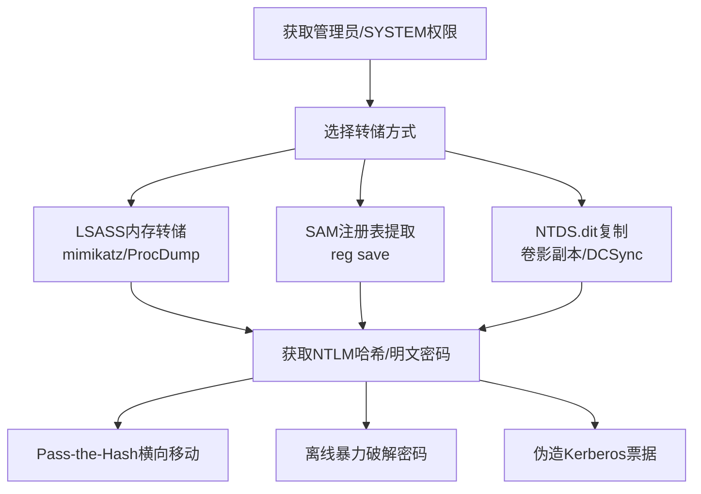

# 操作系统凭证转储 (T1003)

## 一句话通俗理解

**就像从保险箱里倒出所有钥匙——攻击者把系统内存或数据库中存储的密码哈希"倒"出来，直接用来开门。**

## 30秒速查卡

| 维度 | 你需要知道的 |
|------|-------------|
| 这是什么？ | 从Windows/Linux系统内存或数据库中提取密码哈希，用于离线破解或横向移动 |
| 为什么危险？ | 密码哈希存储在内存和文件中，攻击者可以用mimikatz等工具轻松提取，拿到哈希就能冒充任何登录过的用户 |
| 谁需要关心？ | 域管理员、Windows安全工程师、SOC分析师 |
| 你的第一步防御 | 启用Credential Guard保护内存中的凭证，部署EDR监控lsass.exe的异常访问 |
| 如果只做一件事 | 监控对lsass.exe进程的异常内存访问（Sysmon事件ID 10），任何非系统进程打开lsass都值得立即告警 |

## 难度等级

- ⭐⭐ 中级（需要一定基础）

## 前置知识检查

**读这个文件需要什么？**

- [ ] 进程与内存空间：了解每个程序有自己独立的内存"工作区"——就像每个办公桌属于不同员工，管理员可以查看任何人的桌面
- [ ] NTLM认证基础：了解Windows网络认证的核心概念——用密码的"指纹"（NTLM哈希）来证明身份，而不是直接用原始密码
- [ ] 权限级别概念：理解Windows管理员（Administrator）与SYSTEM权限的差异——管理员是"最高权限用户"，SYSTEM是"操作系统自己"的权限，SYSTEM能读到管理员也读不到的数据

## 技术描述

操作系统凭证转储（T1003）是MITRE ATT&CK框架中凭证访问战术的一种核心技术。

**过渡段：** 理解凭证转储的关键不在于"怎么读取LSASS内存"，而在于"为什么密码必然存在于内存中"。Windows为了实现单点登录体验（SSO），在用户登录后必须将凭证缓存到LSASS进程内存中，以便后续访问文件共享、打印机等网络资源时自动完成认证。这意味着：只要系统上有用户登录过，其密码哈希就一定在内存中的某个位置，攻击者要做的只是通过合适的API"伸手去拿"。这就像酒店前台必须记录所有客人的房号才能帮他们开门——攻击者冒充酒店经理，让前台把所有房号抄给他，出门后就能用这些号码进入任何房间。

**通俗解释：**
Windows系统为了让用户不用每次都输密码，会把密码的"加密版"（哈希）缓存到内存和文件中。就像你进大楼刷卡后，闸机会记住你的卡号一段时间。攻击者用特殊工具（如mimikatz）读取这些缓存，就能拿到密码哈希——然后直接用这些哈希登录其他电脑（Pass-the-Hash），或者暴力破解出原始密码。

**技术原理：**
1. 当用户登录Windows时，系统在LSASS进程内存中缓存用户的认证凭证（NTLM哈希、Kerberos票据等）
2. 管理员权限的进程可以读取LSASS进程的内存空间
3. 攻击者使用mimikatz、ProcDump等工具，通过Windows API（如MiniDumpWriteDump）将LSASS内存转储为文件
4. 离线分析转储文件，提取NTLM哈希和明文密码（如果启用了WDigest）
5. 使用提取的凭证进行横向移动（Pass-the-Hash）或离线破解

**用途与影响：**
凭证转储是最常用的凭证访问技术之一，几乎所有高级APT组织和勒索软件操作都使用至少一种变体。拿到域控制器的凭证（NTDS.dit或DCSync），就等于拿到了整个域的"万能钥匙"。2025年Recorded Future检测到超过19.5亿条被盗凭证，其中大部分通过凭证转储和信息窃取类恶意软件获取。

## 子技术列表

**该技术共有 8 个子技术：**

| 子技术ID | 中文名称 | 通俗解释 |
|----------|----------|----------|
| T1003.001 | LSASS内存转储 | 从系统内存中提取正在使用的密码哈希 |
| T1003.002 | SAM注册表 | 从本地账户数据库中提取密码哈希 |
| T1003.003 | NTDS数据库 | 从域控制器中提取所有域用户的密码哈希 |
| T1003.004 | LSA Secrets | 提取系统服务账户的密码 |
| T1003.005 | 缓存域凭证 | 提取缓存的域登录凭证 |
| T1003.006 | DCSync | 模拟域控制器"复制"所有域凭证 |
| T1003.007 | /proc文件系统 | 从Linux进程内存中提取凭证 |
| T1003.008 | /etc/passwd和/etc/shadow | 读取Linux密码文件并离线破解 |

<details>
<summary><strong>展开查看各子技术详细说明</strong></summary>

各子技术详细说明请参阅独立文档：

- [T1003.001 - LSASS内存转储](./T1003/T1003.001-LSASS-Memory-Dump.md) — 从Windows的认证进程（LSASS）内存中把正在使用的密码哈希读出来。
- [T1003.002 - SAM注册表](./T1003/T1003.002-Security-Account-Manager.md) — 从Windows注册表中读取本地用户的密码哈希。
- [T1003.003 - NTDS数据库](./T1003/T1003.003-NTDS-Database.md) — 从域控制器上偷走所有域用户的密码"账本"。
- [T1003.006 - DCSync攻击](./T1003/T1003.006-DCSync-DCSync.md) — 假装自己是域控制器，让真的域控制器把所有人的密码"同步"给你。

</details>

## 攻击流程

```
准备权限 --> 选择目标 --> 转储凭证 --> 提取哈希 --> 横向移动
```



**步骤详解：**

1. **获取管理员权限**
   - 通俗描述：先成为电脑的"超级管理员"（SYSTEM或root），因为普通用户没有权限读取别人的密码
   - 技术细节：通过漏洞利用、权限提升或窃取管理员凭证获得高权限
   - 常用工具：漏洞利用工具、Cobalt Strike

2. **选择转储方式**
   - 通俗描述：选择一种"倒密码"的方法，不同的目标用不同的招
   - 技术细节：根据目标系统选择LSASS转储（当前登录用户）、SAM提取（本地用户）或DCSync（域环境）
   - 常用工具：mimikatz、ProcDump、Impacket secretsdump

3. **转储并提取凭证**
   - 通俗描述：执行工具把密码倒出来，拿到密码的"加密版"或明文
   - 技术细节：在内存或文件中提取NTLM哈希，如果启用了WDigest可获取明文密码
   - 常用工具：mimikatz `sekurlsa::logonpasswords`、comsvcs.dll MiniDump

4. **使用凭证**
   - 通俗描述：用偷到的密码直接登录其他电脑
   - 技术细节：Pass-the-Hash（用哈希直接认证）、离线破解（用Hashcat暴力破解哈希）
   - 常用工具：Impacket psexec、CrackMapExec、Hashcat

## 真实案例

### 案例1：Volt Typhoon -- 针对关键基础设施的凭证转储（2024）

- **时间**: 2024年
- **目标**: 美国关键基础设施（能源、水务、通信）
- **攻击组织**: Volt Typhoon（中国国家背景）
- **手法**: Volt Typhoon使用"寄生攻击"（Living-off-the-land）技术，在不投放恶意软件的情况下，使用系统自带工具（如comsvcs.dll MiniDump）转储LSASS内存。他们还使用DCSync攻击从域控制器提取凭证，用于在关键基础设施网络中长期潜伏。
- **影响**: 获取大量域管理员凭证，在能源、水务等关键基础设施网络中长期潜伏
- **参考链接**: [CISA AA24-038A](https://www.cisa.gov/news-events/cybersecurity-advisories/aa24-038a)

### 案例2：Snowflake数据泄露 -- 云服务凭证转储（2024）

- **时间**: 2024年
- **目标**: 超过160个组织（AT&T、Ticketmaster、Santander等）
- **攻击组织**: UNC5537（ShinyHunters）
- **手法**: 攻击者通过信息窃取类恶意软件（Infostealer）从Snowflake客户员工电脑上窃取凭证，这些凭证缺乏MFA保护。攻击者使用窃取的凭证登录Snowflake管理控制台，导出超过50亿条通话记录和大量客户数据。这是2024年最大的数据泄露事件之一。
- **影响**: 影响超过160个组织，包括AT&T的50亿条通话记录、Ticketmaster的5.6亿条交易数据
- **参考链接**: [Wikipedia - Snowflake数据泄露](https://en.wikipedia.org/wiki/Snowflake_data_breach)

### 案例3：Akira勒索软件 -- LSASS转储（2024）

- **时间**: 2024年
- **目标**: 全球多个行业
- **攻击组织**: Akira勒索软件组织
- **手法**: Akira勒索软件组织在入侵企业网络后，使用ProcDump或comsvcs.dll转储LSASS内存，提取域管理员凭证。他们特别擅长使用"寄生攻击"技术，利用Windows自带工具完成凭证转储，避免触发杀毒软件告警。
- **影响**: 多家企业被加密勒索，损失数百万美元
- **参考链接**: [MITRE ATT&CK - Akira Group](https://attack.mitre.org/groups/G1024/)

### 案例4：APT29 (Nobelium) -- DCSync和LSASS转储（2020-2021）

- **时间**: 2020-2021年
- **目标**: 美国政府机构、IT公司
- **攻击组织**: APT29（俄罗斯国家背景）
- **手法**: APT29在SolarWinds供应链攻击中，使用mimikatz的DCSync功能通过MS-DRSR协议从域控制器提取所有域用户的NTLM哈希和Kerberos密钥。此外，Teardrop恶意软件植入LSASS进程内存访问后门，在系统运行时持续提取登录用户的凭据。
- **影响**: 入侵了包括多个美国联邦政府机构在内的数千家组织
- **参考链接**: [MITRE ATT&CK - APT29](https://attack.mitre.org/groups/G0143/)

## 红队视角

> ⚠️ **免责声明**：以下内容仅用于合法的安全测试、渗透测试和教育目的。未经授权对他人系统进行测试是违法行为。

### 实战技巧

1. **优先使用LOLBins（寄生二进制文件）**
   使用Windows自带工具（如comsvcs.dll）转储LSASS，避免投放第三方工具触发杀毒软件告警。命令：`rundll32.exe comsvcs.dll, MiniDump &lt;PID&gt; dump.bin full`

2. **离线解析减少停留时间**
   在目标上只做转储操作，将dmp文件下载到攻击机后使用mimikatz的`sekurlsa::minidump`离线解析，减少在目标系统上的活跃时间。

3. **DCSync是最隐蔽的域凭证提取方式**
   DCSync不需要在域控制器上执行代码，只需有域复制权限的账户即可远程提取所有域凭证。

### 常用工具

| 工具名称 | 用途 | 平台 | 链接 |
|----------|------|------|------|
| mimikatz | 最经典的Windows凭证提取工具 | Windows | [GitHub](https://github.com/gentilkiwi/mimikatz) |
| ProcDump | Sysinternals工具，转储进程内存 | Windows | [Microsoft](https://docs.microsoft.com/en-us/sysinternals/downloads/procdump) |
| comsvcs.dll | Windows内置DLL，可转储LSASS | Windows | 系统自带 |
| Impacket secretsdump | Python工具集，远程DCSync和NTDS提取 | 跨平台 | [GitHub](https://github.com/fortra/impacket) |
| SharpDump | C#实现的凭证转储工具 | Windows | [GitHub](https://github.com/GhostPack/SharpDump) |

### 注意事项

- LSASS转储需要管理员或SYSTEM权限
- DCSync需要"Replicating Directory Changes"权限（域管理员默认拥有）
- Windows Defender Credential Guard会阻止LSASS内存读取，需先绕过
- 2025年后越来越多的EDR产品监控LSASS进程访问

## 蓝队视角

### 检测要点

1. **LSASS进程异常访问**
   - 日志来源：Sysmon Event ID 10（进程访问）、Windows Security Event ID 4663
   - 关注字段：TargetProcessName = lsass.exe，AccessMask包含PROCESS_VM_READ
   - 异常特征：非标准工具（如cmd.exe、powershell.exe、rundll32.exe）打开lsass.exe进程

2. **DCSync攻击检测**
   - 日志来源：Windows Security Event ID 4662（目录服务操作）
   - 关注字段：AccessMask = DS-Replication-Get-Changes，来自非域控制器的IP
   - 异常特征：非域控制器发起域复制请求

3. **卷影副本创建**
   - 日志来源：Windows Security Event ID 7036（服务状态变更）
   - 关注字段：Volume Shadow Copy服务启动
   - 异常特征：非备份计划时间创建卷影副本

### 监控建议

- 启用Sysmon Event ID 10监控所有对lsass.exe的进程访问
- 部署Windows Defender Credential Guard阻止LSASS内存读取
- 监控Event ID 4662中来自非域控制器的DS-Replication-Get-Changes请求
- 设置告警规则：任何使用rundll32执行comsvcs.dll MiniDump的行为

## 检测建议

### 网络层检测

**检测方法：** 监控网络中的DCSync相关流量（DRSUAPI复制请求）

**具体规则/命令示例：**
```
# 检测非域控制器IP发起DRSUAPI复制请求
Zeek检测规则：dce_rpc 且 operation = DsGetNCChanges
```

### 主机层检测

**检测方法：** 监控LSASS进程的异常访问行为

**Windows事件ID：**
- 事件ID 4663：尝试访问受保护对象（lsass.exe）
- 事件ID 4662：目录服务操作（DCSync检测）
- 事件ID 4688：进程创建（检测ProcDump、mimikatz执行）

**具体命令示例：**
```powershell
# 查看谁访问了LSASS进程
Get-WinEvent -FilterHashtable @{LogName='Microsoft-Windows-Sysmon/Operational';ID=10} | 
    Where-Object { $_.Properties[15].Value -like '*lsass.exe' }
```


**用人话说：** 这条规则在监控是否有进程在读取系统内存中的密码哈希。Windows/Linux系统会把登录用户的密码哈希缓存在内存中，方便快速认证。正常情况下只有系统进程会读取这些内存区域。如果有陌生进程试图读取凭证存储区域，那就是攻击者在'倒'系统内存中的密码哈希。

### 应用层检测

**Sigma规则示例：**
```yaml
title: LSASS Process Access via Non-Standard Tool
status: experimental
description: 检测非标准工具对LSASS进程的异常访问
logsource:
    category: process_access
    product: windows
detection:
    selection:
        TargetImage: 'C:\Windows\System32\lsass.exe'
        SourceImage:
            - 'C:\Windows\System32\rundll32.exe'
            - 'C:\Windows\System32\cmd.exe'
            - 'C:\*\procdump.exe'
    condition: selection
level: high
tags:
    - attack.t1003
```

## 缓解措施

### 优先级1：关键措施

**措施名称：** 启用Windows Defender Credential Guard

**具体实施步骤：**
1. 通过组策略启用Credential Guard：计算机配置 > 管理模板 > 系统 > Device Guard
2. 选择"启用基于虚拟化的安全"和"启用Credential Guard"
3. 重启系统生效

**配置示例：**
```powershell
# 通过PowerShell启用Credential Guard
Enable-WindowsOptionalFeature -Online -FeatureName Microsoft-Windows-Subsystem-Linux
```

### 优先级2：重要措施

**措施名称：** 限制域复制权限

**具体实施步骤：**
1. 审计拥有"Replicating Directory Changes"权限的账户
2. 移除不必要的账户的域复制权限
3. 实施JEA（Just Enough Administration）最小权限原则

### 优先级3：建议措施

**措施名称：** 使用LAPS管理本地管理员密码

**具体实施步骤：**
1. 部署Microsoft LAPS（Local Administrator Password Solution）
2. 配置自动轮换本地管理员密码
3. 禁止在多个系统使用相同的本地管理员密码

### MITRE ATT&CK 缓解措施映射

| 缓解措施ID | 缓解措施名称 | 适用性 | 说明 |
|------------|-------------|--------|------|
| M1047 | 审计 | 适用 | 启用详细的日志记录和审计策略 |
| M1041 | 凭证保护 | 适用 | 启用Credential Guard和受限管理员模式 |
| M1026 | 权限管理 | 适用 | 限制域复制权限和管理员组成员 |

## 动手实验

> ⚠️ **重要提示**：所有实验必须在隔离的实验室环境中进行，禁止对未授权的真实系统进行测试。

### 实验环境准备

**推荐靶场/实验平台：**

| 平台名称 | 类型 | 难度 | 链接 |
|----------|------|------|------|
| HackTheBox | CTF/渗透测试 | 中级 | [HTB](https://www.hackthebox.com/) |
| TryHackMe | 教学平台 | 初级 | [THM](https://tryhackme.com/) |

**所需工具：**
- mimikatz：凭证提取工具
- Sysinternals Suite：包含ProcDump等工具
- Windows VM（用于目标系统）

### 实验1：LSASS内存转储（初级）

**实验目标：** 使用不同方法转储LSASS进程内存

**实验步骤：**
1. 在Windows VM中以管理员身份打开命令提示符
2. 方法1（mimikatz）：`mimikatz.exe "privilege::debug" "sekurlsa::logonpasswords" exit`
3. 方法2（ProcDump）：`procdump.exe -accepteula -ma lsass.exe lsass.dmp`
4. 方法3（comsvcs.dll）：`rundll32.exe comsvcs.dll, MiniDump &lt;PID&gt; dump.bin full`
5. 使用方法2的dmp文件，在攻击机上使用mimikatz离线解析

**预期结果：** 获取当前登录用户的NTLM哈希

**学习要点：** 理解LSASS进程的重要性和不同转储方法的原理

### 实验2：DCSync攻击（中级）

**实验目标：** 模拟域环境中的DCSync攻击

**实验步骤：**
1. 搭建Windows域环境（1台DC + 1台成员服务器）
2. 在成员服务器上使用域管理员权限执行DCSync：`mimikatz.exe "lsadump::dcsync /domain:corp.local /user:krbtgt" exit`
3. 或者使用Impacket：`secretsdump.py domain/user:password@<DC_IP>`
4. 观察域控制器上的安全日志（Event ID 4662）

**预期结果：** 获取krbtgt账户的哈希

**学习要点：** DCSync攻击的原理和日志特征

## 术语解释

| 术语 | 英文原名 | 通俗解释 |
|------|----------|----------|
| LSASS | Local Security Authority Subsystem Service | Windows的"认证总管"，管理所有用户登录的核心进程 |
| NTLM哈希 | NTLM Hash | 密码的加密指纹，不是密码本身但可以用来登录 |
| SAM | Security Account Manager | Windows存放本地用户密码的"小账本" |
| NTDS.dit | NT Directory Services Database | 域控制器上存着所有域用户密码的"大账本" |
| DCSync | Domain Controller Synchronization | 伪装成域控制器骗真域控制器"同步"所有密码 |
| Pass-the-Hash | Pass-the-Hash | 指纹识别：不输密码只用"指纹"（哈希）就能开门 |
| 卷影副本 | Volume Shadow Copy | Windows的"时光机"功能，可以读取正在被使用的文件 |
| LOLBins | Living-off-the-Land Binaries | 用系统自带的工具干坏事，不用额外装恶意软件 |
| DPAPI | Data Protection API | Windows的加密保护服务，保护存储在系统中的敏感数据 |
| 离线破解 | Offline Cracking | 把偷来的哈希拿回家慢慢试密码，不受次数限制 |

## 参考资料

### 官方文档

- 📚 [MITRE ATT&CK - T1003](https://attack.mitre.org/techniques/T1003/) - 深入了解技术细节
- 📚 [Microsoft - Credential Guard](https://learn.microsoft.com/en-us/windows/security/identity-protection/credential-guard/) - 深入了解技术细节

### 安全报告

- 📰 [CISA - Volt Typhoon Advisory](https://www.cisa.gov/news-events/cybersecurity-advisories/aa24-038a) - 真实攻击案例
- 📰 [Mandiant - Detecting DCSync](https://www.mandiant.com/resources/blog/detecting-dcsync-attacks) - 真实攻击案例

### 工具与资源

- 🔧 [Mimikatz官方仓库](https://github.com/gentilkiwi/mimikatz) - 动手试试
- 🔧 [Impacket - secretsdump.py](https://github.com/fortra/impacket) - 动手试试

### 学习资料

- 📰 [Recorded Future - 2025 Identity Threat Report](https://www.recordedfuture.com/blog/identity-trend-report-march-blog) - 深入了解技术细节
- 📰 [Check Point - 2025凭证泄露分析](https://blog.checkpoint.com/security/the-alarming-surge-in-compromised-credentials-in-2025/) - 深入了解技术细节
