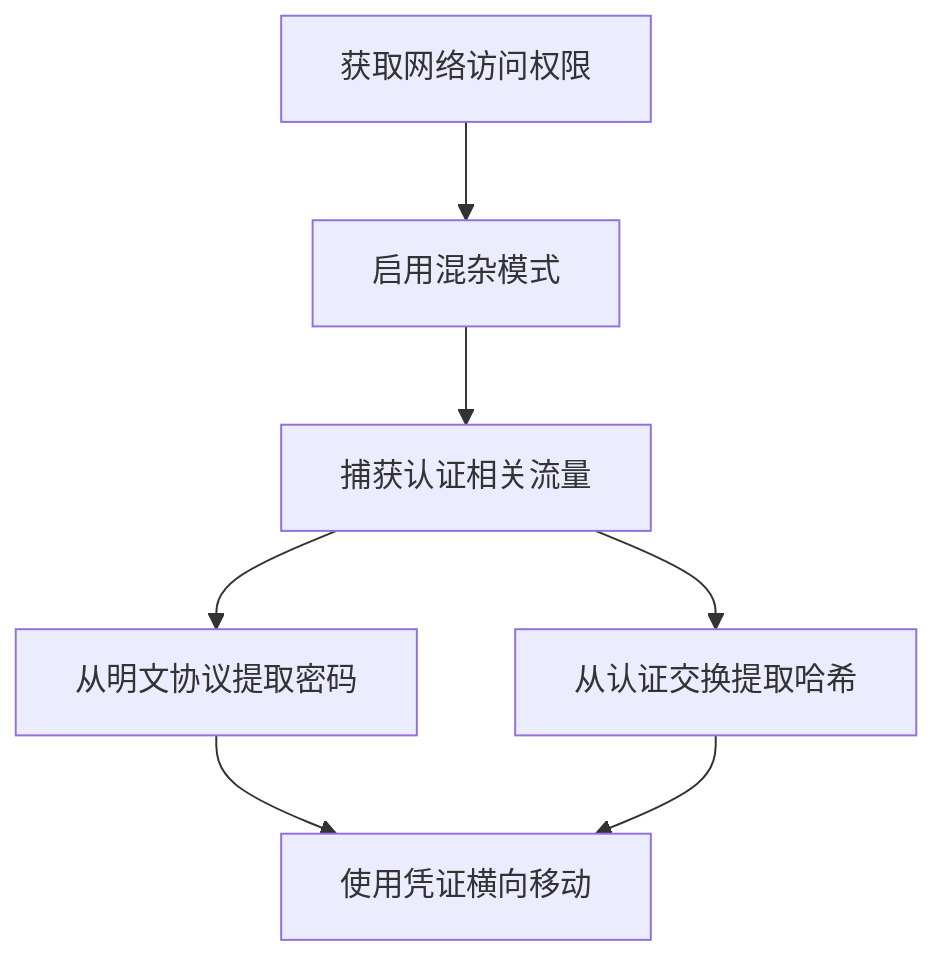

# 网络嗅探 (T1040)

## 一句话通俗理解

**就像在电话线上搭线窃听——攻击者在网络上"偷听"通信，抓取传输中的密码和其他敏感信息。**

## 难度等级

- ⭐ 初级（新手可学）

## 技术描述

网络嗅探（T1040）是MITRE ATT&CK框架中凭证访问战术的一种技术。

**通俗解释：**
如果网络是一条高速公路，数据包就是路上跑的汽车。攻击者站在路边，用"摄像头"（抓包工具）拍下每一辆车的内部情况。如果汽车里的"货物"是明文密码（比如老旧的FTP、Telnet协议），攻击者能直接看到。即使是加密的通信，攻击者也能从"车牌号"（元数据）中推断有价值的信息。在公共Wi-Fi环境中，这种方法特别危险。

**技术原理：**
1. 攻击者先将网卡设置为"混杂模式"（接收所有经过的数据包，不只是发给自己的）
2. 在共享网络环境（如集线器网络、公共Wi-Fi）或通过ARP欺骗，攻击者可以捕获同一网段内的所有网络流量
3. 使用tcpdump/Wireshark等工具捕获数据包，过滤出包含认证信息的协议（FTP、HTTP、SMTP、SMB、Telnet）
4. 从明文协议中直接读取用户名和密码，或从NTLM/Kerberos认证交换中捕获Net-NTLMv2哈希

**用途与影响：**
网络嗅探是被动攻击，不产生主动连接，隐蔽性极高。在公共Wi-Fi环境中，大量明文协议可供利用。攻击者可同时捕获多个用户的凭证，用于后续横向移动。2024年Salt Typhoon事件中，攻击者通过网络嗅探获取了政府官员的认证凭证。

## 子技术列表

该技术没有官方子技术分类。

## 攻击流程

```
获取网络访问 --> 启用混杂模式 --> 捕获流量 --> 提取凭证 --> 横向移动
```



**步骤详解：**

1. **获取网络访问权限**
   - 通俗描述：先连接到目标网络上，就像先进入大楼才能安装窃听器
   - 技术细节：物理接入（插网线/连Wi-Fi）、已入侵的内部主机、配置端口镜像
   - 常用工具：Wi-Fi破解工具、物理接入

2. **启用混杂模式**
   - 通俗描述：告诉网卡"别挑，所有的数据包都收"
   - 技术细节：设置网卡为混杂模式（Promiscuous Mode），接收整个网段的流量
   - 常用工具：`ifconfig eth0 promisc`、`tcpdump`

3. **捕获并过滤流量**
   - 通俗描述：录制所有网络通信，筛选出包含密码的部分
   - 技术细节：使用BPF过滤器精确捕获认证相关协议（FTP端口21、HTTP端口80、SMB端口445）
   - 常用工具：tcpdump、Wireshark、TShark

4. **提取凭证**
   - 通俗描述：从记录中找出密码
   - 技术细节：从明文协议中直接读取密码，从NTLM认证中提取Net-NTLMv2哈希
   - 常用工具：Wireshark（Follow TCP Stream）、NetworkMiner

## 真实案例

### 案例1：Salt Typhoon -- 电信网络嗅探（2024）

- **时间**: 2024年
- **目标**: 美国主要电信运营商（AT&T、Verizon、T-Mobile）
- **攻击组织**: Salt Typhoon（中国国家背景）
- **手法**: 攻击者入侵了美国多家电信运营商的网络基础设施，在网络设备上配置流量镜像，捕获了大量通信元数据和部分通信内容。通过网络嗅探，他们获取了包括政府官员在内的目标用户的认证凭证和通信记录，被称为"美国历史上最严重的电信入侵事件"。
- **影响**: 数百万用户的通信数据被窃取，包括政府官员的通话记录
- **参考链接**: [CISA AA24-326A](https://www.cisa.gov/news-events/cybersecurity-advisories/aa24-326a)

### 案例2：DarkHotel -- 酒店Wi-Fi嗅探（2014-2024）

- **时间**: 2014-2024年（持续活跃）
- **目标**: 亚洲高端酒店中的企业高管旅客
- **攻击组织**: DarkHotel
- **手法**: DarkHotel在亚洲高端酒店的Wi-Fi网络中部署嗅探基础设施。当目标高管使用酒店Wi-Fi登录企业VPN或Web邮箱时，捕获其认证过程中的凭证数据。攻击者针对特定目标（如半导体、国防工业高管）进行长期监控。
- **影响**: 大量企业高管和政府的机密信息被窃取
- **参考链接**: [MITRE ATT&CK - DarkHotel](https://attack.mitre.org/groups/G0012/)

### 案例3：Turla -- 网络嗅探木马（2015-2020）

- **时间**: 2015-2020年
- **目标**: 全球外交机构、国防部门
- **攻击组织**: Turla（俄罗斯国家背景）
- **手法**: Turla使用名为"Snake"的恶意软件在被感染主机上激活混杂模式，捕获并过滤特定模式的网络流量（包括FTP、HTTP、SMTP认证流量）。该恶意软件具有高度模块化设计，可远程更新嗅探规则。
- **影响**: 多个国家的外交和军事机密泄露
- **参考链接**: [MITRE ATT&CK - Turla](https://attack.mitre.org/groups/G0010/)

### 案例4：APT10 -- 云环境网络嗅探（2019-2020）

- **时间**: 2019-2020年
- **目标**: 全球科技公司、政府机构
- **攻击组织**: APT10（中国国家背景）
- **手法**: APT10在入侵云托管环境后，利用对虚拟化网络基础设施的访问权限部署网络嗅探器。他们在同一VPC中监听实例之间的内部通信流量，捕获云服务API调用中的临时凭证和访问令牌。
- **影响**: 多家云托管客户的凭证和数据被窃取
- **参考链接**: [MITRE ATT&CK - APT10](https://attack.mitre.org/groups/G0014/)

## 红队视角

> ⚠️ **免责声明**：以下内容仅用于合法的安全测试、渗透测试和教育目的。未经授权对他人系统进行测试是违法行为。

### 实战技巧

1. **被动嗅探不产生流量**
   被动抓包不发送任何数据包，不会被网络IDS/IPS检测，隐蔽性极高

2. **使用BPF精确过滤**
   使用Berkeley Packet Filter只捕获认证相关流量，减少数据量：`tcpdump -i eth0 port 21 or port 80 or port 445 or port 587`

3. **云环境中的元数据嗅探**
   在云环境中，检查是否有VPC流量镜像权限，可批量捕获内部通信

### 常用工具

| 工具名称 | 用途 | 平台 | 链接 |
|----------|------|------|------|
| tcpdump | 命令行抓包工具 | Linux/macOS | 系统自带 |
| Wireshark/TShark | 图形化/命令行网络分析工具 | 跨平台 | [官方](https://www.wireshark.org/) |
| Responder | LLMNR/NBT-NS投毒+NTLM哈希捕获 | 跨平台 | [GitHub](https://github.com/SpiderLabs/Responder) |
| BetterCAP | 网络攻击框架，支持ARP欺骗和嗅探 | 跨平台 | [GitHub](https://github.com/bettercap/bettercap) |
| NetworkMiner | 网络取证分析工具 | Windows | [官方](https://www.netresec.com/?page=NetworkMiner) |

### 注意事项

- 在非授权网络上进行嗅探是违法的
- 现代加密协议（HTTPS、SSH）可以保护数据内容，但元数据仍会泄露
- 交换网络环境中需要ARP欺骗才能嗅探其他主机的流量

## 蓝队视角

### 检测要点

1. **网卡混杂模式检测**
   - 日志来源：系统日志、EDR
   - 关注字段：网络接口状态
   - 异常特征：非预期网卡切换到混杂模式

2. **异常网络分析工具**
   - 日志来源：进程创建日志（Event ID 4688）
   - 关注字段：进程名称、命令行参数
   - 异常特征：tcpdump、Wireshark、tshark等工具在不需要网络分析的主机上运行

### 监控建议

- 定期检查所有主机的网卡模式（`ip link show eth0 | grep PROMISC`）
- 部署交换机端口安全功能，限制每个端口的MAC地址数量
- 在云环境中监控VPC流量镜像和流日志的创建事件
- 使用网络流量异常检测分析流量模式的突然变化

## 检测建议

### 网络层检测

**检测方法：** 监控网络中的ARP欺骗行为和混杂模式检测

**具体规则/命令示例：**
```
# 检测网卡混杂模式（Linux）
ip link show eth0 | grep PROMISC

# 检测网卡混杂模式（Windows PowerShell）
Get-NetAdapter | Select-Object Name, PromiscuousMode
```

### 主机层检测

**检测方法：** 监控异常的分析工具安装和网络接口配置变更

**Windows事件ID：**
- 事件ID 4688：检测tcpdump、Wireshark等工具的启动
- 事件ID 7040：检测网络配置变更

**具体命令示例：**
```bash
# 检测Linux主机上的TCP Dump进程
ps aux | grep tcpdump
lsof -i | grep -E "tcpdump|wireshark"
```

### 应用层检测

**Sigma规则示例：**
```yaml
title: Network Sniffing Tool Execution
status: experimental
description: 检测网络嗅探工具的执行
logsource:
    category: process_creation
    product: windows
detection:
    selection:
        Image|endswith:
            - '\tcpdump.exe'
            - '\wireshark.exe'
            - '\tshark.exe'
            - '\windump.exe'
    condition: selection
level: medium
tags:
    - attack.t1040
```

## 缓解措施

### 优先级1：关键措施

**措施名称：** 在所有内部通信中强制使用加密协议

**具体实施步骤：**
1. 禁用组织中所有明文协议（FTP→SFTP、HTTP→HTTPS、Telnet→SSH）
2. 配置强制SMB签名和加密
3. 在邮件服务器上强制使用TLS加密

### 优先级2：重要措施

**措施名称：** 实施网络分段

**具体实施步骤：**
1. 将敏感系统和用户置于独立网段
2. 使用VLAN隔离不同部门
3. 在网段间部署防火墙，控制访问

### 优先级3：建议措施

**措施名称：** 部署802.1X网络访问控制和DHCP Snooping

**具体实施步骤：**
1. 配置交换机支持802.1X认证
2. 部署RADIUS服务器验证接入设备
3. 启用DHCP Snooping防止恶意DHCP服务器

### MITRE ATT&CK 缓解措施映射

| 缓解措施ID | 缓解措施名称 | 适用性 | 说明 |
|------------|-------------|--------|------|
| M1042 | 网络访问控制 | 适用 | 实施802.1X和NAC限制网络接入 |
| M1031 | 网络隔离 | 适用 | 网络分段和VLAN隔离 |
| M1041 | 凭证保护 | 部分适用 | 加密协议保护传输中的凭证 |

## 动手实验

> ⚠️ **重要提示**：所有实验必须在隔离的实验室环境中进行，禁止对未授权的真实系统进行测试。

### 实验环境准备

**推荐靶场/实验平台：**

| 平台名称 | 类型 | 难度 | 链接 |
|----------|------|------|------|
| TryHackMe | 教学平台 | 初级 | [THM](https://tryhackme.com/) |

**所需工具：**
- Wireshark/tcpdump：抓包工具
- Docker：搭建实验环境

### 实验1：捕获FTP密码（初级）

**实验目标：** 在模拟环境中抓取FTP明文密码

**实验步骤：**
1. 在Docker中启动FTP服务器：`docker run -d -p 21:21 stilliard/pure-ftpd`
2. 在攻击机上启动抓包：`sudo tcpdump -i eth0 -w capture.pcap port 21`
3. 使用FTP客户端连接服务器：`ftp 192.168.1.100`
4. 输入用户名和密码
5. 停止抓包，用Wireshark打开capture.pcap，追踪TCP流查看USER和PASS命令

**预期结果：** 在抓包文件中看到明文的FTP用户名和密码

**学习要点：** 理解为什么明文协议是危险的

### 实验2：网络嗅探检测

**实验目标：** 学习检测网卡混杂模式

**实验步骤：**
1. 在目标主机上设置网卡为混杂模式
2. 在监控主机上使用脚本定期检查网卡模式
3. 对比混杂模式和正常模式的差异

**预期结果：** 发现网络接口状态异常

## 术语解释

| 术语 | 英文原名 | 通俗解释 |
|------|----------|----------|
| 混杂模式 | Promiscuous Mode | 网卡不再挑食，所有经过的数据包都吃掉（收下来） |
| ARP欺骗 | ARP Spoofing | 发送假地址信息，让数据包走错路送到攻击者那里 |
| BPF过滤器 | Berkeley Packet Filter | 抓包时的"关键词搜索"，只抓你感兴趣的流量 |
| 端口镜像 | Port Mirroring/SPAN | 交换机的复印功能，把一个端口的数据复制到另一个端口 |
| Net-NTLMv2 | Network NTLMv2 Hash | Windows网络认证时使用的"密码指纹" |

## 参考资料

### 官方文档

- [MITRE ATT&CK - T1040](https://attack.mitre.org/techniques/T1040/)

### 安全报告

- [CISA - Salt Typhoon Advisory](https://www.cisa.gov/news-events/cybersecurity-advisories/aa24-326a) - 2024年Salt Typhoon事件分析

### 工具与资源

- [Wireshark官方文档](https://www.wireshark.org/docs/) - Wireshark使用指南
- [BetterCAP](https://github.com/bettercap/bettercap) - 网络攻击和监控框架

### 学习资料

- [SANS - Network Sniffing and Credential Capture](https://www.sans.org/white-papers/network-sniffing/) - 网络嗅探技术白皮书
