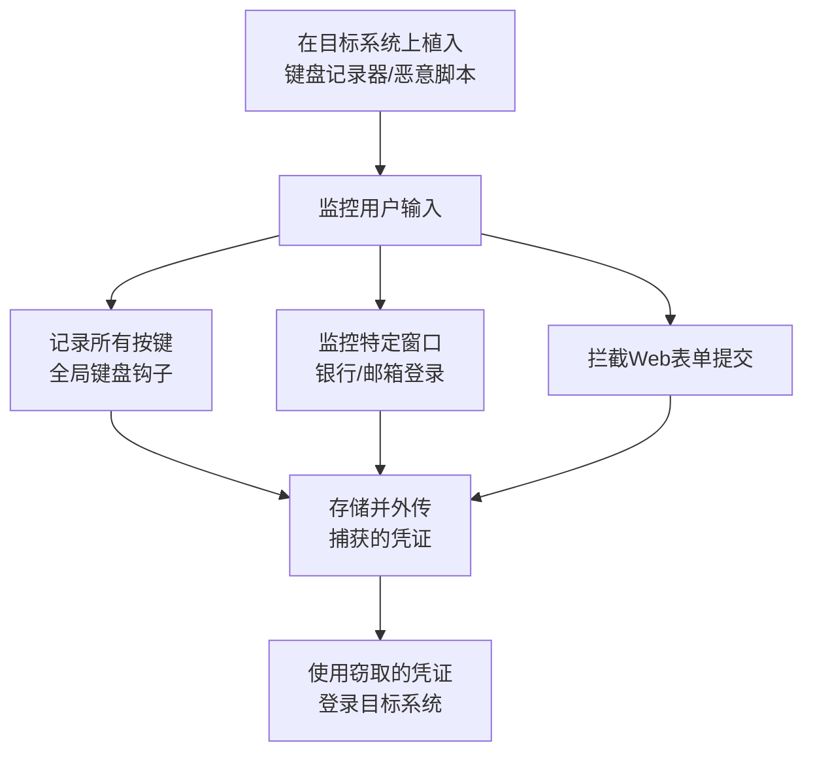

# 输入捕获 (T1056)

## 一句话通俗理解

**就像在你背后装了个摄像头偷看你输密码——攻击者记录你的键盘输入或拦截你在网页上填写的登录信息。**

## 30秒速查卡

| 维度 | 你需要知道的 |
|------|-------------|
| 这是什么？ | 通过键盘记录、屏幕截图或表单捕获等方式窃取用户输入的密码和敏感信息 |
| 为什么危险？ | 用户在键盘上敲的每一个字、在屏幕上看到的每一个画面都可能被攻击者捕获，这种攻击极其隐蔽 |
| 谁需要关心？ | 终端安全工程师、SOC分析师 |
| 你的第一步防御 | 部署终端检测响应（EDR）系统，监控异常的键盘钩子和屏幕截图行为 |
| 如果只做一件事 | 监控SetWindowsHookEx API调用和异常的全局键盘钩子安装，特别是来自非可信进程的调用 |

## 难度等级

- ⭐⭐ 中级（需要一定基础）

## 技术描述

输入捕获（T1056）是MITRE ATT&CK框架中凭证访问战术的一种技术。

**通俗解释：**
输入捕获就是攻击者在你的电脑上装了一个"监视器"，记录你敲的每一个键（键盘记录器），或者在你登录银行网站时，在网页上偷偷加一段代码，把你输入的用户名密码发到黑客的服务器。这就像在ATM机上装了个假键盘——你以为是在安全操作，其实每一步都被记录了。

**技术原理：**
1. **键盘记录器**：使用Windows API（如SetWindowsHookEx）注册全局键盘钩子，记录所有按键事件
2. **Web表单劫持**：在网页中注入恶意JavaScript代码，在表单提交时劫持输入数据
3. **API钩子**：拦截系统认证函数（如CredUIPromptForCredentials）的调用，在参数传递时捕获凭证
4. 捕获的凭证通过C2通道加密传输到攻击者服务器

**用途与影响：**
与其他凭证获取方式不同，输入捕获是"实时"的——攻击者拿到的是用户当前正在使用的最新密码，而不是缓存的旧密码。这使得获取的凭证时效性更强。键盘记录器可以长期驻留，持续收集凭证。2025年Check Point报告显示，信息窃取类恶意软件（Infostealer）增长了160%，键盘记录是其核心功能之一。

## 子技术列表

**该技术共有 4 个子技术：**

| 子技术ID | 中文名称 | 通俗解释 |
|----------|----------|----------|
| T1056.001 | Web门户捕获 | 创建假的登录页面骗取真实密码 |
| T1056.002 | GUI输入捕获 | 用键盘记录器记录所有按键 |
| T1056.003 | Web凭证API | 利用浏览器API窃取保存的凭证 |
| T1056.004 | 凭证API钩子 | 拦截系统认证函数的调用 |

<details>
<summary><strong>展开查看各子技术详细说明</strong></summary>

各子技术详细说明请参阅独立文档：

- [T1056.001 - Web门户捕获](./T1056/T1056.001-Web-Portal-Capture.md) — 造一个和真的一模一样的假登录页面，骗你输入密码。
- [T1056.002 - GUI输入捕获](./T1056/T1056.002-GUI-Input-Capture.md) — 在你电脑里装一个"录音机"，记录你敲的每一个字母。
- [T1056.004 - 凭证API钩子](./T1056/T1056.004-Credential-API-Hooking.md) — 在系统的"密码输入接口"上装一个分叉管，你输入的密码系统收到一份，黑客也收到一份。

</details>

## 攻击流程

```
植入恶意代码 --> 监控用户输入 --> 捕获凭证 --> 外传C2 --> 横向移动
```



**步骤详解：**

1. **植入恶意代码**
   - 通俗描述：先在你的电脑上装一个"间谍软件"
   - 技术细节：通过钓鱼邮件、恶意网站、USB设备或其他方式传播
   - 常用工具：钓鱼工具包、漏洞利用套件

2. **监控用户输入**
   - 通俗描述：开始记录你的一举一动
   - 技术细节：注册全局键盘钩子、注入JavaScript脚本、钩住认证API
   - 常用工具：自定义键盘记录器、EvilGinx2

3. **存储并外传凭证**
   - 通俗描述：把偷到的密码打包发出去
   - 技术细节：加密存储日志文件，定期通过HTTP/DNS上传到C2服务器
   - 常用工具：HTTP POST、DNS隧道

## 真实案例

### 案例1：Lumma Stealer -- 信息窃取恶意软件（2024-2025）

- **时间**: 2024-2025年
- **目标**: 全球范围内的个人和企业用户
- **攻击组织**: Lumma Stealer运营者
- **手法**: Lumma Stealer是2024-2025年最活跃的信息窃取类恶意软件之一。它使用键盘记录功能捕获用户输入，特别是针对加密货币钱包和交易所的登录凭证。Lumma还具备表单劫持能力，在用户提交网页表单时截取数据。2025年上半年，Lumma Stealer感染了超过58万个终端。
- **影响**: 数十万个加密货币账户和在线服务的凭证被窃取
- **参考链接**: [Flashpoint - 2025凭证威胁报告](https://dailysecurityreview.com/news/credential-theft-up-160-in-2025-billion-logins-stolen/)

### 案例2：Scattered Spider -- 社工+键盘记录（2024）

- **时间**: 2024年
- **目标**: 科技、金融、游戏行业
- **攻击组织**: Scattered Spider
- **手法**: Scattered Spider在通过社会工程学获得初始访问后，在受害者系统上部署键盘记录器。他们使用定制的恶意软件监控特定窗口标题（如"Login"、"Password"），仅记录敏感上下文中的按键，减少日志量并提高隐蔽性。捕获的凭证用于后续的横向移动和勒索软件部署。
- **影响**: 多家科技和金融公司遭到数据泄露和勒索
- **参考链接**: [CISA AA23-320A](https://www.cisa.gov/news-events/cybersecurity-advisories/aa23-320a)

### 案例3：Kimsuky -- 键盘记录器（2020-2022）

- **时间**: 2020-2022年
- **目标**: 韩国政府和国防机构
- **攻击组织**: Kimsuky（朝鲜国家背景）
- **手法**: Kimsuky使用多种定制的键盘记录恶意软件，使用Windows SetWindowsHookEx注册全局键盘钩子，记录所有按键并定期将日志上传到攻击者控制的服务器。Kimsuky利用捕获的VPN和电子邮件凭证访问受害者的工作账户。
- **影响**: 大量政府机密信息被窃取
- **参考链接**: [MITRE ATT&CK - Kimsuky](https://attack.mitre.org/groups/G0094/)

### 案例4：Magecart -- Web表单劫持（2018-2025）

- **时间**: 2018-2025年（持续活跃）
- **目标**: 全球电商网站
- **攻击组织**: Magecart攻击者
- **手法**: Magecart攻击者在电商网站中注入恶意JavaScript，捕获用户在支付表单中输入的数据。脚本在表单提交时劫持包括信用卡号、CVV在内的敏感信息，发送至攻击者控制的域名。2025年Magecart仍在活跃，并增加了对单页应用（SPA）和移动端支付表单的支持。
- **影响**: 每年数百万信用卡信息被盗
- **参考链接**: [MITRE ATT&CK - Magecart](https://attack.mitre.org/groups/G0040/)

## 红队视角

> ⚠️ **免责声明**：以下内容仅用于合法的安全测试、渗透测试和教育目的。未经授权对他人系统进行测试是违法行为。

### 实战技巧

1. **使用窗口标题过滤**
   只记录"Login"、"Password"、"2FA"等敏感窗口的按键，减少数据量，提高隐蔽性

2. **浏览器扩展形式**
   将键盘记录器伪装成浏览器扩展，利用`content_scripts`注入JavaScript，可长期驻留且不易被检测

3. **有限次记录**
   每台机器只记录前1000次按键就停止，避免日志过大

### 常用工具

| 工具名称 | 用途 | 平台 | 链接 |
|----------|------|------|------|
| EvilGinx2 | AitM钓鱼框架，实时捕获密码和MFA代码 | 跨平台 | [GitHub](https://github.com/kgretzky/evilginx2) |
| SET | 社会工程学工具包 | Linux | [GitHub](https://github.com/trustedsec/social-engineer-toolkit) |
| 自定义键盘记录器 | 使用SetWindowsHookEx API注册钩子 | Windows | - |
| PowerSploit | PowerShell键盘记录脚本 | Windows | [GitHub](https://github.com/PowerShellMafia/PowerSploit) |

### 注意事项

- 键盘记录器配合截图功能可捕获虚拟键盘输入
- Web表单劫持可通过XSS注入实现，无需在目标系统上安装软件
- 内核级键盘记录器难以被用户态安全软件检测

## 蓝队视角

### 检测要点

1. **异常的SetWindowsHookEx调用**
   - 日志来源：Sysmon、EDR
   - 关注字段：HookType（WH_KEYBOARD、WH_KEYBOARD_LL）、Module路径
   - 异常特征：非预期进程安装全局键盘钩子

2. **浏览器进程中的非法DLL注入**
   - 日志来源：Sysmon Event ID 7（模块加载）
   - 关注字段：进程为浏览器，加载非预期的DLL
   - 异常特征：chrome.exe/msedge.exe加载了未知DLL

### 监控建议

- 监控SetWindowsHookEx调用的键盘和鼠标钩子安装
- 检测钩子链中异常的DLL模块注入
- 使用浏览器检测DOM级别表单数据拦截的脚本注入
- 应用CSP（Content Security Policy）防止脚本注入

## 检测建议

### 网络层检测

**检测方法：** 监控异常频繁的上传模式，可能是键盘记录器外传数据

**具体规则/命令示例：**
```
# 检测小型数据包定期上传
Zeek检测规则：http 且 content_length < 1KB 且 请求频率 > 1次/分钟
```

### 主机层检测

**检测方法：** 监控全局键盘钩子的安装

**Windows事件ID：**
- 事件ID 4688：检测PowerShell执行键盘记录脚本
- Sysmon Event ID 7：检测模块加载（异常的DLL注入）

**具体命令示例：**
```powershell
# 检测全局键盘钩子
Get-Process | Where-Object {
    $_.Modules.ModuleName -like "*keyboard*"
}
```


**用人话说：** 这条规则在监控是否有进程在安装键盘钩子或进行屏幕截图。键盘记录器通过Hook系统来拦截用户按键，屏幕截图则定时截取屏幕内容。正常情况下只有输入法和安全软件会安装键盘钩子。如果有陌生进程安装键盘钩子或频繁截图，那就是攻击者在偷看你的每一个按键和屏幕内容。

### 应用层检测

**Sigma规则示例：**
```yaml
title: Suspicious SetWindowsHookEx for Keylogger
status: experimental
description: 检测SetWindowsHookEx API的异常调用
logsource:
    category: api_monitor
    product: windows
detection:
    selection:
        API: 'SetWindowsHookEx'
        HookType:
            - 'WH_KEYBOARD'
            - 'WH_KEYBOARD_LL'
        SourceImage: 'C:\Windows\System32\rundll32.exe'
    condition: selection
level: high
tags:
    - attack.t1056
```

## 缓解措施

### 优先级1：关键措施

**措施名称：** 实施应用程序控制策略

**具体实施步骤：**
1. 使用Windows Defender Application Control（WDAC）白名单允许运行的应用程序
2. 限制非授权软件安装和脚本执行
3. 在Web应用中实施CSP防止脚本注入

### 优先级2：重要措施

**措施名称：** 部署键盘记录防护

**具体实施步骤：**
1. 使用Windows Defender Credential Guard保护凭据输入路径
2. 开启"增强型键盘过滤"功能（Windows的安全键盘输入路径）
3. 使用硬件安全键盘输入路径（如Windows Hello生物识别）

### 优先级3：建议措施

**措施名称：** 用户培训

**具体实施步骤：**
1. 培训用户识别网络钓鱼和伪造登录页面
2. 建立明确的安全报告渠道
3. 定期演练社会工程学攻击防御

### MITRE ATT&CK 缓解措施映射

| 缓解措施ID | 缓解措施名称 | 适用性 | 说明 |
|------------|-------------|--------|------|
| M1038 | 执行防护 | 适用 | 应用程序白名单限制恶意软件执行 |
| M1017 | 用户培训 | 适用 | 培训用户识别钓鱼攻击 |
| M1041 | 凭证保护 | 部分适用 | 使用安全键盘输入路径 |

## 动手实验

> ⚠️ **重要提示**：所有实验必须在隔离的实验室环境中进行，禁止对未授权的真实系统进行测试。

### 实验环境准备

**所需工具：**
- Python（用于编写键盘记录器）
- Windows虚拟机（用于测试）
- Visual Studio或Python环境

### 实验1：Python键盘记录器（初级）

**实验目标：** 编写一个简单的键盘记录器

**实验步骤：**
1. 安装pynput库：`pip install pynput`
2. 编写键盘记录脚本
3. 运行脚本，在另一个窗口中打字，查看日志文件

```python
from pynput.keyboard import Listener

def on_press(key):
    with open("keylog.txt", "a") as f:
        f.write(f"{key}\n")

with Listener(on_press=on_press) as listener:
    listener.join()
```

**预期结果：** keylog.txt中记录了所有按键

**学习要点：** 理解键盘记录的工作原理

### 实验2：Web表单劫持检测（中级）

**实验目标：** 学习检测Web表单劫持

**实验步骤：**
1. 创建一个简单的登录页面
2. 注入恶意JavaScript监听表单提交
3. 使用浏览器开发者工具（F12）检测注入的脚本
4. 使用CSP策略阻止脚本注入

**预期结果：** 发现注入的恶意脚本

## 术语解释

| 术语 | 英文原名 | 通俗解释 |
|------|----------|----------|
| 键盘记录器 | Keylogger | 在你电脑后台偷偷记录你敲了哪些键的软件 |
| SetWindowsHookEx | SetWindowsHookEx API | Windows的"监听接口"，程序可以通过它监控键盘鼠标事件 |
| API钩子 | API Hooking | 截断系统函数调用，在函数执行前插入恶意代码 |
| XSS | Cross-Site Scripting | 跨站脚本攻击，往网页里注入恶意代码 |
| C2 | Command and Control | 攻击者与被感染电脑之间的秘密通信渠道 |
| CSP | Content Security Policy | 浏览器的"门卫"，决定哪些脚本可以运行 |

## 参考资料

### 官方文档

- [MITRE ATT&CK - T1056](https://attack.mitre.org/techniques/T1056/)

### 安全报告

- [CISA - Kimsuky恶意软件分析](https://www.cisa.gov/news-events/cybersecurity-advisories/aa23-165a)
- [Flashpoint - 2025凭证威胁报告](https://dailysecurityreview.com/news/credential-theft-up-160-in-2025-billion-logins-stolen/) - 2025年凭证窃取增长160%

### 工具与资源

- [EvilGinx2](https://github.com/kgretzky/evilginx2) - 中间人钓鱼框架

### 学习资料

- [OWASP - XSS Prevention](https://owasp.org/www-community/attacks/xss/) - XSS攻击防御指南
