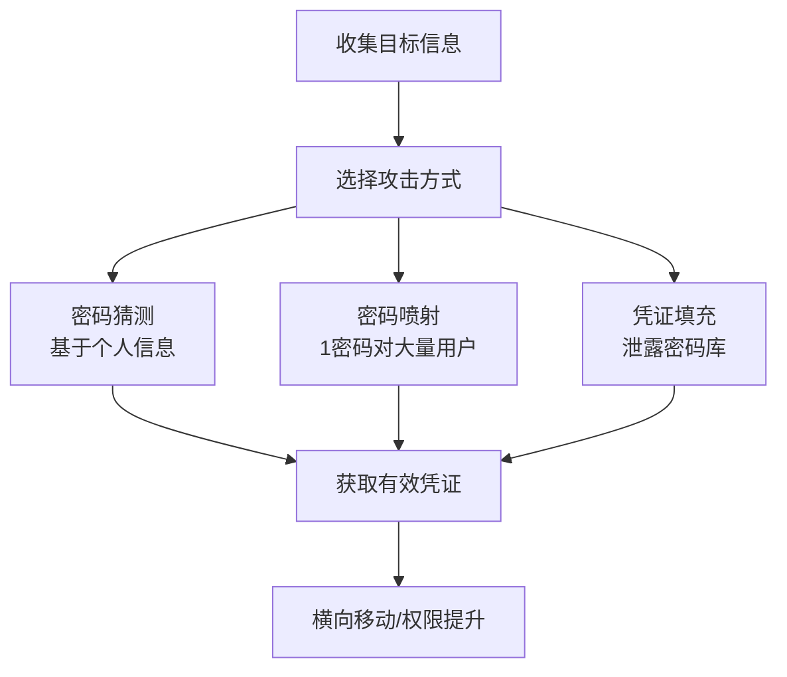

# 暴力破解 (T1110)

## 一句话通俗理解

**就像用一把一把钥匙试开锁——攻击者用自动化工具批量尝试密码，总能碰上用弱密码的人。**

## 难度等级

- ⭐ 初级（新手可学）

## 技术描述

暴力破解（T1110）是MITRE ATT&CK框架中凭证访问战术的一种技术。

**通俗解释：**
攻击者用程序自动尝试大量用户名和密码组合，直到找到能登录的那一对。就像小偷拿着一大串钥匙，一把一把试开一栋楼的每扇门。虽然每把钥匙打开门的概率很小，但如果试一万把，总有几扇门是用最常见的密码锁（比如"123456"、"password"）的。

**技术原理：**
1. **字典攻击**：使用常见的密码列表（如rockyou.txt包含1400万个密码），对目标系统尝试所有组合
2. **密码喷射**：用少数最常见的密码（如"Spring2024!"、"Password123"）对大量账户尝试——不会触发单账户锁定
3. **凭证填充**：使用从其他网站泄露的用户名密码组合，直接尝试登录——用户常在多个网站用相同密码
4. **离线破解**：先获取密码哈希，然后在本地用GPU暴力计算，不受在线锁策略限制

**用途与影响：**
暴力破解是最古老也最直接的凭证获取方式。门槛最低，无需特殊权限或漏洞。根据Recorded Future 2025年报告，密码喷射和凭证填充是最常见的初始访问方式之一。Verizon 2025年DBIR报告显示，凭证相关攻击占所有数据泄露的31%。

## 子技术列表

**该技术共有 4 个子技术：**

| 子技术ID | 中文名称 | 通俗解释 |
|----------|----------|----------|
| T1110.001 | 密码猜测 | 根据目标信息（生日、公司名）猜测可能的密码 |
| T1110.002 | 密码破解 | 离线破解已获取的密码哈希 |
| T1110.003 | 密码喷射 | 用少数常见密码对大量账户尝试 |
| T1110.004 | 凭证填充 | 用泄露的密码库直接尝试登录 |

<details>
<summary><strong>展开查看各子技术详细说明</strong></summary>

### T1110.001 - 密码猜测

**通俗理解：** 根据目标的个人信息推测密码。

**详细说明：** 攻击者收集目标的信息（公司名、员工生日、兴趣爱好、宠物名字等），然后用这些信息生成可能的密码组合。例如Company2024!、ZhangSan2025等。这种方式比纯字典攻击效率更高。

### T1110.003 - 密码喷射

**通俗理解：** 用一个常见密码试几千个账号，不会触发单账号锁定。

**详细说明：** 普通暴力破解会反复尝试一个账号直到锁定，而密码喷射是反过来——用1-2个最常见的密码（Password1、Welcome!）尝试所有用户的账号。每个账号只试1次，不会触发锁定策略。

### T1110.004 - 凭证填充

**通俗理解：** 用从其他网站偷来的用户名密码组合试登录。

**详细说明：** 因为很多人在不同网站用相同密码，攻击者从HaveIBeenPwned等泄露数据库获取用户名密码对，用自动化工具批量尝试登录目标系统。

</details>

## 攻击流程

```
收集信息 --> 选择方式 --> 执行攻击 --> 获取凭证 --> 横向移动
```



**步骤详解：**

1. **收集目标信息**
   - 通俗描述：先摸清目标"家底"——有哪些员工、用什么系统
   - 技术细节：获取用户名列表（邮箱、AD用户名）、组织信息、泄露密码库
   - 常用工具：LinkedIn、HaveIBeenPwned、OSINT工具

2. **选择攻击方式并执行**
   - 通俗描述：选一种"试密码"的方法，开始自动尝试
   - 技术细节：密码喷射用1-2个密码试所有用户；凭证填充用泄露列表试
   - 常用工具：Hydra、MSOLSpray、CrackMapExec

3. **使用获取的凭证**
   - 通俗描述：用试出来的密码登录系统
   - 技术细节：使用有效凭证登录VPN、邮箱、云服务管理面板
   - 常用工具：SSH客户端、RDP客户端、云平台CLI

## 真实案例

### 案例1：Midnight Blizzard (APT29) -- 密码喷射攻击微软（2024）

- **时间**: 2024年1月
- **目标**: 微软公司内部邮件系统
- **攻击组织**: Midnight Blizzard（APT29，俄罗斯国家背景）
- **手法**: 攻击者使用已泄露的测试租户凭证，通过密码喷射成功入侵了微软高级管理人员的企业邮箱。攻击者访问了包括网络安全团队和法律团队在内的邮件账户，获取了关于微软调查Midnight Blizzard本身的信息。这是首次有国家背景的APT组织成功入侵微软核心系统。
- **影响**: 微软高级管理人员的邮箱被入侵，大量内部安全信息泄露
- **参考链接**: [Microsoft - 攻击分析](https://www.microsoft.com/en-us/security/blog/2024/01/19/microsoft-actions-following-attack-by-nation-state-actor-midnight-blizzard/)

### 案例2：Snowflake数据泄露 -- 凭证填充攻击（2024）

- **时间**: 2024年
- **目标**: 超过160个Snowflake客户（AT&T、Ticketmaster等）
- **攻击组织**: UNC5537
- **手法**: 攻击者利用从其他信息窃取恶意软件中获得的凭证，针对Snowflake客户进行凭证填充攻击。这些客户账户没有启用MFA，攻击者直接使用泄露的用户名密码登录Snowflake管理控制台，导出大量客户数据。单一攻击影响了全球160多个组织。
- **影响**: 包括AT&T的50亿条通话记录、Ticketmaster的5.6亿条交易数据在内的海量数据被窃取
- **参考链接**: [Wikipedia - Snowflake数据泄露](https://en.wikipedia.org/wiki/Snowflake_data_breach)

### 案例3：DraftKings -- 凭证填充攻击（2025年9月）

- **时间**: 2025年9月
- **目标**: DraftKings在线体育博彩平台
- **攻击组织**: 未知
- **手法**: 攻击者利用从非DraftKings来源窃取的用户凭证，对DraftKings平台进行凭证填充攻击。2025年9月2日，公司检测到未经授权的账户访问。攻击者可能获取了姓名、地址、出生日期、电话号码、邮箱、交易详情等信息。DraftKings迅速响应并强制受影响用户重置密码。
- **影响**: 部分用户账户被未授权访问，个人信息可能泄露
- **参考链接**: [Security Affairs - DraftKings](https://securityaffairs.com/183110/security/draftkings-thwarts-credential-stuffing-attack-but-urges-password-reset-and-mfa.html)

### 案例4：0ktapus -- 凭证填充攻击（2022）

- **时间**: 2022年
- **目标**: Cloudflare、Twilio、DoorDash等科技公司
- **攻击组织**: 0ktapus
- **手法**: 0ktapus活动使用从其他泄露站点获取的用户名密码组合，针对使用Okta SSO的组织进行凭证填充攻击。此活动影响了超过130个组织，攻击者通过钓鱼获取Okta凭证后，进一步访问受害者的内部系统。
- **影响**: 超过130个组织的凭证被窃取
- **参考链接**: [Cloudflare - 0ktapus分析](https://www.cloudflare.com/blog/2022/08/05/okta-phishing-attack/)

## 红队视角

> ⚠️ **免责声明**：以下内容仅用于合法的安全测试、渗透测试和教育目的。未经授权对他人系统进行测试是违法行为。

### 实战技巧

1. **密码喷射的时间控制**
   每个账户只尝试1-2个密码，间隔30分钟以上，避免触发锁定策略。利用时区差异在目标非工作时间进行尝试。

2. **定制密码字典**
   使用组织信息构建定制密码字典（公司名+年份+特殊字符）。例如：Company2024!、Company@2025、Welcome2Company

3. **优先尝试常见弱密码**
   Password1、Welcome1、Spring2024!、Company123、Admin@123

### 常用工具

| 工具名称 | 用途 | 平台 | 链接 |
|----------|------|------|------|
| Hydra | 多协议暴力破解工具 | Linux | [GitHub](https://github.com/vanhauser-thc/thc-hydra) |
| MSOLSpray | Office 365密码喷射工具 | 跨平台 | [GitHub](https://github.com/dafthack/MSOLSpray) |
| CrackMapExec | 内网凭证测试工具 | Linux | [GitHub](https://github.com/Porchetta-Industries/CrackMapExec) |
| Hashcat | 离线密码破解工具（GPU加速） | 跨平台 | [官方](https://hashcat.net/hashcat/) |
| John the Ripper | 离线密码破解工具 | 跨平台 | [官方](https://www.openwall.com/john/) |

### 注意事项

- 密码喷射时每个账户只尝试1-2个密码是最安全的策略
- 在线暴力破解会受到速率限制和账户锁定的影响
- 离线破解（从哈希破解）不受锁定策略限制，但需要先获得哈希

## 蓝队视角

### 检测要点

1. **大量登录失败事件**
   - 日志来源：Windows Security Event ID 4625
   - 关注字段：FailureReason、SourceIP、TargetUser
   - 异常特征：短时间内同一IP对多个用户的失败登录

2. **分布式暴力破解**
   - 日志来源：认证日志、Web服务器日志
   - 关注字段：不同源IP对同一账户的登录尝试
   - 异常特征：来自不同IP的同一模式登录尝试

### 监控建议

- 监控认证日志中的大量登录失败事件（Event ID 4625）
- 检测短时间内从不同源IP对同一账户的登录尝试
- 对Azure AD/Office 365登录日志启用风险检测
- 部署RDP/SSH暴力破解检测规则

## 检测建议

### 网络层检测

**检测方法：** 监控SSH/RDP/HTTP认证端口的异常连接频率

**具体规则/命令示例：**
```bash
# 检测SSH暴力破解（fail2ban）
journalctl -u sshd | grep "Failed password" | awk '{print $11}' | sort | uniq -c | sort -nr
```

### 主机层检测

**检测方法：** 监控认证日志中的失败模式

**Windows事件ID：**
- 事件ID 4625：登录失败
- 事件ID 4776：域控认证失败

**具体命令示例：**
```powershell
# 查看登录失败事件
Get-WinEvent -FilterHashtable @{LogName='Security';ID=4625} |
    Select-Object TimeCreated, @{N='User';E={$_.Properties[5].Value}},
    @{N='SourceIP';E={$_.Properties[19].Value}}
```

### 应用层检测

**Sigma规则示例：**
```yaml
title: Password Spraying Detection
status: experimental
description: 检测密码喷射攻击模式
logsource:
    category: authentication
    product: windows
detection:
    selection:
        EventID: 4625
        LogonType: 3
    timeframe: 5m
    condition: selection | count() by TargetUserName > 50
level: high
tags:
    - attack.t1110
```

## 缓解措施

### 优先级1：关键措施

**措施名称：** 部署多因素认证（MFA）

**具体实施步骤：**
1. 为所有远程访问和云管理入口启用MFA
2. 优先使用FIDO2安全密钥或Authenticator应用
3. 短信验证码仅作为备选方案

### 优先级2：重要措施

**措施名称：** 实施账户锁定策略

**具体实施步骤：**
1. 设置合理的失败尝试阈值（如5次失败后锁定15分钟）
2. 配置Azure AD Smart Lockout或Fail2ban
3. 实施密码复杂度策略和密码黑名单

### 优先级3：建议措施

**措施名称：** 部署条件访问策略

**具体实施步骤：**
1. 限制来自不信任IP的登录
2. 阻止来自匿名代理和Tor节点的访问
3. 对高风险登录请求要求额外验证

### MITRE ATT&CK 缓解措施映射

| 缓解措施ID | 缓解措施名称 | 适用性 | 说明 |
|------------|-------------|--------|------|
| M1032 | 多因素认证 | 适用 | MFA可阻止大多数凭证认证攻击 |
| M1036 | 账户锁定策略 | 适用 | 设置合理的锁定阈值 |
| M1018 | 用户账户管理 | 适用 | 定期审计和清理无效账户 |

## 动手实验

> ⚠️ **重要提示**：所有实验必须在隔离的实验室环境中进行，禁止对未授权的真实系统进行测试。

### 实验环境准备

**所需工具：**
- Kali Linux虚拟机（攻击机）
- Windows/Linux服务器（目标）
- Hydra、Hashcat工具包

### 实验1：SSH暴力破解（初级）

**实验目标：** 使用Hydra对SSH服务进行密码破解

**实验步骤：**
1. 准备目标服务器（开启SSH服务）
2. 使用Hydra进行暴力破解：`hydra -l admin -P /usr/share/wordlists/rockyou.txt ssh://192.168.1.100`
3. 观察破解过程
4. 查看成功破解的密码

**预期结果：** 找到目标SSH账户的密码

**学习要点：** 理解在线暴力破解的基本原理和速度限制

### 实验2：Office 365密码喷射（中级）

**实验目标：** 模拟对Office 365的密码喷射攻击

**实验步骤：**
1. 准备用户邮箱列表（在实验环境中）
2. 使用MSOLSpray进行密码喷射：`Invoke-MSOLSpray -UserList .\emails.txt -Password "Spring2024!"`
3. 观察哪些账户使用了弱密码
4. 在Azure AD中查看登录日志

**预期结果：** 发现使用弱密码的账户

## 术语解释

| 术语 | 英文原名 | 通俗解释 |
|------|----------|----------|
| 密码喷射 | Password Spraying | 用一个常见密码试成千上万个账号，每个只试一次 |
| 凭证填充 | Credential Stuffing | 用别的网站泄露的密码来试这个网站 |
| 字典攻击 | Dictionary Attack | 用一本"常见密码字典"批量试密码 |
| 离线破解 | Offline Cracking | 拿到密码的加密版本后在自己电脑上慢慢破解 |
| 哈希 | Hash | 密码的"数字指纹"，不可逆的加密结果 |
| GPU破解 | GPU Cracking | 用显卡（而不是CPU）来加速密码破解，速度可以快几百倍 |

## 参考资料

### 官方文档

- [MITRE ATT&CK - T1110](https://attack.mitre.org/techniques/T1110/)

### 安全报告

- [Microsoft - 密码喷射攻击检测](https://www.microsoft.com/en-us/security/blog/2020/04/23/protecting-organization-password-spray-attacks/)
- [Microsoft - Midnight Blizzard攻击分析](https://www.microsoft.com/en-us/security/blog/2024/01/19/microsoft-actions-following-attack-by-nation-state-actor-midnight-blizzard/)

### 工具与资源

- [OWASP - 凭证填充攻击](https://owasp.org/www-community/attacks/Credential_stuffing)
- [SecLists密码字典集合](https://github.com/danielmiessler/SecLists) - 常用密码字典

### 学习资料

- [Recorded Future - 2025凭证威胁报告](https://www.recordedfuture.com/blog/identity-trend-report-march-blog) - 2025年凭证威胁态势
- [Check Point - 2025凭证泄露分析](https://blog.checkpoint.com/security/the-alarming-surge-in-compromised-credentials-in-2025/) - 2025年凭证泄露增长160%
