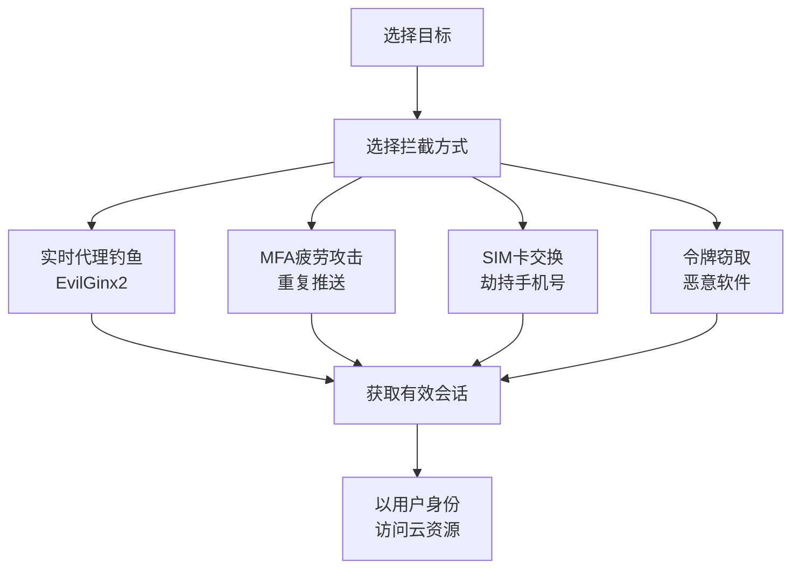

# 多因素认证拦截 (T1111)

## 一句话通俗理解

**连你的手机验证码也一起偷走——即使你用了密码+验证码双重保护，攻击者照样能绕过。**

## 30秒速查卡

| 维度 | 你需要知道的 |
|------|-------------|
| 这是什么？ | 拦截多因素认证（MFA）的验证码或推送确认，绕过MFA保护 |
| 为什么危险？ | MFA是现代安全的'最后一道防线'，如果被绕过，攻击者就能畅通无阻地访问所有资源 |
| 谁需要关心？ | 身份安全工程师、SOC分析师 |
| 你的第一步防御 | 启用防钓鱼MFA（如FIDO2安全密钥），监控MFA拦截尝试 |
| 如果只做一件事 | 监控MFA注册和配置的任何变更，特别是新设备的MFA注册请求 |

## 难度等级

- ⭐⭐⭐ 高级（需要深入技术知识）

## 技术描述

多因素认证拦截（T1111）是MITRE ATT&CK框架中凭证访问战术的一种技术。

**通俗解释：**
多因素认证（MFA）就像一栋大楼有两道门——第一道是指纹锁（密码），第二道是保安人工确认（验证码）。按理说这样很安全，但攻击者现在有办法同时骗过两道门：要么在登录的时候实时转发密码和验证码（中间人钓鱼），要么反复发验证码把用户烦到主动"同意"，要么直接偷走登录后的"通行证"（会话令牌）跳过MFA。

**技术原理：**
1. **实时代理钓鱼（AitM）**：攻击者在用户与真实网站之间搭建代理，用户输入的密码和MFA代码被实时转发给真实网站，同时攻击者窃取登录后的会话Cookie
2. **MFA疲劳攻击**：反复向用户发送MFA推送通知（每小时数十次），直到用户因疲劳而误"批准"
3. **SIM卡交换**：通过社会工程学让运营商将受害者的手机号转移到攻击者的SIM卡上，拦截短信验证码
4. **令牌窃取**：窃取OAuth刷新令牌或会话Cookie，在MFA完成后直接使用令牌访问，绕过MFA
5. **MFA注册劫持**：入侵身份提供者管理控制台，注册攻击者控制的MFA设备

**用途与影响：**
MFA拦截是2024-2026年增长最快的攻击方式。根据Microsoft 2025年报告，AiTM钓鱼攻击每月超过10,000起。Obsidian Security报告显示，令牌窃取攻击占Microsoft 365安全事件的31%。2025年凭证窃取整体增长了160%。

## 子技术列表

该技术没有官方子技术分类。攻击者使用的MFA拦截方法包括：
- **实时代理钓鱼**：使用EvilGinx2、Modlishka等反向代理工具
- **MFA疲劳攻击**：反复发送Azure AD MFA推送通知直到用户误批准
- **SIM卡交换**：劫持手机号拦截短信验证码
- **令牌克隆**：复制硬件令牌的种子值生成相同的OTP序列
- **回退攻击**：利用MFA配置中的回退机制（如条件访问策略绕过）

## 攻击流程

```
选择目标 --> 选取拦截方式 --> 实时拦截 --> 获取会话 --> 横向移动
```



**步骤详解：**

1. **选择目标**
   - 通俗描述：确定要攻击的人，通常是高管或有权限的员工
   - 技术细节：收集目标邮箱、角色、使用的身份提供商（Okta/Azure AD）
   - 常用工具：OSINT、LinkedIn

2. **选择拦截方式**
   - 通俗描述：选一种骗过MFA的方法
   - 技术细节：根据目标环境选择最合适的绕过方式
   - 常用工具：EvilGinx2、Modlishka、Social-Engineer Toolkit

3. **执行攻击并获取会话**
   - 通俗描述：在目标不知情的情况下完成认证并窃取会话
   - 技术细节：捕获认证后的会话Cookie或OAuth令牌
   - 常用工具：EvilGinx2、定制恶意软件

## 真实案例

### 案例1：Tycoon 2FA钓鱼平台 -- AiTM攻击（2024-2026）

- **时间**: 2024-2026年
- **目标**: 全球Microsoft 365用户
- **攻击组织**: Tycoon 2FA运营者
- **手法**: Tycoon 2FA是2024-2025年最活跃的钓鱼即服务平台（Phishing-as-a-Service），占Microsoft拦截的钓鱼流量的62%。它使用实时代理（AiTM）技术，在用户和真实Microsoft 365之间建立代理。用户输入密码和MFA代码后，攻击者立即捕获会话Cookie，绕过MFA。2026年初，Microsoft、Europol联合行动捣毁了该平台网络。
- **影响**: 每月超过3000万封恶意邮件，数千个组织受影响
- **参考链接**: [WorkOS - 2026 MFA绕过分析](https://workos.com/blog/how-attackers-are-bypassing-mfa-using-ai-in-2026)

### 案例2：Scattered Spider -- MFA疲劳+SIM交换（2024）

- **时间**: 2024年
- **目标**: 科技、电信、游戏行业
- **攻击组织**: Scattered Spider
- **手法**: Scattered Spider使用多种MFA拦截技术。最著名的是MFA推送疲劳攻击：已知受害者密码后，反复发送Azure AD MFA推送通知（每小时数十次），直到用户因疲劳批准。他们还使用SIM交换攻击劫持手机号，拦截SMS验证码用于重置密码和MFA注册。通过社会工程学联系IT服务台冒充员工，请求重置MFA注册。
- **影响**: 多家财富500强企业数据被窃取
- **参考链接**: [CISA AA23-320A](https://www.cisa.gov/news-events/cybersecurity-advisories/aa23-320a)

### 案例3：UNC5225 -- EvilGinx实时MFA钓鱼（2022-2024）

- **时间**: 2022-2024年
- **目标**: 政府机构、智库、非政府组织
- **攻击组织**: UNC5225
- **手法**: 使用EvilGinx2框架搭建针对目标组织的实时反向代理钓鱼页面。受害者访问看似合法的O365登录页面时，攻击者的代理在真实服务与受害者之间建立连接。受害者输入密码和MFA OTP后，代理将凭证实时转发给真实服务完成认证，同时攻击者窃取已认证的会话Cookie，在几秒内劫持账户。
- **影响**: 多个政府机构和智库的云账户被入侵
- **参考链接**: [MITRE ATT&CK - UNC5225](https://attack.mitre.org/groups/G1022/)

### 案例4：SonicWall VPN MFA绕过（2026）

- **时间**: 2026年2月-3月
- **目标**: SonicWall Gen6 SSL-VPN用户
- **攻击组织**: 未知（初始访问经纪人）
- **手法**: 攻击者利用CVE-2024-12802漏洞，通过暴力破解VPN凭证并绕过MFA认证。即使设备已安装固件更新，如果未手动重新配置LDAP服务器，MFA保护仍然无效。攻击者在30-60分钟内完成登录、网络侦察、凭证重用测试。ReliaQuest研究人员评估这是CVE-2024-12802的首次野外利用。
- **影响**: 多个组织VPN访问被入侵，可能部署勒索软件
- **参考链接**: [Bleeping Computer - SonicWall MFA绕过](https://bleepingcomputer.com/news/security/hackers-bypass-sonicwall-vpn-mfa-due-to-incomplete-patching/)

### 案例5：Lapsus$ -- MFA注册劫持（2021-2022）

- **时间**: 2021-2022年
- **目标**: 微软、Okta、NVIDIA、三星等科技巨头
- **攻击组织**: Lapsus$
- **手法**: Lapsus$通过社会工程学攻击进入企业的IT支持流程，冒充员工请求重置MFA注册或添加新设备。在某些情况下，他们通过窃取的身份提供者管理权限（Okta超级管理员、Azure AD全局管理员）直接修改用户的MFA配置，添加攻击者控制的MFA设备。
- **影响**: 多家科技巨头的源代码和数据被窃取
- **参考链接**: [MITRE ATT&CK - Lapsus$](https://attack.mitre.org/groups/G1005/)

## 红队视角

> ⚠️ **免责声明**：以下内容仅用于合法的安全测试、渗透测试和教育目的。未经授权对他人系统进行测试是违法行为。

### 实战技巧

1. **MFA疲劳攻击时效性**
   在目标当地深夜时间发起推送疲劳攻击，成功率更高（用户迷迷糊糊容易误点）

2. **AitM钓鱼的证书处理**
   使用Let's Encrypt为钓鱼域名获取合法HTTPS证书，减少浏览器安全警告

3. **令牌窃取优先于MFA绕过**
   如果能直接窃取OAuth令牌或会话Cookie，就完全不需要处理MFA

### 常用工具

| 工具名称 | 用途 | 平台 | 链接 |
|----------|------|------|------|
| EvilGinx2 | AitM反向代理钓鱼框架 | 跨平台 | [GitHub](https://github.com/kgretzky/evilginx2) |
| Modlishka | 反向代理钓鱼工具 | 跨平台 | [GitHub](https://github.com/drk1wi/Modlishka) |
| Muraena | 反向代理钓鱼工具 | 跨平台 | [GitHub](https://github.com/muraenateam/muraena) |
| SET | 社会工程学工具包 | Linux | [GitHub](https://github.com/trustedsec/social-engineer-toolkit) |

### 注意事项

- AitM钓鱼需要搭建和维护钓鱼基础设施（域名、服务器）
- MFA疲劳攻击需要已知受害者密码
- SIM卡交换需要社会工程学能力

## 蓝队视角

### 检测要点

1. **异常MFA注册事件**
   - 日志来源：身份提供者审计日志（Azure AD、Okta）
   - 关注字段：新MFA设备添加、MFA方法变更
   - 异常特征：非管理员添加新的MFA设备

2. **MFA疲劳攻击**
   - 日志来源：Azure AD登录日志
   - 关注字段：大量MFA推送拒绝事件后跟一个批准
   - 异常特征：短时间内大量MFA拒绝，随后一个批准

### 监控建议

- 监控身份提供者审计日志中的异常MFA注册事件
- 配置MFA推送通知的地理位置和IP限制
- 监控SIM卡变更事件与账户活动关联分析
- 使用风险条件访问策略，将高风险认证指向更严格的验证

## 检测建议

### 网络层检测

**检测方法：** 检测钓鱼域名和异常TLS证书

**具体规则/命令示例：**
```
# 检测与合法域名相似的钓鱼域名
检测包含品牌名称的异常域名（如 microsoft-login.com）
```

### 主机层检测

**检测方法：** 监控身份提供者API的异常调用

**Azure AD事件ID：**
- 事件ID 50076：MFA失败
- 事件ID 50125：MFA注册变更
- 登录日志中的异常IP地理位置


**用人话说：** 这条规则在监控多因素认证（MFA）配置是否被篡改。MFA是防止账户被盗用的'最后一道防线'。正常情况下MFA配置不会被频繁修改。如果发现有新的MFA设备被注册、MFA被禁用、或者认证策略被修改，那就是攻击者在试图绕过MFA保护。

### 应用层检测

**Sigma规则示例：**
```yaml
title: MFA Fatigue Attack Detection
status: experimental
description: 检测MFA推送疲劳攻击
logsource:
    category: authentication
    product: azure
detection:
    selection:
        EventID: 50076
    timeframe: 5m
    condition: selection | count() by User > 20
level: high
tags:
    - attack.t1111
```

## 缓解措施

### 优先级1：关键措施

**措施名称：** 使用钓鱼抵抗型MFA（FIDO2/Passkeys）

**具体实施步骤：**
1. 部署FIDO2安全密钥或Passkeys（密码钥匙）
2. 为管理员账户强制使用硬件安全密钥
3. 禁用SMS等弱MFA方法

### 优先级2：重要措施

**措施名称：** 实施MFA号码匹配

**具体实施步骤：**
1. 在Microsoft Authenticator中启用号码匹配功能
2. 要求用户输入屏幕上显示的数字才能批准推送
3. 禁用传统推送通知（仅批准即可）

### 优先级3：建议措施

**措施名称：** 条件访问策略

**具体实施步骤：**
1. 配置要求受管理设备进行MFA
2. 对MFA注册事件实施严格审批流程
3. 实施连续访问评估（Continuous Access Evaluation）

### MITRE ATT&CK 缓解措施映射

| 缓解措施ID | 缓解措施名称 | 适用性 | 说明 |
|------------|-------------|--------|------|
| M1032 | 多因素认证 | 部分适用 | 标准MFA可能被绕过，需用FIDO2 |
| M1017 | 用户培训 | 适用 | 培训用户识别MFA钓鱼 |
| M1037 | 条件访问策略 | 适用 | 使用风险条件访问 |

## 动手实验

> ⚠️ **重要提示**：所有实验必须在隔离的实验室环境中进行，禁止对未授权的真实系统进行测试。

### 实验环境准备

**所需工具：**
- 两个浏览器（用于模拟受害者/攻击者）
- Docker（用于搭建EvilGinx2实验环境）
- 钓鱼域名（仅在隔离环境中）

### 实验1：MFA疲劳攻击模拟（初级）

**实验目标：** 理解MFA疲劳攻击的原理

**实验步骤：**
1. 准备Azure AD测试租户
2. 为用户启用MFA
3. 使用自动化脚本模拟发送多次MFA推送
4. 观察用户收到推送时的心理状态

**预期结果：** 理解为什么用户会在疲劳下误批准

**学习要点：** MFA疲劳攻击的危害和防御

## 术语解释

| 术语 | 英文原名 | 通俗解释 |
|------|----------|----------|
| AitM | Adversary-in-the-Middle | 攻击者插在你和服务器之间，你和服务器都在跟攻击者通信 |
| MFA疲劳 | MFA Fatigue | 反复发验证通知把人烦到主动同意 |
| SIM卡交换 | SIM Swapping | 骗运营商把你的手机号转移到黑客的SIM卡上 |
| OAuth令牌 | OAuth Token | 登录后拿到的"通行证"，有效期内不需要再输密码 |
| FIDO2 | Fast Identity Online 2 | 使用物理密钥登录，钓鱼也偷不走 |

## 参考资料

### 官方文档

- [MITRE ATT&CK - T1111](https://attack.mitre.org/techniques/T1111/)
- [CISA - MFA风险分析](https://www.cisa.gov/mfa)

### 安全报告

- [Microsoft - MFA推送疲劳攻击分析](https://www.microsoft.com/en-us/security/blog/2022/12/12/targeted-phishing-attacks-against-okta-and-microsoft-365/)
- [Obsidian Security - 2026令牌攻击分析](https://www.obsidiansecurity.com/blog/token-based-attacks-how-attackers-bypass-mfa)
- [WorkOS - 2026年AiTM攻击分析](https://workos.com/blog/how-attackers-are-bypassing-mfa-using-ai-in-2026)

### 工具与资源

- [EvilGinx2](https://github.com/kgretzky/evilginx2) - MFA钓鱼反向代理

### 学习资料

- [Cloudflare - 0ktapus攻击分析](https://blog.cloudflare.com/2022-okta-phishing-attack/)
