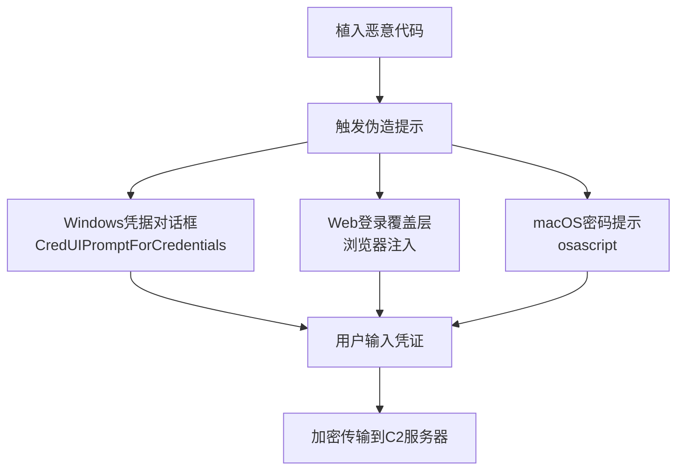

# 输入提示 (T1141)

## 一句话通俗理解

**弹个假的登录框骗你输密码——攻击者伪造一个系统对话框或网页弹窗，当你输入密码时就被记录下来了。**

## 30秒速查卡

| 维度 | 你需要知道的 |
|------|-------------|
| 这是什么？ | 弹出假的登录框骗用户输入密码 |
| 为什么危险？ | 人类很难分辨真假登录框，一旦输入就等于把密码交给了攻击者 |
| 谁需要关心？ | 终端安全工程师、SOC分析师 |
| 你的第一步防御 | 部署终端检测响应（EDR），监控异常的登录框弹出 |
| 如果只做一件事 | 监控异常的登录对话框弹出，特别是来自非浏览器进程的登录请求 |

## 难度等级

- ⭐⭐ 中级（需要一定基础）

## 技术描述

输入提示（T1141）是MITRE ATT&CK框架中凭证访问战术的一种技术。

**通俗解释：**
你在用电脑时突然弹出一个窗口说"您的会话已过期，请重新登录"，看起来跟系统的登录框一模一样。你输入用户名和密码后，系统说"登录成功"，什么都没发生——但你的密码已经被发送到攻击者那里了。就像有人冒充快递员让你签收快递，你看他穿着快递制服就签了字，其实他是来偷你签名的。

**技术原理：**
1. **Windows凭据提示伪造**：使用CredUIPromptForCredentials API创建与原系统提示外观一致的凭据对话框，标题仿造为"您的会话已过期，请重新登录"
2. **Web登录覆盖层**：在浏览器中检测到目标银行/邮箱URL时，在正常页面之上显示一个伪造的登录覆盖层（overlay）
3. **macOS密码提示**：使用AppleScript或osascript命令伪造macOS密码提示，如`osascript -e 'display dialog "请输入密码以安装更新" default answer "" with hidden answer'`
4. **终端sudo伪装**：在终端中伪装sudo或su命令的密码提示

**用途与影响：**
输入提示的成功率通常较高，因为用户在日常操作中已经习惯于响应系统凭据请求。与键盘记录器不同，输入提示直接获取用户主动输入的凭证，不需要在后台被动记录。攻击者通常配合社会工程学，选择用户最不会怀疑的时机弹出伪造提示。

## 子技术列表

该技术没有官方子技术分类。

## 攻击流程

```
植入恶意代码 --> 触发伪造提示 --> 用户输入 --> 捕获凭证 --> 外传
```



**步骤详解：**

1. **植入恶意代码**
   - 通俗描述：先在目标电脑上装一个能弹窗的恶意软件
   - 技术细节：通过钓鱼邮件、漏洞利用、恶意网站传播
   - 常用工具：木马、浏览器劫持脚本

2. **触发伪造提示**
   - 通俗描述：在合适的时机弹出一个假登录框
   - 技术细节：监控用户行为（访问银行网站、打开特定软件），触发伪造提示
   - 常用工具：CredUIPromptForCredentials API、AppleScript

3. **捕获并外传**
   - 通俗描述：用户输入的密码被悄悄发送出去
   - 技术细节：通过HTTP POST或加密通道发送到C2服务器
   - 常用工具：HTTP POST、DNS隧道

## 真实案例

### 案例1：Lumma Stealer -- 伪造浏览器登录提示（2024-2025）

- **时间**: 2024-2025年
- **目标**: 全球加密货币和银行用户
- **攻击组织**: Lumma Stealer运营者
- **手法**: Lumma Stealer（2024-2025年最活跃的信息窃取恶意软件之一）在感染浏览器后，等待用户导航到目标加密货币交易所或银行网站。当检测到目标URL时，Lumma在正常页面之上显示伪造的登录覆盖层，包含品牌logo。用户输入的凭证被记录并通过HTTP发送到C2服务器。2025年上半年Lumma感染了超过58万个终端。
- **影响**: 数十万个加密货币和银行账户凭证被窃取
- **参考链接**: [Flashpoint - 2025凭证威胁报告](https://dailysecurityreview.com/news/credential-theft-up-160-in-2025-billion-logins-stolen/)

### 案例2：DanaBot -- Windows凭据对话框劫持（2018-2024）

- **时间**: 2018-2024年
- **目标**: 全球银行、支付处理机构
- **攻击组织**: DanaBot运营者
- **手法**: DanaBot木马使用Windows API CredUIPromptForCredentialsW创建与原系统提示外观一致的凭据对话框。感染后等待用户访问银行或加密货币网站，在用户执行操作前弹出自定义凭据提示，标题为"您的会话已过期，请重新登录"。输入的凭据被加密存储并发送到C2基础设施。
- **影响**: 大量银行客户凭证被窃取
- **参考链接**: [MITRE ATT&CK - DanaBot](https://attack.mitre.org/software/S0667/)

### 案例3：Atomic macOS Stealer -- macOS密码提示（2023-2024）

- **时间**: 2023-2024年
- **目标**: macOS用户（科技行业、加密货币）
- **攻击组织**: Atomic Stealer运营者
- **手法**: Atomic macOS Stealer（AMOS）使用AppleScript通过osascript命令伪造macOS密码提示。恶意软件通过DMG安装包分发，运行时弹出显示"需要输入您的密码以安装更新"的对话框。当用户输入密码后，明文密码被写入文件并通过HTTP POST发送给攻击者。此技术成功绕过了macOS的内置安全机制。
- **影响**: 大量macOS用户的系统和加密货币钱包凭证被窃取
- **参考链接**: [MITRE ATT&CK - T1141](https://attack.mitre.org/techniques/T1141/)

## 红队视角

> ⚠️ **免责声明**：以下内容仅用于合法的安全测试、渗透测试和教育目的。未经授权对他人系统进行测试是违法行为。

### 实战技巧

1. **时机的选择**
   在用户刚打开浏览器或访问特定网站时弹出提示，成功的概率最高

2. **视觉逼真度**
   使用真实网站的截图作为覆盖层背景，确保像素级别的相似

3. **错误处理**
   用户第一次输错时显示"密码错误，请重试"，增加真实感

### 常用工具

| 工具名称 | 用途 | 平台 | 链接 |
|----------|------|------|------|
| CredUIPromptForCredentials | Windows API伪造凭据对话框 | Windows | 系统API |
| osascript | macOS伪造密码提示 | macOS | 系统自带 |
| SET | 社会工程学工具包 | Linux | [GitHub](https://github.com/trustedsec/social-engineer-toolkit) |
| BeEF | 浏览器漏洞利用框架 | 跨平台 | [GitHub](https://github.com/beefproject/beef) |

### 注意事项

- 伪造提示的成功率高度依赖社会工程学的质量
- Windows UAC提示不能被恶意软件模拟（微软做了防护）
- macOS的Touch ID不能通过osascript模拟

## 蓝队视角

### 检测要点

1. **异常的CredUIPromptForCredentials调用**
   - 日志来源：API监控、EDR
   - 关注字段：调用进程（非预期进程弹出凭据提示）
   - 异常特征：非系统进程调用凭据提示API

2. **浏览器覆盖层检测**
   - 日志来源：浏览器安全扩展、EDR
   - 关注字段：浏览器窗口中的异常DOM元素
   - 异常特征：页面加载后出现额外的登录表单

### 监控建议

- 监控异常的API调用（CredUIPromptForCredentials）
- 审计osascript和AppleScript的异常使用
- 对频繁出现的浏览器覆盖层行为进行UEBA分析
- 教育用户永远不要通过弹窗输入企业凭据

## 检测建议

### 网络层检测

**检测方法：** 监控与输入提示相关的网络通信模式，检测凭据外传的流量特征。

**具体规则/命令示例：**
```
# 检测向可疑域名POST包含密码字段的HTTP请求（Zeek脚本）
# 监控HTTP POST请求中的敏感字段名（password、credential、login）
zeek -C -r capture.pcap "http_post_body" | grep -iE "password=|credential=|passwd="

# 检测DNS查询中的异常编码（可能是凭据外传的DNS隧道）
tshark -r capture.pcap -Y "dns.qry.name" -T fields -e dns.qry.name | grep -E "^(base64|[a-z0-9]{40,}\.)"
```

### 主机层检测

**检测方法：** 监控凭据提示API的异常调用

**Windows事件ID：**
- 事件ID 4688：检测非法进程调用凭据提示API
- Sysmon Event ID 1：检测PowerShell脚本执行osascript

**具体命令示例：**
```powershell
# 检测PowerShell中的凭据提示
Get-WinEvent -FilterHashtable @{LogName='Security';ID=4688} |
    Where-Object { $_.Properties[5].Value -like '*Credential*' }
```


**用人话说：** 这条规则在监控是否有异常的登录对话框被弹出。攻击者会创建假的登录框，看起来和系统登录框一模一样，诱骗用户输入密码。正常情况下只有系统登录和特定应用会弹出登录框。如果有陌生进程弹出登录框，那就是攻击者在用假登录框偷密码。

### 应用层检测

**Sigma规则示例：**
```yaml
title: Suspicious Credential Prompt via OSAScript
status: experimental
description: 检测macOS中使用osascript的恶意密码提示
logsource:
    category: process_creation
    product: macos
detection:
    selection:
        Image: '/usr/bin/osascript'
        CommandLine|contains:
            - 'display dialog'
            - 'password'
            - 'hidden answer'
    condition: selection
level: high
tags:
    - attack.t1141
```

## 缓解措施

### 优先级1：关键措施

**措施名称：** 教育用户识别伪造提示

**具体实施步骤：**
1. 培训用户永远不要通过弹窗输入企业凭据
2. 强调合法的系统提示不会要求输入密码
3. 建立报告可疑提示的渠道

### 优先级2：重要措施

**措施名称：** 实施Web隔离

**具体实施步骤：**
1. 部署远程浏览器隔离技术
2. 防止恶意脚本在用户浏览器会话中注入覆盖层
3. 使用浏览器安全扩展标记和拦截非请求的登录覆盖层

### 优先级3：建议措施

**措施名称：** 端点检测

**具体实施步骤：**
1. 部署EDR监控凭据提示API的异常使用
2. 在macOS中限制AppleScript的使用权限
3. 实施应用程序白名单

### MITRE ATT&CK 缓解措施映射

| 缓解措施ID | 缓解措施名称 | 适用性 | 说明 |
|------------|-------------|--------|------|
| M1017 | 用户培训 | 适用 | 培训用户识别伪造提示 |
| M1038 | 执行防护 | 适用 | 应用程序白名单限制恶意软件 |
| M1041 | 凭证保护 | 部分适用 | 使用Windows Defender Credential Guard |

## 动手实验

> ⚠️ **重要提示**：所有实验必须在隔离的实验室环境中进行，禁止对未授权的真实系统进行测试。

### 实验环境准备

**所需工具：**
- Windows虚拟机
- Visual Studio或Python
- PowerShell

### 实验1：Windows凭据提示实验（初级）

**实验目标：** 了解CredUIPromptForCredentials API的工作原理

**实验步骤：**
1. 使用PowerShell创建简单的凭据提示
2. 观察凭据提示的外观和行为
3. 对比合法的系统提示与伪造提示的差异

```powershell
$cred = $Host.UI.PromptForCredential("安全验证", "您的会话已过期，请重新登录", "", "")
```

**预期结果：** 出现系统的凭据输入对话框

**学习要点：** 理解为什么用户容易上当

## 术语解释

| 术语 | 英文原名 | 通俗解释 |
|------|----------|----------|
| CredUI | Credential UI | Windows的"密码输入框"API |
| 覆盖层 | Overlay | 在现有网页上一层透明覆盖，看起来像原页面的一部分 |
| AppleScript | AppleScript | macOS的自动化脚本语言，可以控制应用程序 |
| 社会工程学 | Social Engineering | 通过"骗"人而不是"黑"系统来获取信息 |
| API钩子 | API Hooking | 拦截和修改系统API调用的技术 |

## 参考资料

### 官方文档

- [MITRE ATT&CK - T1141](https://attack.mitre.org/techniques/T1141/)
- [Credential UI API - Windows文档](https://docs.microsoft.com/en-us/windows/win32/api/wincred/nf-wincred-creduipromptforcredentialsw)

### 安全报告

- [Recorded Future - 2025 Identity Threat Report](https://www.recordedfuture.com/blog/identity-trend-report-march-blog) - 2025年凭证威胁态势报告
