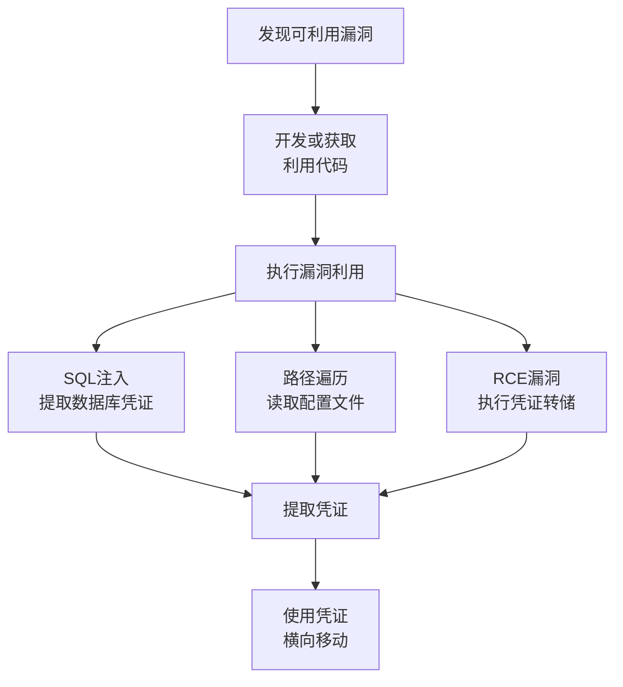

# 凭证访问漏洞利用 (T1212)

## 一句话通俗理解

**利用软件漏洞直接偷密码——不试密码、不装监听器，利用系统或软件的漏洞直接读取存储的凭证。**

## 难度等级

- ⭐⭐⭐ 高级（需要深入技术知识）

## 技术描述

凭证访问漏洞利用（T1212）是MITRE ATT&CK框架中凭证访问战术的一种技术。

**通俗解释：**
攻击者利用软件中的"设计缺陷"或"编程错误"直接获取凭证。比如一个文件上传系统有一个漏洞，攻击者利用这个漏洞可以读取服务器上的所有配置文件，其中包括数据库密码。这就像房子的门锁设计有缺陷——小偷不用撬锁，只需要知道锁的缺陷就能轻松开门。

**技术原理：**
1. **内存损坏漏洞**：缓冲区溢出、释放后使用（Use-After-Free）导致非授权的内存读取，泄露内存中缓存的凭证
2. **SQL注入**：通过注入SQL语句绕过认证，直接从数据库提取用户凭证哈希
3. **认证绕过漏洞**：利用认证逻辑缺陷直接访问包含凭证的数据存储或API
4. **信息泄露漏洞**：通过路径遍历、SSRF（服务器端请求伪造）获取存储在文件系统或数据库中的凭证
5. **权限提升漏洞**：从低权限提升到管理员/SYSTEM权限，执行需要高权限的凭证转储操作

**用途与影响：**
该技术的核心在于利用漏洞代码执行或信息泄露，直接获得本不应被攻击者访问的凭证材料。攻击者可能利用操作系统漏洞、Web应用漏洞、网络服务漏洞或第三方软件漏洞。2025年Mandiant报告显示，漏洞利用是最常见的初始访问方式（占33%），许多漏洞直接导致凭证泄露。

## 子技术列表

该技术没有官方子技术分类。

## 攻击流程

```
发现漏洞 --> 开发/获取利用代码 --> 执行利用 --> 提取凭证 --> 横向移动
```



**步骤详解：**

1. **发现漏洞**
   - 通俗描述：找到软件或系统中的"裂缝"
   - 技术细节：分析CVE公告、使用漏洞扫描器、阅读安全研究
   - 常用工具：Nessus、OpenVAS、Metasploit

2. **执行利用**
   - 通俗描述：沿着裂缝"掰开"系统，获取不该有的访问权限
   - 技术细节：发送精心构造的请求触发漏洞（SQL注入、路径遍历）
   - 常用工具：SQLMap、Metasploit、自定义漏洞利用脚本

3. **提取凭证**
   - 通俗描述：利用获取的权限读取密码
   - 技术细节：读取配置文件中的密码、从数据库提取用户哈希
   - 常用工具：Impacket secretsdump、mimikatz

## 真实案例

### 案例1：MOVEit Transfer漏洞 (CVE-2023-34362) -- CLOP勒索软件（2023-2024）

- **时间**: 2023-2024年
- **目标**: 全球企业（政府、金融、医疗）
- **攻击组织**: CLOP勒索软件组织
- **手法**: CLOP利用MOVEit Transfer托管文件传输软件中的SQL注入漏洞（CVE-2023-34362）。攻击者向MOVEit的REST API发送精心构造的HTTP请求，利用SQL注入绕过认证机制获得数据库访问权限。通过该漏洞，攻击者从MOVEit的数据库中提取了所有用户的凭证哈希。此次攻击影响了超过2000个组织，CLOP利用窃取的凭证进行横向移动并部署勒索软件。2024年CLOP仍在对未打补丁的系统进行攻击。
- **影响**: 超过2000个组织受影响，数千万人的数据被泄露（包括BBC、Boots、英国航空等）
- **参考链接**: [MITRE ATT&CK - CLOP](https://attack.mitre.org/groups/G1003/)

### 案例2：Snowflake数据泄露 -- 凭证使用（2024）

- **时间**: 2024年
- **目标**: 超过160个Snowflake客户
- **攻击组织**: UNC5537
- **手法**: 攻击者利用信息窃取恶意软件中获得的凭证直接登录Snowflake账户。这些账户没有启用MFA，攻击者使用泄露的凭证（从其他漏洞中获得的）直接访问和管理控制台。虽然这不是直接漏洞利用，但它展示了漏洞利用→凭证窃取→凭证填充的完整攻击链。此次攻击导致AT&T的50亿条通话记录和Ticketmaster的数据被窃取。
- **影响**: 史上最大数据泄露之一，影响AT&T、Ticketmaster、Santander等
- **参考链接**: [Wikipedia - Snowflake数据泄露](https://en.wikipedia.org/wiki/Snowflake_data_breach)

### 案例3：ProxyShell漏洞链 -- Exchange服务器凭证（2021-2024）

- **时间**: 2021-2024年
- **目标**: 全球Exchange服务器用户
- **攻击组织**: 多个APT组织
- **手法**: 攻击者利用Microsoft Exchange Server的ProxyShell漏洞链获取初始访问权限。漏洞链包括：绕过Exchange的ACK认证（CVE-2021-34473）、提权至SYSTEM权限（CVE-2021-34523）。利用这些漏洞后，攻击者以SYSTEM权限在Exchange服务器上执行任意PowerShell命令，提取所有邮箱用户的凭据。即使微软发布了补丁，直到2024年仍有大量未修复的服务器被攻击。
- **影响**: 数十万个Exchange服务器被入侵
- **参考链接**: [MITRE ATT&CK - ProxyShell](https://attack.mitre.org/software/S0600/)

### 案例4：PrintNightmare -- Windows Print Spooler漏洞（2021-2024）

- **时间**: 2021-2024年
- **目标**: 全球Windows域环境
- **攻击组织**: 多个勒索软件组织和APT团伙
- **手法**: PrintNightmare是Windows Print Spooler服务中的远程代码执行漏洞（CVE-2021-34527）。攻击者利用该漏洞以SYSTEM权限在目标系统上执行任意代码。获得SYSTEM权限后，攻击者使用LSASS内存转储提取域控制器上的所有域用户凭证哈希。此漏洞在2024年仍被多个勒索软件组织利用。
- **影响**: 影响几乎所有Windows版本，被广泛用于勒索软件攻击
- **参考链接**: [MSRC - PrintNightmare分析](https://msrc.microsoft.com/update-guide/vulnerability/CVE-2021-34527)

## 红队视角

> ⚠️ **免责声明**：以下内容仅用于合法的安全测试、渗透测试和教育目的。未经授权对他人系统进行测试是违法行为。

### 实战技巧

1. **优先使用已公开的PoC**
   大部分CVSS 9.0+漏洞都有公开的利用代码（PoC），在GitHub和Exploit-DB上可找到

2. **结合漏洞链**
   单个漏洞的效果有限，组合多个漏洞可以完成从初始访问到凭证提取的完整攻击链

3. **离线利用优先**
   如果能直接利用漏洞获取NTDS.dit或SAM文件，就不需要在目标上执行mimikatz

### 常用工具

| 工具名称 | 用途 | 平台 | 链接 |
|----------|------|------|------|
| Metasploit | 漏洞利用框架，包含多种凭证利用模块 | 跨平台 | [官方](https://www.metasploit.com/) |
| SQLMap | 自动化SQL注入工具 | 跨平台 | [GitHub](https://github.com/sqlmapproject/sqlmap) |
| Nuclei | 漏洞扫描器，支持自动模板 | 跨平台 | [GitHub](https://github.com/projectdiscovery/nuclei) |
| Impacket | 协议工具集，支持多种凭证提取 | 跨平台 | [GitHub](https://github.com/fortra/impacket) |

### 注意事项

- 漏洞利用可能造成服务中断，在红队测试中需要评估风险
- 部分漏洞利用需要目标系统满足特定条件（如开启特定服务）
- 打补丁的系统无法被已知漏洞利用

## 蓝队视角

### 检测要点

1. **异常错误模式和系统行为**
   - 日志来源：系统日志、应用日志
   - 关注字段：Netlogon失败事件、异常Kerberos请求
   - 异常特征：大量认证失败后突然成功

2. **SQL注入攻击模式**
   - 日志来源：Web服务器日志、WAF日志
   - 关注字段：异常的SQL语句、数据库错误消息
   - 异常特征：URL或POST参数中包含SQL语句

### 监控建议

- 及时跟踪和部署已知漏洞的安全更新
- 部署WAF检测SQL注入和路径遍历攻击
- 监控Active Directory中的账户属性变更
- 使用EDR监控漏洞利用后的凭证访问行为

## 检测建议

### 网络层检测

**检测方法：** 检测扫描和利用活动的网络特征

**具体规则/命令示例：**
```
# Snort/Suricata检测SQL注入
alert http any any -> $HOME_NET any (msg:"潜在的SQL注入"; content:"' OR "; sid:XXXXX;)
```

### 主机层检测

**检测方法：** 监控漏洞利用后的异常行为

**Windows事件ID：**
- 事件ID 4688：检测异常进程创建（如利用后执行PowerShell）
- 事件ID 4662：目录服务操作（DCSync检测）

### 应用层检测

**Sigma规则示例：**
```yaml
title: CVE-2023-34362 MOVEit SQL Injection
status: experimental
description: 检测MOVEit Transfer的SQL注入利用
logsource:
    category: web_server
    product: iis
detection:
    selection:
        cs-uri-query|contains:
            - '/api/'
            - 'Machine'
            - '__VIEWSTATE'
    condition: selection
level: critical
tags:
    - attack.t1212
```

## 缓解措施

### 优先级1：关键措施

**措施名称：** 建立漏洞管理流程

**具体实施步骤：**
1. 建立资产清单，跟踪所有软件版本
2. 订阅CVE公告和安全厂商预警
3. 在24小时内修复CVSS 9.0+漏洞

### 优先级2：重要措施

**措施名称：** 实施深度防御

**具体实施步骤：**
1. 为关键系统（域控、Exchange、VPN）实施额外监控
2. 部署WAF保护Web应用
3. 限制对关键系统的网络访问

### 优先级3：建议措施

**措施名称：** 安全开发生命周期

**具体实施步骤：**
1. 对自建应用实施代码审查和安全测试
2. 定期进行渗透测试
3. 使用SAST/DAST工具自动化安全测试

### MITRE ATT&CK 缓解措施映射

| 缓解措施ID | 缓解措施名称 | 适用性 | 说明 |
|------------|-------------|--------|------|
| M1051 | 更新软件 | 适用 | 及时安装安全补丁 |
| M1030 | 网络分段 | 适用 | 限制对关键系统的访问 |
| M1047 | 审计 | 适用 | 启用详细审计日志 |

## 动手实验

> ⚠️ **重要提示**：所有实验必须在隔离的实验室环境中进行，禁止对未授权的真实系统进行测试。

### 实验环境准备

**所需工具：**
- Metasploit框架
- Docker（搭建漏洞环境）
- Kali Linux

### 实验1：SQL注入提取凭证（中级）

**实验目标：** 使用SQLMap自动化提取数据库凭证

**实验步骤：**
1. 搭建存在SQL注入漏洞的Web应用
2. 使用SQLMap检测注入点：`sqlmap -u "http://target.com/page?id=1" --dbs`
3. 提取用户表：`sqlmap -u "http://target.com/page?id=1" -D db_name --tables`
4. 提取用户凭证：`sqlmap -u "http://target.com/page?id=1" -D db_name -T users --dump`

**预期结果：** 获取数据库中的用户密码哈希

**学习要点：** 理解SQL注入获取凭证的原理

## 术语解释

| 术语 | 英文原名 | 通俗解释 |
|------|----------|----------|
| CVE | Common Vulnerabilities and Exposures | 全球统一的漏洞编号，类似"身份证号" |
| SQL注入 | SQL Injection | 在输入框里输入SQL语句欺骗数据库 |
| RCE | Remote Code Execution | 远程代码执行——在别人电脑上运行自己的代码 |
| 路径遍历 | Path Traversal | 利用../等符号读取不该访问的文件 |
| PoC | Proof of Concept | 证明漏洞存在的示例代码 |
| CVSS | Common Vulnerability Scoring System | 漏洞严重程度评分（0-10分） |

## 参考资料

### 官方文档

- [MITRE ATT&CK - T1212](https://attack.mitre.org/techniques/T1212/)

### 安全报告

- [Mandiant - M-Trends 2025](https://www.mandiant.com/resources/mtrends) - 漏洞利用为33%的初始访问方式
- [Zerologon - CVE-2020-1472分析](https://www.secura.com/blog/zerologon)
- [PrintNightmare分析](https://msrc.microsoft.com/update-guide/vulnerability/CVE-2021-34527)

### 工具与资源

- [Exploit-DB](https://www.exploit-db.com/) - 漏洞利用代码库
- [NVD - 美国国家漏洞数据库](https://nvd.nist.gov/)
