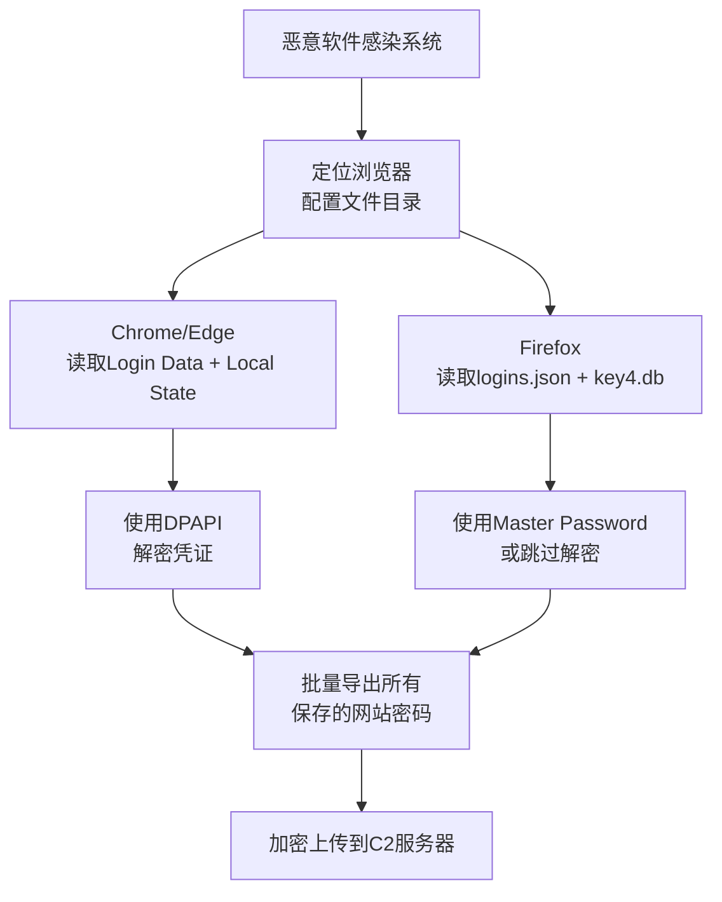

> **注意**：T1503 在 ATT&CK v15 中已弃用，由 T1555.003（云服务凭证）取代。本文件内容保留供向后兼容参考。

# 浏览器凭证窃取 (T1503)

## 一句话通俗理解

**从浏览器记住的密码里提取明文——你让浏览器"记住密码"的功能，成了攻击者的密码保险箱。**

## 30秒速查卡

| 维度 | 你需要知道的 |
|------|-------------|
| 这是什么？ | 从浏览器记住的密码里提取明文 |
| 为什么危险？ | 浏览器保存了大量网站密码，攻击者只需要读取浏览器数据就能拿到所有密码 |
| 谁需要关心？ | 终端安全工程师、SOC分析师 |
| 你的第一步防御 | 禁用浏览器密码保存功能，使用企业密码管理器 |
| 如果只做一件事 | 监控浏览器密码数据库文件的异常访问和复制 |

## 难度等级

- ⭐ 初级（新手可学）

## 技术描述

浏览器凭证窃取（T1503）是MITRE ATT&CK框架中凭证访问战术的一种技术。

**通俗解释：**
几乎所有浏览器（Chrome、Edge、Firefox）都有"记住密码"的功能。当你登录网站时，浏览器会问你要不要保存密码。这些保存的密码实际上存储在电脑的本地文件中。攻击者通过读取这些文件并解密，就能获得你保存的所有网站的用户名和密码——就像你把所有钥匙放在一个抽屉里，小偷撬开抽屉就把所有钥匙都拿走了。

**技术原理：**
1. 浏览器将加密的凭证数据存储在SQLite数据库中（Chrome/Edge的`Login Data`文件、Firefox的`logins.json`）
2. Chrome/Edge使用Windows DPAPI（Data Protection API）加密凭证——加密密钥存储在`Local State`文件中
3. Firefox使用主密码保护的3DES加密，解密密钥位于`key4.db`或`key3.db`中
4. 攻击者读取这些文件，使用系统API解密（DPAPI CryptUnprotectData），或离线解析SQLite内容
5. 解密的凭证包括所有保存在浏览器中的网站登录信息

**用途与影响：**
浏览器凭证窃取是信息窃取类恶意软件（Infostealer）的核心功能。2025年Recorded Future报告显示，每个受感染设备平均产生87条被盗凭证。Lumma、RedLine、StealC等恶意软件家族的核心功能就是从浏览器提取保存的密码。2025年上半年全球凭证窃取增长了160%。

## 子技术列表

该技术没有官方子技术分类。

## 攻击流程

```
感染系统 --> 读取浏览器数据库 --> 解密凭证 --> 外传C2 --> 分类使用
```



**步骤详解：**

1. **感染系统**
   - 通俗描述：在目标电脑上安装"信息窃取"恶意软件
   - 技术细节：通过钓鱼邮件、漏洞利用、恶意下载传播
   - 常用工具：Lumma Stealer、RedLine Stealer

2. **读取并解密浏览器数据**
   - 通俗描述：找到浏览器存密码的文件，把加密的内容解密
   - 技术细节：读取`%LOCALAPPDATA%\Google\Chrome\User Data\Default\Login Data`数据库
   - 常用工具：Chrome DPAPI解密工具、LaZagne

3. **外传凭证**
   - 通俗描述：把所有密码打包发给攻击者的服务器
   - 技术细节：按域名分类后通过HTTP POST或FTP上传
   - 常用工具：HTTP POST、Telegram Bot API

## 真实案例

### 案例1：Lumma Stealer -- 浏览器凭证批量窃取（2024-2025）

- **时间**: 2024-2025年
- **目标**: 全球范围内的个人和企业用户
- **攻击组织**: Lumma Stealer运营者
- **手法**: Lumma Stealer是2024-2025年最活跃的信息窃取恶意软件之一，核心功能是从Chrome、Edge、Firefox等浏览器中提取保存的密码。它读取Chrome的`Login Data`数据库，从`Local State`文件中获取加密密钥，通过DPAPI解密后提取所有保存的网站凭证。窃取的凭证按域名分类（社交媒体、银行、企业应用），通过HTTP上传至C2服务器。2025年上半年感染超过58万个终端。
- **影响**: 数十万个在线账户凭证被窃取，包括加密货币钱包和企业应用
- **参考链接**: [Flashpoint - 2025凭证威胁报告](https://dailysecurityreview.com/news/credential-theft-up-160-in-2025-billion-logins-stolen/)

### 案例2：RedLine Stealer -- 多浏览器凭证窃取（2020-2025）

- **时间**: 2020-2025年
- **目标**: 全球用户
- **攻击组织**: RedLine Stealer运营者
- **手法**: RedLine是2020-2025年最流行的信息窃取恶意软件之一，支持从Chrome、Firefox、Edge、Opera、Brave等所有主流浏览器提取凭证。它读取各浏览器的配置文件目录，使用系统API解密保存的登录信息。RedLine通过恶意网站、伪造软件分发，窃取的凭证在地下市场以每条1-20美元的价格出售。2025年RedLine运营者被国际执法行动部分打击，但变种仍在活跃。
- **影响**: 数百万用户凭证被窃取，运营者盈利数千万美元
- **参考链接**: [MITRE ATT&CK - RedLine](https://attack.mitre.org/software/S0583/)

### 案例3：StealC -- 新兴信息窃取恶意软件（2024-2025）

- **时间**: 2024-2025年
- **目标**: 全球用户
- **攻击组织**: StealC运营者
- **手法**: StealC是2024年新兴的信息窃取恶意软件，具有模块化功能，专门针对浏览器凭证。它比Lumma和RedLine更隐蔽，使用多种反分析技术（如检测沙箱、虚拟机）。StealC读取浏览器SQLite数据库后，使用DPAPI解密。它特别针对企业SaaS应用（Office 365、Salesforce、AWS Console）的凭证。
- **影响**: 大量企业SaaS账户凭证被窃取
- **参考链接**: [Flashpoint - 2025凭证威胁报告](https://dailysecurityreview.com/news/credential-theft-up-160-in-2025-billion-logins-stolen/)

## 红队视角

> ⚠️ **免责声明**：以下内容仅用于合法的安全测试、渗透测试和教育目的。未经授权对他人系统进行测试是违法行为。

### 实战技巧

1. **离线解密**
   如果无法在目标系统上直接解密，可以将Login Data和Local State文件复制到攻击机上离线解密

2. **Firefox主密码绕过**
   即使Firefox设置了主密码，可以通过内存转储提取解密密钥

3. **批量提取脚本**
   使用PowerShell或Python脚本批量提取和解密浏览器凭证

### 常用工具

| 工具名称 | 用途 | 平台 | 链接 |
|----------|------|------|------|
| LaZagne | 从浏览器和应用中提取保存的密码 | 跨平台 | [GitHub](https://github.com/AlessandroZ/LaZagne) |
| BrowserPassView | NirSoft工具，查看浏览器保存的密码 | Windows | [NirSoft](https://www.nirsoft.net/utils/web_browser_password.html) |
| WebBrowserPassView | NirSoft工具，查看浏览器密码 | Windows | [NirSoft](https://www.nirsoft.net/utils/web_browser_password.html) |
| ChromePass | 从Chrome提取密码 | Windows | [NirSoft](https://www.nirsoft.net/utils/chromepass.html) |

### 注意事项

- 浏览器凭证窃取需要用户权限或管理员权限
- Chrome的DPAPI加密在用户登录状态下可被解密
- 在渗透测试中，提取的凭证可能包含敏感个人数据

## 蓝队视角

### 检测要点

1. **浏览器数据库的异常访问**
   - 日志来源：Sysmon Event ID 11（文件创建/访问）
   - 关注字段：Login Data、Local State、logins.json、key4.db的访问
   - 异常特征：非浏览器进程读取浏览器配置文件

2. **DPAPI解密调用**
   - 日志来源：API监控、EDR
   - 关注字段：CryptUnprotectData API被非浏览器进程调用
   - 异常特征：非预期进程调用DPAPI解密函数

### 监控建议

- 监控浏览器进程对敏感配置文件的非正常访问
- 检测进程尝试使用DPAPI CryptUnprotectData解密非自身进程保护的数据
- 监控浏览器配置文件目录的批量文件读取事件

## 检测建议

### 网络层检测

**检测方法：** 监控窃取的浏览器凭据外传的流量特征，检测敏感文件的网络传输。

**具体规则/命令示例：**
```
# 检测批量HTTP POST上传包含Login Data等敏感文件名的流量
zeek -C -r capture.pcap http.log | grep -iE "Login Data|logins.json|key4.db|Cookies"

# 检测向非标准端口外传大量数据的可疑连接（信息窃取恶意软件特征）
tshark -r capture.pcap -Y "tcp.port >= 1024 and tcp.port <= 65535 and data.len > 1000" \
  -T fields -e ip.src -e tcp.srcport -e ip.dst -e tcp.dstport -e data.len
```

### 主机层检测

**检测方法：** 监控浏览器数据库文件的访问

**Windows事件ID：**
- Sysmon Event ID 11：文件读取（监控Login Data文件）
- 事件ID 4688：检测LaZagne等信息窃取工具

**具体命令示例：**
```powershell
# 监控Login Data文件访问
Get-WinEvent -FilterHashtable @{LogName='Microsoft-Windows-Sysmon/Operational';ID=11} |
    Where-Object { $_.Properties[4].Value -like '*Login Data*' }
```


**用人话说：** 这条规则在监控是否有非浏览器进程在读取浏览器的密码数据库。Chrome、Firefox等浏览器会把用户保存的密码存在本地数据库中。正常情况下只有浏览器自己会读这些数据库。如果有陌生进程读取这些文件，那就是攻击者在偷浏览器保存的所有网站密码。

### 应用层检测

**Sigma规则示例：**
```yaml
title: Browser Credential Extraction via Non-Browser Process
status: experimental
description: 检测非浏览器进程读取浏览器密码数据库
logsource:
    category: file_event
    product: windows
detection:
    selection:
        TargetFilename|contains:
            - '\Login Data'
            - '\logins.json'
            - '\key4.db'
        Image|contains:
            - '\powershell.exe'
            - '\cmd.exe'
            - '\rundll32.exe'
    condition: selection
level: high
tags:
    - attack.t1503
```

## 缓解措施

### 优先级1：关键措施

**措施名称：** 不要在浏览器中保存敏感账户密码

**具体实施步骤：**
1. 教育用户不要在浏览器中保存银行、企业VPN、管理员账户的密码
2. 使用企业密码管理器（如Bitwarden、1Password、KeePass）
3. 通过组策略禁用浏览器密码保存功能

### 优先级2：重要措施

**措施名称：** 启用设备加密

**具体实施步骤：**
1. 启用BitLocker驱动器加密，保护硬盘数据安全
2. 配置设备在锁定时自动加密内存
3. 使用Windows Hello或PIN增加本地登录安全性

### 优先级3：建议措施

**措施名称：** 端点检测

**具体实施步骤：**
1. 使用EDR产品检测浏览器凭证窃取行为模式
2. 部署应用程序控制策略阻止恶意软件执行
3. 在Firefox中启用主密码功能

### MITRE ATT&CK 缓解措施映射

| 缓解措施ID | 缓解措施名称 | 适用性 | 说明 |
|------------|-------------|--------|------|
| M1041 | 凭证保护 | 适用 | 使用权限分离保护凭证 |
| M1038 | 执行防护 | 适用 | 应用程序白名单限制恶意软件 |
| M1029 | 远程数据存储 | 部分适用 | 使用企业密码管理器 |

## 动手实验

> ⚠️ **重要提示**：所有实验必须在隔离的实验室环境中进行，禁止对未授权的真实系统进行测试。

### 实验环境准备

**所需工具：**
- Windows虚拟机
- LaZagne工具

### 实验1：提取Chrome保存的密码（初级）

**实验目标：** 使用LaZagne提取浏览器保存的密码

**实验步骤：**
1. 在Chrome中保存几个测试网站的密码
2. 运行LaZagne提取Chrome凭证：`lazagne.exe browsers`
3. 观察提取的网站URL、用户名和密码

**预期结果：** LaZagne列出所有在Chrome中保存的登录信息

**学习要点：** 理解浏览器密码存储的弱点和风险

## 关联技术

| 技术ID | 技术名称 | 关系说明 |
|--------|----------|----------|
| [T1555.003 - Web浏览器](./T1555-Credentials-from-Password-Stores.md) | 密码存储凭证提取：Web浏览器 | **包含关系**：T1555.003（Web Browsers）覆盖与T1503相同的浏览器凭证窃取功能，但T1555.003是T1555（密码存储凭证提取）的一个子技术，而T1503是独立技术。两者在浏览器密码提取方面功能重叠，T1503专注于浏览器，T1555涵盖更广泛的密码存储类型（Keychain、Windows凭据管理器、第三方密码管理器等）。 |

## 术语解释

| 术语 | 英文原名 | 通俗解释 |
|------|----------|----------|
| SQLite | SQLite | 一种轻量级数据库，浏览器用它存密码 |
| DPAPI | Data Protection API | Windows的加密服务，保护浏览器存储的密码 |
| Infostealer | Information Stealer | 专门偷信息（密码、cookie）的恶意软件 |
| 主密码 | Master Password | Firefox的"第二道锁"，不输主密码就看不了保存的密码 |
| 配置文件 | Profile Directory | 浏览器在电脑上存放所有个人数据的文件夹 |

## 参考资料

### 官方文档

- [MITRE ATT&CK - T1503](https://attack.mitre.org/techniques/T1503/)
- [Chrome Password Security FAQ](https://chromium.googlesource.com/chromium/src/+/master/docs/security/faq.md)

### 安全报告

- [Recorded Future - 2025 Identity Threat Report](https://www.recordedfuture.com/blog/identity-trend-report-march-blog) - 每个受感染设备87条凭证

### 工具与资源

- [LaZagne](https://github.com/AlessandroZ/LaZagne) - 凭证恢复工具
- [Firefox Password Manager Technical Overview](https://support.mozilla.org/en-US/kb/firefox-password-manager-technical-overview)
