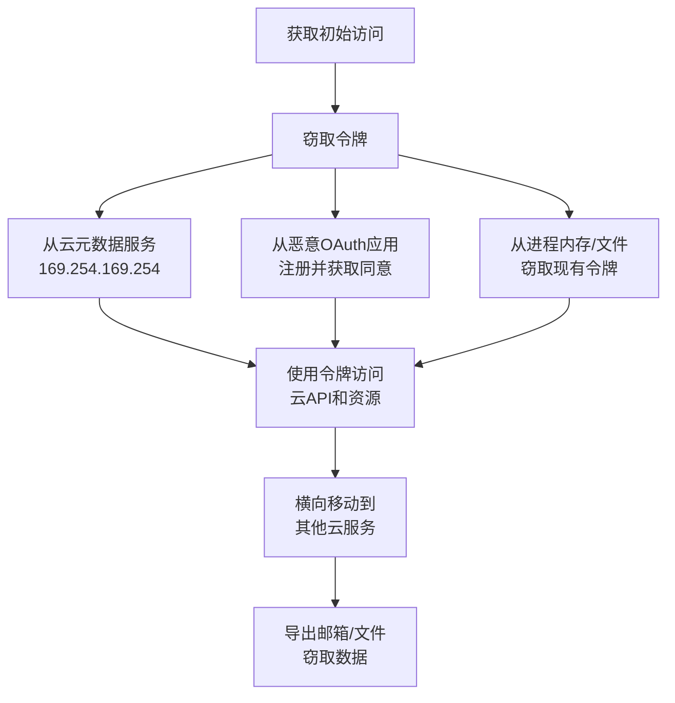

# 窃取应用访问令牌 (T1528)

## 一句话通俗理解

**偷走你的OAuth令牌，不用密码也能登录——令牌是你登录后的"通行证"，拿到它就能以你的身份访问所有云资源。**

## 30秒速查卡

| 维度 | 你需要知道的 |
|------|-------------|
| 这是什么？ | 偷走OAuth令牌，不用密码也能登录 |
| 为什么危险？ | OAuth令牌就是云服务的'万能钥匙'，拿到它就能以用户身份访问所有资源 |
| 谁需要关心？ | 云安全工程师、SOC分析师 |
| 你的第一步防御 | 实施OAuth令牌生命周期管理，监控异常的API访问 |
| 如果只做一件事 | 监控OAuth令牌的异常使用，特别是来自新地理位置的API请求 |

## 难度等级

- ⭐⭐ 中级（需要一定基础）

## 技术描述

窃取应用访问令牌（T1528）是MITRE ATT&CK框架中凭证访问战术的一种技术。

**通俗解释：**
当你用微信或Google账号登录一个网站时，网站不保存你的密码，而是发给你一个"通行证"（访问令牌）。这个通行证在一定时间内有效，可以用来访问你的信息。攻击者偷走这个通行证，就能冒充你访问所有关联的服务——不需要知道你的密码，也不需要MFA验证。就像你进游乐园时手腕上戴了一个手环，有了它就能玩所有项目。小偷只需要偷走你的手环，就能冒充你玩所有项目。

**技术原理：**
1. **OAuth 2.0令牌窃取**：OAuth 2.0框架中的访问令牌（Access Token）和刷新令牌（Refresh Token）是攻击者的主要目标
2. **云元数据服务令牌获取**：云平台（AWS、Azure、GCP）为每个计算实例提供元数据API，包含分配给该实例的IAM角色临时凭证
3. **恶意OAuth应用注册**：攻击者在受害者的云租户中注册恶意应用，请求高权限API作用域（如Mail.Read、Files.ReadWrite.All），获取合法令牌
4. **令牌拦截**：在OAuth授权流程中拦截授权码或令牌响应

**用途与影响：**
令牌窃取是最危险的云攻击技术之一，因为令牌可以绕过MFA。2024-2025年，令牌窃取攻击大幅增加。Obsidian Security报告显示，令牌窃取占Microsoft 365安全事件的31%。攻击者使用窃取的令牌通过Graph API访问电子邮件、SharePoint文件和Teams消息，而不触发任何认证告警。

## 子技术列表

该技术没有官方子技术分类。

## 攻击流程

```
获取初始访问 --> 窃取令牌 --> 使用令牌 --> 横向移动 --> 数据窃取
```



**步骤详解：**

1. **获取初始访问**
   - 通俗描述：先进入目标系统或云环境
   - 技术细节：通过漏洞利用、钓鱼或被盗凭证获得初始入口
   - 常用工具：Cobalt Strike、漏洞利用工具

2. **窃取令牌**
   - 通俗描述：找到并偷走"通行证"
   - 技术细节：访问云实例元数据服务（IMDS）获取IAM角色凭证，或窃取OAuth刷新令牌
   - 常用工具：AWS CLI、Azure CLI、curl

3. **使用令牌扩大访问**
   - 通俗描述：用通行证访问更多资源
   - 技术细节：使用令牌调用Graph API、AWS API、GCP API
   - 常用工具：Microsoft Graph API、AWS SDK

## 真实案例

### 案例1：Midnight Blizzard -- OAuth令牌窃取（2024-2025）

- **时间**: 2024-2025年
- **目标**: 全球科技公司、政府机构
- **攻击组织**: Midnight Blizzard（APT29，俄罗斯国家背景）
- **手法**: 在2024年对微软的攻击中，APT29使用密码喷射获取初始访问后，窃取了OAuth刷新令牌。这些令牌允许攻击者在没有密码和MFA的情况下持续访问Microsoft 365邮件。APT29利用窃取的令牌通过Graph API访问了微软高管（包括安全团队）的邮箱。令牌的有效期长达数月，即使密码被更改，刷新令牌仍然有效。
- **影响**: 微软高级管理人员的邮箱被入侵，内部安全信息泄露
- **参考链接**: [Microsoft - 2024年攻击分析](https://www.microsoft.com/en-us/security/blog/2024/01/19/microsoft-actions-following-attack-by-nation-state-actor-midnight-blizzard/)

### 案例2：Tycoon 2FA -- AiTM令牌窃取（2024-2026）

- **时间**: 2024-2026年
- **目标**: 全球Microsoft 365用户
- **攻击组织**: Tycoon 2FA运营者
- **手法**: Tycoon 2FA钓鱼即服务平台使用实时代理技术，在用户完成Microsoft 365登录和MFA后，窃取认证后的会话令牌。攻击者使用窃取的令牌立即登录用户的邮箱和云应用，进行数据窃取和二次钓鱼。2026年初，国际执法行动捣毁了该平台。此平台占全球钓鱼流量的62%。
- **影响**: 每月超过3000万封钓鱼邮件，数千组织受影响
- **参考链接**: [WorkOS - 2026 AiTM分析](https://workos.com/blog/how-attackers-are-bypassing-mfa-using-ai-in-2026)

### 案例3：Scattered Spider -- OAuth应用滥用（2023-2024）

- **时间**: 2023-2024年
- **目标**: 科技、电信、游戏公司
- **攻击组织**: Scattered Spider
- **手法**: Scattered Spider通过社会工程学获得初始访问后，在受害者的Azure AD或Okta租户中注册自己的OAuth应用程序。这些恶意应用请求高权限OAuth作用域（Mail.Read、Files.ReadWrite.All、User.Read.All），在获得管理员同意后获取合法的访问令牌。攻击者使用这些令牌通过Graph API访问电子邮件、文件存储和身份目录，所有访问看起来均来自合法的OAuth应用。
- **影响**: 多家财富500强企业数据被窃取，包括勒索软件部署
- **参考链接**: [CISA AA23-320A](https://www.cisa.gov/news-events/cybersecurity-advisories/aa23-320a)

### 案例4：2025年OAuth Device Code钓鱼（2024-2025）

- **时间**: 2024-2025年
- **目标**: Microsoft 365用户
- **攻击组织**: 多个攻击组织
- **手法**: 攻击者利用OAuth设备代码认证流程进行钓鱼。攻击者创建一个合法的Microsoft OAuth应用，诱导用户访问并输入设备代码。用户输入代码并完成登录后，攻击者获得OAuth访问令牌和刷新令牌。这种方式可以绕过MFA，因为MFA是在用户设备上完成的。2024年下半年首次在野外发现，2025年大规模增长。
- **影响**: 数千个Microsoft 365账户被未授权访问
- **参考链接**: [Rescana - OAuth Device Code Phishing](https://www.rescana.com/post/microsoft-365-under-attack-oauth-device-code-phishing-campaigns-bypass-mfa-and-compromise-accounts)

## 红队视角

> ⚠️ **免责声明**：以下内容仅用于合法的安全测试、渗透测试和教育目的。未经授权对他人系统进行测试是违法行为。

### 实战技巧

1. **云元数据服务是金矿**
   AWS：`curl http://169.254.169.254/latest/meta-data/iam/security-credentials/`
   Azure：`curl http://169.254.169.254/metadata/identity/oauth2/token -H "Metadata: true"`
   GCP：`curl http://169.254.169.254/computeMetadata/v1/instance/service-accounts/`

2. **OAuth应用权限最大化**
   注册OAuth应用时请求高权限作用域（如`Mail.Read`、`Files.ReadWrite.All`），通过管理员同意获得全局访问

3. **刷新令牌比访问令牌更有价值**
   访问令牌通常1小时过期，但刷新令牌可长期使用，持续生成新的访问令牌

### 常用工具

| 工具名称 | 用途 | 平台 | 链接 |
|----------|------|------|------|
| Microsoft Graph API | 通过令牌访问Microsoft 365资源 | 跨平台 | [Microsoft](https://graph.microsoft.com/) |
| AWS CLI | 使用IAM角色令牌访问AWS资源 | 跨平台 | [AWS](https://aws.amazon.com/cli/) |
| curl | 从IMDS获取临时凭证 | 跨平台 | 系统自带 |
| TokenTactics | Azure AD令牌测试工具集 | 跨平台 | [GitHub](https://github.com/rvrsh3ll/TokenTactics) |

### 注意事项

- 令牌窃取的攻击面在云环境中最大，传统安全工具难以检测
- OAuth令牌通过HTTPS传输，但端点安全不足时可从内存窃取
- 刷新令牌的有效期通常为90天，期间可持续使用

## 蓝队视角

### 检测要点

1. **异常OAuth应用注册**
   - 日志来源：Azure AD审计日志、Okta系统日志
   - 关注字段：新增OAuth应用、API权限授予
   - 异常特征：非管理员注册高权限OAuth应用

2. **令牌使用异常**
   - 日志来源：云平台登录日志、API访问日志
   - 关注字段：令牌来源IP、User-Agent、地理位置
   - 异常特征：同一令牌从不同地理位置使用

### 监控建议

- 监控云平台审计日志中的OAuth应用注册和API权限授予事件
- 跟踪新增的高权限OAuth应用配置
- 监控令牌刷新频率和来源，检测异常地理位置
- 使用云平台的异常检测功能

## 检测建议

### 网络层检测

**检测方法：** 监控对云元数据服务的请求

**具体规则/命令示例：**
```
# 检测对169.254.169.254的异常请求
Zeek检测规则：http请求到169.254.169.254，来自非预期进程
```

### 主机层检测

**检测方法：** 监控对元数据端点的HTTP请求

**具体命令示例：**
```bash
# 检测AWS IMDS访问
grep -r "169.254.169.254" /var/log/syslog
```


**用人话说：** 这条规则在监控OAuth令牌是否被异常使用。OAuth令牌是云服务的登录凭证，正常情况下令牌会在固定设备和位置使用。如果发现同一个令牌突然从不同地理位置或设备发起API请求，那很可能是攻击者偷到了令牌，正在冒充合法用户访问云资源。

### 应用层检测

**Sigma规则示例：**
```yaml
title: OAuth Application Consent from Non-Admin
status: experimental
description: 检测非管理员授予OAuth应用API权限
logsource:
    category: application
    product: azure
detection:
    selection:
        Operation: 'Consent to application'
        Actor: 'Non-admin user'
    condition: selection
level: high
tags:
    - attack.t1528
```

## 缓解措施

### 优先级1：关键措施

**措施名称：** 限制OAuth应用权限

**具体实施步骤：**
1. 限制用户可同意的OAuth应用权限作用域
2. 仅允许管理员审批高权限应用
3. 禁用不必要的OAuth隐式授权流

### 优先级2：重要措施

**措施名称：** 使用短期令牌和连续访问评估

**具体实施步骤：**
1. 配置访问令牌短有效期（如30分钟）
2. 启用连续访问评估（CAE）
3. 实施令牌绑定（Token Binding）

### 优先级3：建议措施

**措施名称：** 监控和审计

**具体实施步骤：**
1. 定期审查和轮换OAuth应用密钥
2. 使用托管身份替代服务主体
3. 实施令牌刷新频率限制

### MITRE ATT&CK 缓解措施映射

| 缓解措施ID | 缓解措施名称 | 适用性 | 说明 |
|------------|-------------|--------|------|
| M1037 | 条件访问策略 | 适用 | 限制令牌使用范围和条件 |
| M1041 | 凭证保护 | 部分适用 | 使用托管身份替代静态凭据 |
| M1047 | 审计 | 适用 | 监控OAuth应用注册和令牌使用 |

## 动手实验

> ⚠️ **重要提示**：所有实验必须在隔离的实验室环境中进行，禁止对未授权的真实系统进行测试。

### 实验环境准备

**所需工具：**
- Azure AD测试租户
- Azure CLI
- Postman或curl

### 实验1：OAuth令牌窃取模拟（中级）

**实验目标：** 了解OAuth令牌的工作机制

**实验步骤：**
1. 在Azure AD中注册测试应用
2. 使用OAuth 2.0授权码流程获取访问令牌
3. 使用令牌调用Microsoft Graph API
4. 观察令牌在HTTP请求中的传输方式

**预期结果：** 理解OAuth令牌的结构和使用方式

**学习要点：** OAuth令牌的安全风险

## 术语解释

| 术语 | 英文原名 | 通俗解释 |
|------|----------|----------|
| OAuth | Open Authorization | 开放授权协议，允许应用不拿密码也能访问你的数据 |
| 访问令牌 | Access Token | 短期的"通行证"，用来证明你有权限 |
| 刷新令牌 | Refresh Token | 长期的"换证券"，用来换新的通行证 |
| IMDS | Instance Metadata Service | 云服务器的"自介绍"接口，里面可能有临时密码 |
| Graph API | Microsoft Graph API | Microsoft 365的"万能接口"，可以访问邮件、文件、用户信息 |
| 托管身份 | Managed Identity | Azure自动管理的服务身份，不用手动管理凭证 |

## 参考资料

### 官方文档

- [MITRE ATT&CK - T1528](https://attack.mitre.org/techniques/T1528/)
- [Microsoft - OAuth令牌保护](https://learn.microsoft.com/en-us/azure/security/fundamentals/token-protection)

### 安全报告

- [Microsoft - Nobelium令牌分析](https://www.microsoft.com/en-us/security/blog/2021/05/28/breaking-down-nobeliums-latest-targeted-activity/)
- [Obsidian Security - 2026令牌攻击分析](https://www.obsidiansecurity.com/blog/token-based-attacks-how-attackers-bypass-mfa)
- [CISA - Scattered Spider](https://www.cisa.gov/news-events/cybersecurity-advisories/aa23-320a)

### 学习资料

- [OAuth 2.0安全最佳实践](https://datatracker.ietf.org/doc/html/draft-ietf-oauth-security-topics)
