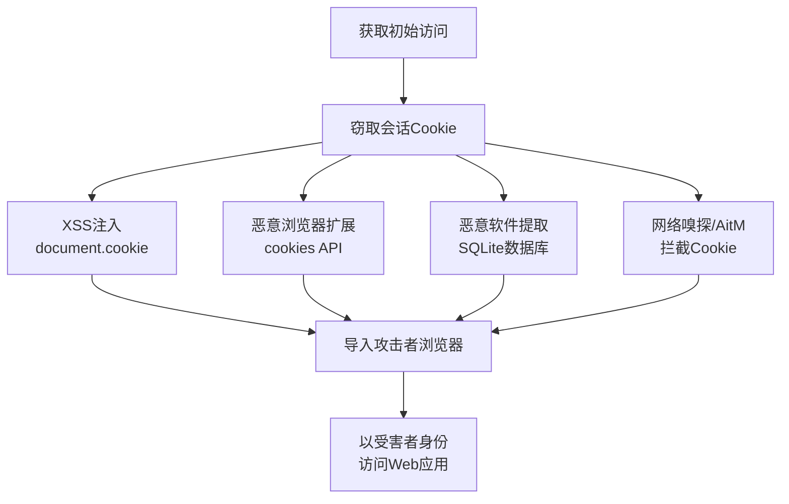

# 窃取Web会话Cookie (T1539)

## 一句话通俗理解

**偷走浏览器的"登录凭证小纸条"——Cookie是你登录网站后浏览器保存的"已登录证明"，拿到它就能直接冒充你。**

## 30秒速查卡

| 维度 | 你需要知道的 |
|------|-------------|
| 这是什么？ | 偷走浏览器的'登录凭证小纸条' |
| 为什么危险？ | Cookie就是网站的'登录小纸条'，拿到它就能跳过密码验证直接进入用户会话 |
| 谁需要关心？ | Web安全工程师、SOC分析师 |
| 你的第一步防御 | 实施Cookie绑定，启用HTTPS Only模式 |
| 如果只做一件事 | 监控Web服务器上Cookie的异常使用，特别是同一Cookie从不同IP的请求 |

## 难度等级

- ⭐⭐ 中级（需要一定基础）

## 技术描述

窃取Web会话Cookie（T1539）是MITRE ATT&CK框架中凭证访问战术的一种技术。

**通俗解释：**
当你登录网站后，网站会在你的浏览器上贴一个小标签（Cookie），上面写着"这个用户已登录"。以后每次访问时，浏览器出示这个标签，网站就不再问密码了。攻击者如果偷走这个标签，贴在自己的浏览器上，就能直接以你的身份登录——不需要知道密码，也不需要MFA验证。就像你进电影院时手上盖了一个荧光章，中途出去再进来只要亮出章就行。小偷如果能复制这个章，就能免费进场。

**技术原理：**
1. 用户登录网站后，服务器在HTTP响应中设置会话Cookie，浏览器将其存储在本地数据库中
2. 攻击者通过以下方式窃取Cookie：
   - **XSS攻击**：注入恶意JavaScript代码，通过`document.cookie`读取当前站点的所有Cookie
   - **浏览器扩展劫持**：恶意扩展请求`cookies`和`tabs`权限，读取所有Cookie
   - **本地数据库提取**：从Chrome的`Cookies` SQLite数据库或Firefox的`cookies.sqlite`中提取
   - **网络拦截**：通过嗅探或中间人攻击捕获未加密或易受攻击的会话标识符
3. 攻击者将窃取的Cookie导入自己的浏览器，以受害者身份访问Web应用

**用途与影响：**
会话Cookie窃取是2024-2026年增长最快的攻击方式之一。根据Microsoft 2025年数字防御报告，每天检测到39,000次会话令牌攻击。Google报告显示，会话Cookie攻击与基于密码的攻击数量相当。2025年，31%的恶意软件来源凭证包含活动会话Cookie。

## 子技术列表

该技术没有官方子技术分类。

## 攻击流程

```
获取初始访问 --> 窃取Cookie --> 导入浏览器 --> 以受害者身份访问
```



**步骤详解：**

1. **窃取Cookie**
   - 通俗描述：想办法偷到那个"已登录标签"
   - 技术细节：XSS注入、恶意浏览器扩展、本地数据库提取
   - 常用工具：BeEF、恶意浏览器扩展

2. **导入并利用**
   - 通俗描述：把偷来的标签贴在自己身上
   - 技术细节：使用Cookie Editor扩展或浏览器开发者工具导入Cookie
   - 常用工具：Cookie Editor、EditThisCookie

## 真实案例

### 案例1：Lumma Stealer -- 浏览器Cookie批量窃取（2024-2025）

- **时间**: 2024-2025年
- **目标**: 全球用户
- **攻击组织**: Lumma Stealer运营者
- **手法**: Lumma Stealer作为2024-2025年最活跃的Infostealer之一，不仅窃取浏览器保存的密码，还批量提取所有浏览器的会话Cookie。它从Chrome的`Cookies` SQLite数据库和Firefox的`cookies.sqlite`文件中提取所有站点的会话Cookie。特别关注云服务（Microsoft 365、AWS、GCP）和银行网站的活跃会话Cookie。攻击者随后使用这些Cookie直接登录目标账户，绕过MFA。
- **影响**: 数十万个云服务和银行账户被未授权访问
- **参考链接**: [Push Security - 2024身份攻击分析](https://pushsecurity.com/blog/2024-identity-breaches)

### 案例2：Tycoon 2FA -- AiTM Cookie窃取（2024-2026）

- **时间**: 2024-2026年
- **目标**: 全球Microsoft 365用户
- **攻击组织**: Tycoon 2FA运营者
- **手法**: Tycoon 2FA钓鱼平台使用实时代理（AitM）技术。当用户完成Microsoft 365登录和MFA后，平台捕获认证后的会话Cookie。攻击者立即使用这些Cookie登录用户的邮箱和云应用。由于Cookie是合法的已认证会话，所有安全控制（包括条件访问策略）都被绕过。2026年Microsoft和国际执法机构捣毁了该平台。
- **影响**: 每月超过3000万封钓鱼邮件，数千组织受影响
- **参考链接**: [HelpNetSecurity - 会话令牌分析](https://www.helpnetsecurity.com/2025/12/22/session-token-theft-video/)

### 案例3：APT29 -- Cookie窃取用于云访问（2020-2021）

- **时间**: 2020-2021年
- **目标**: 美国政府机构、IT供应链
- **攻击组织**: APT29（Nobelium）
- **手法**: APT29在SolarWinds供应链攻击中，使用恶意软件从受感染系统中提取浏览器会话Cookie。恶意软件定位Chrome和Edge浏览器的Cookie数据库文件，解密后提取包含云应用（Microsoft 365、AWS、GCP）认证状态的会话Cookie。APT29使用提取的Cookie直接访问受害者的云账户，绕过MFA和条件访问策略。
- **影响**: 数千个组织的云账户被未授权访问
- **参考链接**: [MITRE ATT&CK - APT29](https://attack.mitre.org/groups/G0143/)

### 案例4：Lazarus Group -- 加密货币交易所Cookie劫持（2021-2024）

- **时间**: 2021-2024年
- **目标**: 加密货币交易所、区块链公司
- **攻击组织**: Lazarus Group（朝鲜国家背景）
- **手法**: Lazarus Group使用恶意软件感染加密货币交易员的系统，提取浏览器中的会话Cookie，特别是已登录加密货币交易所账户的认证Cookie。窃取的Cookie被发送到攻击者控制的服务器，立即使用这些Cookie登录受害者的交易账户，进行未授权的交易和转账。即使交易所启用了MFA，由于Cookie是已认证会话，MFA也被绕过。
- **影响**: 数亿美元的加密货币被盗
- **参考链接**: [MITRE ATT&CK - Lazarus](https://attack.mitre.org/groups/G0032/)

## 红队视角

> ⚠️ **免责声明**：以下内容仅用于合法的安全测试、渗透测试和教育目的。未经授权对他人系统进行测试是违法行为。

### 实战技巧

1. **Cookie比密码更有价值**
   一次登录后的会话Cookie可能访问多个云应用，且绕过MFA

2. **SSO会话Cookie是金矿**
   如果用户使用SSO（如Okta、Azure AD）登录，一个Cookie可以访问所有集成的应用

3. **Chrome和Edge的Cookie解密**
   Cookie使用AES-256-GCM加密，密钥存储在本地状态文件中

### 常用工具

| 工具名称 | 用途 | 平台 | 链接 |
|----------|------|------|------|
| BeEF | 浏览器漏洞利用框架 | 跨平台 | [GitHub](https://github.com/beefproject/beef) |
| EditThisCookie | 浏览器扩展，编辑/导入Cookie | 浏览器 | Chrome商店 |
| Cookie-Editor | 浏览器扩展，导入导出Cookie | 浏览器 | Chrome商店 |
| ChromePass | 从Chrome提取Cookie | Windows | [NirSoft](https://www.nirsoft.net/utils/chromepass.html) |

### 注意事项

- HttpOnly标记的Cookie不能通过JavaScript读取，需要通过恶意软件或扩展来提取
- Secure标记的Cookie只能通过HTTPS传输
- SameSite属性限制了Cookie的跨站发送

## 蓝队视角

### 检测要点

1. **Cookie复用检测**
   - 日志来源：Web应用后端日志
   - 关注字段：同一会话ID来自不同IP或User-Agent
   - 异常特征：会话创建后立即被新的IP使用

2. **恶意浏览器扩展**
   - 日志来源：浏览器扩展管理
   - 关注字段：请求cookies和`&lt;tabs&gt;`高级权限的扩展
   - 异常特征：非官方扩展商店来源的扩展安装

### 监控建议

- 监控Web应用后端日志中的异常地理位置或IP的会话复用
- 检测短时间内从不同IP使用同一会话标识
- 使用WAF和CSP防御XSS攻击导致的Cookie泄露

## 检测建议

### 网络层检测

**检测方法：** 监控会话Cookie的异常使用模式，检测会话劫持相关的网络流量特征。

**具体规则/命令示例：**
```
# 检测同一会话Cookie从不同源IP地址使用的HTTP流量
# 使用Zeek检测HTTP请求中Cookie值的IP突变
zeek -C -r capture.pcap http.log | awk '{print $3, $9, $10}' | sort | uniq -c | sort -rn

# 检测浏览器Cookie数据库文件的网络外传
zeek -C -r capture.pcap http.log | grep -iE "Cookies|cookies.sqlite|.sqlite"
```

### 主机层检测

**检测方法：** 监控浏览器Cookie数据库的异常访问

**具体命令示例：**
```bash
# 监控Chrome Cookie文件的访问
lsof | grep -i "Cookies"
```


**用人话说：** 这条规则在监控Web会话Cookie是否被异常使用。会话Cookie是网站的'登录凭证'，正常情况下一个Cookie只会从一个IP地址使用。如果发现同一个Cookie突然从不同IP地址发起请求，那很可能是攻击者偷到了用户的Cookie，正在冒充合法用户访问网站。

### 应用层检测

**Sigma规则示例：**
```yaml
title: Session Cookie Reuse from Different IP
status: experimental
description: 检测同一会话Cookie从不同IP使用
logsource:
    category: web_server
    product: generic
detection:
    selection:
        Cookie: $SESSION
        src_ip: $IP1
    followed_by:
        Cookie: $SESSION
        src_ip: $IP2
    condition: selection followed_by selection | where IP1 != IP2 | within 5m
level: high
tags:
    - attack.t1539
```

## 缓解措施

### 优先级1：关键措施

**措施名称：** 为所有Cookie设置安全属性

**具体实施步骤：**
1. 设置Cookie的Secure、HttpOnly和SameSite=Lax/Strict属性
2. HttpOnly防止JavaScript读取Cookie
3. SameSite限制跨站请求

### 优先级2：重要措施

**措施名称：** 实施会话绑定策略

**具体实施步骤：**
1. 将会话Cookie与客户端IP绑定
2. 将会话与User-Agent绑定
3. 服务器端检测会话劫持（如IP突变检测）

### 优先级3：建议措施

**措施名称：** 使用短生命周期会话

**具体实施步骤：**
1. 设置较短的会话超时时间（如15-30分钟）
2. 实施会话到期后的自动登出
3. 使用刷新令牌机制轮换会话

### MITRE ATT&CK 缓解措施映射

| 缓解措施ID | 缓解措施名称 | 适用性 | 说明 |
|------------|-------------|--------|------|
| M1041 | 凭证保护 | 部分适用 | 启用HttpOnly和Secure Cookie属性 |
| M1038 | 执行防护 | 适用 | 限制恶意扩展安装 |
| M1021 | 限制网络通信 | 适用 | CSP防止XSS注入 |

## 动手实验

> ⚠️ **重要提示**：所有实验必须在隔离的实验室环境中进行，禁止对未授权的真实系统进行测试。

### 实验环境准备

**所需工具：**
- 两个不同的浏览器
- Cookie Editor扩展

### 实验1：会话Cookie复制实验（初级）

**实验目标：** 理解Cookie如何控制已认证状态

**实验步骤：**
1. 在浏览器A中登录测试Web应用
2. 使用Cookie Editor导出会话Cookie
3. 在浏览器B中导入相同的Cookie
4. 刷新浏览器B——不需要登录直接已认证

**预期结果：** 浏览器B直接以浏览器A的用户身份登录

**学习要点：** Cookie的安全风险和防护

## 术语解释

| 术语 | 英文原名 | 通俗解释 |
|------|----------|----------|
| Cookie | HTTP Cookie | 网站贴在浏览器上的小纸条，用来记住你是谁 |
| 会话 | Session | 从登录到退出的一次使用过程 |
| HttpOnly | HttpOnly | Cookie的一种属性，禁止JavaScript读取 |
| SameSite | SameSite Attribute | 控制Cookie只能在相同网站发送，防止跨站请求伪造 |
| XSS | Cross-Site Scripting | 在网页里注入恶意脚本，可以偷Cookie |
| SSO | Single Sign-On | 一次登录，所有系统都能用 |

## 参考资料

### 官方文档

- [MITRE ATT&CK - T1539](https://attack.mitre.org/techniques/T1539/)

### 安全报告

- [Microsoft - 2025数字防御报告](https://cdn-dynmedia-1.microsoft.com/is/content/microsoftcorp/microsoft/final/en-us/microsoft-brand/documents/Microsoft%20Digital%20Defense%20Report%202024) - 每天39,000次令牌攻击
- [Push Security - 2024身份攻击分析](https://pushsecurity.com/blog/2024-identity-breaches) - 79%的Web应用入侵来自被盗凭证

### 学习资料

- [OWASP - Session Hijacking Prevention](https://owasp.org/www-community/attacks/Session_hijacking_attack) - 会话劫持防御指南
