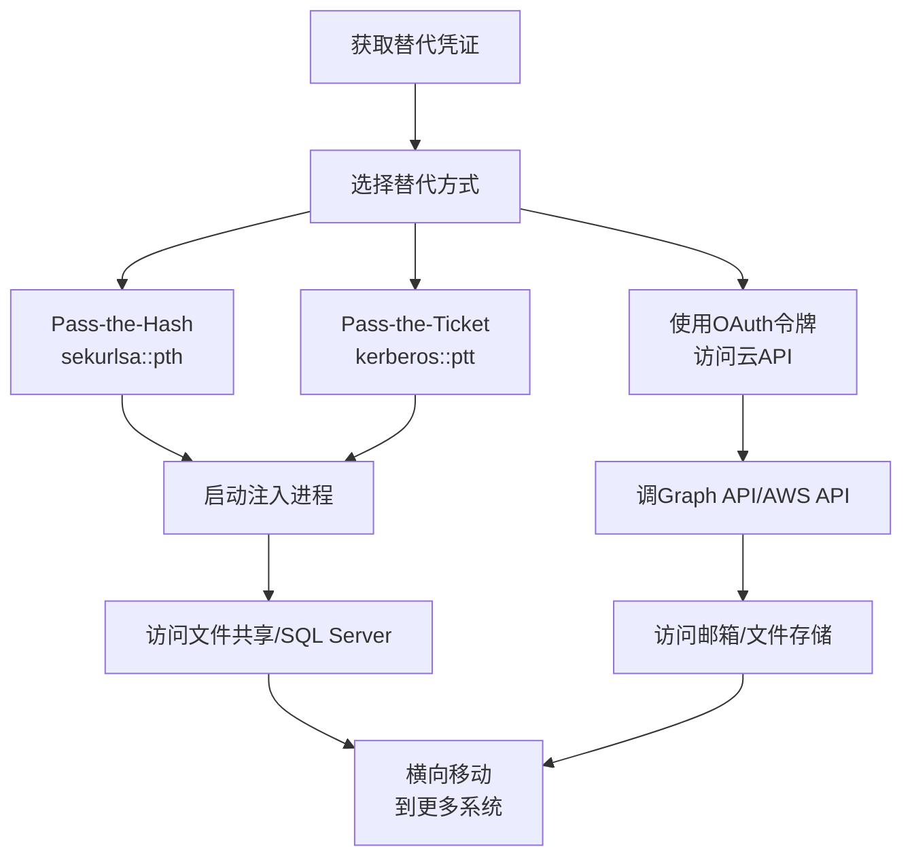

# 使用替代认证材料 (T1550)

## 一句话通俗理解

**不用密码也能登录——攻击者拿密码的"哈希"或"票据"直接认证，就像用指纹膜代替真指纹开锁。**

## 30秒速查卡

| 维度 | 你需要知道的 |
|------|-------------|
| 这是什么？ | 不用密码，拿哈希或票据直接登录 |
| 为什么危险？ | 拿到认证材料就能直接登录，不需要知道密码，速度快且隐蔽 |
| 谁需要关心？ | 域管理员、SOC分析师 |
| 你的第一步防御 | 部署NTLMv2强制策略，监控异常的认证材料使用 |
| 如果只做一件事 | 监控Windows事件ID 4624（登录成功）中的NTLM登录类型，关注非标准登录源 |

## 难度等级

- ⭐⭐⭐ 高级（需要深入技术知识）

## 技术描述

使用替代认证材料（T1550）是MITRE ATT&CK框架中凭证访问战术的一种技术。

**通俗解释：**
在很多情况下，你不需要输入密码也能登录系统。比如，Windows的NTLM认证只需要密码的"哈希"（一种加密结果），不需要原始密码；Kerberos认证只需要"票据"（Ticket），也不需要密码。攻击者利用了这一点——他们不浪费时间破解密码，而是直接使用偷到的哈希或票据登录。就像你丢了门禁卡（哈希）而不是丢了钥匙（密码）——捡到卡的人直接刷卡进门，不需要配钥匙。

**技术原理：**
1. **Pass-the-Hash（PtH）**：NTLM认证协议只验证密码哈希，不验证原始密码。攻击者使用mimikatz的`sekurlsa::pth`命令将窃取的NTLM哈希注入当前会话，启动一个使用该哈希进行网络认证的进程
2. **Pass-the-Ticket（PtT）**：Kerberos认证使用票据（Ticket）作为凭证。攻击者从LSASS内存中提取Kerberos票据，使用`kerberos::ptt`命令将票据注入当前会话
3. **Web Session Cookie**：使用窃取的会话Cookie代替密码登录Web应用
4. **Application Access Token**：使用窃取的OAuth令牌代替密码访问云API

**用途与影响：**
替代认证材料是横向移动的核心技术。攻击者无需破解密码，只需将窃取的哈希或票据注入系统即可访问其他机器。这是红队渗透测试中最高频使用的技术之一，也是APT组织最常用的横向移动方式。

## 子技术列表

**该技术共有 4 个子技术：**

| 子技术ID | 中文名称 | 通俗解释 |
|----------|----------|----------|
| T1550.001 | Application Access Token | 用偷来的OAuth令牌访问云API |
| T1550.002 | Pass the Hash | 用密码哈希代替密码登录Windows系统 |
| T1550.003 | Pass the Ticket | 用Kerberos票据代替密码登录域资源 |
| T1550.004 | Web Session Cookie | 用偷来的会话Cookie登录Web应用 |

<details>
<summary><strong>展开查看各子技术详细说明</strong></summary>

各子技术详细说明请参阅独立文档：

- [T1550.002 - 哈希传递](./T1550/T1550.002-Pass-the-Hash-Pass-the-Hash.md) — 用密码的"指纹"代替密码本身来开门。
- [T1550.003 - 票据传递](./T1550/T1550.003-Pass-the-Ticket-Pass-the-Ticket.md) — 用"通行证"代替密码进入大楼。

</details>

## 攻击流程

```
获取替代凭证 --> 注入凭证 --> 访问目标 --> 横向移动
```



**步骤详解：**

1. **获取替代凭证**
   - 通俗描述：先偷到密码的"哈希"或"票据"
   - 技术细节：使用mimikatz从LSASS提取NTLM哈希（sekurlsa::logonpasswords）或Kerberos票据（sekurlsa::tickets）
   - 常用工具：mimikatz、Impacket

2. **注入并使用凭证**
   - 通俗描述：把偷来的哈希或票据"贴"到自己的会话上
   - 技术细节：使用mimikatz的pth/ptt命令，或使用Impacket的wmiexec.py -hashes参数
   - 常用工具：mimikatz、Impacket

## 真实案例

### 案例1：APT29 -- Pass-the-Hash与Pass-the-Ticket组合（2024-2025）

- **时间**: 2024-2025年
- **目标**: 全球政府机构、IT公司
- **攻击组织**: APT29（Midnight Blizzard，俄罗斯国家背景）
- **手法**: APT29在多次攻击中广泛使用替代认证材料。他们使用mimikatz从LSASS转储中提取用户凭证后，通过`sekurlsa::pth`注入NTLM哈希横向移动到多台服务器。获得域管理员权限后，提取Kerberos TGT票据并在网络中传递使用，实现了对数千台系统的访问。在2024年对微软的攻击中，他们使用窃取的OAuth令牌访问云资源。
- **影响**: 数千个系统和云账户被未授权访问
- **参考链接**: [MITRE ATT&CK - APT29](https://attack.mitre.org/groups/G0143/)

### 案例2：Conti勒索软件 -- Pass-the-Hash（2021-2024）

- **时间**: 2021-2024年
- **目标**: 全球医疗、制造、政府机构
- **攻击组织**: Conti勒索软件运营者
- **手法**: Conti勒索软件运营团队在横向移动阶段大量使用Pass-the-Hash技术。他们使用Cobalt Strike的`pth`命令注入域管理员NTLM哈希，通过PowerShell远程执行（WinRM）和计划任务在所有域成员系统上部署勒索软件负载。Conti使用单一域管理员哈希即可控制整个域网络，每小时加密数千台端点。即使Conti在2022年关闭，其技术和工具仍被其他勒索软件组织使用。
- **影响**: 全球数百个组织被加密勒索
- **参考链接**: [MITRE ATT&CK - Conti](https://attack.mitre.org/software/S0575/)

### 案例3：BlackCat/ALPHV -- Pass-the-Hash与PtT（2023-2024）

- **时间**: 2023-2024年
- **目标**: 全球多个行业
- **攻击组织**: BlackCat（ALPHV）勒索软件组织
- **手法**: BlackCat附属组织在被入侵网络中广泛使用替代认证材料进行横向移动。他们从LSASS转储提取域管理员NTLM哈希后，使用Pass-the-Hash通过SMB和WinRM访问企业内所有服务器。同时，他们使用Rubeus从域控制器提取Kerberos票据，进行Pass-the-Ticket攻击。2024年3月，执法行动查封了BlackCat的基础设施，但其在2024年下半年重新活跃。
- **影响**: 全球多个大型组织被加密勒索，支付赎金数千万美元
- **参考链接**: [MITRE ATT&CK - BlackCat](https://attack.mitre.org/groups/G1023/)

## 红队视角

> ⚠️ **免责声明**：以下内容仅用于合法的安全测试、渗透测试和教育目的。未经授权对他人系统进行测试是违法行为。

### 实战技巧

1. **Pass-the-Hash首选工具**
   mimikatz：`sekurlsa::pth /user:admin /domain:corp /ntlm:HASH /run:powershell.exe`
   Impacket：`wmiexec.py -hashes :HASH domain/user@target`

2. **绕过Credential Guard**
   Credential Guard启用时，LSASS内存被保护。可使用不依赖LSASS的方法，如从NTDS.dit提取

3. **Golden Ticket和Silver Ticket**
   如果获得了KRBTGT哈希，可以伪造任意用户的TGT（Golden Ticket）；如果获得了服务账户哈希，可以伪造该服务的票据（Silver Ticket）

### 常用工具

| 工具名称 | 用途 | 平台 | 链接 |
|----------|------|------|------|
| mimikatz | 凭证提取和注入（PtH/PtT） | Windows | [GitHub](https://github.com/gentilkiwi/mimikatz) |
| Impacket | Python工具集，支持PtH远程执行 | 跨平台 | [GitHub](https://github.com/fortra/impacket) |
| Rubeus | Kerberos票据操作工具 | Windows | [GitHub](https://github.com/GhostPack/Rubeus) |
| CrackMapExec | 内网横向移动工具 | Linux | [GitHub](https://github.com/Porchetta-Industries/CrackMapExec) |
| Cobalt Strike | 渗透测试框架，内置PtH/PtT | Windows | [官网](https://www.cobaltstrike.com/) |

### 注意事项

- Pass-the-Hash只适用于NTLM认证，Kerberos环境中需要Pass-the-Ticket
- Windows 10/11和Windows Server 2016+默认启用Credential Guard
- 替代认证材料不修改系统文件，日志量小，隐蔽性高

## 蓝队视角

### 检测要点

1. **NTLM认证异常**
   - 日志来源：Windows Security Event ID 4624
   - 关注字段：登录类型3（网络登录）、登录进程NtLmSsp
   - 异常特征：同一账户从多台机器同时发起网络登录

2. **Kerberos票据异常**
   - 日志来源：Windows Security Event ID 4768（TGT请求）
   - 关注字段：请求来源、票据生命周期
   - 异常特征：短时间内的异常票据请求

### 监控建议

- 监控Event ID 4624中登录类型3的NTLM认证事件
- 检测LSASS进程中的敏感API调用（MiniDumpWriteDump等）
- 监控Kerberos TGT申请事件（Event ID 4768）

## 检测建议

### 网络层检测

**检测方法：** 监控NTLM和Kerberos认证流量的异常模式，检测Pass-the-Hash和Pass-the-Ticket的网络层特征。

**具体规则/命令示例：**
```
# 检测NTLM认证的异常源IP（同一账户从多台机器同时认证）
zeek -C -r capture.pcap ntlm.log | awk '{print $5, $3}' | sort | uniq -c | sort -rn | head -20

# 检测Kerberos TGS请求的批量模式（可能的Pass-the-Ticket横向移动）
tshark -r capture.pcap -Y "kerberos.msg_type == 13" -T fields -e ip.src -e kerberos.ServerName | \
  sort | uniq -c | sort -rn | head -20
```

### 主机层检测

**检测方法：** 监控LSASS内存的异常访问

**Windows事件ID：**
- 事件ID 4663：对LSASS进程的异常访问
- Sysmon Event ID 10：进程访问（监控lsass.exe）
- 事件ID 4768：Kerberos TGT请求异常

**具体命令示例：**
```powershell
# 查看NTLM网络登录事件
Get-WinEvent -FilterHashtable @{LogName='Security';ID=4624} |
    Where-Object { $_.Properties[8].Value -eq 3 -and $_.Properties[10].Value -eq 'NtLmSsp' }
```


**用人话说：** 这条规则在监控是否有人使用非密码方式（如哈希、票据）进行登录。Pass the Hash/Ticket是攻击者拿到密码哈希或Kerberos票据后直接用来登录，不需要破解出明文密码。正常情况下用户登录会使用密码或Kerberos。如果发现有人用非标准方式从非标准位置登录，那就是攻击者在用偷来的认证材料冒充登录。

### 应用层检测

**Sigma规则示例：**
```yaml
title: Pass-the-Hash via Mimikatz
status: experimental
description: 检测mimikatz的PtH命令执行
logsource:
    category: process_creation
    product: windows
detection:
    selection:
        CommandLine|contains:
            - 'sekurlsa::pth'
            - 'kerberos::ptt'
    condition: selection
level: critical
tags:
    - attack.t1550
```

## 缓解措施

### 优先级1：关键措施

**措施名称：** 启用Windows Defender Credential Guard

**具体实施步骤：**
1. 通过组策略启用Credential Guard
2. 保护LSASS内存免受读取
3. 重启系统生效

### 优先级2：重要措施

**措施名称：** 实施受限管理员模式

**具体实施步骤：**
1. 启用Restricted Admin Mode for RDP
2. 禁用WDigest认证
3. 实施Protected Users安全组

### 优先级3：建议措施

**措施名称：** 网络分段和监控

**具体实施步骤：**
1. 实施网络分段减少横向移动路径
2. 部署Microsoft LAPS管理本地管理员密码
3. 为服务账户配置托管服务账户（gMSA）

### MITRE ATT&CK 缓解措施映射

| 缓解措施ID | 缓解措施名称 | 适用性 | 说明 |
|------------|-------------|--------|------|
| M1041 | 凭证保护 | 适用 | 启用Credential Guard和Restricted Admin Mode |
| M1026 | 权限管理 | 适用 | 限制域管理员组成员和复制权限 |
| M1030 | 网络分段 | 适用 | 减少横向移动路径 |

## 动手实验

> ⚠️ **重要提示**：所有实验必须在隔离的实验室环境中进行，禁止对未授权的真实系统进行测试。

### 实验环境准备

**所需工具：**
- Windows域环境（1台DC+1台成员服务器）
- mimikatz
- Impacket

### 实验1：Pass-the-Hash（中级）

**实验目标：** 使用mimikatz执行PtH攻击

**实验步骤：**
1. 在已获管理员权限的系统上运行mimikatz
2. 提取NTLM哈希：`sekurlsa::logonpasswords`
3. 使用哈希注入：`sekurlsa::pth /user:admin /domain:corp /ntlm:HASH /run:powershell.exe`
4. 在新powershell窗口中访问目标系统：`dir \\target\c$`

**预期结果：** 无需输入密码即可访问目标系统的文件共享

**学习要点：** Pass-the-Hash的原理和防御

## 术语解释

| 术语 | 英文原名 | 通俗解释 |
|------|----------|----------|
| Pass-the-Hash | Pass-the-Hash | 用密码的"指纹"（哈希）代替密码来开门 |
| Pass-the-Ticket | Pass-the-Ticket | 用"门票"（票据）代替密码进入域资源 |
| NTLM哈希 | NTLM Hash | Windows密码的加密版本，可以用来进行网络认证 |
| TGT | Ticket-Granting Ticket | Kerberos的"主门票"，有了它可以申请所有服务的"分门票" |
| TGS | Ticket-Granting Service Ticket | Kerberos的"分门票"，用来访问特定服务 |
| CREDSSP | Credential Security Support Provider | Windows中管理凭证的组件 |

## 参考资料

### 官方文档

- [MITRE ATT&CK - T1550](https://attack.mitre.org/techniques/T1550/)
- [MITRE ATT&CK - T1550.002 Pass the Hash](https://attack.mitre.org/techniques/T1550/002/)
- [Microsoft - Pass-the-Hash缓解指南](https://docs.microsoft.com/en-us/windows-server/identity/ad-ds/manage/understand-pass-the-hash-mitigation)

### 工具与资源

- [Mimikatz官方文档](https://github.com/gentilkiwi/mimikatz) - 凭证工具
- [Impacket](https://github.com/fortra/impacket) - Python协议工具集

### 学习资料

- [Harmj0y - Kerberos攻击深入分析](https://www.harmj0y.net/blog/redteaming/kerberoasting-without-mimikatz/)
