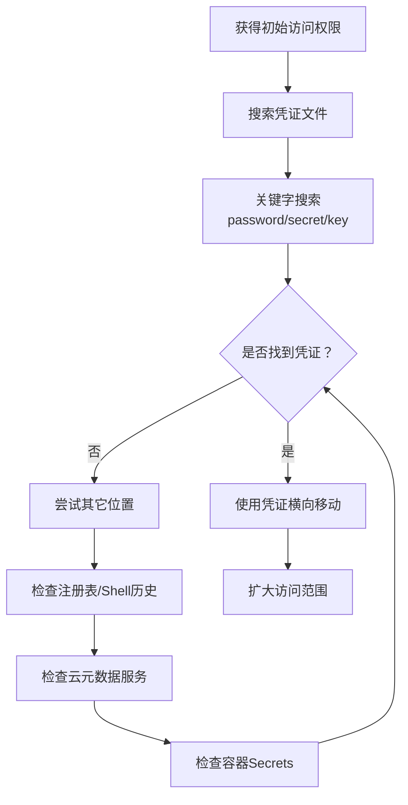

# 不安全的凭证 (T1552)

## 一句话通俗理解

**攻击者在配置文件、脚本、日志和系统各处翻找别人不小心留下的密码——就像在别人办公室抽屉里找到写着密码的便签纸。**

## 30秒速查卡

| 维度 | 你需要知道的 |
|------|-------------|
| 这是什么？ | 在配置文件、脚本里找到别人留下的密码 |
| 为什么危险？ | 开发者经常把密码写在配置文件里，攻击者只需要找到这些文件就能拿到大量凭证 |
| 谁需要关心？ | 开发人员、DevOps工程师、SOC分析师 |
| 你的第一步防御 | 使用密钥管理工具替代明文存储，扫描代码仓库中的敏感信息 |
| 如果只做一件事 | 使用git-secrets或trufflehog扫描代码仓库，确保密码和密钥不会被提交到版本控制 |

## 难度等级

- ⭐ 初级（新手可学）

## 技术描述

不安全的凭证（T1552）是MITRE ATT&CK框架中凭证访问战术的一种技术。

**通俗解释：**
在软件开发和系统管理中，密码经常被无意地留在没有保护的地方：配置文件中写着数据库密码、脚本里硬编码了服务账户凭据、云服务器的"元数据服务"（IMDS）会泄露临时访问密钥、甚至聊天记录里也常有API密钥。攻击者不需要高深的技巧，只要知道去哪里找，就能捡到这些"被遗忘的钥匙"。

**技术原理：**
1. **文件搜索**：扫描文件系统中的配置文件（web.config、database.yml）、备份文件（.bak）、源代码和文档，用关键字（password、pwd、connection string）搜索
2. **注册表读取**：访问Windows注册表中保存的旧版应用程序凭据（如自动登录密码）
3. **Bash历史**：读取用户的Shell历史文件（~/.bash_history），找到命令行中直接输入的密码
4. **IMDS请求**：云服务器实例通过元数据服务自动分发临时凭证，攻击者只需发送HTTP请求即可获取
5. **容器环境**：从Kubernetes Secrets、容器镜像层、环境变量中提取硬编码的凭据

**用途与影响：**
这种技术的好处（对攻击者而言）是不需要破解密码、不需要漏洞利用，只需要知道去哪里找。这些凭证往往具有高权限（如数据库管理员、云服务管理员），且长期不更换。根据2025年GitGuardian报告，仅2024年就在公开代码仓库中检测到超过1200万个硬编码凭证。

## 子技术列表

**该技术共有 8 个子技术：**

| 子技术ID | 中文名称 | 通俗解释 |
|----------|----------|----------|
| T1552.001 | Credentials in Files | 在配置文件和脚本中找到明文密码 |
| T1552.002 | Credentials in Registry | 从Windows注册表里提取保存的密码 |
| T1552.003 | Bash History | 从命令行历史记录中翻出输入过的密码 |
| T1552.004 | Certificates | 窃取数字证书的私钥 |
| T1552.005 | Cloud Instance Metadata API | 从云服务器"元数据"接口获取临时凭证 |
| T1552.006 | Group Policy Preferences | 从域策略文件中解密管理员密码 |
| T1552.007 | Container Credentials | 从容器环境中提取硬编码密钥 |
| T1552.008 | Chat Platform Credentials | 从聊天记录里找到不小心发出的密码 |

<details>
<summary><strong>展开查看各子技术详细说明</strong></summary>

各子技术详细说明请参阅独立文档：

- [T1552.001 - 文件中的凭证](./T1552/T1552.001-Credentials-in-Files-Credentials-in-Files.md) — 在代码和配置文件中搜索不小心留下的密码。
- [T1552.002 - 注册表中的凭证](./T1552/T1552.002-Credentials-in-Registry-Credentials-in-Registry.md) — 在Windows注册表里翻找旧软件留下的密码。
- [T1552.003 - Bash历史记录](./T1552/T1552.003-Bash-History-Bash-History.md) — 从命令行记录里翻出曾经输入过的密码。
- [T1552.005 - 云实例元数据API](./T1552/T1552.005-Cloud-Instance-Metadata-API-Cloud-Instance-Metadata-API.md) — 云服务器内部有个"小窗口"会告诉攻击者当前机器的访问密钥。
- [T1552.007 - 容器凭证](./T1552/T1552.007-Container-Credentials-Container-Credentials.md) — 从容器和Kubernetes环境中提取硬编码的密钥。

</details>

## 攻击流程



**步骤详解：**

1. **搜索配置文件**
   - 通俗描述：用关键字搜索所有配置和代码文件
   - 技术细节：运行 `findstr /s /i "password" *.config *.xml *.yml *.json`（Windows）或 `grep -r "password" --include="*.{conf,yml,json}"`
   - 常用工具：findstr（Windows）、grep（Linux）、LaZagne、SessionGopher

2. **检查云元数据服务**
   - 通俗描述：向云服务器的"内部窗口"发送请求获取临时密钥
   - 技术细节：`curl http://169.254.169.254/latest/meta-data/iam/security-credentials/`（AWS）或 `curl -H "Metadata:true" http://169.254.169.254/metadata/instance?api-version=2021-02-01`（Azure）
   - 常用工具：curl、PowerShell Invoke-RestMethod

3. **使用凭证扩大战果**
   - 通俗描述：用找到的密码登录更多系统
   - 技术细节：使用窃取的数据库密码连接SQL Server/Oracle，使用云服务密钥访问S3存储桶/Azure Blob
   - 常用工具：sqlcmd、mssql-cli、AWS CLI、Azure CLI、kubectl

## 真实案例

### 案例1：Salt Typhoon - 配置文件凭证窃取（2024）

- **时间**: 2024年
- **目标**: 美国多家电信运营商（Verizon、AT&T、Lumen等）
- **攻击组织**: Salt Typhoon（Volt Typhoon关联组织）
- **手法**: Salt Typhoon在入侵电信运营商的网络设备后，系统性地搜索了网络设备的配置文件（包括路由器和交换机的配置备份），从中提取了SNMP社区字符串、RADIUS共享密钥和本地管理员凭证。这些凭证被用于在运营商的内部网络中进一步移动，访问通话记录系统和客户数据库。攻击者还从备份服务器中的脚本文件里提取了自动化任务的明文服务账户密码。根据Mandiant的披露，Salt Typhoon使用的定制工具专门针对网络设备配置文件进行关键字搜索。
- **影响**: 美国多家电信运营商的通话记录被窃取，涉及大量政府官员和敏感客户
- **参考链接**: [Mandiant - Salt Typhoon Analysis](https://www.mandiant.com/resources/blog/salt-typhoon-telecom-analysis)

### 案例2：TeamTNT - 云IMDS凭证窃取（2021）

- **时间**: 2021年
- **目标**: AWS和Docker云基础设施
- **攻击组织**: TeamTNT
- **手法**: TeamTNT在入侵Docker容器后，立即执行脚本向AWS实例元数据服务（IMDS）发送HTTP请求，获取IAM角色临时凭证。他们的恶意软件自动请求`http://169.254.169.254/latest/meta-data/iam/security-credentials/`，提取访问密钥和令牌。使用这些凭证，TeamTNT扫描公开的S3存储桶、创建后门访问密钥，并横向扩展到更多云服务。
- **影响**: 数千个AWS账户的凭证被窃取，S3存储桶数据泄露
- **参考链接**: [Unit 42 - TeamTNT Cloud Operations](https://unit42.paloaltonetworks.com/team-tnt-cloud-operations/)

### 案例3：SolarWinds供应链攻击 - 文件凭证搜索（2020）

- **时间**: 2020年
- **目标**: 美国政府机构和大型企业
- **攻击组织**: Nobelium（APT29）
- **手法**: Nobelium使用Sunburst后门在受感染系统上使用关键字搜索扫描配置文件、源代码和文档，提取包含"password"、"pwd"、"connection string"等关键字的文件内容。发现的凭证被用于后续的横向移动和权限提升。攻击者在多台服务器上重复此过程，逐步从低权限账户提升至域管理员级别。
- **影响**: 超过18000个组织受影响，包括多个美国政府机构
- **参考链接**: [Mandiant - SolarWinds Investigation](https://www.mandiant.com/resources/blog/solarwinds-supply-chain-attack)

### 案例4：Kubernetes集群攻击 - Container Secrets窃取（2022-2024）

- **时间**: 2022-2024年
- **目标**: 全球Kubernetes集群
- **攻击组织**: 多个勒索软件组织
- **手法**: 攻击者利用未授权访问的Kubernetes Pod，发现Service Account令牌自动挂载在`/var/run/secrets/kubernetes.io/serviceaccount/token`。使用此令牌访问Kubernetes API服务器，列举并窃取所有namespace中的Secret对象，包括数据库密码、TLS证书和云服务API密钥。2024年的多起勒索软件攻击中，攻击者通过暴露的Kubelet API直接获取节点凭证。
- **影响**: 多个组织的容器化环境遭入侵，敏感配置被窃取
- **参考链接**: [Aqua Security - K8s Secrets Dumping](https://www.aquasec.com/blog/kubernetes-secrets-exposed/)

## 红队视角

> ⚠️ **免责声明**：以下内容仅用于合法的安全测试、渗透测试和教育目的。未经授权对他人系统进行测试是违法行为。

### 实战技巧

1. **用自动化工具批量搜索**
   使用LaZagne或SessionGopher自动化的凭证提取工具，一条命令即可扫描多种凭证存储位置。`SessionGopher`特别擅长从本机和远程主机的PuTTY、WinSCP、SuperPuTTY等工具中提取保存的会话凭证。

2. **云环境元数据服务**：
   在AWS中立即执行 `curl http://169.254.169.254/latest/meta-data/iam/security-credentials/`。如果IMDSv2启用，使用 `TOKEN=$(curl -X PUT http://169.254.169.254/latest/api/token -H "X-aws-ec2-metadata-token-ttl-seconds: 21600") && curl -H "X-aws-ec2-metadata-token: $TOKEN"`。

3. **Git历史中的凭证**：
   检查项目的Git历史中是否有不小心提交的凭证：`git log --all -p | grep -i "password\|secret\|key"`。即使之后删除了，历史记录中仍有痕迹。

### 常用工具

| 工具名称 | 用途 | 平台 | 链接 |
|----------|------|------|------|
| LaZagne | 自动从多种来源提取密码 | Windows/Linux/macOS | https://github.com/AlessandroZ/LaZagne |
| SessionGopher | 提取远程会话工具保存的凭证 | Windows | https://github.com/Arvanaghi/SessionGopher |
| truffleHog | 扫描Git仓库中的硬编码密钥 | 跨平台 | https://github.com/trufflesecurity/trufflehog |
| git-secrets | 防止提交密码到Git仓库 | 跨平台 | https://github.com/awslabs/git-secrets |
| GppPassword | 解密GPP中的cpassword | 跨平台 | https://github.com/tweksteen/gpppassword |

### 注意事项

- 搜索配置文件时注意不要触发文件监控告警（避免在一个目录下批量搜所有文件）
- 云IMDS凭证有有效期（通常1-6小时），拿到后要尽快使用
- 在真实渗透测试中，先在目标环境中扫描敏感信息，往往比花时间破解密码更有效

## 蓝队视角

### 检测要点

1. **非正常的文件扫描行为**
   - 日志来源：Sysmon Event ID 1（进程创建）、Windows Defender AV日志
   - 关注字段：进程命令行中包含 `findstr`、`grep`、`Select-String`、`password` 等特征
   - 异常特征：非管理员用户在短时间内大量读取 `.config`、`.yml`、`.xml`、`.json` 文件

2. **IMDS请求监控**
   - 日志来源：云平台API调用日志（AWS CloudTrail、Azure Activity Log）
   - 关注字段：对元数据服务地址（169.254.169.254）的HTTP请求
   - 异常特征：非预期进程（如恶意软件）向元数据服务发送请求

3. **Shell历史文件读取**
   - 日志来源：Sysmon Event ID 11（文件创建）或EDR文件访问日志
   - 关注字段：对 ~/.bash_history、~/.zsh_history 的读取操作
   - 异常特征：进程（非shell本身）读取历史文件

### 监控建议

- 在Windows上使用Sysmon监控`findstr`和`Select-String`的执行，特别是当发起进程不是开发工具或管理员时
- 配置云平台的GuardDuty（AWS）或Defender for Cloud（Azure）检测IMDS滥用
- 在Kubernetes中启用审计日志，监控Secrets对象的大批量读取（Get/List Secrets）
- 使用文件完整性监控（FIM）跟踪敏感配置文件的读取活动
- 监控注册表读取操作，特别是对`HKLM\Software\Microsoft\Windows NT\CurrentVersion\Winlogon`等已知位置的访问

## 检测建议

### 主机层检测

**检测方法：** 监控文件系统和注册表中非授权的凭证搜索行为。

**Windows事件ID：**
- 事件ID 4688（进程创建）+ 命令行监控：检测 `findstr /s /i "password"` 或 `Select-String "password"` 的执行
- 事件ID 4656（文件句柄请求）：监控对敏感配置文件的异常读取
- Sysmon Event ID 1（进程创建）：检测LaZagne、SessionGopher等工具的启动

**具体命令示例：**
```powershell
# 监控findstr用于凭证搜索的行为
Get-WinEvent -FilterHashtable @{LogName='Security';ID=4688} | 
    Where-Object {$_.Properties[5].Value -like '*findstr*password*'}
```

**Linux命令示例：**
```bash
# 监控grep用于凭证搜索
auditctl -a always,exit -S execve -F key=cred_search
ausearch -k cred_search | grep -i "grep.*password"
```

### 网络层检测

**检测方法：** 监控云环境中对元数据服务的异常访问。

**具体规则/命令示例：**
```
# AWS CloudWatch告警规则 - 检测IMDS请求
sourceIPAddress = "169.254.169.254" AND eventName = "AssumeRole"
```


**用人话说：** 这条规则在扫描代码仓库和配置文件中是否包含明文密码。很多开发者为了方便，会把数据库密码、API密钥直接写在代码或配置文件里。如果这些文件被攻击者找到，就等于把密码直接送给了他们。定期扫描代码仓库中的敏感信息，能提前发现这些'密码泄露点'。

### 应用层检测

**Sigma规则示例：**
```yaml
title: 检测通过findstr搜索密码的行为
status: experimental
description: 检测攻击者使用findstr在文件系统中搜索凭证
logsource:
    category: process_creation
    product: windows
detection:
    selection:
        CommandLine|contains|all:
            - 'findstr'
            - 'password'
    condition: selection
level: medium
tags:
    - attack.t1552
```

## 缓解措施

### 优先级1：关键措施

**措施名称：** 消除硬编码凭证

**具体实施步骤：**
1. 使用凭据扫描工具（truffleHog、git-secrets）搜索所有代码仓库中的硬编码密码
2. 使用HashiCorp Vault、AWS Secrets Manager或Azure Key Vault管理所有敏感凭证
3. 在CI/CD流水线中加入凭证扫描步骤，阻止含凭证的代码被合入主分支

**配置示例：**
```bash
# 在Git仓库中搜索历史记录中的所有凭证
trufflehog git --since --branch HEAD file:///path/to/repo

# 使用git-secrets防止提交密码
git secrets --add 'password\s*=\s*.+'
git secrets --register-aws
```

### 优先级2：重要措施

**措施名称：** 限制IMDS访问（云环境）

**具体实施步骤：**
1. 在AWS中禁用IMDSv1，强制使用IMDSv2（需要令牌）
2. 在Azure中禁用IMDS对非特权容器的访问
3. 在网络层面限制对169.254.169.254的出站访问

### 优先级3：建议措施

**措施名称：** 保护Shell历史记录

**具体实施步骤：**
1. 配置HISTCONTROL=ignorespace，在以空格开头的命令前不记录历史
2. 使用`HISTIGNORE`环境变量排除包含特定关键字的命令
3. 定期清理历史文件中的敏感信息

### MITRE ATT&CK 缓解措施映射

| 缓解措施ID | 缓解措施名称 | 适用性 | 说明 |
|------------|-------------|--------|------|
| M1047 | 审计 | 适用 | 审计文件和注册表访问，监控凭证搜索行为 |
| M1017 | 用户培训 | 适用 | 培训开发人员避免在代码中硬编码凭证 |
| M1027 | 操作系统配置 | 部分适用 | 配置Shell历史忽略包含密码的命令 |
| M1045 | 代码审查 | 适用 | 在代码审查中检查硬编码凭证 |
| M1022 | 限制文件权限 | 适用 | 限制配置文件、备份文件的读取权限 |

## 动手实验

> ⚠️ **重要提示**：所有实验必须在隔离的实验室环境中进行，禁止对未授权的真实系统进行测试。

### 实验环境准备

**推荐靶场/实验平台：**

| 平台名称 | 类型 | 难度 | 链接 |
|----------|------|------|------|
| TryHackMe - Common Linux Privesc | 虚拟靶场 | 初级 | https://tryhackme.com/ |
| HackTheBox - Sauna | 虚拟靶场 | 中级 | https://www.hackthebox.com/ |
| VulnHub - Mr Robot | 虚拟机 | 初级 | https://www.vulnhub.com/ |

**所需工具：**
- LaZagne：自动化凭证提取工具
- grep/findstr：文本搜索工具
- curl：HTTP请求工具

### 实验1：在Windows系统中搜索硬编码凭证（初级）

**实验目标：** 在模拟环境中练习使用命令行搜索配置文件中的密码。

**实验步骤：**
1. 在Windows VM中创建几个测试文件，故意在其中包含密码字符串
2. 使用 `findstr /s /i "password" C:\*.config C:\*.xml C:\*.yml` 进行搜索
3. 观察搜索返回结果，识别哪些文件包含密码
4. 使用LaZagne自动提取更多凭证：`laZagne.exe all`

**预期结果：** 找到测试文件中包含的明文密码，理解攻击者如何在文件系统中搜索凭证。

**学习要点：** 理解为什么配置文件的权限控制和加密如此重要。

### 实验2：访问云IMDS获取实例凭证（中级）

**实验目标：** 在一个模拟的云实例环境中练习IMDS凭证提取。

**实验步骤：**
1. 启动一个配置了IAM角色的云实例（或使用本地模拟器）
2. 使用curl访问IMDS：`curl http://169.254.169.254/latest/meta-data/`
3. 列出IAM角色：`curl http://169.254.169.254/latest/meta-data/iam/security-credentials/`
4. 获取临时凭证：`curl http://169.254.169.254/latest/meta-data/iam/security-credentials/<role-name>`
5. 使用获取的临时密钥访问云服务

**预期结果：** 获取到一组临时访问密钥（AccessKeyId、SecretAccessKey、Token）。

**学习要点：** 理解为什么云实例应该使用IMDSv2并严格控制IAM角色权限。

## 术语解释

| 术语 | 英文原名 | 通俗解释 |
|------|----------|----------|
| IMDS | Instance Metadata Service | 云服务器内部的一个特殊服务，运行在固定的IP地址（169.254.169.254），用于给实例分配身份信息。就像云服务器的一个"内部窗口"，程序通过这个窗口可以拿到自己的身份证件 |
| IAM | Identity and Access Management | 身份和访问管理，云平台中管理"谁能做什么"的系统。定义了用户或程序能访问哪些云资源 |
| DPAPI | Data Protection API | Windows的数据保护API，用于加密用户数据。就像Windows自带的"保险箱"，只有登录的用户才能打开 |
| GPP | Group Policy Preferences | 组策略首选项，Windows域管理员用来统一配置计算机设置的功能。曾被用来批量部署密码，但因为加密密钥公开而成为安全风险 |
| SYSVOL | System Volume | 域控制器上的一个共享文件夹，存放组策略和登录脚本。域内所有计算机都可以读取（包括攻击者） |
| Secrets | Secrets | Kubernetes中用于存储敏感信息的对象，如密码、令牌、密钥。类似于一个加密的"钥匙柜" |
| Shell History | Shell History | 命令行终端（如Bash、Zsh）自动记录的用户输入历史，就像聊天软件的聊天记录 |
| 硬编码 | Hardcoded | 将密码或密钥直接写在源代码中，而不是放在配置文件或使用变量引用。就像把银行卡密码写在门上 |

## 参考资料

### 官方文档

- [MITRE ATT&CK - T1552 Unsecured Credentials](https://attack.mitre.org/techniques/T1552/)
- [MITRE ATT&CK - T1552.005 Cloud Instance Metadata API](https://attack.mitre.org/techniques/T1552/005/)
- [MITRE ATT&CK - T1552.007 Container Credentials](https://attack.mitre.org/techniques/T1552/007/)

### 安全报告

- [Mandiant - Salt Typhoon Telecom Analysis](https://www.mandiant.com/resources/blog/salt-typhoon-telecom-analysis) - 2024年电信运营商凭证窃取案例
- [Unit 42 - TeamTNT Cloud Operations](https://unit42.paloaltonetworks.com/team-tnt-cloud-operations/) - TeamTNT云IMDS凭证窃取分析
- [GitGuardian - State of Secrets Spraw 2025](https://www.gitguardian.com/report) - 2024年硬编码凭证统计报告

### 工具与资源

- [LaZagne - 凭证提取工具](https://github.com/AlessandroZ/LaZagne)
- [truffleHog - Git凭证扫描](https://github.com/trufflesecurity/trufflehog)
- [SessionGopher - 远程会话凭证提取](https://github.com/Arvanaghi/SessionGopher)
- [Aqua Security - K8s Secrets安全指南](https://www.aquasec.com/blog/kubernetes-secrets-exposed/)

### 学习资料

- [AWS - IMDSv2使用指南](https://docs.aws.amazon.com/AWSEC2/latest/UserGuide/ec2-instance-metadata.html)
- [Kubernetes - Secrets管理](https://kubernetes.io/docs/concepts/configuration/secret/)
- [Microsoft - 凭据保护最佳实践](https://learn.microsoft.com/en-us/windows/security/identity-protection/credential-guard/)
