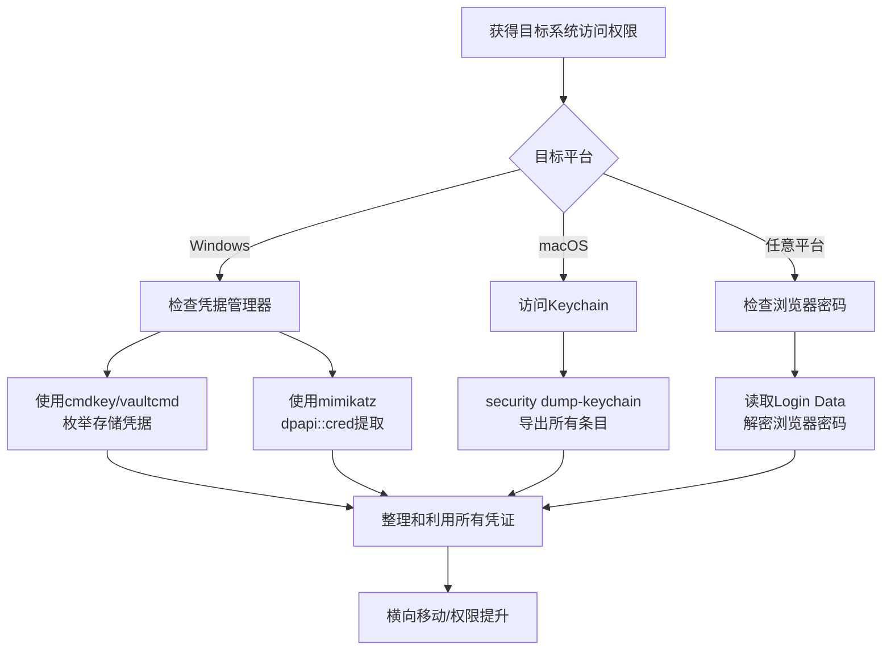

# 密码存储凭证提取 (T1555)

## 一句话通俗理解

**攻击者从密码管理器、系统保险箱和浏览器里偷走你存好的密码——就像偷走你的钱包，里面装着所有网站的账号密码。**

## 难度等级

- ⭐⭐ 中级（需要一定基础）

## 技术描述

密码存储凭证提取（T1555）是MITRE ATT&CK框架中凭证访问战术的一种技术。

**通俗解释：**
为了方便用户，操作系统和浏览器都提供了"记住密码"的功能——macOS有Keychain（钥匙串），Windows有凭据管理器（Credential Manager），Chrome和Edge可以保存网站密码。这些功能就像你的"数字钱包"，里面装着所有登录信息。攻击者的目标就是偷走这个钱包。他们使用专门的工具，从这些存储中提取明文密码，然后利用这些密码登录其他系统。

**技术原理：**
1. **macOS Keychain**：使用`security dump-keychain`命令或专用工具（如keychaindump）读取存储在Keychain中的所有凭证。如果用户当前已登录且Keychain在解锁状态，可以直接提取明文
2. **Windows Credential Manager**：通过Windows API（`CredReadW`）或命令行（`cmdkey /list`、`vaultcmd`）枚举和读取存储的凭据。这些凭据使用DPAPI加密，但登录用户有解密密钥
3. **浏览器密码管理器**：访问浏览器的本地数据库文件（Chrome的Login Data、Firefox的logins.json），使用工具（如WebBrowserPassView）解码存储的密码
4. **第三方密码管理器**：针对1Password、LastPass、KeePass等工具的本地数据库文件进行离线破解或内存转储

**用途与影响：**
密码存储中的凭证通常是用户最常用的密码，包括企业系统、个人邮箱、社交媒体等。一个凭证泄露可能导致所有关联账号被攻陷。根据2025年Verizon数据泄露调查报告，70%以上的凭证窃取事件涉及密码存储的提取。现代攻击者使用自动化工具（如LaZagne、mimikatz）可以在一分钟内提取几十个存储的密码。

## 子技术列表

**该技术共有 6 个子技术：**

| 子技术ID | 中文名称 | 通俗解释 |
|----------|----------|----------|
| T1555.001 | Keychain | 窃取macOS系统钥匙串中的所有密码 |
| T1555.002 | Securityd | 直接从macOS安全服务进程内存中提取密码 |
| T1555.003 | Web Browsers | 从Chrome/Firefox/Edge保存的密码中提取明文 |
| T1555.004 | Windows Credential Manager | 提取Windows凭据管理器中保存的登录信息 |
| T1555.005 | Password Managers | 从1Password/LastPass/KeePass等工具中提取密码 |
| T1555.006 | Group Policies | 解密域策略中嵌入的管理员密码 |

<details>
<summary><strong>展开查看各子技术详细说明</strong></summary>

### T1555.001 - Keychain

**通俗理解：** 偷走macOS系统自带的"密码保险箱"。

**详细说明：**
macOS的Keychain（钥匙串）是一个集中式凭证存储系统，保存用户的密码、私钥、证书和安全笔记。攻击者在获取macOS系统访问权限后，使用`security dump-keychain -a ~/Library/Keychains/login.keychain-db`命令导出所有条目，或使用`keychaindump`工具从内存中读取已解锁的Keychain内容。如果Keychain主密码与登录密码相同（默认设置），攻击者可以直接解密。

### T1555.003 - Web Browsers

**通俗理解：** 从浏览器内置的"记住密码"功能中偷登录信息。

**详细说明：**
现代浏览器都有密码保存功能。Chrome和Edge将加密的密码存储在SQLite数据库（Login Data）中，使用Windows的DPAPI进行加密——但登录用户在浏览器中可以解密自己的密码。攻击者使用`WebBrowserPassView`、`ChromePass`等工具自动读取和解码这些数据库。Firefox使用主密码保护的SQLite数据库，如果没有设置主密码，密码以明文存储。

> **关联技术：** [T1503（浏览器凭证窃取）](./T1503-Credentials-from-Web-Browsers.md)是独立于T1555的浏览器凭证窃取技术。T1503与T1555.003功能重叠，两者都覆盖从Chrome、Firefox、Edge等浏览器提取保存的密码。区别在于：T1503是独立的完整技术，专门针对浏览器凭证；T1555.003是T1555的一个子技术，T1555覆盖更广泛的密码存储类型（Keychain、Windows凭据管理器、第三方密码管理器等）。两个技术建议结合阅读。

### T1555.004 - Windows Credential Manager

**通俗理解：** 攻击者翻看Windows的"通讯录"——里面存着你登录过的所有服务的密码。

**详细说明：**
Windows凭据管理器（Credential Manager）存储了三类凭据：Windows登录凭据、基于证书的凭据和通用凭据（网站密码）。攻击者使用`cmdkey /list`列出所有存储的凭据名称，使用`vaultcmd /listcreds:"Windows Credentials"`枚举凭据内容，或使用mimikatz的`dpapi::cred`模块提取解密后的凭据。

</details>

## 攻击流程



**步骤详解：**

1. **枚举密码存储位置**
   - 通俗描述：查看目标系统上哪些地方可能存了密码
   - 技术细节：在Windows上运行 `cmdkey /list`，在macOS上检查Keychain状态，在浏览器中打开`chrome://settings/passwords`
   - 常用工具：cmdkey（Windows）、security（macOS）

2. **提取存储凭证**
   - 通俗描述：使用专用工具从密码存储中提取明文密码
   - 技术细节：使用LaZagne自动检测所有密码存储并提取，或使用mimikatz的dpapi模块解密Windows凭据管理器
   - 常用工具：LaZagne、mimikatz、WebBrowserPassView、keychaindump

3. **凭证验证与利用**
   - 通俗描述：用提取到的密码尝试登录更多系统
   - 技术细节：使用密码喷射工具将提取的凭证尝试登录域控制器、VPN、云服务管理控制台
   - 常用工具：CrackMapExec、hydra、nxc

## 真实案例

### 案例1：Lumma Stealer - 浏览器密码批量窃取（2024-2025）

- **时间**: 2024-2025年
- **目标**: 全球Windows用户，超过580,000个端点
- **攻击组织**: Lumma Stealer（信息窃取恶意软件即服务）
- **手法**: Lumma Stealer是一种广泛传播的信息窃取恶意软件，通过假软件下载站和恶意广告投放。一旦感染Windows系统，它立刻从Chrome、Edge、Firefox、Brave等浏览器的密码管理器中提取保存的所有网站密码。Lumma Stealer通过读取Chrome的Login Data SQLite数据库文件，并使用DPAPI解密密码字段。它还针对KeePass和1Password等本地密码管理器的数据库文件进行提取。窃取的凭证通过HTTPS回调发送到C2服务器。2024-2025年间，Lumma Stealer在全球感染了超过58万个系统，窃取了数以百万计的网站凭证，包括企业VPN、云服务管理后台和金融账户。
- **影响**: 超过58万个系统被感染，数百万条网站凭证被窃取，多个组织的企业凭证泄露
- **参考链接**: [Kaspersky - Lumma Stealer Analysis 2024](https://securelist.com/lumma-stealer-analysis/)

### 案例2：Scattered Spider - 浏览器凭证与社会工程结合（2024）

- **时间**: 2024年
- **目标**: 多家科技和金融公司
- **攻击组织**: Scattered Spider（UNC3944）
- **手法**: Scattered Spider通过社会工程学攻击（冒充IT支持人员）获取初始访问权限后，使用信息窃取工具从受害者的浏览器中批量导出保存的企业凭证。他们特别针对Chrome的企业配置文件（Chrome Enterprise Profile），从中提取了SSO登录令牌、VPN密码和内部系统登录信息。同时，Scattered Spider还利用窃取的凭证登录O365管理门户，进一步修改MFA配置建立持久化。2024年多起高调入侵事件中，该组织都使用了从浏览器密码存储中提取凭证作为初始凭证获取手段。
- **影响**: 多家知名企业遭入侵，敏感数据被窃取
- **参考链接**: [CISA AA23-320A - Scattered Spider](https://www.cisa.gov/news-events/cybersecurity-advisories/aa23-320a)

### 案例3：APT28 - Keychain凭证提取（2018-2021）

- **时间**: 2018-2021年
- **目标**: 欧洲政府组织、军事机构
- **攻击组织**: APT28（Fancy Bear）
- **手法**: APT28针对macOS系统开发了定制的恶意软件（X-Agent for macOS），专门用于提取Keychain中存储的凭证。恶意软件使用`security dump-keychain`命令导出所有Keychain条目，包括VPN凭证、电子邮件密码和安全笔记。APT28还使用了公开工具`keychaindump`，通过读取`securityd`进程内存来获取未加密的Keychain内容，绕过了Keychain主密码保护。提取的凭证被用于后续的横向移动和情报收集。
- **影响**: 多个欧洲政府机构的电子邮件和VPN访问凭证被窃取
- **参考链接**: [MITRE ATT&CK - APT28 Group](https://attack.mitre.org/groups/G0007/)

### 案例4：LockBit - Windows凭据管理器提取（2022-2024）

- **时间**: 2022-2024年
- **目标**: 全球多个行业的组织
- **攻击组织**: LockBit勒索软件附属组织
- **手法**: LockBit附属组织在横向移动阶段使用`cmdkey /list`枚举Windows凭据管理器中的存储凭据，并使用公开工具（如mimikatz的`dpapi::cred`模块）解密提取明文密码。他们还利用`runas /user:DOMAIN\user /savecred`技术使用存储的凭据进行网络移动。LockBit的定制加载器包含自动扫描凭据管理器的功能，在部署勒索软件之前将提取的凭证上传到C2服务器，供后续利用。
- **影响**: 全球范围内多个组织遭勒索，企业网络整网被加密
- **参考链接**: [Mandiant - LockBit Ransomware Analysis](https://www.mandiant.com/resources/lockbit-ransomware)

## 红队视角

> ⚠️ **免责声明**：以下内容仅用于合法的安全测试、渗透测试和教育目的。未经授权对他人系统进行测试是违法行为。

### 实战技巧

1. **LaZagne一键提取**
   LaZagne是目前最强大的自动化凭证提取工具之一。在目标系统上运行 `laZagne.exe all` 即可自动检测并提取所有支持的密码存储中的凭证。支持Windows凭据管理器、浏览器密码、Wi-Fi密码、邮件客户端密码等超过30种来源。

2. **浏览器密码解密技巧**
   Chrome和Edge的密码存储在 `%LOCALAPPDATA%\Google\Chrome\User Data\Default\Login Data`（SQLite数据库）。使用`sqlite3`命令行工具打开数据库后，运行`SELECT signon_realm, username_value, password_value FROM logins;`获取加密的密码字段。加密的password_value需要使用Chromium的DPAPI解密函数处理。mimikatz的`dpapi::chrome`模块可以自动完成解密。

3. **macOS Keychain的无密码提取**
   如果目标macOS已登录且Keychain解锁，直接使用`security dump-keychain -a`即可导出所有密码。如果只有登录密码，使用`security unlock-keychain -p <password> ~/Library/Keychains/login.keychain-db`解锁后导出。

### 常用工具

| 工具名称 | 用途 | 平台 | 链接 |
|----------|------|------|------|
| LaZagne | 自动化密码提取工具 | Windows/Linux/macOS | https://github.com/AlessandroZ/LaZagne |
| mimikatz | Windows凭证提取（含dpapi模块） | Windows | https://github.com/gentilkiwi/mimikatz |
| WebBrowserPassView | 浏览器密码提取 | Windows | https://www.nirsoft.net/utils/web_browser_password.html |
| keychaindump | macOS Keychain内存提取 | macOS | https://github.com/juuso/keychaindump |
| cmdkey | Windows凭据枚举（内置） | Windows | 系统内置 |

### 注意事项

- 提取浏览器密码时，如果浏览器正在运行，数据库文件可能被锁定无法读取
- macOS Keychain需要系统解锁状态才能提取，SSH远程访问可能无法直接提取
- 凭据管理器中的凭证可能使用目标用户的DPAPI密钥加密，只能在相应用户上下文中解密

## 蓝队视角

### 检测要点

1. **cmdkey/vaultcmd异常使用**
   - 日志来源：Windows Event ID 4688（进程创建）+ 命令行审计
   - 关注字段：`cmdkey /list`、`vaultcmd /listcreds` 的执行
   - 异常特征：非管理员用户在非预期时间执行凭证枚举命令

2. **浏览器数据库异常访问**
   - 日志来源：Sysmon Event ID 11（文件创建）、EDR文件访问日志
   - 关注字段：对 `Login Data`、`logins.json`、`signons.sqlite` 等浏览器密码数据库文件的读取
   - 异常特征：非浏览器进程（如notepad.exe、cmd.exe、恶意软件）读取浏览器密码文件

3. **Keychain访问监控**
   - 日志来源：macOS统一日志（unified logging）
   - 关注字段：`security dump-keychain` 命令执行、`securityd` 进程的异常API调用
   - 异常特征：非用户发起的Keychain大量导出操作

### 监控建议

- 启用Sysmon并监控对Chrome/Edge的Login Data文件的非浏览器进程读取
- 配置Windows Defender Attack Surface Reduction规则阻止LaZagne等凭证提取工具的执行
- 监控PowerShell对`System.Security.Cryptography.ProtectedData`类的异常调用（DPAPI解密）
- 在macOS上使用Endpoint Security Framework监控`security`命令的执行
- 使用AppLocker或WDAC白名单限制非授权工具的启动

## 检测建议

### 网络层检测

**检测方法：** 监控密码存储中提取的凭据外传流量，检测批量凭证数据的网络传输。

**具体规则/命令示例：**
```
# 检测向C2服务器批量发送凭证数据的HTTP/HTTPS流量
zeek -C -r capture.pcap http.log | grep -iE "password|credential|login|token" | \
  awk '{print $3, $9, size=$12}' | sort -rn -k3 | head -20

# 检测DNS隧道特征（凭证外传的隐蔽通道）
tshark -r capture.pcap -Y "dns.qry.name" -T fields -e dns.qry.name | \
  grep -E "^([a-zA-Z0-9\/+]{40,}\.)" | head -20
```

### 主机层检测

**检测方法：** 监控凭证存储访问API和工具的异常使用。

**Windows事件ID：**
- 事件ID 5379（凭据管理器凭据读取）：每次从凭据管理器读取凭据时记录
- 事件ID 4688 + 命令行审计：检测`cmdkey`、`vaultcmd`、`rundll32.exe keymgr.dll`的执行
- Sysmon Event ID 11（文件创建）：检测对`%APPDATA%\Microsoft\Credentials\`和`%LOCALAPPDATA%\Microsoft\Vault\`的异常访问

**具体命令示例：**
```powershell
# 检测对Chrome密码数据库的异常访问
Get-WinEvent -FilterHashtable @{LogName='Microsoft-Windows-Sysmon/Operational';ID=11} |
    Where-Object {$_.Properties[4].Value -like '*Login Data*' -and $_.Properties[4].Value -like '*Chrome*'}
```

**Linux/macOS命令示例：**
```bash
# 检测Keychain的批量导出
sudo log show --predicate 'process == "security" AND eventMessage CONTAINS "dump-keychain"'
```

### 应用层检测

**Sigma规则示例：**
```yaml
title: 检测cmdkey枚举凭据
status: experimental
description: 检测攻击者使用cmdkey /list枚举Windows凭据管理器
logsource:
    category: process_creation
    product: windows
detection:
    selection:
        Image|endswith: '\cmdkey.exe'
        CommandLine|contains|all:
            - '/list'
    condition: selection
level: medium
tags:
    - attack.t1555
```

## 缓解措施

### 优先级1：关键措施

**措施名称：** 禁用浏览器密码保存功能

**具体实施步骤：**
1. 通过组策略禁用Chrome、Edge和Firefox的密码保存功能
2. 配置企业密码管理器（如Bitwarden企业版、1Password Business）替代浏览器内置密码管理
3. 使用组策略删除已保存的浏览器密码

**配置示例：**
```xml
<!-- Chrome组策略禁用密码保存 -->
<policy>
    <name>PasswordManagerEnabled</name>
    <value>false</value>
</policy>
```

### 优先级2：重要措施

**措施名称：** 保护Windows凭据管理器

**具体实施步骤：**
1. 启用Windows Credential Guard（通过组策略或Hyper-V保护）
2. 限制对凭据管理器的访问权限
3. 定期清理不再使用的存储凭据

### 优先级3：建议措施

**措施名称：** macOS Keychain安全加固

**具体实施步骤：**
1. 为Keychain设置与登录密码不同的主密码
2. 配置Keychain在锁定屏幕后自动锁定
3. 限制`security`命令的执行权限

### MITRE ATT&CK 缓解措施映射

| 缓解措施ID | 缓解措施名称 | 适用性 | 说明 |
|------------|-------------|--------|------|
| M1047 | 审计 | 适用 | 审计凭证管理器的访问和浏览器密码文件的读取 |
| M1025 | 权限升级保护 | 适用 | 实施Credential Guard保护凭据管理器 |
| M1026 | 应用程序隔离 | 部分适用 | 使用沙箱隔离浏览器进程 |
| M1028 | 操作系统配置 | 适用 | 配置组策略禁用密码保存功能 |
| M1017 | 用户培训 | 适用 | 培训用户不使用浏览器保存企业密码 |

## 动手实验

> ⚠️ **重要提示**：所有实验必须在隔离的实验室环境中进行，禁止对未授权的真实系统进行测试。

### 实验环境准备

**推荐靶场/实验平台：**

| 平台名称 | 类型 | 难度 | 链接 |
|----------|------|------|------|
| TryHackMe - Credential Harvesting | 虚拟靶场 | 中级 | https://tryhackme.com/ |
| HackTheBox - APT | 虚拟靶场 | 中级 | https://www.hackthebox.com/ |

**所需工具：**
- LaZagne：多来源凭证提取工具
- sqlite3：SQLite数据库管理工具
- WebBrowserPassView：浏览器密码提取（Windows）

### 实验1：从Chrome浏览器提取保存的密码（初级）

**实验目标：** 在模拟环境中练习从Chrome浏览器提取保存的密码。

**实验步骤：**
1. 在Windows虚拟机中安装Chrome，保存几个测试网站的密码
2. 关闭Chrome浏览器进程
3. 导航到 `%LOCALAPPDATA%\Google\Chrome\User Data\Default\`
4. 使用sqlite3打开Login Data数据库
5. 运行 `SELECT signon_realm, username_value, password_value FROM logins;`
6. 下载WebBrowserPassView直接查看解密后的密码

**预期结果：** 获取到保存的网站密码列表和对应的用户名。

**学习要点：** 理解浏览器密码存储的机制和为什么不应在浏览器中保存企业密码。

### 实验2：Windows凭据管理器提取（中级）

**实验目标：** 学习如何枚举和提取Windows凭据管理器中的凭证。

**实验步骤：**
1. 在Windows VM中使用控制面板添加一些测试凭据
2. 使用 `cmdkey /list` 列出所有存储的凭据
3. 使用 `vaultcmd /listcreds:"Windows Credentials"` 查看凭据详情
4. 使用LaZagne自动提取所有存储的凭据：`laZagne.exe all`

**预期结果：** 对比两种方法的结果，理解LaZagne如何自动化完成提取。

**学习要点：** 理解凭据管理器的DPAPI加密机制和本地解密的条件。

## 术语解释

| 术语 | 英文原名 | 通俗解释 |
|------|----------|----------|
| Keychain | Keychain | macOS系统的密码管理工具，就像一个"数字钥匙扣"，装着你的所有密码和私钥。解锁一次就全部可用 |
| DPAPI | Data Protection API | Windows的数据保护API，用当前用户的登录密码作为密钥来加密数据。就像一把锁，只有本人能开 |
| 凭据管理器 | Credential Manager | Windows内置的密码保存工具，帮你记住网站、应用和网络共享的登录信息 |
| SQLite | SQLite | 一种轻量级的本地数据库，很多软件用它来存储结构化数据。Chrome的密码文件就是SQLite格式 |
| securityd | Security Daemon | macOS后台运行的安全服务进程，管理加密操作和Keychain访问，相当于系统的"安全保镖" |
| GPP | Group Policy Preferences | 组策略首选项，Windows域管理员用来统一分发配置（包括密码）的功能 |
| 主密码 | Master Password | 密码管理器（或Keychain）的总密码，就像你的"万能钥匙"，有了它就能打开所有存储的密码 |
| SSO | Single Sign-On | 单点登录，用一个账号登录一次就能访问所有关联的应用。方便但危险——凭证泄露影响面极大 |

## 参考资料

### 官方文档

- [MITRE ATT&CK - T1555 Credentials from Password Stores](https://attack.mitre.org/techniques/T1555/)
- [MITRE ATT&CK - T1555.001 Keychain](https://attack.mitre.org/techniques/T1555/001/)
- [MITRE ATT&CK - T1555.003 Web Browsers](https://attack.mitre.org/techniques/T1555/003/)
- [MITRE ATT&CK - T1555.004 Windows Credential Manager](https://attack.mitre.org/techniques/T1555/004/)

### 安全报告

- [Kaspersky - Lumma Stealer Analysis 2024](https://securelist.com/lumma-stealer-analysis/) - 浏览器密码批量窃取案例
- [CISA AA23-320A - Scattered Spider](https://www.cisa.gov/news-events/cybersecurity-advisories/aa23-320a) - 浏览器凭证与社会工程学结合
- [Mandiant - LockBit Ransomware](https://www.mandiant.com/resources/lockbit-ransomware) - 凭据管理器提取在勒索攻击中的应用

### 工具与资源

- [LaZagne - 多来源凭证提取工具](https://github.com/AlessandroZ/LaZagne)
- [mimikatz - Windows凭证提取工具](https://github.com/gentilkiwi/mimikatz)
- [keychaindump - macOS Keychain提取](https://github.com/juuso/keychaindump)
- [WebBrowserPassView - 浏览器密码查看](https://www.nirsoft.net/utils/web_browser_password.html)

### 学习资料

- [Microsoft - 凭据管理器概述](https://learn.microsoft.com/en-us/windows/security/identity-protection/credential-manager/)
- [Apple - Keychain安全指南](https://support.apple.com/guide/security/keychain-data-protection-sec0a7e0b1a8/)
- [Chrome - 密码管理安全](https://support.google.com/chrome/answer/95606)
