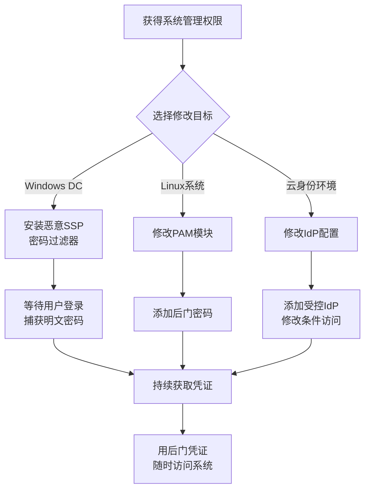

# 修改认证流程 (T1556)

## 一句话通俗理解

**攻击者修改了门锁的构造，让自己的钥匙也能开门——改掉认证系统本身，即使不知道密码也能登录。**

## 难度等级

- ⭐⭐⭐ 高级（需要深入技术知识）

## 技术描述

修改认证流程（T1556）是MITRE ATT&CK框架中凭证访问战术的一种技术。

**通俗解释：**
之前的凭证访问技术都是"偷"——偷密码、偷令牌、偷票据。而修改认证流程是"改"——直接修改认证系统本身。比如：在Windows的登录流程中插入一个恶意组件，让每个用户登录时都把密码发给攻击者；在Linux的PAM（可插拔认证模块，相当于系统的"门锁接口"）中添加一个后门密码；在云端的身份提供商（IdP）中修改配置，让攻击者控制的账户也能登录。这就像小偷不撬锁，而是让锁匠改了锁芯的结构。

**技术原理：**
1. **安装恶意认证组件**：在Windows上安装恶意安全支持提供程序（SSP）或密码过滤器DLL，在用户输入密码时捕获明文
2. **修改PAM模块**：在Linux/macOS上修改PAM配置或替换认证库，添加后门密码
3. **篡改域认证**：在域控制器上安装恶意Kerberos认证包（KDC），或配置域账户使用可还原加密存储密码
4. **修改云身份配置**：在Azure AD/Okta中添加受控的身份提供商（IdP），修改条件访问策略

**用途与影响：**
这是最高级的凭证攻击技术之一，具有极强的隐蔽性和持久性。修改认证流程后，攻击者无需每次重新入侵系统，只要知道后门密码或持有特定令牌就能随时进入。而且即使用户修改了自己的密码，认证系统中的后门依然有效。2025年微软报告显示，涉及混合身份环境认证配置修改的攻击增加了超过200%。

## 子技术列表

**该技术共有 9 个子技术：**

| 子技术ID | 中文名称 | 通俗解释 |
|----------|----------|----------|
| T1556.001 | Domain Controller Authentication | 修改域控的认证流程以捕获所有登录密码 |
| T1556.002 | Password Filter DLL | 安装密码过滤器，在用户改密码时记录新密码 |
| T1556.003 | Pluggable Authentication Modules | 修改Linux的认证模块，添加后门密码 |
| T1556.004 | Network Device Authentication | 在路由器/交换机上添加后门用户或改认证配置 |
| T1556.005 | Reversible Encryption | 将域账户密码改为可解密格式存储在AD中 |
| T1556.006 | Multi-Factor Authentication | 修改或绕过多因素认证配置 |
| T1556.007 | Hybrid Identity | 在混合云身份环境中添加受控的信任关系 |
| T1556.008 | Network Provider DLL | 安装恶意网络提供程序捕获网络认证密码 |
| T1556.009 | Conditional Access Policy | 修改云端的条件访问策略绕过安全限制 |

<details>
<summary><strong>展开查看各子技术详细说明</strong></summary>

### T1556.001 - Domain Controller Authentication

**通俗理解：** 在"中央门禁系统"上加装窃听器，每次有人刷卡进门都记录下密码。

**详细说明：**
攻击者在域控制器（DC）上安装恶意安全支持提供程序（SSP）或替换LSA认证包。SSP是Windows中处理不同类型认证的插件（如Kerberos、NTLM）。攻击者安装一个自定义SSP后，每次用户登录时都会调用该SSP，恶意SSP将用户的明文密码保存到文件中。常用工具有mimikatz的`misc::memssp`命令，它会在内存中安装一个SSP，记录所有登录密码到`c:\windows\temp\`。

### T1556.002 - Password Filter DLL

**通俗理解：** 用户在改密码时，恶意软件会把新密码偷偷记下来。

**详细说明：**
Windows系统允许安装自定义密码过滤器（Password Filter DLL）来验证新密码的强度。攻击者注册一个恶意密码过滤器到注册表（`HKLM\SYSTEM\CurrentControlSet\Control\Lsa\Notification Packages`），该过滤器在每次用户更改密码时被调用。恶意过滤器把新密码的明文保存到攻击者可控的位置。此技术的可怕之处在于：即使用户定期更改密码（安全最佳实践），每次更改的新密码都会被攻击者捕获。

### T1556.003 - Pluggable Authentication Modules

**通俗理解：** 修改Linux系统的"门锁"，用自己的密码也能开门。

**详细说明：**
PAM是Linux/macOS的认证框架，支持通过插件扩展认证方式。攻击者可以修改`/etc/pam.d/`下的配置文件，添加一个新的认证条目，允许一个特定的后门密码通过认证。或者替换`pam_unix.so`等核心库文件，在其中硬编码一个万能密码。修改PAM后，任何知道后门密码的人都可以登录任意系统用户账户。

### T1556.005 - Reversible Encryption

**通俗理解：** 让Active Directory用明文保存密码——这样攻击者就能直接读了。

**详细说明：**
Active Directory默认使用不可逆哈希（NTLM hash）存储密码，这意味即使拿到数据库（NTDS.dit）也无法还原明文密码。但AD支持为特定账户启用"使用可还原加密存储密码"选项，该选项使密码以可解密格式存储在AD中。攻击者如果拥有域管理员权限，可以修改此选项，等待用户下次登录或改密码后，通过DCSync提取密码并解密为明文。

### T1556.006 - Multi-Factor Authentication

**通俗理解：** 绕过第二道验证——让双因子认证变成单因子。

**详细说明：**
攻击者登录身份提供商的管理控制台后，可以为现有用户添加攻击者控制的MFA设备（如攻击者的手机号码或认证器应用），修改MFA策略降低认证要求，或禁用特定用户的MFA。2024年Scattered Spider攻击案例中，攻击者在受害者Okta租户中注册了自己的MFA设备，从而绕过了MFA保护。

### T1556.007 - Hybrid Identity

**通俗理解：** 在公司的云和本地之间的"信任通道"上加个假门。

**详细说明：**
在混合云身份环境中，企业使用AD FS等联合服务在本地AD和云服务（Azure AD）之间建立信任关系。攻击者如果攻破AD FS服务器，可以添加受自己控制的身份提供商（IdP），或修改联合信任配置。这样攻击者就可以用伪造的SAML断言登录任何与Azure AD集成的云应用。

### T1556.009 - Conditional Access Policy

**通俗理解：** 修改云服务的"安检规则"，让自己不被安检。

**详细说明：**
条件访问策略是云端的安全规则，规定了"什么样的人、从什么地方、用什么设备才能登录"。攻击者登录Azure AD或Okta管理控制台后，可以修改这些策略——如添加绕过MFA的IP地址、延长登录会话有效期、或禁用风险检测。修改后攻击者使用窃取的凭证登录时，不再需要满足原有的安全要求。

</details>

## 攻击流程



**步骤详解：**

1. **获取管理权限**
   - 通俗描述：需要先获得系统的管理员权限才能修改认证组件
   - 技术细节：通过漏洞利用、凭证窃取或社会工程学获得域管理员或root权限
   - 常用工具：mimikatz、漏洞利用工具包

2. **安装/修改认证组件**
   - 通俗描述：在认证流程中插入恶意代码
   - 技术细节：在Windows DC上运行`misc::memssp`安装SSP，或在Linux上修改`/etc/pam.d/sshd`
   - 常用工具：mimikatz、自定义恶意软件

3. **利用后门**
   - 通俗描述：使用后门密码或捕获到的凭证持续访问系统
   - 技术细节：密码过滤器DLL捕获的密码写入隐藏文件，攻击者定期回连读取
   - 常用工具：C2框架（Cobalt Strike、Sliver）

## 真实案例

### 案例1：Nobelium (APT29) - 混合身份认证修改（2021-2025）

- **时间**: 2021-2025年
- **目标**: 全球政府机构、IT供应链
- **攻击组织**: APT29（Nobelium）
- **手法**: APT29在入侵AD FS服务器后，修改了Azure AD联邦信任配置，添加了受控制的SAML身份提供商。利用Golden SAML技术，他们使用窃取的AD FS令牌签名证书伪造合法用户的认证断言。修改后的联邦配置使攻击者能够以任意用户身份（包括全局管理员）登录任何与Azure AD集成的应用，完全绕过MFA。2024-2025年，APT29持续利用这种混合身份篡改技术，在被清除的网络中重新获得访问权限。
- **影响**: 多个美国政府机构和全球IT公司长期遭入侵，伪造的认证令牌有效期长达数年
- **参考链接**: [Mandiant - Golden SAML](https://www.mandiant.com/resources/blog/golden-saml-and-golden-certificates)

### 案例2：Scattered Spider - MFA配置修改（2022-2024）

- **时间**: 2022-2024年
- **目标**: 科技、金融服务、游戏行业
- **攻击组织**: Scattered Spider（UNC3944）
- **手法**: Scattered Spider通过社会工程学（冒充IT支持）获得初始访问后，登录受害者的身份提供商管理控制台（Okta、Azure AD），执行多项MFA配置修改：注册攻击者控制的MFA设备到现有用户账户、修改MFA策略跳过特定用户的验证要求、添加外部身份提供商使组织外账户能访问内部应用。2024年的攻击中，他们通过修改条件访问策略添加了绕过MFA的IP白名单，使窃取的凭证可以直接登录。CISA和FBI联合预警指出，MFA配置修改是Scattered Spider最危险的技术之一。
- **影响**: 多家知名企业遭入侵，身份基础设施被控制
- **参考链接**: [CISA AA23-320A - Scattered Spider](https://www.cisa.gov/news-events/cybersecurity-advisories/aa23-320a)

### 案例3：Chimera - 密码过滤器DLL（2018-2019）

- **时间**: 2018-2019年
- **目标**: 金融机构
- **攻击组织**: Chimera（APT组织）
- **手法**: Chimera组织在受感染的Windows域控制器上部署了恶意密码过滤器DLL。恶意DLL被注册为系统的密码过滤器，并在用户每次更改密码时捕获新密码的明文，保存到加密文件中。这种方式使得即使组织要求员工定期更换密码（从季度改到月度），攻击者依然能够持续获取域用户的最新凭证。Chimera还通过修改LSA认证包配置来确保SSP在系统重启后依然存在。
- **影响**: 金融机构域用户的凭证持续泄露，攻击者保持长期访问
- **参考链接**: [MITRE ATT&CK - Chimera Group](https://attack.mitre.org/groups/G0114/)

### 案例4：UNC5225 - 云条件访问策略修改（2024-2025）

- **时间**: 2024-2025年
- **目标**: 多家大型企业
- **攻击组织**: UNC5225（Mandiant追踪的APT组织）
- **手法**: UNC5225在获取Azure AD全局管理员权限后，修改了目标组织的条件访问策略。他们添加了新的可信位置（攻击者控制的IP地址），修改了登录风险策略以忽略来自异常位置的登录告警，并延长了登录会话的有效期。这些修改使攻击者可以使用之前窃取的凭证直接登录云应用，不再触发MFA要求或风险告警。Mandiant在2025年的报告中指出，条件访问策略修改已成为云身份攻击中最危险的持久化技术之一。
- **影响**: 多家大型企业的云身份安全策略被削弱，攻击者获得无阻碍的云资源访问
- **参考链接**: [Mandiant - Cloud Identity Attacks 2025 Report](https://www.mandiant.com/resources/cloud-identity-attacks)

## 红队视角

> ⚠️ **免责声明**：以下内容仅用于合法的安全测试、渗透测试和教育目的。未经授权对他人系统进行测试是违法行为。

### 实战技巧

1. **mimikatz memssp**：
   在域控制器上运行 `misc::memssp` 会在内存中安装一个SSP。之后所有域用户登录时，密码会被写入 `c:\windows\temp\mimilsa.log`。这条命令不需要写磁盘，不容易被文件扫描检测到。

2. **修改PAM的万能密码**：
   在Linux上，编译一个修改版的`pam_unix.so`，在其中硬编码一个后门密码（如`Backdoor@123`）。后门密码的认证始终返回成功。每次系统更新PAM后需要重新安装。

3. **Azure AD条件访问绕过**：
   登录Azure AD管理门户 → 安全 → 条件访问 → 添加可信位置（攻击者出网IP）→ 修改MFA策略排除该位置。这样攻击者从自己的IP登录时不需要MFA。

### 常用工具

| 工具名称 | 用途 | 平台 | 链接 |
|----------|------|------|------|
| mimikatz | 安装内存SSP、密码过滤器 | Windows | https://github.com/gentilkiwi/mimikatz |
| Rubeus | Kerberos票据操作 | Windows | https://github.com/GhostPack/Rubeus |
| AzureAD PowerShell | Azure AD配置管理 | 跨平台 | https://learn.microsoft.com/en-us/powershell/azure/ |
| ADFSDump | AD FS配置提取 | Windows | https://github.com/mandiant/ADFSDump |

### 注意事项

- 修改认证流程很可能触发安全告警，需要先了解目标环境的监控能力
- 在域控制器上实施修改时，错误的配置可能导致域认证中断，影响业务运行
- 密码过滤器DLL需要代码签名或绕过AppLocker规则
- 修改云身份配置的操作会被记录在审计日志中，需要及时清理

## 蓝队视角

### 检测要点

1. **SSP/密码过滤器注册变更**
   - 日志来源：Windows Event ID 4688（进程创建）、Sysmon Event ID 1
   - 关注字段：HKLM\SYSTEM\CurrentControlSet\Control\Lsa\Security Packages 和 Notification Packages 的修改
   - 异常特征：新增未知的SSP DLL或密码过滤器DLL
   - 检测命令：`reg query HKLM\SYSTEM\CurrentControlSet\Control\Lsa /v "Security Packages"`

2. **PAM配置修改**
   - 日志来源：Linux auditd（审计守护进程）、AIDE文件完整性监控
   - 关注字段：/etc/pam.d/ 目录下文件的修改
   - 异常特征：PAM配置文件被修改或新增未知的.so模块

3. **云身份配置变更**
   - 日志来源：Azure AD Audit Logs、Okta System Log
   - 关注字段：联邦域名配置修改、新的IdP添加、条件访问策略变更、新的MFA设备注册
   - 异常特征：非管理员账户执行身份配置修改，或来自异常IP的管理操作

### 监控建议

- 使用Sysmon Event ID 13（注册表修改）监控认证相关注册表项的变更
- 部署文件完整性监控（FIM）跟踪PAM配置文件和认证DLL的修改
- 配置Azure AD异常活动告警，特别是来自非信任位置的全局管理员操作
- 定期审计AD FS服务器上所有已注册的信任关系
- 使用Microsoft Defender for Identity检测DC上的LSASS异常加载

## 检测建议

### 网络层检测

**检测方法：** 监控认证协议流量和身份提供商通信的异常模式，检测认证流程篡改后的网络层特征。

**具体规则/命令示例：**
```
# 检测异常的身份提供商（IdP）通信流量（可能指示混合身份篡改）
zeek -C -r capture.pcap ssl.log | grep -iE "adfs|sts|identity|okta|saml" | \
  awk '{print $3, $5, $6}' | sort | uniq -c | sort -rn | head -20

# 检测SAML断言在HTTP流量中的异常提交
zeek -C -r capture.pcap http.log | grep -i "SAMLResponse" | \
  awk '{print $3, $9, $10}' | sort -k1 | head -20
```

### 主机层检测

**检测方法：** 监控认证组件的注册和加载。

**Windows事件ID：**
- 事件ID 4688（进程创建）+ 命令行审计：监控新的SSP或密码过滤器DLL加载
- Sysmon Event ID 7（模块加载）：检测非标准路径的认证DLL加载
- 事件ID 4793（密码策略变更）：检测密码过滤器相关的注册表修改

**具体命令示例：**
```powershell
# 检测当前加载的SSP
Get-ItemProperty -Path HKLM:\SYSTEM\CurrentControlSet\Control\Lsa\ `
    -Name "Security Packages" | Select-Object -ExpandProperty "Security Packages"
```

**Linux命令示例：**
```bash
# 监控PAM配置文件的修改
auditctl -w /etc/pam.d/ -p wa -k pam_modification
ausearch -k pam_modification
```

### 应用层检测

**Sigma规则示例：**
```yaml
title: 检测恶意密码过滤器DLL注册
status: experimental
description: 检测非标准密码过滤器DLL在注册表中的注册
logsource:
    category: registry_event
    product: windows
detection:
    selection:
        EventType: SetValue
        TargetObject|contains: '\Control\Lsa\Notification Packages'
        Details|contains:
            - '.dll'
    filter:
        Details|contains:
            - 'scecli.dll'
            - 'passfilt.dll'
            - 'cngaudit.dll'
    condition: selection and not filter
level: high
tags:
    - attack.t1556
```

## 缓解措施

### 优先级1：关键措施

**措施名称：** 保护域控制器和身份基础设施

**具体实施步骤：**
1. 在域控制器上启用Windows Defender Credential Guard和Device Guard
2. 实施JIT（Just-In-Time）管理权限，减少常驻的域管理员账户
3. 对AD FS和CA服务器实施特权访问工作站（PAW）级别的保护

**配置示例：**
```powershell
# 启用Credential Guard（通过组策略）
# 计算机配置 → 管理模板 → 系统 → Device Guard → 打开基于虚拟化的安全
```

### 优先级2：重要措施

**措施名称：** 监控和审计身份配置变更

**具体实施步骤：**
1. 配置Azure AD审计日志的实时告警，特别是"添加联合域名"、"修改条件访问策略"等高危操作
2. 定期审查所有已注册的MFA设备和OAuth应用
3. 部署文件完整性监控（FIM）跟踪认证组件的修改

### 优先级3：建议措施

**措施名称：** PAM加固

**具体实施步骤：**
1. 使用Tripwire或AIDE监控 `/etc/pam.d/` 和 `/lib/security/` 的变更
2. 对PAM配置文件设置只读权限，限制修改权限给特定管理员组
3. 定期计算并记录PAM文件的校验和，巡检时对比

### MITRE ATT&CK 缓解措施映射

| 缓解措施ID | 缓解措施名称 | 适用性 | 说明 |
|------------|-------------|--------|------|
| M1028 | 操作系统配置 | 适用 | 限制认证组件的安装和修改权限 |
| M1018 | 用户账户管理 | 适用 | 限制管理员的MFA注册和策略修改权限 |
| M1025 | 权限升级保护 | 适用 | 启用Credential Guard保护LSA进程 |
| M1047 | 审计 | 适用 | 审计认证配置的修改操作 |
| M1037 | 过滤器网络流量 | 部分适用 | 限制对身份提供商管理端口的访问 |

## 动手实验

> ⚠️ **重要提示**：所有实验必须在隔离的实验室环境中进行，禁止对未授权的真实系统进行测试。

### 实验环境准备

**推荐靶场/实验平台：**

| 平台名称 | 类型 | 难度 | 链接 |
|----------|------|------|------|
| TryHackMe - AD域渗透 | 虚拟靶场 | 高级 | https://tryhackme.com/ |
| HackTheBox - Forest | 虚拟靶场 | 高级 | https://www.hackthebox.com/ |

**所需工具：**
- mimikatz：SSP注入和密码提取
- 虚拟机：Windows Server DC + 成员机

### 实验1：mimikatz memssp测试（高级）

**实验目标：** 在隔离的域环境中验证SSP注入的效果。

**实验步骤：**
1. 搭建Windows域环境（1台DC + 1台成员机）
2. 在DC上以管理员身份运行mimikatz：`misc::memssp`
3. 在成员机上登录域用户账户
4. 在DC上检查 `c:\windows\temp\mimilsa.log` 文件
5. 观察是否记录到域用户的登录密码

**预期结果：** 成功捕获到域用户的明文登录密码。

**学习要点：** 理解SSP的工作原理和为什么保护域控制器的LSA进程至关重要。

### 实验2：Azure AD条件访问策略修改（高级）

**实验目标：** 在测试Azure AD租户中练习条件访问策略修改。

**实验步骤：**
1. 创建一个测试Azure AD租户
2. 使用全局管理员身份登录Azure Portal
3. 导航到安全 → 条件访问 → 添加新策略
4. 创建一个绕过MFA的例外规则（指定可信IP范围）
5. 验证修改后的策略效果

**预期结果：** 修改条件访问策略后，从指定IP登录不再触发MFA。

**学习要点：** 理解条件访问策略在身份安全中的关键作用，以及为什么需要严格的审批流程。

## 术语解释

| 术语 | 英文原名 | 通俗解释 |
|------|----------|----------|
| SSP | Security Support Provider | Windows的安全支持提供程序，负责处理各种认证协议。类似于"门锁插件"——不同的认证方式需要不同的插件 |
| LSA | Local Security Authority | Windows本地安全机构，负责处理所有用户的本地登录和域认证。是操作系统的"认证核心" |
| PAM | Pluggable Authentication Modules | Linux/macOS的认证框架，通过可插拔模块支持不同的认证方式。就像"认证插排"，可以插上不同的认证方式 |
| 密码过滤器 | Password Filter DLL | Windows中的密码强度验证组件，在用户更改密码时被调用。攻击者利用它来捕获新密码 |
| IdP | Identity Provider | 身份提供商，负责验证用户身份并签发认证断言。如Azure AD、Okta、AD FS |
| 联邦 | Federation | 多个组织之间建立信任关系，使一个组织的用户可以用自己的账号访问另一个组织的资源 |
| 条件访问 | Conditional Access | 云端的安全策略引擎，根据用户、设备、位置等条件决定是否允许访问以及需要什么级别的认证 |
| 混合身份 | Hybrid Identity | 在本地AD和云身份服务（Azure AD）之间建立的统一身份管理方案 |

## 参考资料

### 官方文档

- [MITRE ATT&CK - T1556 Modify Authentication Process](https://attack.mitre.org/techniques/T1556/)
- [MITRE ATT&CK - T1556.001 Domain Controller Authentication](https://attack.mitre.org/techniques/T1556/001/)
- [MITRE ATT&CK - T1556.006 Multi-Factor Authentication](https://attack.mitre.org/techniques/T1556/006/)
- [MITRE ATT&CK - T1556.007 Hybrid Identity](https://attack.mitre.org/techniques/T1556/007/)

### 安全报告

- [Mandiant - Golden SAML and Golden Certificates](https://www.mandiant.com/resources/blog/golden-saml-and-golden-certificates) - SAML令牌伪造与混合身份攻击
- [CISA AA23-320A - Scattered Spider](https://www.cisa.gov/news-events/cybersecurity-advisories/aa23-320a) - MFA配置修改案例
- [Mandiant - Cloud Identity Attacks 2025](https://www.mandiant.com/resources/cloud-identity-attacks) - 云身份攻击趋势报告

### 工具与资源

- [mimikatz - Windows凭证提取和SSP注入](https://github.com/gentilkiwi/mimikatz)
- [ADFSDump - AD FS配置提取工具](https://github.com/mandiant/ADFSDump)
- [Azure AD PowerShell模块](https://learn.microsoft.com/en-us/powershell/azure/)

### 学习资料

- [Microsoft - LSA保护配置](https://learn.microsoft.com/en-us/windows-server/security/credentials-protection-and-management/configuring-additional-lsa-protection)
- [Microsoft - Azure AD条件访问文档](https://learn.microsoft.com/en-us/azure/active-directory/conditional-access/)
- [Red Hat - PAM配置指南](https://access.redhat.com/documentation/en-us/red_hat_enterprise_linux/8/html/configuring_authentication_and_authorization_in_rhel/using-pluggable-authentication-modules-pam_configuring-authentication-and-authorization-in-rhel)
