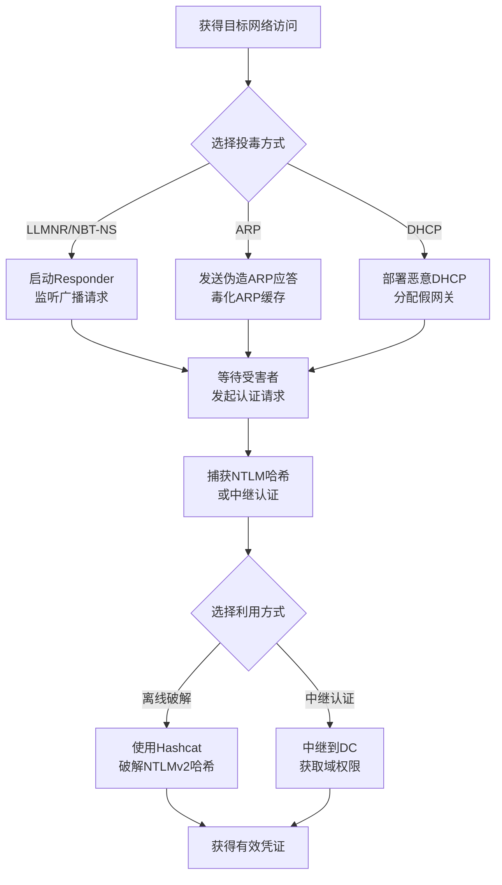

# 中间人攻击 (T1557)

## 一句话通俗理解

**攻击者偷偷坐在你和服务器之间，你们之间的所有通信他都能看到甚至修改——就像邮递员拆开你的信件看完再封好送出去。**

## 30秒速查卡

| 维度 | 你需要知道的 |
|------|-------------|
| 这是什么？ | 夹在你和服务器之间偷看通信内容 |
| 为什么危险？ | 中间人攻击可以截获所有通信数据，包括密码、令牌等敏感信息 |
| 谁需要关心？ | 网络管理员、SOC分析师 |
| 你的第一步防御 | 部署加密通信，使用证书固定（Certificate Pinning） |
| 如果只做一件事 | 监控网络中是否有ARP投毒、LLMNR投毒等中间人攻击活动 |

## 难度等级

- ⭐⭐ 中级（需要一定基础）

## 技术描述

中间人攻击（T1557，简称AitM/MITM）是MITRE ATT&CK框架中凭证访问战术的一种技术。

**通俗解释：**
正常情况下你的电脑和服务器之间是"直连"的——你发消息给对方，对方直接收到。中间人攻击就是攻击者把自己"插"到你和服务器之间：你的消息先发到攻击者那里，攻击者看完（甚至修改后）再转发给服务器。服务器的回应也先经过攻击者。由于网络协议的一些设计缺陷，攻击者可以在你不察觉的情况下做到这一点。通过中间人位置，攻击者可以捕获你的登录密码、会话令牌甚至修改传输的内容。

**技术原理：**
1. **LLMNR/NBT-NS投毒**：当Windows电脑找不到某个主机名时，会广播询问"谁是这个地址？"。攻击者抢先回答"是我！"，骗你的电脑把流量发给他
2. **ARP欺骗**：在局域网内，攻击者发送伪造的"地址对应关系"，告诉其他电脑"路由器的IP对应的是我的MAC地址"。之后所有本来要发给路由器的流量都发给了攻击者
3. **DHCP欺骗**：攻击者伪装成DHCP服务器（网络中的"地址分配员"），给受害者的电脑分配一个假的网关地址，骗受害者把流量发给攻击者
4. **证书欺骗**：当访问HTTPS网站时，攻击者用自己的假证书冒充网站，浏览器如果信任了这个假证书，攻击者就能解密加密流量

**用途与影响：**
中间人攻击是横向移动和凭证捕获的核心技术之一。攻击者不需要直接入侵目标服务器，只需要在同一个网络中就能拦截通信。根据2025年CrowdStrike报告，LLMNR/NBT-NS投毒是在Windows域环境中第二常用的横向移动技术。

## 子技术列表

**该技术共有 4 个子技术：**

| 子技术ID | 中文名称 | 通俗解释 |
|----------|----------|----------|
| T1557.001 | LLMNR/NBT-NS Poisoning and SMB Relay | 毒化名称解析，骗你的电脑把密码发给攻击者的机器 |
| T1557.002 | ARP Cache Poisoning | 伪造IP和MAC地址的对应关系，让流量走攻击者的机器 |
| T1557.003 | DHCP Spoofing | 用假的DHCP服务器分配恶意网络配置 |
| T1557.004 | Mutual Authentication Impairment | 破坏双向证书验证，让攻击者能解密加密流量 |

<details>
<summary><strong>展开查看各子技术详细说明</strong></summary>

各子技术详细说明请参阅独立文档：

- [T1557.001 - LLMNR/NBT-NS中毒和SMB中继](./T1557/T1557.001-LLMNR-NBT-NS-Poisoning-and-SMB-Relay-LLMNR-NBT-NS-Poisoning-and-SMB-Relay.md) — 当你的电脑找不到某台机器时，会大喊"谁是XXX？"，攻击者抢先回答"是我！"骗你把密码发过来。
- [T1557.002 - ARP缓存中毒](./T1557/T1557.002-ARP-Cache-Poisoning-ARP-Cache-Poisoning.md) — 在网络中散播假的地图，让所有人把寄给别人的信都送到你这里来。
- [T1557.003 - DHCP欺骗](./T1557/T1557.003-DHCP-Spoofing-DHCP-Spoofing.md) — 攻击者冒充公司的网络管理员，给新接入的设备分配错误的网络设置。
- [T1557.004 - 相互认证损害](./T1557/T1557.004-Mutual-Authentication-Impairment-Mutual-Authentication-Impairment.md) — 破坏服务器和客户端之间的相互身份验证，让攻击者可以冒充服务器。

</details>

## 攻击流程



**步骤详解：**

1. **选择投毒位置和工具**
   - 通俗描述：在目标网络中确定可以执行中间人攻击的位置
   - 技术细节：攻击者需要在目标子网中有一台已控主机，或连接到目标网络（如Wi-Fi）
   - 常用工具：Responder、Inveigh、Ettercap

2. **执行名称解析投毒**
   - 通俗描述：启动工具监听网络上的名称解析请求，伪造响应
   - 技术细节：运行 `Responder -I eth0 -wrf` 启用LLMNR、NBT-NS和WPAD投毒
   - 常用工具：Responder（Python）、Inveigh（PowerShell）

3. **捕获并利用凭证**
   - 通俗描述：受害者尝试连接资源时，认证凭证被攻击者截获
   - 技术细节：捕获的Net-NTLMv2哈希用Hashcat离线破解，或使用Impacket的ntlmrelayx.py中继到目标服务器
   - 常用工具：Hashcat、Impacket ntlmrelayx

## 真实案例

### 案例1：Black Basta - Responder投毒与SMB Relay（2024）

- **时间**: 2024年
- **目标**: 多个行业组织（制造业、医疗保健）
- **攻击组织**: Black Basta勒索软件附属组织
- **手法**: Black Basta附属组织在获得对目标网络的初始访问后，使用Responder进行LLMNR/NBT-NS投毒。他们在内部网络的工作站上部署Responder，监听网络上的名称解析广播。当域成员尝试访问不存在的网络资源时（如网络打印机失效、管理员输入错误的主机名），Responder捕获发送的NTLMv2哈希。攻击者使用Impacket的ntlmrelayx.py将捕获的哈希中继到域控制器，以受害者身份完成认证。通过SMB Relay，他们逐步获得域管理员权限，最终部署勒索软件。2024年CISA的Black Basta分析指出，SMB Relay是其横向移动的核心技术。
- **影响**: 多个组织被勒索，攻击者通过SMB Relay获得域控制权
- **参考链接**: [CISA - Black Basta Analysis 2024](https://www.cisa.gov/news-events/cybersecurity-advisories/aa24-277a)

### 案例2：DarkHotel - 酒店Wi-Fi中间人攻击（2014-2020）

- **时间**: 2014-2020年（持续活跃）
- **目标**: 亚洲高端酒店中的企业高管和外交人员
- **攻击组织**: DarkHotel（APT-TOCS）
- **手法**: DarkHotel组织通过在高端酒店中部署恶意Wi-Fi接入点或入侵酒店的Wi-Fi基础设施，建立中间人攻击位置。他们使用购买了合法签名的SSL证书，在酒店网络中执行TLS中间人攻击——当受害者访问安全网站时，DarkHotel的网关使用合法签发的证书替换原网站证书，浏览器不显示警告。通过这种方式，DarkHotel能够解密所有HTTPS加密流量，捕获VPN登录凭证、电子邮件密码和企业云服务的访问令牌。受害者的设备上也通过社会工程安装了攻击者控制的根证书，确保长期拦截能力。
- **影响**: 多国政府官员和企业高管的敏感信息被窃取，包括国防合同相关通信
- **参考链接**: [Kaspersky - DarkHotel Analysis](https://securelist.com/darkhotel-more-tales/)

### 案例3：NotPetya - 投毒组件加速传播（2017）

- **时间**: 2017年6月
- **目标**: 全球企业（乌克兰为首要目标）
- **攻击组织**: NotPetya（沙虫组织关联）
- **手法**: NotPetya勒索软件利用EternalBlue漏洞在网络上快速传播，同时在受影响的主机上部署了LLMNR/NBT-NS投毒组件。投毒组件捕获网络中的NTLM认证请求，并使用捕获的凭证通过PsExec和WMI将恶意软件复制到其他机器。NotPetya的传播结合了漏洞利用和中间人攻击，使其在数小时内感染了全球数千个组织。虽然NotPetya实际是数据破坏型攻击（伪装为勒索软件），但其传播速度创下了记录，部分归功于AitM技术的加持。
- **影响**: 全球超过2000个组织被感染，总损失超过100亿美元
- **参考链接**: [MITRE ATT&CK - NotPetya](https://attack.mitre.org/software/S0368/)

### 案例4：Salt Typhoon - ARP欺骗与VoIP拦截（2024）

- **时间**: 2024年
- **目标**: 美国电信运营商
- **攻击组织**: Salt Typhoon
- **手法**: Salt Typhoon在入侵电信运营商的内部网络后，使用ARP缓存投毒技术在核心网络设备之间建立中间人位置。他们将运营商的交换机和路由器之间的流量重定向到攻击者控制的主机，拦截并记录了大量的VoIP信令流量。通过分析这些流量中的SIP认证信息（包含明文或哈希凭证），Salt Typhoon提取了管理员的SIP账户凭证，进一步扩大了对运营商网络设备的控制。Mandiant的报告指出，ARP欺骗是该组织在运营商网络中进行横向移动和凭证捕获的关键技术。
- **影响**: 美国多家电信运营商遭受入，数百万人通话记录被窃取
- **参考链接**: [Mandiant - Salt Typhoon Telecom Operations](https://www.mandiant.com/resources/blog/salt-typhoon-telecom-analysis)

## 红队视角

> ⚠️ **免责声明**：以下内容仅用于合法的安全测试、渗透测试和教育目的。未经授权对他人系统进行测试是违法行为。

### 实战技巧

1. **Responder的高效使用**：
   在目标子网中运行 `Responder -I eth0 -wrf` 启用所有的投毒功能（LLMNR、NBT-NS、WPAD、DHCP）。将抓取的Net-NTLMv2哈希用Hashcat的`-m 5600`模式配合`rockyou.txt`字典进行离线破解。破解速度可达到100GH/s（搭配8x RTX 4090）。

2. **SMB Relay绕过NTLMv1限制**：
   如果环境中NTLMv2签名强制启用（通过组策略），直接中继会失败。使用Impacket的 `ntlmrelayx.py -socks` 模式建立SOCKS代理，通过已认证的会话访问资源。还可以使用`SMB Signing Disabled`扫描工具找到未启用SMB签名的目标。

3. **绕过HSTS/TLS拦截检测**：
   对于启用了HSTS（HTTP严格传输安全）的网站，直接证书替换会触发浏览器警告。使用`mitmproxy`或`BetterCAP`配合浏览器扩展，或利用协议降级攻击（降级到HTTP）绕过HSTS保护。

### 常用工具

| 工具名称 | 用途 | 平台 | 链接 |
|----------|------|------|------|
| Responder | LLMNR/NBT-NS/WPAD投毒 | Linux | https://github.com/SpiderLabs/Responder |
| Inveigh | Windows环境下的投毒工具 | Windows | https://github.com/Kevin-Robertson/Inveigh |
| Impacket | SMB Relay和协议操作 | 跨平台 | https://github.com/fortra/impacket |
| Ettercap | ARP欺骗和流量拦截 | Linux | https://www.ettercap-project.org/ |
| mitmproxy | TLS拦截和流量修改 | 跨平台 | https://mitmproxy.org/ |

### 注意事项

- SMB Relay需要目标服务器未启用SMB签名，否则认证中继会失败
- ARP欺骗在交换网络中有效，但被VLAN隔离、端口安全和动态ARP检测（DAI）防御
- 不要在客户生产环境中长时间运行投毒工具，可能导致网络中断
- 现代Windows系统默认启用LLMNR，但很多安全加固指南建议关闭

## 蓝队视角

### 检测要点

1. **异常名称解析响应**
   - 日志来源：网络流量日志、Windows Defender for Identity
   - 关注字段：来自非域控制器的LLMNR/NBT-NS响应、短时间内大量名称解析应答
   - 异常特征：单一主机对大量名称解析请求进行应答

2. **ARP异常**
   - 日志来源：交换机日志、ARP监控工具
   - 关注字段：ARP缓存表中IP-MAC映射的异常变化
   - 异常特征：一个IP地址对应多个MAC地址（ARP欺骗标志）

3. **非授权DHCP服务器**
   - 日志来源：DHCP服务器日志、网络监控
   - 关注字段：DHCP Offer的来源IP（不应来自没有授权的主机）
   - 异常特征：客户端从非授权的DHCP服务器获取配置

### 监控建议

- 在交换机上启用DHCP Snooping（DHCP监听）和Dynamic ARP Inspection（动态ARP检测，DAI）
- 使用NetFlow或Zeek（Bro）监控网络中的异常LLMNR（UDP 5355）和NBT-NS（UDP 137）流量
- 部署Windows Defender for Identity监控NTLM认证中的异常中继行为
- 配置组策略禁用LLMNR和NetBIOS over TCP/IP（减少投毒攻击面）
- 启用Windows Firewall阻止LLMNR和NetBIOS跨子网流量

## 检测建议

### 网络层检测

**检测方法：** 监控网络中的异常广播和ARP行为。

**具体规则/命令示例：**

**Snort/Suricata规则 - 检测Responder特征：**
```
alert udp any any -> $HOME_NET 5355 (msg:"LLMNR投毒检测 - 来自非DC的响应"; 
  content:"|00 00 00 00|"; offset:4; depth:4; 
  reference:url,attack.mitre.org/techniques/T1557/; classtype:attempted-recon; sid:1000001; rev:1;)
```

**Zeek脚本 - 检测ARP欺骗：**
```
# 检测ARP缓存中IP-MAC映射的异常变化
event arp_reply(c: connection, src_mac: string, src_ip: addr, tgt_mac: string, tgt_ip: addr) {
    if ([src_ip] in arp_cache && arp_cache[src_ip] != src_mac) {
        NOTICE([$note=ARP::Spoofing, $msg=fmt("ARP欺骗检测: %s 的MAC从 %s 变为 %s", src_ip, arp_cache[src_ip], src_mac)]);
    }
    arp_cache[src_ip] = src_mac;
}
```

### 主机层检测

**检测方法：** 监控主机上的ARP缓存异常和投毒工具的执行。

**Windows命令示例：**
```powershell
# 检查ARP缓存中是否存在多个IP对应同一个MAC
arp -a | Group-Object -Property {($_ -split '\s+')[2]} | Where-Object Count -gt 1

# 检测进程中运行Responder或Inveigh
Get-Process | Where-Object { $_.ProcessName -match "Responder|Inveigh|Python" }
```


**用人话说：** 这条规则在监控网络中是否有中间人攻击活动。中间人攻击是攻击者插入到通信双方之间，截获和篡改所有数据。正常情况下网络流量会直接到达目标服务器。如果发现流量异常地经过未知设备，或者ARP表出现异常，那就是攻击者在进行中间人攻击。

### 应用层检测

**Sigma规则示例：**
```yaml
title: 检测LLMNR/NBT-NS投毒工具运行
status: experimental
description: 检测Responder或Inveigh等投毒工具的运行
logsource:
    category: process_creation
    product: windows
detection:
    responder:
        Image|endswith: '\python.exe'
        CommandLine|contains: 'Responder.py'
    inveigh:
        Image|endswith: '\powershell.exe'
        CommandLine|contains: 'Inveigh'
    condition: responder or inveigh
level: high
tags:
    - attack.t1557
```

## 缓解措施

### 优先级1：关键措施

**措施名称：** 禁用LLMNR和NetBIOS over TCP/IP

**具体实施步骤：**
1. 通过组策略禁用LLMNR：计算机配置 → 管理模板 → 网络 → DNS客户端 → 关闭多播名称解析 → 启用
2. 通过组策略禁用NetBIOS over TCP/IP：网络连接设置
3. 验证禁用效果：使用`nbtstat -n`和`ipconfig /displaydns`检查

**配置示例：**
```powershell
# 通过注册表禁用LLMNR
New-ItemProperty -Path "HKLM:\SOFTWARE\Policies\Microsoft\Windows NT\DNSClient" `
    -Name "EnableMulticast" -Value 0 -PropertyType DWord -Force
```

### 优先级2：重要措施

**措施名称：** 启用SMB签名

**具体实施步骤：**
1. 通过组策略启用SMB签名：计算机配置 → Windows设置 → 安全设置 → 本地策略 → 安全选项
2. 设置 `Microsoft网络服务器：对通信进行数字签名（始终）` → 启用
3. 设置 `Microsoft网络客户端：对通信进行数字签名（始终）` → 启用

### 优先级3：建议措施

**措施名称：** 网络基础设施安全

**具体实施步骤：**
1. 在受管交换机上启用DHCP Snooping和Dynamic ARP Inspection
2. 部署802.1X网络访问控制（NAC），防止未授权设备接入
3. 实施网络分段（VLAN）和最小访问权限策略

### MITRE ATT&CK 缓解措施映射

| 缓解措施ID | 缓解措施名称 | 适用性 | 说明 |
|------------|-------------|--------|------|
| M1037 | 过滤网络流量 | 适用 | 阻止LLMNR和NetBIOS流量跨子网 |
| M1042 | 禁用或移除功能 | 适用 | 禁用LLMNR和NetBIOS |
| M1032 | 多因素认证 | 部分适用 | 启用MFA降低凭证泄露风险 |
| M1041 | 加密敏感信息 | 适用 | 使用Kerberos替代NTLM认证 |
| M1029 | 网络访问控制 | 适用 | 启用802.1X和网络准入 |

## 动手实验

> ⚠️ **重要提示**：所有实验必须在隔离的实验室环境中进行，禁止对未授权的真实系统进行测试。

### 实验环境准备

**推荐靶场/实验平台：**

| 平台名称 | 类型 | 难度 | 链接 |
|----------|------|------|------|
| TryHackMe - Active Directory Basics | 虚拟靶场 | 中级 | https://tryhackme.com/ |
| HackTheBox - Responder | 虚拟靶场 | 中级 | https://www.hackthebox.com/ |

**所需工具：**
- Responder：LLMNR/NBT-NS投毒
- Hashcat：密码哈希破解
- Wireshark：抓包分析
- 实验环境：Windows VM（大内网）+ Kali Linux（攻击机）

### 实验1：Responder投毒抓取NTLM哈希（中级）

**实验目标：** 在隔离的局域网环境中使用Responder捕获Windows NTLMv2哈希。

**实验步骤：**
1. 在Kali VM上启动Responder：`sudo responder -I eth0 -wrf`
2. 在Windows VM上访问一个不存在的主机名（假设备名称，如`\\FAKESERVER`）
3. 观察Kali VM上的Responder输出，看到捕获的NTLMv2哈希
4. 将哈希保存到文件，使用Hashcat尝试破解：`hashcat -m 5600 hash.txt rockyou.txt`
5. 如果破解成功，看到明文密码

**预期结果：** Windows VM向攻击机发送NTLM认证请求，捕获到Net-NTLMv2哈希，并可能破解出明文密码。

**学习要点：** 理解LLMNR/NBT-NS投毒的原理和在企业网络中的风险。

### 实验2：Wireshark抓包分析ARP欺骗（初级）

**实验目标：** 学习识别网络中的ARP欺骗攻击。

**实验步骤：**
1. 在Kali VM上使用Ettercap进行ARP欺骗：`sudo ettercap -T -M arp:remote /目标IP// /网关IP//`
2. 在Windows VM上使用Wireshark抓包
3. 在Wireshark中设置过滤条件：`arp`
4. 观察ARP应答的数量和来源——正常网络ARP应答很少
5. 留意ARP应答中IP-MAC映射的重复和矛盾

**预期结果：** Wireshark中观察到大量非正常的ARP应答包，且网关IP的MAC地址被篡改。

**学习要点：** 熟悉ARP欺骗的网络特征，理解为什么需要DAI（动态ARP检测）。

## 术语解释

| 术语 | 英文原名 | 通俗解释 |
|------|----------|----------|
| LLMNR | Link-Local Multicast Name Resolution | Windows的名称解析协议，当DNS找不到某个主机名时，用它在局域网内广播询问。就像在小区的广播里喊"谁知道XXX住在哪栋楼？" |
| NBT-NS | NetBIOS Name Service | 老版本的Windows名称解析协议，与LLMNR类似，通过广播询问主机名对应的IP地址 |
| ARP | Address Resolution Protocol | 把IP地址转换成MAC地址的协议。就像问"谁住在XX号房间？"——得到回答后就知道该把信送到哪个具体的信箱 |
| SMB | Server Message Block | Windows文件共享协议，用于访问共享文件夹、打印机等。认证过程中会传输NTLM哈希 |
| DHCP | Dynamic Host Configuration Protocol | 自动给设备分配IP地址、网关等网络配置的协议。就像酒店前台给新入住的客人分配房间钥匙 |
| Relay | Relay Attack | 中继攻击，将截获的认证请求直接转发到目标服务器，在不破解密码的情况下完成认证。就像捡到别人的门禁卡，直接用这张卡开门而不是复制 |
| Net-NTLMv2 | NTLMv2 Hash | Windows NTLM认证中使用的加密密码形式，可被离线破解。比NTLMv1更安全但仍然可破解 |
| HSTS | HTTP Strict Transport Security | 网站强制浏览器使用HTTPS连接的安全机制，防止HTTPS降级攻击。就像一个标志牌写着"请从正门进，不要走后门" |

## 参考资料

### 官方文档

- [MITRE ATT&CK - T1557 Adversary-in-the-Middle](https://attack.mitre.org/techniques/T1557/)
- [MITRE ATT&CK - T1557.001 LLMNR/NBT-NS Poisoning](https://attack.mitre.org/techniques/T1557/001/)
- [MITRE ATT&CK - T1557.002 ARP Cache Poisoning](https://attack.mitre.org/techniques/T1557/002/)

### 安全报告

- [CISA - Black Basta Analysis 2024](https://www.cisa.gov/news-events/cybersecurity-advisories/aa24-277a) - SMB Relay在勒索攻击中的应用
- [Mandiant - Salt Typhoon Telecom Analysis](https://www.mandiant.com/resources/blog/salt-typhoon-telecom-analysis) - ARP欺骗在电信攻击中的应用
- [Kaspersky - DarkHotel](https://securelist.com/darkhotel-more-tales/) - 酒店Wi-Fi中间人攻击案例

### 工具与资源

- [Responder - LLMNR/NBT-NS投毒工具](https://github.com/SpiderLabs/Responder)
- [Impacket - 网络协议工具集](https://github.com/fortra/impacket)
- [Ettercap - ARP欺骗工具](https://www.ettercap-project.org/)
- [mitmproxy - TLS拦截代理](https://mitmproxy.org/)

### 学习资料

- [Microsoft - 禁用LLMNR指南](https://learn.microsoft.com/en-us/windows-server/security/group-policy/)
- [Cisco - DHCP Snooping配置](https://www.cisco.com/c/en/us/td/docs/switches/lan/catalyst3750x/software/15-2E/ip_services/configuration/guide/)
- [PortSwigger - TLS中间人攻击详解](https://portswigger.net/web-security/ssl-tls/mitm)
