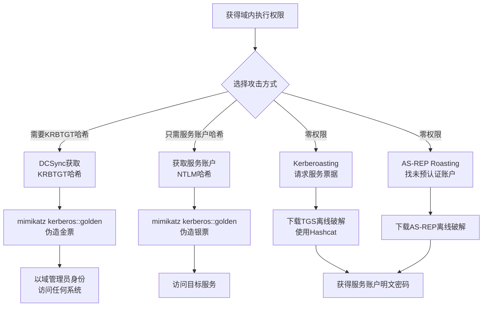

# 窃取或伪造Kerberos票据 (T1558)

## 一句话通俗理解

**攻击者伪造了"域通行证"——不需要知道密码，拿着这张假票就能进入域里的任何系统，就像拿着伪造的工牌混进公司大楼。**

## 30秒速查卡

| 维度 | 你需要知道的 |
|------|-------------|
| 这是什么？ | 伪造域认证的'通行证' |
| 为什么危险？ | Kerberos票据是域环境的认证核心，伪造它就能冒充任何域用户 |
| 谁需要关心？ | 域管理员、Active Directory安全工程师、SOC分析师 |
| 你的第一步防御 | 监控异常的Kerberos票据使用，启用PAC验证 |
| 如果只做一件事 | 监控Windows事件ID 4769，关注异常的票据请求和使用模式 |

## 难度等级

- ⭐⭐⭐ 高级（需要深入技术知识）

## 技术描述

窃取或伪造Kerberos票据（T1558）是MITRE ATT&CK框架中凭证访问战术的一种技术。

**通俗解释：**
Kerberos是Windows域环境中的核心认证协议，它的工作原理有点像主题公园的票务系统：你进门时需要先到"售票处"（密钥分发中心，KDC）用密码换取一张"当日通票"（票据授权票据，TGT）；然后拿着通票去每个项目（服务）排队时，再换成"项目票"（服务票据，TGS）。攻击者发现了这个系统的漏洞：如果知道了"售票处"的签名密钥（KRBTGT哈希），就可以自己伪造通票，想去哪个项目就去哪个项目，而且不需要任何人的密码。

**技术原理：**
1. **Golden Ticket（金票）**：攻击者需要获取域控上的KRBTGT账户的密码哈希（通常通过DCSync攻击）。有了这个"万能钥匙"，攻击者可以伪造任何域用户的TGT，包括域管理员
2. **Silver Ticket（银票）**：攻击者只需要获取某个服务账户的NTLM哈希，就可以伪造访问该服务的TGS。银票不接触域控，更隐蔽
3. **Kerberoasting**：任何域用户都可以向域控请求某个服务账户的服务票据，票据用服务账户的密码哈希加密，攻击者下载后离线破解
4. **AS-REP Roasting**：针对没有启用Kerberos预认证的账户，直接请求认证回复并离线破解

**用途与影响：**
Kerberos票据攻击是域渗透中最核心的技术之一。金票攻击可以让攻击者在域内获得完全访问权限，且KRBTGT密码通常几年不换。银票攻击由于不依赖域控，可以在没有网络连接域控的情况下使用。根据2025年Mandiant报告，超过70%的域渗透事件中涉及Kerberos票据攻击。

## 子技术列表

**该技术共有 4 个子技术：**

| 子技术ID | 中文名称 | 通俗解释 |
|----------|----------|----------|
| T1558.001 | Golden Ticket | 伪造Kerberos通票，可以冒充任何域用户 |
| T1558.002 | Silver Ticket | 伪造服务票，不用联系域控也能访问特定服务 |
| T1558.003 | Kerberoasting | 申请服务票据离线破解服务账户密码 |
| T1558.004 | AS-REP Roasting | 针对不需要预认证的账户直接破解密码 |

<details>
<summary><strong>展开查看各子技术详细说明</strong></summary>

各子技术详细说明请参阅独立文档：

- [T1558.001 - 黄金票据](./T1558/T1558.001-Golden-Ticket-Golden-Ticket.md) — 伪造了一张"万能通行证"，可以在整个域中自由出入。
- [T1558.002 - 白银票据](./T1558/T1558.002-Silver-Ticket-Silver-Ticket.md) — 伪造了一张"项目票"——只能玩一个项目，但好处是不用去售票处验票。
- [T1558.003 - Kerberoasting攻击](./T1558/T1558.003-Kerberoasting-Kerberoasting.md) — 向售票处要一张游戏项目的门票，然后拿着门票回家慢慢试密码。
- [T1558.004 - AS-REP Roasting攻击](./T1558/T1558.004-AS-REP-Roasting-AS-REP-Roasting.md) — 找到没有上锁的房间，直接拿走里面的密码慢慢试。

</details>

## 攻击流程



**步骤详解：**

1. **收集目标信息**
   - 通俗描述：确定要攻击的账户类型（KRBTGT还是服务账户）
   - 技术细节：使用AdFind查询域中所有注册了SPN的服务账户
   - 常用工具：AdFind、BloodHound、PowerView

2. **提取密钥/请求票据**
   - 通俗描述：获取KRBTGT哈希（金票）或请求服务票据（Kerberoasting）
   - 技术细节：DCSync使用`mimikatz lsadump::dcsync /user:krbtgt`
   - 常用工具：mimikatz、Rubeus、Impacket

3. **伪造票据或破解密码**
   - 通俗描述：用获取的密钥伪造票据或用Hashcat破解密码
   - 技术细节：金票`kerberos::golden /user:administrator /domain:domain.com /sid:S-1-5-... /krbtgt:hash /ptt`
   - 常用工具：mimikatz、Hashcat

## 真实案例

### 案例1：APT29 - 金票与KRBTGT滥用（2021-2025）

- **时间**: 2021-2025年
- **目标**: 全球政府机构和IT公司
- **攻击组织**: APT29（Nobelium）
- **手法**: 在SolarWinds供应链攻击后续活动中，APT29在提升至域管理员权限后，通过DCSync提取了KRBTGT账户的NTLM哈希。使用此哈希，他们伪造了Golden Ticket票据，指定域管理员SID和任意组成员身份。金票使他们能够以域管理员身份访问域内任何系统，即使被清理后仍能重新获得访问。2024-2025年间，APT29多次利用同一KRBTGT哈希在被清理的网络中重建访问。微软建议客户重置两次KRBTGT密码才能完全清除金票带来的威胁。
- **影响**: 多个政府机构长期被入侵，金票有效期跨越数年
- **参考链接**: [Mandiant - Golden SAML and Kerberos Attacks](https://www.mandiant.com/resources/blog/golden-saml-and-golden-certificates)

### 案例2：APT28 - Kerberoasting攻击（2017-2024）

- **时间**: 2017-2024年
- **目标**: 欧洲政府机构、军事组织
- **攻击组织**: APT28（Fancy Bear）
- **手法**: APT28使用经过初始入侵的域用户账户发起Kerberoasting攻击。他们使用Impacket的GetUserSPNs.py查询域中所有注册了SPN的服务账户，批量请求对应的TGS票据。将票据下载后使用Hashcat离线破解服务账户密码。破解的服务账户密码（如SQL Server服务账户）比普通域用户密码更简单。获得的密码被用于横向移动和权限提升。2024年，APT28仍在使用此技术针对欧洲目标。
- **影响**: 欧洲政府机构的服务账户密码被破解，攻击者获得高权限访问
- **参考链接**: [MITRE ATT&CK - APT28](https://attack.mitre.org/groups/G0007/)

### 案例3：BlackByte - Kerberoasting+AS-REP Roasting（2022-2024）

- **时间**: 2022-2024年
- **目标**: 全球多个行业
- **攻击组织**: BlackByte勒索软件附属组织
- **手法**: BlackByte附属组织在被入侵的网络中使用Rubeus同时执行Kerberoasting和AS-REP Roasting。他们运行`Rubeus kerberoast /outfile:hashes.txt`请求所有服务票据，同时使用`Rubeus asreproast /format:hashcat /outfile:asrep.txt`定位不需要预认证的账户。大量票据被传输到攻击者的GPU破解服务器进行离线破解。破解的密码用于提升权限和横向移动，最终部署勒索软件。
- **影响**: 全球多家组织遭受勒索攻击，域环境被完全控制
- **参考链接**: [CISA - BlackByte Analysis](https://www.cisa.gov/news-events/cybersecurity-advisories/aa24-277a)

### 案例4：FIN7 - 银票攻击SQL Server（2018）

- **时间**: 2018年
- **目标**: 美国金融机构
- **攻击组织**: FIN7
- **手法**: FIN7在获取域中SQL Server服务账户的NTLM哈希后，使用mimikatz的kerberos::golden功能（配置银票参数）伪造成MSSQLSvc的银票。使用银票，他们不需要通过域控认证即可直接访问SQL Server，绕过SQL Server自身的访问控制列表检查，提取了数百万条支付卡记录。
- **影响**: 数百万条支付卡记录被窃取
- **参考链接**: [MITRE ATT&CK - FIN7](https://attack.mitre.org/groups/G0046/)

## 红队视角

> ⚠️ **免责声明**：以下内容仅用于合法的安全测试、渗透测试和教育目的。未经授权对他人系统进行测试是违法行为。

### 实战技巧

1. **金票优先级**：获得域管理员权限后立即使用DCSync提取KRBTGT哈希。这是整个域中最有价值的凭证。

2. **Kerberoasting优化**：使用Rubeus的`/tgtdeleg`参数申请可委派的TGT，可以在不接触DC的情况下请求服务票据。

3. **银票的隐蔽性**：银票攻击不在域控上产生4769日志事件，仅写在目标服务的日志中。使用银票访问文件共享比使用金票更难被发现。

### 常用工具

| 工具名称 | 用途 | 平台 | 链接 |
|----------|------|------|------|
| mimikatz | 金票/银票伪造、DCSync | Windows | https://github.com/gentilkiwi/mimikatz |
| Rubeus | Kerberoasting、AS-REP Roasting | Windows | https://github.com/GhostPack/Rubeus |
| Impacket | GetUserSPNs、GetNPUsers | 跨平台 | https://github.com/fortra/impacket |
| Hashcat | 票据离线破解 | 跨平台 | https://hashcat.net/hashcat/ |

### 注意事项

- 金票即使注入成功，也要确认系统时间与域控同步（Kerberos对时间敏感）
- Kerberoasting可能触发大量4769事件，容易被SOC发现
- Silver Ticket只对特定服务有效，验证时确保服务名（SPN）完全正确

## 蓝队视角

### 检测要点

1. **DCSync检测**
   - 日志来源：Windows Event ID 4662（目录服务访问）
   - 关注字段：对DS-Replication-Get-Changes的访问
   - 异常特征：非域控制器发起域复制请求

2. **大量TGS请求**
   - 日志来源：Windows Event ID 4769（Kerberos服务票据请求）
   - 关注字段：单个账户在短时间内请求大量不同SPN的TGS
   - 异常特征：数十上百个来自同一源的不同SPN的TGS请求（Kerberoasting标志）

3. **AS-REP异常**
   - 日志来源：Windows Event ID 4771（Kerberos预认证失败）
   - 关注字段：来自同一源的大量AS-REP请求
   - 异常特征：针对多个不存在的用户或未启用预认证账户的尝试

### 监控建议

- 使用Event ID 4662监控DS-Replication-Get-Changes的异常使用（DCSync）
- 配置Event ID 4769告警：单账户1小时内请求超过10个不同SPN的TGS
- 定期扫描域中未启用Kerberos预认证的账户，标记为高风险
- 将KRBTGT账户密码更改纳入紧急变更流程

## 检测建议

### 网络层检测

**检测方法：** 监控Kerberos协议流量的异常模式，检测票据窃取和伪造的网络层特征。

**具体规则/命令示例：**
```
# 检测DCSync攻击的复制流量（非域控制器之间的域复制请求）
zeek -C -r capture.pcap dceprpc.log | grep -i "DRSGetNCChanges\|DS-Replication-Get-Changes"

# 检测批量Kerberos TGS请求流量（Kerberoasting特征）
tshark -r capture.pcap -Y "kerberos.msg_type == 13" -T fields -e ip.src -e kerberos.CNameString | \
  sort | uniq -c | sort -rn | head -20

# 检测异常的Kerberos AS-REP流量（AS-REP Roasting特征）
tshark -r capture.pcap -Y "kerberos.msg_type == 11" -T fields -e ip.src -e kerberos.CNameString | \
  sort | uniq -c | sort -rn | head -20
```

### 主机层检测

**Windows事件ID：**
- 事件ID 4662（目录服务访问）：检测DCSync攻击
- 事件ID 4769：检测批量服务票据请求（Kerberoasting）
- 事件ID 4771：检测AS-REP Roasting尝试

**具体命令示例：**
```powershell
# 检测大量TGS请求（Kerberoasting指标）
Get-WinEvent -FilterHashtable @{LogName='Security';ID=4769} |
    Group-Object {$_.Properties[0].Value} |
    Where-Object Count -gt 10
```


**用人话说：** 这条规则在监控Kerberos票据的异常使用。Kerberos是Windows域环境的认证协议。正常情况下票据会在固定设备上使用，而且每次使用都会关联到TGT请求。如果发现票据使用异常（如从不同设备使用、没有对应TGT请求），那就是攻击者在使用伪造的Kerberos票据。

### 应用层检测

**Sigma规则示例：**
```yaml
title: 检测Kerberoasting攻击
status: experimental
description: 检测单个账户在短时间内请求大量不同SPN的TGS
logsource:
    category: kerberos
    product: windows
detection:
    selection:
        EventID: 4769
    timeframe: 1h
    condition: selection | count() by AccountName > 10
level: high
tags:
    - attack.t1558
```

## 缓解措施

### 优先级1：关键措施

**措施名称：** 保护KRBTGT账户

**具体实施步骤：**
1. 定期（每6-12个月）轮换KRBTGT密码（两次轮换才能清除所有金票）
2. 使用DCSync监控检测对KRBTGT的复制请求
3. 将KRBTGT密码更改脚本化，确保两次轮换间隔不超过24小时

**配置示例：**
```powershell
# 重置KRBTGT密码（需要执行两次）
Reset-ADAccountPassword -Identity krbtgt
```

### 优先级2：重要措施

**措施名称：** 强化服务账户

**具体实施步骤：**
1. 为所有服务账户设置25+字符的强密码
2. 使用组托管服务账户（gMSA）自动管理密码
3. 使用受保护用户组（Protected Users Group）禁止NTLM认证

### 优先级3：建议措施

**措施名称：** 审计未启用预认证账户

**具体实施步骤：**
1. 定期使用PowerShell扫描未启用Kerberos预认证的账户
2. 确认每此类账户的业务必要性，否则启用预认证
3. 对必须使用的此类账户实施额外监控

### MITRE ATT&CK 缓解措施映射

| 缓解措施ID | 缓解措施名称 | 适用性 | 说明 |
|------------|-------------|--------|------|
| M1042 | 限制权限 | 适用 | 限制域管理员权限，减少DCSync攻击面 |
| M1018 | 用户账户管理 | 适用 | 使用gMSA管理服务账户密码 |
| M1027 | 操作系统配置 | 适用 | 启用受保护用户组 |
| M1047 | 审计 | 适用 | 审计DCSync和Kerberoasting |

## 动手实验

> ⚠️ **重要提示**：所有实验必须在隔离的实验室环境中进行，禁止对未授权的真实系统进行测试。

### 实验环境准备

**推荐靶场/实验平台：**

| 平台名称 | 类型 | 难度 | 链接 |
|----------|------|------|------|
| TryHackMe - Active Directory | 虚拟靶场 | 高级 | https://tryhackme.com/ |
| HackTheBox - Forest | 虚拟靶场 | 高级 | https://www.hackthebox.com/ |

### 实验1：Kerberoasting攻击（高级）

**实验目标：** 在隔离的域环境中练习Kerberoasting攻击。

**实验步骤：**
1. 搭建域环境（1台DC + 1台成员机，配置几个服务账户）
2. 在成员机上使用普通域账户运行：`Rubeus kerberoast /outfile:hashes.txt`
3. 将hashes.txt传输到Kali VM
4. 使用Hashcat破解：`hashcat -m 13100 hashes.txt rockyou.txt`
5. 观察破解结果，获取服务账户明文密码

**预期结果：** 成功获取服务票据并破解出服务账户密码。

**学习要点：** 理解Kerberoasting的攻击原理和防御策略。

### 实验2：Golden Ticket伪造（高级）

**实验目标：** 在隔离域环境中练习金票伪造。

**实验步骤：**
1. 在DC上使用域管理员身份运行mimikatz
2. 执行 `lsadump::dcsync /user:krbtgt` 获取KRBTGT哈希
3. 记录域SID：`kerberos::golden /user:administrator /domain:domain.com /sid:S-1-5-... /krbtgt:hash /ptt`
4. 验证是否成功访问域控：`dir \\DC\c$`

**预期结果：** 使用金票成功访问域控上的文件共享，无需密码。

**学习要点：** 理解金票的作用和为什么需要保护KRBTGT哈希。

## 术语解释

| 术语 | 英文原名 | 通俗解释 |
|------|----------|----------|
| Kerberos | Kerberos | 一种网络认证协议，使用"票据"而不是密码进行认证，Windows域环境的核心认证方式 |
| KDC | Key Distribution Center | 密钥分发中心，Kerberos认证的中心服务器（域控制器），负责签发所有票据 |
| TGT | Ticket-Granting Ticket | 票据授权票据，相当于"通票"——先用密码换通票，再用通票换服务票 |
| TGS | Ticket-Granting Service | 票据授权服务票据，相当于"项目票"——用通票去申请访问特定服务 |
| KRBTGT | KRBTGT Account | 域中特殊的账户，负责签发所有Kerberos票据。如果密码哈希泄露，整个域就沦陷了 |
| SPN | Service Principal Name | 服务主体名称，域中每个服务的唯一标识。就像是服务的"身份证号" |
| DCSync | Domain Controller Synchronization | 攻击者模拟域控制器从真实DC复制数据，窃取密码哈希。不需要登录DC就能拿到所有密码 |
| 预认证 | Pre-authentication | Kerberos认证的第一步，客户端向DC证明自己知道密码。跳过这一步意味着任何人都可以请求加密的认证数据 |
| SID | Security Identifier | 安全标识符，Windows系统中每个用户和组的唯一数字身份编号 |

## 参考资料

### 官方文档

- [MITRE ATT&CK - T1558 Steal or Forge Kerberos Tickets](https://attack.mitre.org/techniques/T1558/)
- [MITRE ATT&CK - T1558.001 Golden Ticket](https://attack.mitre.org/techniques/T1558/001/)
- [MITRE ATT&CK - T1558.003 Kerberoasting](https://attack.mitre.org/techniques/T1558/003/)

### 安全报告

- [Mandiant - Golden SAML and Kerberos Attacks](https://www.mandiant.com/resources/blog/golden-saml-and-golden-certificates)
- [CISA - BlackByte Analysis](https://www.cisa.gov/news-events/cybersecurity-advisories/aa24-277a)

### 工具与资源

- [mimikatz - 金票/银票工具](https://github.com/gentilkiwi/mimikatz)
- [Rubeus - Kerberos票据操作](https://github.com/GhostPack/Rubeus)
- [Impacket - 网络协议工具集](https://github.com/fortra/impacket)

### 学习资料

- [Harmj0y - Kerberoasting深入分析](https://www.harmj0y.net/blog/redteaming/kerberoasting-without-mimikatz/)
- [Microsoft - Kerberos安全最佳实践](https://learn.microsoft.com/en-us/windows/security/identity-protection/kerberos/)
