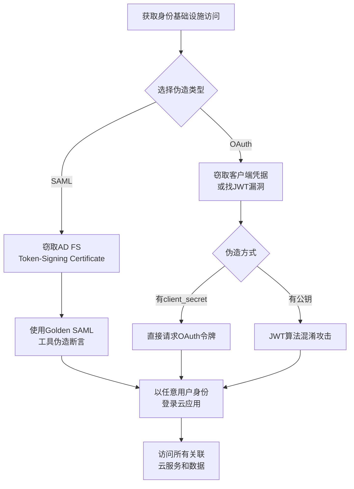

# 伪造Web凭证 (T1606)

## 一句话通俗理解

**攻击者伪造了网站的登录凭据——不用密码也能以任何人的身份登录云应用，就像用假身份证冒充别人去银行办理业务。**

## 30秒速查卡

| 维度 | 你需要知道的 |
|------|-------------|
| 这是什么？ | 伪造SAML/OAuth令牌冒充任何用户 |
| 为什么危险？ | Web凭证是云应用的认证核心，伪造它就能以任何用户身份访问企业应用 |
| 谁需要关心？ | 云安全工程师、身份安全工程师、SOC分析师 |
| 你的第一步防御 | 监控Web凭证的签发和使用，实施证书轮换 |
| 如果只做一件事 | 监控身份提供商的签名证书是否被导出或篡改 |

## 难度等级

- ⭐⭐⭐ 高级（需要深入技术知识）

## 技术描述

伪造Web凭证（T1606）是MITRE ATT&CK框架中凭证访问战术的一种技术。

**通俗解释：**
现代的Web应用和云服务不再使用传统的密码登录，而是使用一种"电子令牌"（Token）来证明身份。最常见的两种是SAML断言（用于企业单点登录）和OAuth令牌（用于API和云服务访问）。这些令牌由身份提供商（IdP，比如Azure AD、Okta）用私钥签名，持有令牌的人可以证明自己是某个用户。攻击者的目标就是获得或者伪造这些令牌。如果拿到了IdP的签名密钥（私钥），攻击者就可以为任何人（包括CEO、系统管理员）签发合法的令牌，完全绕过密码和MFA。

**技术原理：**
1. **SAML令牌伪造**：SAML断言使用XML签名验证，由IdP用私钥签名。攻击者通过窃取AD FS的令牌签名证书，使用`ADFSDump`或`mimikatz`提取私钥后，使用`SAML2Toolkit`或`ForgedSAML`工具生成任意用户的SAML断言
2. **OAuth令牌伪造**：OAuth 2.0访问令牌通常是JWT（JSON Web Token）格式，由授权服务器签名。攻击者可以利用JWT算法混淆漏洞（将RS256改为HS256使用公钥签名）、窃取客户端凭据（client_secret）、或通过配置不当的令牌交换流程获取高权限令牌
3. **令牌重放**：截获合法的令牌后在其他上下文（不同IP、不同时间）中重复使用

**用途与影响：**
伪造Web凭证是云攻击中最危险的技术之一。攻击者不需要知道用户密码，不需要通过MFA，也不需要与用户有任何交互，就能以任意用户身份访问所有云资源。根据2025年微软数字防御报告，SAML令牌伪造（Golden SAML）被列为最高风险的云攻击技术之一。

## 子技术列表

**该技术共有 2 个子技术：**

| 子技术ID | 中文名称 | 通俗解释 |
|----------|----------|----------|
| T1606.001 | SAML Tokens | 伪造SAML单点登录断言，冒充任何用户访问企业应用 |
| T1606.002 | OAuth Tokens | 伪造OAuth访问令牌，未经授权访问云API和资源 |

<details>
<summary><strong>展开查看各子技术详细说明</strong></summary>

各子技术详细说明请参阅独立文档：

- [T1606.001 - SAML令牌](./T1606/T1606.001-SAML-Tokens-SAML-Tokens.md) — 伪造了一张"企业门禁卡"，可以进公司的任何系统——ERP、企业邮箱、云服务。
- [T1606.002 - OAuth令牌](./T1606/T1606.002-OAuth-Tokens-OAuth-Tokens.md) — 伪造了一把"API钥匙"，可以调用任何云服务的接口。

</details>

## 攻击流程



**步骤详解：**

1. **获取签名密钥**
   - 通俗描述：攻击者需要先拿到身份提供商的签名私钥
   - 技术细节：入侵AD FS服务器，使用ADFSDump或mimikatz的`crypto::certificates`导出Token-Signing Certificate私钥
   - 常用工具：ADFSDump、mimikatz

2. **伪造令牌/断言**
   - 通俗描述：使用窃取的私钥为任意用户签发合法的认证令牌
   - 技术细节：使用SAML2Toolkit或ForgedSAML生成SAML断言，指定任意用户名、角色和属性
   - 常用工具：ForgedSAML、SAML2Toolkit

3. **利用令牌访问资源**
   - 通俗描述：使用伪造的令牌登录云应用，完全绕过密码验证
   - 技术细节：将SAML断言通过浏览器POST到服务提供商ACS URL，或使用OAuth令牌在API调用中设置Authorization头
   - 常用工具：Burp Suite、cURL、自定义脚本

## 真实案例

### 案例1：APT29 - Golden SAML攻击（2021-2025）

- **时间**: 2021-2025年
- **目标**: 全球政府机构和IT公司
- **攻击组织**: APT29（Nobelium）
- **手法**: 在SolarWinds供应链攻击的后续活动中，APT29实施了迄今为止最具影响力的SAML令牌伪造攻击。他们入侵了受害组织的AD FS服务器，使用ADFSDump工具提取了Token-Signing Certificate的私钥。利用窃取的证书，APT29创建了针对任意域用户的SAML断言，包括全局管理员账户。这些伪造的SAML断言使他们能够以合法用户身份登录Microsoft 365、Salesforce、Teams等云应用，完全绕过了MFA保护。APT29特别使用此技术在被清理的网络中重新获得访问——即使用户密码被重置、MFA重新配置，只要AD FS证书未轮换，Golden SAML令牌仍然有效。2024-2025年间，APT29在多个新的攻击活动中持续使用Golden SAML技术。
- **影响**: 多个美国政府机构和全球IT公司长期被入侵，伪造令牌跨越数年有效
- **参考链接**: [Mandiant - Golden SAML](https://www.mandiant.com/resources/blog/golden-saml-and-golden-certificates)

### 案例2：APT29 - OAuth On-Behalf-Of令牌滥用（2021-2024）

- **时间**: 2021-2024年
- **目标**: Microsoft 365客户
- **攻击组织**: APT29（Nobelium）
- **手法**: 在Golden SAML攻击之后，APT29进一步发展了OAuth令牌伪造技术。他们在受感染的服务器上注册恶意应用到Azure AD，使用窃取的证书向Azure AD请求OAuth访问令牌。通过OAuth 2.0的On-Behalf-Of（OBO）流程，恶意应用使用其权限模拟用户并获取访问其他资源的令牌。APT29通过OBO获得了跨Exchange Online（邮件）、SharePoint（文件）和Azure AD（身份）的多服务访问权限。由于访问来自合法的OAuth应用，所有操作看起来都是正常的API调用，不触发用户级别的告警。2024年，微软安全团队发现APT29使用此技术从被入侵的合作伙伴租户向目标租户发起跨租户OAuth攻击。
- **影响**: 多个组织的邮件和文件数据通过OAuth令牌被窃取
- **参考链接**: [Microsoft - Nobelium OAuth Abuse](https://www.microsoft.com/en-us/security/blog/2021/05/28/breaking-down-nobeliums-latest-targeted-activity/)

### 案例3：Scattered Spider - OAuth应用注册与令牌伪造（2022-2024）

- **时间**: 2022-2024年
- **目标**: 科技、金融、游戏公司
- **攻击组织**: Scattered Spider（UNC3944）
- **手法**: Scattered Spider在获得受害者Azure AD租户的管理权限后，注册恶意的OAuth应用并配置高权限的API作用域。他们通过管理员审批（Admin Consent）授予这些应用广泛权限（Microsoft Graph、Exchange Online、SharePoint、Teams的全域访问）。然后使用客户端凭据流程（Client Credentials Grant）获取合法的OAuth访问令牌，以应用身份访问所有可访问的资源。在2024年的攻击中，他们还利用OAuth设备授权码流程（Device Code Flow）进行钓鱼攻击，诱骗用户输入设备码，从而获取OAuth刷新令牌。CISA在2024年联合预警中特别指出OAuth攻击是身份安全的最大威胁之一。
- **影响**: 多家知名企业遭入侵，OAuth令牌被用于长期数据窃取
- **参考链接**: [CISA AA23-320A - Scattered Spider](https://www.cisa.gov/news-events/cybersecurity-advisories/aa23-320a)

### 案例4：OAuth Device Code钓鱼攻击（2024-2025）

- **时间**: 2024-2025年
- **目标**: 全球云服务用户
- **攻击组织**: 多个APT和信息窃取组织
- **手法**: 攻击者利用OAuth 2.0设备授权码流程（Device Authorization Grant）进行大规模钓鱼攻击。攻击者发起设备码认证请求，获取用户码（user code）和设备码（device code）。然后诱导受害者访问`microsoft.com/devicelogin`等合法URL并输入用户码。受害者输入用户码并完成认证后，攻击者持有的设备码被兑换为OAuth刷新令牌。这种攻击的精妙之处在于：认证过程在合法的Microsoft登录页面上完成（没有伪造的钓鱼页面），受害者实际上是在"帮助"攻击者登录。2024-2025年间，多个APT组织和信息窃取恶意软件使用此技术获取OAuth刷新令牌，用于长期访问受害者的邮箱和云文件。Microsoft 2025年报告显示，设备码钓鱼攻击增长了超过500%。
- **影响**: 数十万云用户账户的OAuth刷新令牌被窃取，攻击者获得长期访问权限
- **参考链接**: [Microsoft - Device Code Phishing](https://www.microsoft.com/en-us/security/blog/2024/device-code-phishing/)

## 红队视角

> ⚠️ **免责声明**：以下内容仅用于合法的安全测试、渗透测试和教育目的。未经授权对他人系统进行测试是违法行为。

### 实战技巧

1. **Golden SAML全流程**：
   使用ADFSDump导出AD FS配置，提取Token-Signing Certificate私钥。然后使用ForgedSAML工具创建SAML断言，指定任意UPN（用户主体名称）和组成员身份。最后使用Burp Suite的SAML Raider插件将伪造断言注入认证流程。

2. **JWT算法混淆攻击**：
   如果目标服务使用RS256签名的JWT，尝试将JWT头部的`alg`字段改为`HS256`，使用从目标获取的公钥作为HMAC密钥重新签名。某些JWT库在验证时不检查算法是否与服务端预期一致。使用`jwt_tool`可以自动化此攻击。

3. **OAuth设备码钓鱼**：
   使用`Microsoft Authentication Libraries`发起设备码认证请求，获取用户码后发送钓鱼邮件诱导受害者访问`https://microsoft.com/devicelogin`输入该码。获取的OAuth刷新令牌有效期长达90天。

### 常用工具

| 工具名称 | 用途 | 平台 | 链接 |
|----------|------|------|------|
| ADFSDump | AD FS配置和证书提取 | Windows | https://github.com/mandiant/ADFSDump |
| ForgedSAML | SAML断言伪造工具 | 跨平台 | https://github.com/PreOS-Offsec/ForgedSAML |
| jwt_tool | JWT攻击测试工具 | 跨平台 | https://github.com/ticarpi/jwt_tool |
| SAML Raider | Burp Suite的SAML测试插件 | 跨平台 | Burp Suite Extender |
| TokenTactics | OAuth令牌操作工具集 | PowerShell | https://github.com/rvrsh3ll/TokenTactics |

### 注意事项

- Golden SAML攻击需要域管理员权限访问AD FS服务器
- 伪造的SAML断言必须在断言有效期（NotOnOrAfter）内使用
- JWT算法混淆攻击依赖服务端JWT库的实现缺陷

## 蓝队视角

### 检测要点

1. **AD FS证书导出**
   - 日志来源：Windows Event ID 5061（加密操作）、Event ID 4692（私钥访问）
   - 关注字段：对Token-Signing Certificate私钥的异常访问
   - 异常特征：非计划内的证书导出操作

2. **异常SAML/OAuth令牌使用**
   - 日志来源：Azure AD Sign-in Logs、Okta System Log
   - 关注字段：来自异常位置的登录、不匹配的令牌版本、非标准的声明（Claim）
   - 异常特征：无对应的IdP认证记录的SAML断言使用

3. **OAuth应用异常注册**
   - 日志来源：Azure AD Audit Logs（应用注册事件）
   - 关注字段：新注册的OAuth应用、授予的API权限
   - 异常特征：来自非特权账户的高权限应用注册

### 监控建议

- 部署Azure ATP监控AD FS服务器的异常行为
- 配置Azure AD Identity Protection检测异常令牌使用
- 定期审查所有OAuth应用注册和API权限授予
- 使用Microsoft Sentinel创建SAML令牌异常检测规则
- 监控证书导出事件（Event ID 4690、4692、5061）

## 检测建议

### 网络层检测

**检测方法：** 监控SAML断言和OAuth令牌使用的网络流量异常，检测伪造Web凭证的流量特征。

**具体规则/命令示例：**
```
# 检测SAML断言提交流量中的异常来源（非预期IdP的SAML断言）
zeek -C -r capture.pcap http.log | grep -i "SAMLResponse" | \
  awk '{print $3, $9, $10}' | sort -k1 | head -20

# 检测OAuth令牌在API调用中的异常使用模式
zeek -C -r capture.pcap http.log | grep -iE "Bearer|Authorization: Bearer" | \
  awk '{print $3, $9, $10}' | sort | uniq -c | sort -rn | head -20
```

### 主机层检测

**检测方法：** 监控AD FS服务器上令牌签名证书的访问。

**Windows事件ID：**
- 事件ID 4690（导出私钥）：每次私钥导出时记录
- 事件ID 4882（证书服务权限变更）：检测证书访问权限的修改
- 事件ID 5061（加密操作）：检测私钥的使用

**具体命令示例：**
```powershell
# 监控AD FS证书导出
Get-WinEvent -FilterHashtable @{LogName='Security';ID=4690} |
    Where-Object {$_.Properties[2].Value -like '*AD FS*'}
```


**用人话说：** 这条规则在监控Web凭证（SAML/OAuth）的签发和使用是否异常。SAML和OAuth是企业单点登录的核心协议。正常情况下凭证会在固定设备和位置使用。如果发现有异常的凭证被签发，或者凭证从不同地理位置使用，那就是攻击者在伪造Web凭证访问企业应用。

### 应用层检测

**检测规则示例：**
```yaml
title: 检测OAuth应用的高权限注册
status: experimental
description: 检测新注册的OAuth应用请求高权限API作用域
logsource:
    category: audit
    product: azure
detection:
    selection:
        OperationName: 'Add application'
        ApplicationPermissions|contains:
            - 'Directory.ReadWrite.All'
            - 'Mail.Read'
            - 'Sites.ReadWrite.All'
    condition: selection
level: high
tags:
    - attack.t1606
```

### Sigma规则示例

**Sigma规则示例：**
```yaml
title: AD FS Token-Signing Certificate Access
status: experimental
description: 检测对AD FS令牌签名证书的异常访问操作，可能表明Golden SAML攻击准备
logsource:
    category: audit
    product: windows
detection:
    selection:
        EventID:
            - 4690
            - 4882
        ObjectName|contains: 'AD FS'
    condition: selection
level: critical
tags:
    - attack.t1606
```

## 缓解措施

### 优先级1：关键措施

**措施名称：** 保护AD FS令牌签名证书

**具体实施步骤：**
1. 将令牌签名证书私钥存储在硬件安全模块（HSM）中
2. 使用短期证书并设置自动轮换（建议每6个月轮换一次）
3. 对AD FS服务器实施特权访问工作站（PAW）级别的保护

**配置示例：**
```powershell
# 使用PowerShell轮换AD FS证书
Update-AdfsCertificate -CertificateType Token-Signing -Urgent $true
```

### 优先级2：重要措施

**措施名称：** OAuth应用注册审批流程

**具体实施步骤：**
1. 在Azure AD中配置用户同意设置，禁止用户自行批准高权限应用
2. 实施管理员审批工作流，所有高权限API作用域的授予需要审批
3. 定期审查和清理未使用的OAuth应用和权限

### 优先级3：建议措施

**措施名称：** JWT验证加固

**具体实施步骤：**
1. 在JWT库中强制白名单签名算法，禁止接受`none`算法
2. 验证JWT的`alg`头与预期算法一致
3. 使用JWT库的最新版本，避免已知的算法混淆漏洞

### MITRE ATT&CK 缓解措施映射

| 缓解措施ID | 缓解措施名称 | 适用性 | 说明 |
|------------|-------------|--------|------|
| M1041 | 加密敏感信息 | 适用 | 使用HSM保护签名私钥 |
| M1018 | 用户账户管理 | 适用 | 限制OAuth应用注册和权限授予 |
| M1047 | 审计 | 适用 | 审计证书导出、应用注册、令牌使用 |
| M1026 | 应用程序隔离 | 部分适用 | 隔离AD FS服务器 |

## 动手实验

> ⚠️ **重要提示**：所有实验必须在隔离的实验室环境中进行，禁止对未授权的真实系统进行测试。

### 实验环境准备

**推荐靶场/实验平台：**

| 平台名称 | 类型 | 难度 | 链接 |
|----------|------|------|------|
| TryHackMe - Cloud Security | 虚拟靶场 | 高级 | https://tryhackme.com/ |
| PentesterLab - JWT | CTF | 中级 | https://pentesterlab.com/ |

### 实验1：JWT算法混淆攻击（中级）

**实验目标：** 练习JWT算法混淆攻击的基本步骤。

**实验步骤：**
1. 搭建一个使用RS256 JWT的测试Web应用
2. 获取应用的公钥（通常在/jwks.json端点）
3. 使用jwt_tool修改JWT头部：`python jwt_tool.py -X a -k public.pem -I -pc "role" -pv "admin" token.txt`
4. 使用修改后的JWT访问受保护的API端点

**预期结果：** 服务端接受使用公钥签名的HS256 JWT，成功获得管理员权限。

**学习要点：** 理解JWT算法混淆漏洞的原理和为什么需要强制算法白名单。

### 实验2：SAML断言伪造分析（高级）

**实验目标：** 在隔离环境中分析SAML认证流程。

**实验步骤：**
1. 使用Burp Suite拦截基于SAML的单点登录流程
2. 使用SAML Raider插件解码SAML断言
3. 分析断言中的Subject、AttributeStatement和Signature元素
4. 尝试修改断言中的用户属性并观察服务器是否验证签名

**预期结果：** 理解SAML断言的结构和签名验证的重要性。

**学习要点：** 掌握SAML认证流程和签名验证的关键点。

## 术语解释

| 术语 | 英文原名 | 通俗解释 |
|------|----------|----------|
| SAML | Security Assertion Markup Language | 安全断言标记语言，一种基于XML的认证协议，用于企业单点登录。相当于"电子介绍信"——IdP给你写一封介绍信，你拿着去访问各个应用 |
| OAuth | Open Authorization | 开放授权协议，允许第三方应用在不获取用户密码的情况下访问用户资源。相当于"代客泊车票据"——你不把车钥匙给别人，只给他一张临时停车票 |
| JWT | JSON Web Token | JSON网络令牌，一种紧凑的令牌格式，包含用户信息和签名。就像一张"电子身份证卡" |
| IdP | Identity Provider | 身份提供商，负责验证用户身份并签发令牌。如Azure AD、Okta、AD FS |
| SP | Service Provider | 服务提供商，提供实际服务的应用（如Salesforce、Workday），信任IdP签发的令牌 |
| 断言 | Assertion | SAML中的认证声明，包含用户的身份信息和认证上下文。相当于"身份声明书" |
| 令牌签名证书 | Token-Signing Certificate | IdP用于签署SAML断言的数字证书。如果被窃取，攻击者可以伪造任意用户的登录令牌 |
| 客户端凭据 | Client Credentials | OAuth应用中用于获取令牌的client_id和client_secret，相当于"应用的用户名和密码" |
| 授权码 | Authorization Code | OAuth授权码流程中的临时代码，用于交换访问令牌。相当于"兑换券" |
| 刷新令牌 | Refresh Token | OAuth中用于获取新的访问令牌的长期令牌。相当于"会员卡"——过期了可以续期 |

## 参考资料

### 官方文档

- [MITRE ATT&CK - T1606 Forge Web Credentials](https://attack.mitre.org/techniques/T1606/)
- [MITRE ATT&CK - T1606.001 SAML Tokens](https://attack.mitre.org/techniques/T1606/001/)
- [MITRE ATT&CK - T1606.002 OAuth Tokens](https://attack.mitre.org/techniques/T1606/002/)

### 安全报告

- [Mandiant - Golden SAML and Golden Certificates](https://www.mandiant.com/resources/blog/golden-saml-and-golden-certificates)
- [Microsoft - Nobelium OAuth Abuse](https://www.microsoft.com/en-us/security/blog/2021/05/28/breaking-down-nobeliums-latest-targeted-activity/)
- [CISA AA23-320A - Scattered Spider](https://www.cisa.gov/news-events/cybersecurity-advisories/aa23-320a)

### 工具与资源

- [ADFSDump - AD FS配置提取](https://github.com/mandiant/ADFSDump)
- [jwt_tool - JWT攻击测试](https://github.com/ticarpi/jwt_tool)
- [TokenTactics - OAuth令牌操作](https://github.com/rvrsh3ll/TokenTactics)

### 学习资料

- [Microsoft - 保护AD FS](https://learn.microsoft.com/en-us/windows-server/identity/ad-fs/deployment/best-practices-securing-ad-fs)
- [OAuth 2.0授权框架](https://oauth.net/2/)
- [SAML 2.0技术概述](https://docs.oasis-open.org/security/saml/Post2.0/sstc-saml-tech-overview-2.0.html)
