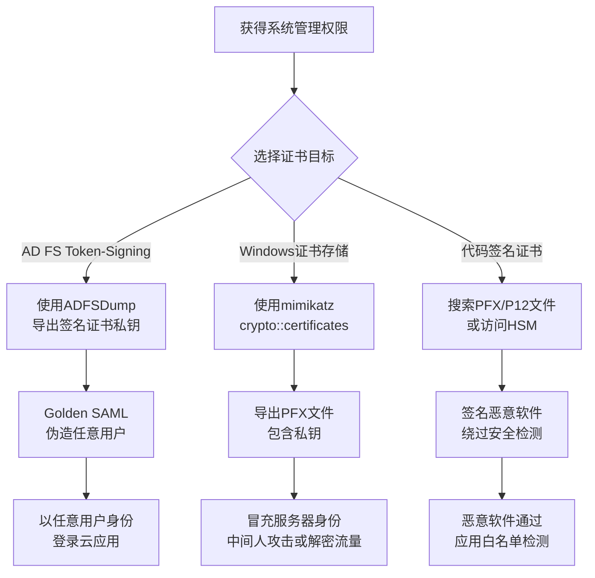

# 窃取或伪造认证证书 (T1649)

## 一句话通俗理解

**攻击者偷走了数字证书的私钥——就像偷了公司的公章，可以伪造任何官方文件冒充公司。**

## 30秒速查卡

| 维度 | 你需要知道的 |
|------|-------------|
| 这是什么？ | 偷走数字证书的私钥 |
| 为什么危险？ | 私钥就是数字证书的'灵魂'，拿到它就能冒充证书持有者身份 |
| 谁需要关心？ | PKI管理员、安全工程师 |
| 你的第一步防御 | 使用硬件安全模块（HSM）存储私钥，监控证书存储的异常访问 |
| 如果只做一件事 | 监控Windows证书存储和密钥文件的异常导出和访问 |

## 难度等级

- ⭐⭐⭐ 高级（需要深入技术知识）

## 技术描述

窃取或伪造认证证书（T1649）是MITRE ATT&CK框架中凭证访问战术的一种技术。

**通俗解释：**
数字证书（Digital Certificate）是互联网世界的"身份证"——它包含一个公钥和一个私钥。公钥像你的姓名和照片，可以公开；私钥像你的签名，只有你才有。证书的作用很重要：网站用它证明自己的身份（HTTPS小锁图标）、程序员用它签名软件（证明软件是作者写的）、企业用它做单点登录（SAML令牌签名）。如果攻击者偷到了证书的私钥，就可以冒充网站、签署恶意软件、或者伪造企业登录令牌。而且私钥一旦被偷，除非吊销证书，否则攻击者可以一直使用。

**技术原理：**
1. **Windows证书存储导出**：Windows系统将证书和私钥存储在本地证书存储区。攻击者使用mimikatz的`crypto::certificates`模块或certutil.exe导出包含私钥的PFX/P12文件
2. **AD FS令牌签名证书**：AD FS服务器使用Token-Signing Certificate签署SAML断言。攻击者入侵AD FS后，使用ADFSDump工具提取此证书的私钥，用于Golden SAML攻击
3. **代码签名证书窃取**：攻击者从软件开发公司窃取代码签名证书，用于签名恶意软件，使其看起来像合法的软件更新
4. **证书私钥DPAPI解密**：Windows使用DPAPI加密证书私钥，但登录用户上下文中可以解密。攻击者使用mimikatz的`dpapi::capi`模块解密私钥
5. **CA服务器入侵**：直接入侵组织的证书颁发机构（CA）服务器，签发未经授权的证书

**用途与影响：**
证书攻击是最高级的凭证攻击之一。一旦私钥被窃取，攻击者可以在不持有用户密码的情况下完全冒充该证书所代表的身份。证书通常有效期很长（1-5年），即使组织发现了入侵，也需要昂贵的证书吊销和重新签发过程。2025年Mandiant报告显示，涉及证书窃取的事件比2020年增加了超过300%。

## 攻击流程



**步骤详解：**

1. **定位目标证书**
   - 通俗描述：确定哪些数字证书有价值、它们存储在哪里
   - 技术细节：AD FS Token-Signing Certificate通常存储在AD FS服务器的本地计算机证书存储中，代码签名证书可能在HSM或加密文件中
   - 常用工具：certlm.msc（Windows证书管理）、ADFSDump

2. **导出证书私钥**
   - 通俗描述：将证书和私钥从系统中提取出来
   - 技术细节：mimikatz运行`crypto::certificates /systemstore:local_machine /export`导出所有包含私钥的证书
   - 常用工具：mimikatz、certutil.exe

3. **利用窃取的证书**
   - 通俗描述：用偷到的私钥伪造身份或签名恶意内容
   - 技术细节：使用窃取的AD FS证书生成Golden SAML令牌，或使用代码签名证书对恶意软件进行Authenticode签名
   - 常用工具：ForgedSAML、SignTool.exe

## 真实案例

### 案例1：APT29 - Golden SAML证书窃取（2021-2025）

- **时间**: 2021-2025年
- **目标**: 全球政府机构和IT公司
- **攻击组织**: APT29（Nobelium）
- **手法**: APT29在入侵受害组织的AD FS服务器后，使用ADFSDump工具提取了Token-Signing Certificate的私钥。ADFSDump是一个专门设计用于从AD FS配置数据库中提取证书和配置的工具。APT29使用窃取的证书创建了任意域用户的SAML令牌（Golden SAML），完全绕过了MFA保护。即使组织重新设置了所有用户密码、重新配置了MFA，只要AD FS证书未轮换，Golden SAML令牌仍然有效。2024-2025年间，APT29在多个新的攻击活动中持续使用此技术。
- **影响**: 多个政府机构长期被入侵，伪造的SAML令牌有效期限与证书有效期一致（通常1-5年）
- **参考链接**: [Mandiant - Golden SAML and Golden Certificates](https://www.mandiant.com/resources/blog/golden-saml-and-golden-certificates)

### 案例2：APT28 - 代码签名证书窃取（2015-2024）

- **时间**: 2015-2024年
- **目标**: 全球政府、军事组织
- **攻击组织**: APT28（Fancy Bear）
- **手法**: APT28（Sofacy Group）持续从全球多家软件公司窃取代码签名证书。2015年他们从一家保加利亚软件公司窃取了证书，用于签名X-Agent恶意软件。2022年又从另一家东欧公司窃取了新证书。代码签名证书使他们的恶意软件在Windows系统上运行时不会触发SmartScreen警告，并通过应用白名单策略的检查。APT28使用窃取的证书签名了Zebrocy和X-Agent macOS变种等多个恶意软件家族。
- **影响**: 窃取的代码签名证书被用于签名恶意软件，持续超过10年未完全清除
- **参考链接**: [MITRE ATT&CK - APT28](https://attack.mitre.org/groups/G0007/)

### 案例3：FIN7 - 恶意软件签名证书（2016-2023）

- **时间**: 2016-2023年
- **目标**: 全球零售和餐饮行业
- **攻击组织**: FIN7
- **手法**: FIN7使用从合法软件公司窃取的代码签名证书签名其Carbanak和Griffon恶意软件组件。通过使用受信任的证书签名，DLL和可执行文件加载时不会触发UAC警告，绕过防病毒和AppLocker白名单。FIN7在多个活跃期反复更换被窃取的证书以保持绕过能力。2023年，FIN7的证书窃取技术仍然有效，他们使用新窃取的证书签名了针对POS系统的恶意软件。
- **影响**: 全球数千家零售和餐饮企业遭入侵，支付卡数据被窃取
- **参考链接**: [MITRE ATT&CK - FIN7](https://attack.mitre.org/groups/G0046/)

### 案例4：Stuxnet - 伪造设备证书（2010）

- **时间**: 2010年
- **目标**: 伊朗核设施
- **攻击组织**: 国家背景攻击者
- **手法**: Stuxnet蠕虫使用从两家合法台湾公司（Realtek和JMicron）窃取的代码签名证书签名其驱动程序组件。这些数字签名使Stuxnet的内核驱动能够成功加载到Windows系统上，在目标SCADA网络中传播并操作离心机控制器。这是已知最早利用窃取证书绕过操作系统安全机制的著名案例之一。Stuxnet使用的两个证书分别签名了JMB363和Realtek驱动，在证书被发现和吊销之前，这些签名的恶意驱动已被广泛传播。
- **影响**: 伊朗核设施离心机被物理破坏，标志着国家级网络战的里程碑
- **参考链接**: [MITRE ATT&CK - Stuxnet Certificate](https://attack.mitre.org/techniques/T1587/001/)

## 红队视角

> ⚠️ **免责声明**：以下内容仅用于合法的安全测试、渗透测试和教育目的。未经授权对他人系统进行测试是违法行为。

### 实战技巧

1. **mimikatz证书导出全流程**：
   在目标系统上运行`mimikatz crypto::certificates /systemstore:local_machine /export`。这将把所有包含私钥的证书导出为`.pfx`文件。注意：只有标记为可导出的证书才能用此方法导出，非可导出的证书需要其他技术。

2. **AD FS证书提取**：
   使用ADFSDump工具从AD FS配置数据库中提取Token-Signing和Token-Decrypting证书。`ADFSDump.exe`不需要AD FS管理权限，只需要系统管理员权限。提取的证书直接写入`.pfx`文件。

3. **非可导出证书的提取**：
   如果证书标记为"不可导出"，使用mimikatz的`crypto::certificates /export /usehwskey`从LSASS内存中提取私钥，或使用`dpapi::capi`模块从DPAPI保护的密钥存储中解密。

### 常用工具

| 工具名称 | 用途 | 平台 | 链接 |
|----------|------|------|------|
| mimikatz | 证书导出、DPAPI解密 | Windows | https://github.com/gentilkiwi/mimikatz |
| ADFSDump | AD FS配置和证书提取 | Windows | https://github.com/mandiant/ADFSDump |
| SharpDPAPI | DPAPI数据解密 | Windows | https://github.com/GhostPack/SharpDPAPI |
| CertUtil | 证书管理（内置） | Windows | 系统内置 |

### 注意事项

- 被标记为"不可导出"的证书不能通过正常方式导出私钥，但mimikatz可以从内存中提取
- AD FS证书提取需要AD FS服务器上的管理员权限
- 代码签名证书使用HSM存储时无法软件导出，需要使用HSM的API进行签名操作

## 蓝队视角

### 检测要点

1. **证书私钥导出**
   - 日志来源：Windows Event ID 4690（导出私钥）
   - 关注字段：私钥导出的目标用户和进程
   - 异常特征：非计划内的证书导出操作，特别是AD FS服务器上的证书导出

2. **mimikatz模块检测**
   - 日志来源：Sysmon Event ID 1（进程创建）、Event ID 7（模块加载）
   - 关注字段：mimikatz的执行、`crypto::certificates`模块的使用
   - 异常特征：非授权的mimikatz执行，特别是crypto模块

3. **CA服务器异常**
   - 日志来源：Windows Event ID 4882（证书服务权限变更）、4887（证书颁发）
   - 关注字段：非授权的证书签发请求
   - 异常特征：从非正常来源的证书申请、异常时间的证书签发

### 监控建议

- 在AD FS和CA服务器上启用详细的审计策略（证书导出、私钥访问）
- 部署Sysmon监控mimikatz和ADFSDump的执行
- 使用Certificate Transparency监控组织域名的异常证书签发
- 定期审计证书存储中的证书，确认每张证书的来源和用途
- 实施HSM监控，审计所有密钥导出和签名操作

## 检测建议

### 网络层检测

**检测方法：** 监控证书相关的网络异常流量，检测证书私钥外传和证书滥用的网络层特征。

**具体规则/命令示例：**
```
# 检测HTTPS流量中异常的证书指纹变化（可能指示中间人攻击或证书替换）
zeek -C -r capture.pcap ssl.log | awk '{print $3, $7, $8}' | sort -k1 | \
  uniq -c | sort -rn | head -20

# 检测大规模证书导出文件（PFX/P12）的网络传输
zeek -C -r capture.pcap http.log | grep -iE "\.pfx|\.p12|\.pem|\.cert" | \
  awk '{print $3, $9, $12}' | sort -rn -k3 | head -20

# 检测对CA服务器的异常OCSP/CRL查询流量
tshark -r capture.pcap -Y "ocsp" -T fields -e ip.src -e ip.dst | \
  sort | uniq -c | sort -rn | head -10
```

### 主机层检测

**检测方法：** 监控证书私钥导出和证书相关的加密操作。

**Windows事件ID：**
- 事件ID 4690（导出私钥）：每次私钥导出时记录，应设置告警
- 事件ID 4692（访问私钥）：私钥被访问时记录
- 事件ID 4693（加密操作）：私钥被使用时记录
- 事件ID 5061（加密操作）：详细的加密操作审计

**具体命令示例：**
```powershell
# 监控证书导出事件
Get-WinEvent -FilterHashtable @{LogName='Security';ID=4690} -MaxEvents 100 |
    Format-Table TimeCreated, Message -Wrap

# 检测证书存储中的所有可导出私钥证书
Get-ChildItem -Path Cert:\LocalMachine\My | Where-Object {$_.HasPrivateKey}
```


**用人话说：** 这条规则在监控是否有进程在读取或导出数字证书的私钥。私钥是数字证书的核心，正常情况下只有证书管理工具和对应的Web服务会访问它。如果有陌生进程试图读取证书存储或导出.pfx、.pem文件，那就是攻击者在偷数字证书的私钥，准备冒充合法身份。

### 应用层检测

**Sigma规则示例：**
```yaml
title: 检测证书私钥导出
status: experimental
description: 检测Windows系统中证书私钥的导出操作
logsource:
    category: process_creation
    product: windows
detection:
    selection:
        CommandLine|contains|all:
            - 'certutil'
            - '-exportPFX'
            - '-p'
    condition: selection
level: high
tags:
    - attack.t1649
```

## 缓解措施

### 优先级1：关键措施

**措施名称：** 使用硬件安全模块（HSM）保护私钥

**具体实施步骤：**
1. 将AD FS的Token-Signing Certificate私钥存储在HSM或Azure Key Vault Managed HSM中
2. 对代码签名证书使用YubiKey或SafeNet USB令牌等硬件令牌
3. 确保HSM中存储的私钥无法通过软件导出

**配置示例：**
```powershell
# 将AD FS证书迁移到HSM
Set-AdfsCertificate -CertificateType Token-Signing -Thumbprint <thumbprint> -IsPrimary
```

### 优先级2：重要措施

**措施名称：** 短期证书和自动轮换

**具体实施步骤：**
1. 将AD FS Token-Signing Certificate的有效期设置为6个月
2. 实施证书自动轮换（使用PowerShell脚本或Azure AD自动管理）
3. 设置证书到期前的告警通知

### 优先级3：建议措施

**措施名称：** 证书吊销和响应流程

**具体实施步骤：**
1. 建立证书泄露的应急响应流程
2. 准备CRL（证书吊销列表）和OCSP（在线证书状态协议）的快速颁发
3. 定期测试证书吊销后的影响范围

### MITRE ATT&CK 缓解措施映射

| 缓解措施ID | 缓解措施名称 | 适用性 | 说明 |
|------------|-------------|--------|------|
| M1041 | 加密敏感信息 | 适用 | 使用HSM存储私钥 |
| M1022 | 限制文件权限 | 适用 | 限制证书文件的读取权限 |
| M1047 | 审计 | 适用 | 审计证书导出和私钥访问 |
| M1018 | 用户账户管理 | 适用 | 限制对证书存储的访问权限 |
| M1025 | 权限升级保护 | 部分适用 | 保护CA和AD FS服务器 |

## 动手实验

> ⚠️ **重要提示**：所有实验必须在隔离的实验室环境中进行，禁止对未授权的真实系统进行测试。

### 实验环境准备

**推荐靶场/实验平台：**

| 平台名称 | 类型 | 难度 | 链接 |
|----------|------|------|------|
| TryHackMe - Windows Certificates | 虚拟靶场 | 高级 | https://tryhackme.com/ |
| HackTheBox - Sauna | 虚拟靶场 | 高级 | https://www.hackthebox.com/ |

**所需工具：**
- mimikatz：证书导出
- OpenSSL：证书格式转换
- Windows Server VM：证书操作环境

### 实验1：Windows证书导出分析（中级）

**实验目标：** 学习在Windows系统中导出证书的合法操作和攻击者使用的技术。

**实验步骤：**
1. 在Windows VM中使用certlm.msc查看本地计算机证书存储
2. 创建一个自签名测试证书（带私钥）
3. 使用certutil导出证书（不含私钥）：`certutil -exportPFX -p Password123 My MyCert.cer`
4. 使用mimikatz导出证书（包含私钥）：`mimikatz crypto::certificates /systemstore:local_machine /export`
5. 使用OpenSSL查看导出的PFX文件内容

**预期结果：** 观察certutil（正常管理工具）和mimikatz（攻击工具）都能导出证书，理解为什么需要监控证书导出事件。

**学习要点：** 理解证书存储的访问机制和私钥保护的重要性。

### 实验2：PFX文件密码破解（高级）

**实验目标：** 练习破解受密码保护的PFX证书文件。

**实验步骤：**
1. 使用certutil创建一个受密码保护的PFX文件
2. 使用`pfx2john.pl`脚本将PFX转换为John the Ripper可破解格式
3. 使用`john`破解PFX密码
4. 使用OpenSSL解密PFX并提取私钥

**预期结果：** 成功破解PFX密码并提取私钥。

**学习要点：** 理解为什么PFX文件的强密码保护和安全分发如此重要。

## 术语解释

| 术语 | 英文原名 | 通俗解释 |
|------|----------|----------|
| 数字证书 | Digital Certificate | 网络世界的"电子身份证"，包含持有人的身份信息和用于加解密的密钥对 |
| 私钥 | Private Key | 证书中的秘密密钥，只有证书持有人拥有。相当于"签名笔迹"——别人模仿不了 |
| 公钥 | Public Key | 证书中的公开密钥，任何人都可以获取。相当于"印章"——别人可以验证公章是不是你的 |
| PFX/P12 | Personal Information Exchange | 包含公钥和私钥的证书文件格式。相当于"数字身份证的备份文件"，需要密码保护 |
| CA | Certificate Authority | 证书颁发机构，负责签发和管理数字证书。相当于"身份证办理中心" |
| HSM | Hardware Security Module | 硬件安全模块，专门用于保护加密密钥的物理设备。相当于"防撬保险柜" |
| CRL | Certificate Revocation List | 证书吊销列表，列出已被吊销的证书的清单。相当于"黑名单" |
| OCSP | Online Certificate Status Protocol | 在线证书状态协议，实时查询证书是否有效。相当于"即时验证系统" |
| Authenticode | Authenticode | Microsoft的代码签名技术，用于验证软件发布者的身份和确保软件未被篡改 |
| Golden SAML | Golden SAML | 使用窃取的AD FS签名证书伪造SAML断言的一种攻击技术 |

## 参考资料

### 官方文档

- [MITRE ATT&CK - T1649 Steal or Forge Authentication Certificates](https://attack.mitre.org/techniques/T1649/)
- [MITRE ATT&CK - T1587.001 Develop Capabilities: Digital Certificates](https://attack.mitre.org/techniques/T1587/001/)

### 安全报告

- [Mandiant - Golden SAML and Golden Certificates](https://www.mandiant.com/resources/blog/golden-saml-and-golden-certificates) - AD FS证书窃取与SAML伪造
- [CISA - 保护代码签名证书](https://www.cisa.gov/news-events/alerts/2019/08/29/protecting-code-signing-certificates) - 代码签名证书安全指南
- [Microsoft - AD FS安全最佳实践](https://learn.microsoft.com/en-us/windows-server/identity/ad-fs/deployment/best-practices-securing-ad-fs)

### 工具与资源

- [mimikatz - Windows凭证和证书提取](https://github.com/gentilkiwi/mimikatz)
- [ADFSDump - AD FS配置提取](https://github.com/mandiant/ADFSDump)
- [SharpDPAPI - DPAPI数据解密](https://github.com/GhostPack/SharpDPAPI)
- [OpenSSL - 证书格式转换工具](https://www.openssl.org/)

### 学习资料

- [NIST SP 800-57 - 密钥管理指南](https://csrc.nist.gov/publications/detail/sp/800-57-part-1/rev-5/final)
- [Microsoft - 证书服务文档](https://learn.microsoft.com/en-us/windows/security/identity-protection/active-directory-certificate-services/)
- [Certificate Transparency - 证书透明性](https://certificate.transparency.dev/)
