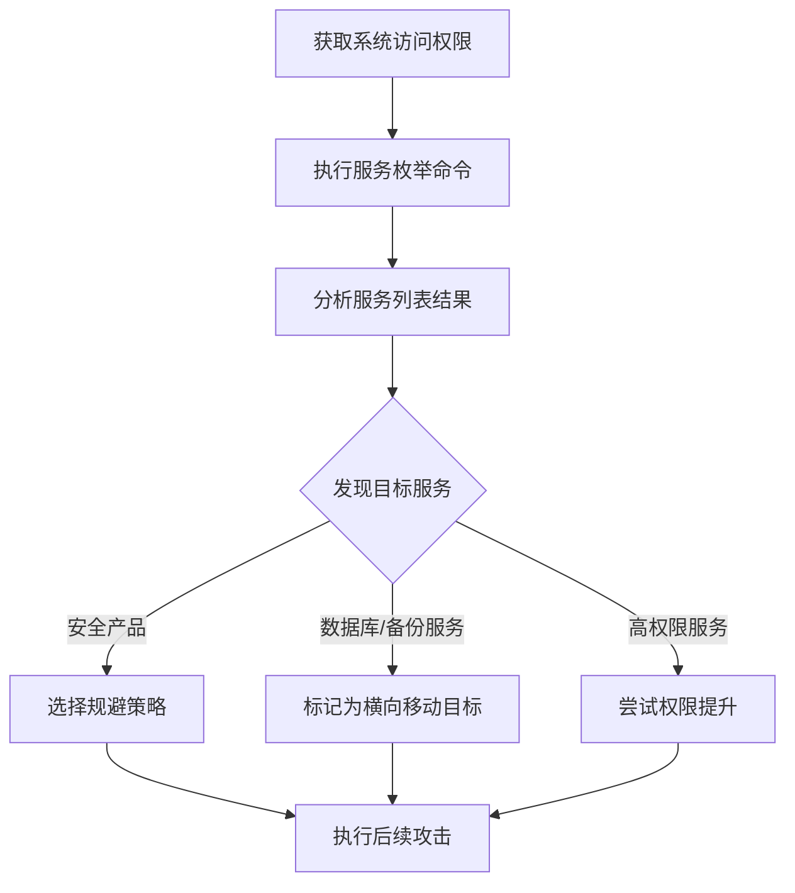

# 系统服务发现 (T1007)

## 一句话通俗理解

就像检查店里的设备有没有开机——攻击者查看电脑上跑了哪些后台服务，从中找到有价值的目标。

## 难度等级

- ⭐⭐ 中级（需要一定基础）

## 技术描述

系统服务发现（T1007）是MITRE ATT&CK框架中的一种发现技术。

**通俗解释：**
电脑上有很多"后台程序"在默默运行，比如打印服务、数据库服务、安全软件服务等。攻击者入侵后，会像小偷翻看店里的设备清单一样，查看这些后台服务的运行情况。通过服务发现，攻击者可以判断这台电脑是普通工作站还是重要的服务器，有没有安全软件在保护，以及哪些服务可能存在漏洞可以利用。

**技术原理：**
1. 攻击者在受感染的系统上执行服务查询命令（如 `sc query`、`net start`）
2. 系统返回所有已注册服务的信息，包括服务名称、显示名称、当前状态（运行中/已停止）、启动类型（自动/手动/禁用）和运行账户
3. 攻击者分析这些信息，识别关键服务（数据库、备份、安全软件）和配置不当的服务
4. 攻击者还可以通过WMI远程查询其他系统上的服务状态

**用途与影响：**
攻击者通过服务发现可以：识别安装了哪些安全产品（EDR、防病毒）以选择规避策略；定位数据库服务器、文件服务器等高价值目标作为横向移动的对象；发现配置不当的"高权限服务"进行权限提升；判断系统角色和业务功能。

## 子技术列表

**该技术没有子技术。**

## 攻击流程

### 典型攻击流程

```
获取权限 --> 执行服务枚举 --> 分析结果 --> 规划后续攻击
```



**步骤详解：**

1. **获取系统访问权限**
   - 通俗描述：攻击者先通过漏洞利用或钓鱼等方式进入系统
   - 技术细节：获得命令执行权限，可以是交互式Shell或通过后门远程执行
   - 常用工具：Cobalt Strike、Metasploit、自定义后门

2. **执行服务枚举**
   - 通俗描述：在系统上运行命令查看所有后台服务
   - 技术细节：使用 `sc query`、`net start`、PowerShell `Get-Service` 或WMI查询 `SELECT * FROM Win32_Service`
   - 常用工具：Windows内置命令、PowerShell、WMI

3. **分析服务列表**
   - 通俗描述：攻击者仔细查看输出结果，找出感兴趣的服务
   - 技术细节：交叉比对服务名称列表与已知安全产品和目标服务名称库
   - 常用工具：手动分析、自动化脚本

4. **根据结果采取行动**
   - 通俗描述：根据发现的服务信息决定下一步做什么
   - 技术细节：针对安全产品启动规避，针对数据库服务尝试凭证窃取或横向移动
   - 常用工具：Mimikatz、PsExec、自定义载荷

## 真实案例

### 案例1：Conti勒索软件 - 服务发现关闭安全防护

- **时间**: 2021年-2022年
- **目标**: 全球企业网络
- **攻击组织**: Wizard Spider / Conti
- **手法**: Conti勒索软件在部署前使用PowerShell的 `Get-Service` cmdlet枚举目标系统上所有服务的状态。恶意代码特别检查Windows Defender服务（`WinDefend`）是否正在运行，以及是否有其他安全产品服务（如 `sense`、`cbdefense`、`sesvc`）。如果检测到安全服务正在运行，Conti会使用 `net stop` 命令尝试停止这些服务，然后再执行文件加密操作。这种服务发现流程确保了加密过程不会被安全软件拦截。
- **影响**: 多个行业的组织遭受大规模勒索加密，导致业务中断和数据丢失
- **参考链接**: [Conti Ransomware Analysis](https://attack.mitre.org/software/S0575/)

### 案例2：Lazarus Group - 数据库服务发现用于横向移动

- **时间**: 2020年-2024年
- **目标**: 加密货币交易所、防务公司
- **攻击组织**: Lazarus Group (HIDDEN COBRA)
- **手法**: Lazarus组织在MATA框架攻击活动中通过WMI查询 `SELECT * FROM Win32_Service` 枚举系统上所有服务。他们特别关注服务显示名称中包含 "MSSQL"、"Oracle"、"MySQL" 的数据库服务。一旦发现数据库服务，Lazarus会使用 `sc qc` 查询服务的详细配置，分析服务启动账户是否具有SYSTEM权限。识别的数据库服务被标记为潜在的凭证窃取和横向移动目标。在2024年的Operation SyncHole攻击中，Lazarus通过服务发现定位了目标环境中的关键服务器。
- **影响**: 多国组织和加密货币平台遭受数据窃取
- **参考链接**: [Securelist - Lazarus Operation SyncHole](https://securelist.com/operation-synchole-watering-hole-attacks-by-lazarus/116326/)

### 案例3：MuddyWater - 服务发现用于环境侦察

- **时间**: 2025年-2026年
- **目标**: 美国企业、中东组织
- **攻击组织**: MuddyWater (Seedworm)
- **手法**: 在2026年初的MuddyWater攻击活动中，攻击者通过Microsoft Teams社会工程获得初始访问后，立即执行了 `net start` 命令查看系统上运行的所有服务。攻击者利用服务发现的结果识别了域控制器（`NTDS` 相关服务）、备份服务（`Veeam`、`SQL Server`）和远程管理服务（`AnyDesk`、`DWAgent` 服务）。这些信息帮助MuddyWater操作者快速定位了环境中的高价值目标，并选择适当的横向移动路径。
- **影响**: 敏感数据被窃取，部分系统被作为跳板攻击其他目标
- **参考链接**: [Rapid7 - MuddyWater Chaos Ransomware 2026](https://www.rapid7.com/blog/post/tr-muddying-tracks-state-sponsored-shadow-behind-chaos-ransomware/)

### 案例4：RansomHub - 服务枚举准备大规模加密

- **时间**: 2024年-2025年
- **目标**: 医疗、教育、企业
- **攻击组织**: RansomHub
- **手法**: RansomHub勒索软件附属组织在2024-2025年的多起攻击中，使用Advanced IP Scanner和NetScan进行初步发现后，通过WMI远程查询 `Win32_Service` 枚举了环境中所有服务器上的服务。攻击者特别标记了运行备份软件（Veeam、Acronis）、数据库（MSSQL、MySQL）和邮件服务（Exchange）的系统。这些信息用于规划加密策略——优先加密备份服务器以防止恢复，同时确保数据库服务被关闭以解锁文件。
- **影响**: 多组织数据被加密，部分组织支付了赎金
- **参考链接**: [The DFIR Report - RansomHub 2025](https://thedfirreport.com/2025/06/30/hide-your-rdp-password-spray-leads-to-ransomhub-deployment/)

## 红队视角

> ⚠️ **免责声明**：以下内容仅用于合法的安全测试、渗透测试和教育目的。未经授权对他人系统进行测试是违法行为。

### 实战技巧

1. **使用WMI远程查询服务**
   `Get-WmiObject Win32_Service -ComputerName <target>` 可以远程查询其他系统上的服务，无需在目标上安装任何软件。配合有效的域凭证，可以批量枚举内网中所有Windows系统的服务状态。

2. **关注安全产品服务的状态**
   使用 `sc query` 检查安全产品服务的状态。如果检测到 `WinDefend` 已停止，说明防御已经被绕过或禁用。如果安全服务正在运行，考虑使用进程注入或内存加载的方式避免触发文件扫描。

3. **检查服务的启动账户**
   使用 `sc qc <服务名>` 可以查看服务的详细配置。关注使用 `LocalSystem` 账户运行的非微软服务——这些服务如果存在漏洞，可以用于权限提升。

### 常用工具

| 工具名称 | 用途 | 平台 | 链接 |
|----------|------|------|------|
| sc.exe | Windows服务控制管理器命令行工具 | Windows | 内置命令 |
| Get-Service | PowerShell服务管理cmdlet | Windows | 内置PowerShell |
| WMI (Win32_Service) | 通过WMI远程查询服务 | Windows | 内置WMI |
| PsService | Sysinternals服务查看工具 | Windows | [Sysinternals](https://learn.microsoft.com/en-us/sysinternals/downloads/psservice) |

### 注意事项

- 执行服务枚举命令会在安全日志中留下事件ID 4688（进程创建），需要权衡隐蔽性
- 高频的WMI远程服务查询可能触发基于阈值的告警
- 在运行了EDR的系统上执行 `sc query` 可能被检测为恶意行为

## 蓝队视角

### 检测要点

1. **`sc.exe` 的异常使用**
   - 日志来源：Windows Security Event Log (Event ID 4688)、Sysmon Event ID 1
   - 关注字段：命令行参数包含 `query`、`qc`、`enum` 的sc.exe调用
   - 异常特征：非管理员用户的sc.exe执行，或短时间内从同一主机执行大量sc查询

2. **WMI服务枚举**
   - 日志来源：Microsoft-Windows-WMI-Activity/Operational (Event ID 5861)
   - 关注字段：查询内容包含 `Win32_Service` 的WMI请求
   - 异常特征：非管理员账户发起的WMI服务查询，或来自非预期主机的远程WMI连接

3. **PowerShell `Get-Service` 调用**
   - 日志来源：PowerShell ScriptBlock Logging (Event ID 4104)
   - 关注字段：命令中包含 `Get-Service` 或 `Get-WmiObject Win32_Service`
   - 异常特征：脚本或计划任务中隐藏的服务枚举命令

### 监控建议

- 启用PowerShell ScriptBlock Logging以记录所有PowerShell命令内容
- 配置Sysmon监控 `sc.exe`、`net.exe` 的创建事件
- 使用Windows Defender for Identity检测异常的WMI活动
- 在SIEM中建立基线，识别服务查询的异常频率模式

## 检测建议

### 网络层检测

**检测方法：** 监控远程WMI和RPC流量中的服务枚举行为。

**具体规则/命令示例：**
```
# Zeek检测远程WMI的RPC连接
$ zeek -r capture.pcap "rpc"
# 查找DCOM/WMI相关的SMB连接
```

**示例（Suricata规则）：**
```
alert ip any any -> $HOME_NET any (msg:"Potential WMI Service Enumeration"; content:"|05|"; distance:0; within:1; content:"|0b|"; distance:1; within:1; sid:1000001; rev:1;)
```

### 主机层检测

**检测方法：** 监控服务枚举命令的执行和WMI活动。

**Windows事件ID：**
- 事件ID 4688：进程创建（监控 `sc.exe`、`net.exe` 的执行）
- 事件ID 5861：WMI活动（监控 `Win32_Service` 查询）
- 事件ID 4104：PowerShell脚本内容（监控 `Get-Service` 调用）

**具体命令示例：**
```bash
# 查找近期执行的sc query命令
Get-WinEvent -FilterHashtable @{LogName='Security';Id=4688} | Where-Object {$_.Message -match 'sc.*query'}
```

### 应用层检测

**Sigma规则示例：**
```yaml
title: System Service Discovery via Sc.EXE
status: experimental
description: Detects execution of sc.exe for service enumeration
logsource:
    category: process_creation
    product: windows
detection:
    selection:
        Image|endswith: '\sc.exe'
        CommandLine|contains: 'query'
    condition: selection
level: medium
tags:
    - attack.t1007
```

## 缓解措施

### 优先级1：关键措施

**措施名称：** 限制WMI远程访问权限

**具体实施步骤：**
1. 通过组策略限制非管理账户对WMI的访问权限
2. 配置WMI命名空间安全设置，移除`Everyone`组的执行权限
3. 使用Windows Defender Firewall阻止非信任子网的RPC和DCOM连接

**配置示例：**
```
# 通过组策略限制WMI访问
Computer Configuration -> Administrative Templates -> Windows Components -> Windows Management Instrumentation (WMI) -> WMI Control
```

### 优先级2：重要措施

**措施名称：** 对sc.exe和PowerShell实施AppLocker策略

**具体实施步骤：**
1. 配置AppLocker规则，仅允许管理员执行sc.exe
2. 对PowerShell执行策略设置为ConstrainedLanguage模式
3. 启用PowerShell ScriptBlock Logging记录所有命令

### 优先级3：建议措施

**措施名称：** 实施用户权限最小化

**具体实施步骤：**
1. 移除普通用户的服务控制管理器（SCM）访问权限
2. 使用Just Enough Administration (JEA)限制管理任务
3. 定期审计非管理员账户的服务查询活动

### MITRE ATT&CK 缓解措施映射

| 缓解措施ID | 缓解措施名称 | 适用性 | 说明 |
|------------|-------------|--------|------|
| M1026 | Privileged Account Management | 适用 | 限制用户对服务控制管理器的访问权限 |
| M1018 | User Account Control | 适用 | 限制非管理员执行高权限查询 |
| M1047 | Audit | 适用 | 启用服务枚举行为的审计日志记录 |
| M1030 | Network Segmentation | 部分适用 | 分区可以减少远程服务枚举的范围 |

## 动手实验

> ⚠️ **重要提示**：所有实验必须在隔离的实验室环境中进行，禁止对未授权的真实系统进行测试。

### 实验环境准备

**推荐靶场/实验平台：**

| 平台名称 | 类型 | 难度 | 链接 |
|----------|------|------|------|
| TryHackMe (Windows PrivEsc) | 虚拟靶场 | 初级 | [tryhackme.com](https://tryhackme.com) |
| Hack The Box | 虚拟靶场 | 中级 | [hackthebox.com](https://www.hackthebox.com) |

**所需工具：**
- Windows VM：sc.exe、PowerShell（内置）
- WMI工具：wmic.exe（内置）

### 实验1：本地服务枚举（初级）

**实验目标：** 学习使用Windows内置工具枚举系统服务。

**实验步骤：**
1. 打开命令提示符，执行 `sc query` 查看所有服务的状态
2. 执行 `sc query state= all` 查看包括已停止的所有服务
3. 执行 `net start` 查看正在运行的服务列表
4. 执行 `wmic service list brief` 通过WMI获取服务摘要信息
5. 在PowerShell中执行 `Get-Service | Select-Object Name, Status, DisplayName`

**预期结果：** 看到系统上所有已注册的服务列表，包括其运行状态。

**学习要点：** 理解服务发现的基本命令和输出格式。

### 实验2：安全产品识别（中级）

**实验目标：** 通过服务发现识别系统中的安全产品。

**实验步骤：**
1. 在安装了Windows Defender的Windows 10/11 VM上执行 `sc query`
2. 在输出中查找 `WinDefend`（Windows Defender服务）
3. 使用 `sc qc WinDefend` 查看服务详细配置
4. 使用 `Get-Service | Where-Object {$_.DisplayName -match 'defender|security|antivirus|firewall'}` 筛选安全相关服务

**预期结果：** 找到系统上的安全产品服务。

**学习要点：** 理解攻击者如何通过服务名识别安全产品。

## 术语解释

| 术语 | 英文原名 | 通俗解释 |
|------|----------|----------|
| 服务 | Service | Windows后台运行的程序，像餐厅的后厨——客人看不到但一直在运转 |
| SCM | Service Control Manager | Windows中管理所有服务的总管家 |
| WMI | Windows Management Instrumentation | Windows的管理接口，像大楼的中央控制系统，可以远程查询各种信息 |
| sc.exe | Service Control | Windows命令行服务管理工具，类似服务的"遥控器" |
| PID | Process Identifier | 每个运行程序的唯一编号，像学生的学号 |
| 服务启动类型 | Startup Type | 服务开机后的启动方式：自动（随系统启动）、手动（需要时再启动）、禁用（不能启动） |

## 参考资料

### 官方文档

- [MITRE ATT&CK - T1007](https://attack.mitre.org/techniques/T1007/)
- [Microsoft - Sc.exe Query](https://learn.microsoft.com/en-us/windows-server/administration/windows-commands/sc-query)

### 安全报告

- [Kaspersky - Lazarus MATA Framework](https://securelist.com/mata-multi-platform-cyber-framework/102140/)
- [Rapid7 - MuddyWater 2026 Analysis](https://www.rapid7.com/blog/post/tr-muddying-tracks-state-sponsored-shadow-behind-chaos-ransomware/)

### 工具与资源

- [Sysinternals PsService](https://learn.microsoft.com/en-us/sysinternals/downloads/psservice)
- [PowerShell Get-Service Documentation](https://learn.microsoft.com/en-us/powershell/module/microsoft.powershell.management/get-service)
