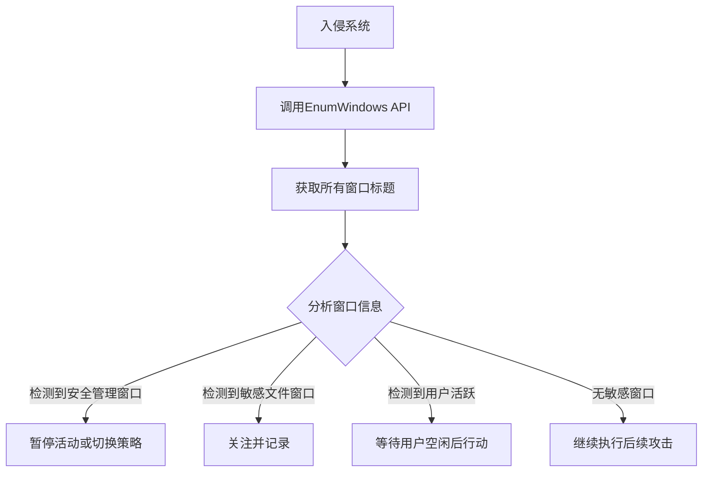

# 应用程序窗口发现 (T1010)

## 一句话通俗理解

就像小偷探头看房间里哪些窗户亮着灯——攻击者查看当前打开的窗口来判断用户在做什么。

## 30秒速查卡

| 维度 | 你需要知道的 |
|------|-------------|
| 这是什么？ | 攻击者调用 `EnumWindows`、`GetWindowText` API 枚举所有打开的窗口标题，判断用户活动和安全工具状态 |
| 为什么危险？ | 窗口标题泄露用户正在做什么（编辑敏感文件、浏览内部系统），攻击者据此选择时机或规避安全分析工具 |
| 谁需要关心？ | SOC分析师、EDR运维、任何需要检测反沙箱和反分析行为的安全人员 |
| 你的第一步防御 | 监控非交互式进程（服务、计划任务）调用 `user32.dll` 的窗口枚举 API，建立正常窗口枚举频率基线 |
| 如果只做一件事 | 对后台进程中加载 WinForm 程序集（`System.Windows.Forms`）的行为立即告警，因为正常后台服务不需要 UI 操作 |

## 难度等级

- ⭐ 初级（新手可学）

## 技术描述

应用程序窗口发现（T1010）是MITRE ATT&CK框架中的一种发现技术。

**通俗解释：**
当你在电脑上打开各种程序窗口时（浏览器、Word、微信等），Windows会知道所有打开的窗口。攻击者入侵后，可以查看当前打开了哪些程序窗口，从而判断：用户是不是在浏览敏感资料、有没有打开安全控制台、或者是不是有人在用电脑。

**技术原理：**
1. 攻击者使用Windows API函数 `EnumWindows` 枚举所有顶层窗口
2. 对每个窗口调用 `GetWindowText` 获取窗口标题栏的文字内容
3. 窗口标题往往包含正在编辑的文件名、网页标题或程序名称
4. 攻击者还可以使用 `GetForegroundWindow` 获取当前激活（最前面的）窗口
5. PowerShell中可以直接调用user32.dll的API

**用途与影响：**
攻击者通过窗口发现可以：判断是否有人在操作电脑（选择无人时段行动）；识别用户正在使用的应用程序；发现敏感信息的窗口标题；验证系统是否在虚拟机中运行。

## 子技术列表

**该技术没有子技术。**

## 攻击流程

### 典型攻击流程

```
入侵系统 --> 枚举窗口 --> 分析标题 --> 决策下一步
```



**步骤详解：**

1. **入侵系统**
   - 通俗描述：攻击者通过漏洞或钓鱼等方式获得系统控制权
   - 技术细节：获取远程命令执行能力
   - 常用工具：Cobalt Strike、自定义后门

2. **枚举窗口**
   - 通俗描述：调用系统功能查看所有打开的窗口
   - 技术细节：使用 `EnumWindows` API枚举所有顶层窗口，`GetWindowText` 获取标题
   - 常用工具：PowerShell脚本、C#载荷

3. **分析结果**
   - 通俗描述：查看窗口标题内容，判断用户活动
   - 技术细节：匹配关键词如"管理员"、"安全"、"机密"
   - 常用工具：自动化分析脚本

4. **行动决策**
   - 通俗描述：根据窗口信息决定是否立即行动
   - 技术细节：如检测到用户活动则延迟执行敏感操作
   - 常用工具：条件判断逻辑

## 真实案例

### 案例1：AgentTesla - 窗口标题捕获窃密

- **时间**: 2020年-2024年
- **目标**: 全球企业和个人用户
- **攻击组织**: AgentTesla运营者
- **手法**: AgentTesla信息窃取木马在感染受害者系统后，通过调用 `EnumWindows` 和 `GetWindowText` API枚举所有打开的窗口标题。恶意软件特别关注浏览器窗口标题（提取访问的网站标题）、邮件客户端窗口（识别邮件服务商）、以及包含"密码"、"账户"、"银行"等关键词的窗口。捕获的窗口标题信息被压缩后通过HTTP POST发送到C2服务器，帮助攻击者了解受害者的在线活动和使用习惯。
- **影响**: 大量用户的凭证和敏感信息被窃取
- **参考链接**: [MITRE - T1010](https://attack.mitre.org/techniques/T1010/)

### 案例2：TrickBot - 活动窗口监控躲避检测

- **时间**: 2019年-2022年
- **目标**: 全球银行客户
- **攻击组织**: Wizard Spider
- **手法**: TrickBot木马使用 `GetForegroundWindow` API每秒查询当前激活窗口的标题。如果检测到特定银行网站的窗口标题，TrickBot立即激活表单注入模块。同时，TrickBot也监控包含"Task Manager"、"Process Explorer"等关键词的窗口，当检测到安全分析工具窗口时暂停所有活动。
- **影响**: 全球数百万银行账户信息被窃取
- **参考链接**: [Trend Micro - TrickBot Analysis](https://www.trendmicro.com/vinfo/us/security/news/cybercrime-and-digital-threats/trickbot-trojans-new-module-steals-browser-passwords-and-credentials)

### 案例3：AsyncRAT - 远程桌面用户监控

- **时间**: 2021年-2024年
- **目标**: 全球个人和企业用户
- **攻击组织**: 多个犯罪组织
- **手法**: AsyncRAT远程访问木马包含窗口发现模块，通过 `EnumWindows` 获取窗口标题和类名，判断：用户是否在使用远程桌面（检测mstsc相关窗口）、用户是否在查看敏感文件、以及系统是否在安全分析环境中运行。
- **影响**: 被广泛用于个人数据窃取和间谍活动
- **参考链接**: [MalwareBytes - AsyncRAT](https://www.malwarebytes.com/blog/threats/asyncrat)

### 案例4：Emotet - 用户活跃度检测

- **时间**: 2021年-2023年
- **目标**: 全球银行、政府、企业
- **攻击组织**: Emotet运营者
- **手法**: Emotet银行木马通过检查窗口枚举结果判断用户是否正在活跃使用电脑。如果检测到前台窗口在变化，Emotet延迟执行敏感操作。窗口发现使用 `GetForegroundWindow` 和 `GetWindowText` 实现，定期检查前台窗口的变化频率来判断用户活跃度。
- **影响**: Emotet在全球造成了数十亿美元的损失
- **参考链接**: [CISA - Emotet Malware](https://www.cisa.gov/news-events/alerts/2020/07/20/emotet-malware)

## 红队视角

> ⚠️ **免责声明**：以下内容仅用于合法的安全测试、渗透测试和教育目的。未经授权对他人系统进行测试是违法行为。

### 实战技巧

1. **使用PowerShell枚举窗口**
   通过加载user32.dll在PowerShell中调用 `EnumWindows` API，无需落地额外的可执行文件。配合反射加载，可以做到完全内存执行。

2. **监控前台窗口变化**
   使用 `GetForegroundWindow` 循环检测前台窗口变化频率，判断用户是否在活跃使用电脑。

3. **窗口标题关键词匹配**
   预定义安全工具窗口关键词列表（如Wireshark、Procmon、IDA、x64dbg），在枚举窗口后快速匹配。

### 常用工具

| 工具名称 | 用途 | 平台 | 链接 |
|----------|------|------|------|
| PowerShell | 通过.NET调用Windows API枚举窗口 | Windows | 内置 |
| C# Loader | 直接调用EnumWindows/GetWindowText API | Windows | 自定义开发 |
| WinSpy++ | 窗口信息查看工具 | Windows | [SourceForge](https://sourceforge.net/projects/winspypp/) |

### 注意事项

- 频繁调用 `EnumWindows` 可能在EDR中留下可疑行为模式
- 窗口发现的结果取决于用户活动状态，需要动态判断
- 某些安全软件会隐藏自己的窗口

## 蓝队视角

### 检测要点

1. **异常的API调用序列**
   - 日志来源：Sysmon Event ID 10、EDR API监控
   - 关注字段：进程调用user32.dll中的窗口枚举API
   - 异常特征：非交互式进程（如服务进程）调用窗口枚举API

2. **PowerShell加载WinForm程序集**
   - 日志来源：PowerShell ScriptBlock Logging (Event ID 4104)
   - 关注字段：脚本内容包含 `Add-Type -AssemblyName System.Windows.Forms`
   - 异常特征：由非管理员用户的PowerShell进程加载WinForm程序集

### 监控建议

- 监控user32.dll的异常加载模式
- 启用PowerShell ScriptBlock Logging捕获窗口枚举脚本
- 关注计划任务或服务进程中加载WinForm组件的行为

## 检测建议

### 网络层检测

窗口发现本身不产生网络流量，但后续行为可能产生异常模式。

### 主机层检测

**检测方法：** 监控窗口枚举API的异常调用。

**Windows事件ID：**
- 事件ID 4688：进程创建
- 事件ID 4104：PowerShell脚本内容
- Sysmon Event ID 1：进程创建

### 应用层检测

**用人话说：** 这条规则在监控有人用 PowerShell 脚本调用 Windows API 枚举窗口标题。攻击者为什么要这么做？因为窗口标题能告诉他们：用户是不是在看安全管理控制台、是不是在编辑敏感文件、或者当前有没有人在用电脑。如果你看到后台进程或计划任务中突然出现了 `EnumWindows` 调用，这通常不是正常业务行为。正常情况下，只有桌面应用才需要枚举窗口，后台服务或脚本做这件事往往有猫腻。

**Sigma规则示例：**
```yaml
title: PowerShell Window Discovery via EnumWindows
status: experimental
description: Detects PowerShell scripts using Windows API for window enumeration
logsource:
    category: script_block
    product: windows
detection:
    selection:
        ScriptBlockText|contains: 'EnumWindows'
    condition: selection
level: medium
tags:
    - attack.t1010
```

## 缓解措施

### 优先级1：关键措施

**措施名称：** 限制非交互式进程调用用户界面API

**具体实施步骤：**
1. 使用WDAC限制可执行文件
2. 监控服务进程加载user32.dll的行为
3. 配置AppLocker限制PowerShell执行

### 优先级2：重要措施

**措施名称：** 启用PowerShell安全日志记录

**具体实施步骤：**
1. 启用ScriptBlock Logging
2. 启用Module Logging
3. 启用Transcription日志

### 优先级3：建议措施

**措施名称：** 实施用户活动监控

**具体实施步骤：**
1. 使用EDR监控异常的窗口枚举行为
2. 建立非交互式进程不应调用UI API的基线规则

### MITRE ATT&CK 缓解措施映射

| 缓解措施ID | 缓解措施名称 | 适用性 | 说明 |
|------------|-------------|--------|------|
| M1040 | Behavior Prevention on Endpoint | 适用 | 端点防护可检测异常API调用 |
| M1026 | Privileged Account Management | 适用 | 限制非管理员执行敏感操作 |
| M1038 | Execution Prevention | 部分适用 | 限制脚本执行 |

## 动手实验

> ⚠️ **重要提示**：所有实验必须在隔离的实验室环境中进行，禁止对未授权的真实系统进行测试。

### 实验环境准备

**推荐靶场/实验平台：**

| 平台名称 | 类型 | 难度 | 链接 |
|----------|------|------|------|
| Windows VM | 本地虚拟机 | 初级 | 自建 |

### 实验1：使用PowerShell枚举窗口（初级）

**实验目标：** 学习使用PowerShell枚举当前打开的窗口。

**实验步骤：**
1. 以管理员身份打开PowerShell
2. 使用以下脚本枚举所有窗口：
```powershell
Add-Type @"
using System;
using System.Runtime.InteropServices;
using System.Text;
public class Window {
    [DllImport("user32.dll")]
    public static extern bool EnumWindows(EnumWindowsProc enumProc, IntPtr lParam);
    [DllImport("user32.dll")]
    public static extern int GetWindowText(IntPtr hWnd, StringBuilder text, int count);
    public delegate bool EnumWindowsProc(IntPtr hWnd, IntPtr lParam);
}
"@
$windows = New-Object System.Collections.ArrayList
$callback = {
    param($hwnd, $lparam)
    $sb = New-Object System.Text.StringBuilder 256
    [Window]::GetWindowText($hwnd, $sb, 256)
    if ($sb.ToString() -ne "") { [void]$windows.Add($sb.ToString()) }
    return $true
}
[Window]::EnumWindows($callback, [IntPtr]::Zero)
$windows
```
3. 观察输出结果

**预期结果：** 看到所有打开窗口的标题栏文字。

**学习要点：** 理解窗口枚举API的基本使用方法。

## 术语解释

| 术语 | 英文原名 | 通俗解释 |
|------|----------|----------|
| 窗口句柄 | Window Handle (hWnd) | Windows给每个窗口分配的唯一编号 |
| API | Application Programming Interface | 程序之间沟通的接口 |
| 枚举 | Enumeration | 逐个列出所有项目 |
| 前台窗口 | Foreground Window | 当前屏幕上最前面的窗口 |
| user32.dll | User32 DLL | Windows管理窗口和用户界面的核心组件 |

## 参考资料

### 官方文档

- [MITRE ATT&CK - T1010](https://attack.mitre.org/techniques/T1010/)
- [Microsoft - EnumWindows API](https://learn.microsoft.com/en-us/windows/win32/api/winuser/nf-winuser-enumwindows)

### 安全报告

- [Trend Micro - TrickBot Analysis](https://www.trendmicro.com/vinfo/us/security/news/cybercrime-and-digital-threats/trickbot-trojans-new-module-steals-browser-passwords-and-credentials)
- [CISA - Emotet Alert](https://www.cisa.gov/news-events/alerts/2020/07/20/emotet-malware)

### 工具与资源

- [PowerShell Documentation](https://learn.microsoft.com/en-us/powershell/)
- [WinSpy++](https://sourceforge.net/projects/winspypp/)
