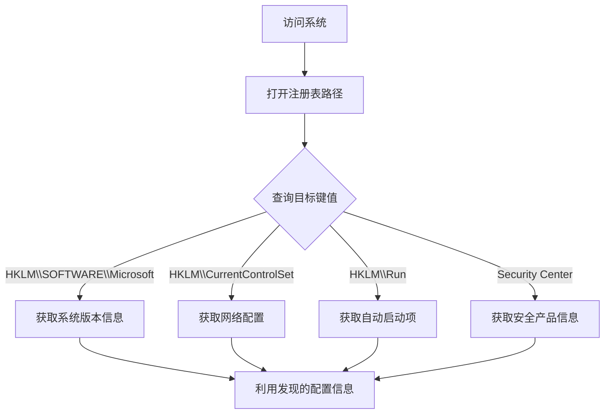

# 查询注册表 (T1012)

## 一句话通俗理解

就像翻看Windows系统的大辞典——攻击者查看注册表来获取系统配置、安装的软件和各种秘密信息。

## 难度等级

- ⭐⭐ 中级（需要一定基础）

## 技术描述

查询注册表（T1012）是MITRE ATT&CK框架中的一种发现技术。

**通俗解释：**
Windows注册表就像一个巨大的数据库，记录了系统和所有软件的配置信息——电脑的序列号、安装了哪些程序、启动时自动运行什么等。攻击者入侵后可以像翻字典一样查询注册表，找到大量有用的信息。

**技术原理：**
1. 攻击者使用 `reg query` 命令或 `RegOpenKeyEx`/`RegQueryValueEx` API打开注册表的特定键路径
2. 读取键值中的数据，这些数据可能是字符串、数字或二进制格式
3. 攻击者关注的关键注册表路径包括：系统信息、已安装软件列表、自动启动项、网络配置、安全产品设置
4. 注册表查询可以通过本地或远程方式（`reg query \\target\path`）执行

**用途与影响：**
攻击者查询注册表可以：定位自动启动路径用于持久化；获取系统详细信息；发现已安装的安全产品；获取网络配置、代理设置；查找存储的密码和敏感配置信息。

## 子技术列表

**该技术没有子技术。**

## 攻击流程

### 典型攻击流程

```
访问系统 --> 查询关键注册表路径 --> 分析信息 --> 利用发现结果
```



**步骤详解：**

1. **打开注册表路径**
   - 通俗描述：攻击者使用命令打开注册表的某个目录
   - 技术细节：`reg query HKLM\SOFTWARE\Microsoft\Windows\CurrentVersion`
   - 常用工具：reg.exe、PowerShell

2. **读取键值**
   - 通俗描述：读取具体配置项的值
   - 技术细节：`reg query <path> /v <valuename>`
   - 常用工具：reg.exe、PowerShell

3. **分析信息**
   - 通俗描述：从配置信息中提取有用的内容
   - 技术细节：解析注册表值字符串，匹配关键信息
   - 常用工具：自动化脚本

4. **利用结果**
   - 通俗描述：根据发现的信息规划后续行动
   - 技术细节：如找到自动启动路径后用于持久化
   - 常用工具：配合其他攻击工具

## 真实案例

### 案例1：APT29 - 注册表查询系统指纹

- **时间**: 2020年-2024年
- **目标**: 美国政府机构、IT公司
- **攻击组织**: APT29 (Cozy Bear)
- **手法**: APT29在SolarWinds供应链攻击后续活动中通过BEACON后门执行注册表查询收集系统指纹信息。攻击者查询 `HKLM\HARDWARE\DESCRIPTION\System` 获取硬件信息，`HKLM\SOFTWARE\Microsoft\Windows NT\CurrentVersion` 获取操作系统版本，`HKLM\SOFTWARE\Microsoft\Cryptography` 获取机器GUID。这些信息被编码在C2通信元数据中。
- **影响**: 数千个政府和企业系统被长期渗透
- **参考链接**: [Mandiant - APT29 Analysis](https://www.mandiant.com/resources/apt29-wineloader-german-political-parties)

### 案例2：RansomHub - 注册表发现配置信息

- **时间**: 2024年-2025年
- **目标**: 全球企业网络
- **攻击组织**: RansomHub
- **手法**: RansomHub附属组织入侵后通过查询注册表获取环境配置信息。攻击者查询 `HKLM\SOFTWARE\Microsoft\Windows NT\CurrentVersion` 确认系统版本，查询 `HKLM\SOFTWARE\Microsoft\Windows\CurrentVersion\Uninstall` 枚举已安装软件特别是备份软件。这些信息帮助选择加密策略。
- **影响**: 多行业组织遭受勒索加密
- **参考链接**: [The DFIR Report - RansomHub 2025](https://thedfirreport.com/2025/06/30/hide-your-rdp-password-spray-leads-to-ransomhub-deployment/)

### 案例3：TrickBot - 注册表获取安全产品信息

- **时间**: 2019年-2022年
- **目标**: 全球银行客户
- **攻击组织**: Wizard Spider
- **手法**: TrickBot读取 `HKLM\SOFTWARE\Microsoft\Security Center` 及防病毒产品的注册表路径检测安装了哪些安全产品。它还查询服务注册表键判断安全产品运行状态。根据发现结果动态调整行为。
- **影响**: 数百万用户银行凭证被窃取
- **参考链接**: [Trend Micro - TrickBot Analysis](https://www.trendmicro.com/vinfo/us/security/news/cybercrime-and-digital-threats/trickbot-trojans-new-module-steals-browser-passwords-and-credentials)

### 案例4：Lazarus Group - 注册表持久化路径查询

- **时间**: 2021年-2024年
- **目标**: 加密货币交易所
- **攻击组织**: Lazarus Group
- **手法**: Lazarus通过查询注册表 `HKLM\SOFTWARE\Microsoft\Windows\CurrentVersion\Run` 枚举所有自动启动项，判断是否有其他恶意软件已实现持久化，以及是否有安全产品的启动监控组件。
- **影响**: 多国加密货币平台被入侵
- **参考链接**: [Securelist - Lazarus MATA Framework](https://securelist.com/mata-multi-platform-cyber-framework/102140/)

## 红队视角

> ⚠️ **免责声明**：以下内容仅用于合法的安全测试、渗透测试和教育目的。未经授权对他人系统进行测试是违法行为。

### 实战技巧

1. **远程查询注册表**
   使用 `reg query \\target\path` 远程查询其他系统的注册表。配合域凭证可批量收集环境信息。

2. **关注安全产品注册表路径**
   查询 `HKLM\SOFTWARE\Microsoft\Security Center`、`HKLM\SOFTWARE\Microsoft\Windows Defender` 等路径。

3. **查找存储的密码**
   `HKLM\SOFTWARE\Microsoft\Windows NT\CurrentVersion\Winlogon` 可能包含自动登录密码。

### 常用工具

| 工具名称 | 用途 | 平台 | 链接 |
|----------|------|------|------|
| reg.exe | Windows注册表命令行工具 | Windows | 内置命令 |
| PowerShell Registry | 通过PSDrive访问注册表 | Windows | 内置 |
| Regedit | 图形化注册表编辑器 | Windows | 内置 |
| RegRipper | 注册表取证分析工具 | 跨平台 | [GitHub](https://github.com/keydet89/RegRipper3.0) |

### 注意事项

- 远程注册表查询需要目标开启Remote Registry服务
- 非管理员用户对注册表的访问受限
- 高频查询可能触发EDR告警

## 蓝队视角

### 检测要点

1. **reg.exe的异常执行**
   - 日志来源：Windows Security Event ID 4688
   - 关注字段：命令行参数包含query
   - 异常特征：非管理员用户执行reg.exe

2. **注册表远程连接**
   - 日志来源：Windows Security Event ID 5140
   - 关注字段：对IPC$共享的访问
   - 异常特征：来自非管理主机的远程注册表访问

3. **PowerShell注册表访问**
   - 日志来源：PowerShell ScriptBlock Logging (Event ID 4104)
   - 关注字段：脚本包含Get-ItemProperty -Path HKLM:
   - 异常特征：对安全产品注册表路径的频繁读取

### 监控建议

- 启用注册表审计策略
- 配置Sysmon Event ID 12-14监控注册表事件
- 监控非标准工具对安全产品注册表路径的读取

## 检测建议

### 网络层检测

监控SMB协议中的远程注册表访问流量。

### 主机层检测

**Windows事件ID：**
- 事件ID 4656：注册表对象句柄请求
- 事件ID 4663：注册表对象访问
- Sysmon Event ID 12-14：注册表事件

### 应用层检测

**Sigma规则示例：**
```yaml
title: Registry Query for Security Product Information
status: experimental
description: Detects registry queries targeting security product configuration
logsource:
    category: process_creation
    product: windows
detection:
    selection:
        CommandLine|contains:
            - 'Security Center'
            - 'Windows Defender'
    condition: selection
level: medium
tags:
    - attack.t1012
```

## 缓解措施

### 优先级1：关键措施

**措施名称：** 限制注册表远程访问

**具体实施步骤：**
1. 禁用Remote Registry服务
2. 通过防火墙阻止非管理子网的SMB访问
3. 配置注册表ACL限制关键路径访问

### 优先级2：重要措施

**措施名称：** 配置注册表审计策略

**具体实施步骤：**
1. 启用高级审计策略中的注册表子类别
2. 配置敏感注册表路径的SACL
3. 将注册表审计日志发送到SIEM

### 优先级3：建议措施

**措施名称：** 限制PowerShell注册表访问

**具体实施步骤：**
1. 使用JEA限制PowerShell注册表Provider访问
2. 设置ConstrainedLanguage模式
3. 监控所有对注册表的查询操作

### MITRE ATT&CK 缓解措施映射

| 缓解措施ID | 缓解措施名称 | 适用性 | 说明 |
|------------|-------------|--------|------|
| M1026 | Privileged Account Management | 适用 | 限制注册表访问权限 |
| M1035 | Limit Access to Resource Over Network | 适用 | 限制远程注册表访问 |
| M1041 | Encrypt Sensitive Information | 部分适用 | 加密注册表中的敏感信息 |

## 动手实验

> ⚠️ **重要提示**：所有实验必须在隔离的实验室环境中进行，禁止对未授权的真实系统进行测试。

### 实验环境准备

**所需工具：** Windows VM、reg.exe（内置）、PowerShell（内置）

### 实验1：本地注册表查询（初级）

**实验目标：** 学习使用reg.exe查询注册表信息。

**实验步骤：**
1. 查询Windows版本信息：
   ```
   reg query "HKLM\SOFTWARE\Microsoft\Windows NT\CurrentVersion" /v ProductName
   ```
2. 查询自动启动程序列表：
   ```
   reg query HKLM\SOFTWARE\Microsoft\Windows\CurrentVersion\Run
   ```

**预期结果：** 看到注册表中存储的系统配置信息。

**学习要点：** 理解关键注册表路径和reg.exe的基本使用。

### 实验2：PowerShell注册表查询（中级）

**实验目标：** 使用PowerShell查询注册表信息。

**实验步骤：**
1. 查询已安装软件列表：
   ```powershell
   Get-ItemProperty HKLM:\SOFTWARE\Microsoft\Windows\CurrentVersion\Uninstall\* | Select-Object DisplayName, DisplayVersion
   ```

**预期结果：** 获取已安装软件的详细列表。

**学习要点：** 使用PowerShell进行注册表信息收集。

## 术语解释

| 术语 | 英文原名 | 通俗解释 |
|------|----------|----------|
| 注册表 | Registry | Windows的配置信息数据库 |
| 键 | Key | 注册表中的目录/文件夹 |
| 值 | Value | 注册表中具体的一项配置数据 |
| HKEY | Handle to Key | 注册表的根键名称 |
| SACL | System Access Control List | 注册表路径的审计规则 |
| 命名管道 | Named Pipe | Windows中进程通信的通道 |

## 参考资料

### 官方文档

- [MITRE ATT&CK - T1012](https://attack.mitre.org/techniques/T1012/)
- [Microsoft - Reg Command](https://learn.microsoft.com/en-us/windows-server/administration/windows-commands/reg)

### 安全报告

- [Mandiant - APT29 Analysis](https://www.mandiant.com/resources/blog/apt29-wineloader-german-political-parties)
- [Trend Micro - TrickBot Registry Analysis](https://www.trendmicro.com/vinfo/us/security/news/cybercrime-and-digital-threats/trickbot-trojans-new-module-steals-browser-passwords-and-credentials)

### 工具与资源

- [RegRipper - Registry Forensic Tool](https://github.com/keydet89/RegRipper3.0)
- [PowerShell Registry Documentation](https://learn.microsoft.com/en-us/powershell/module/microsoft.powershell.management/get-itemproperty)
