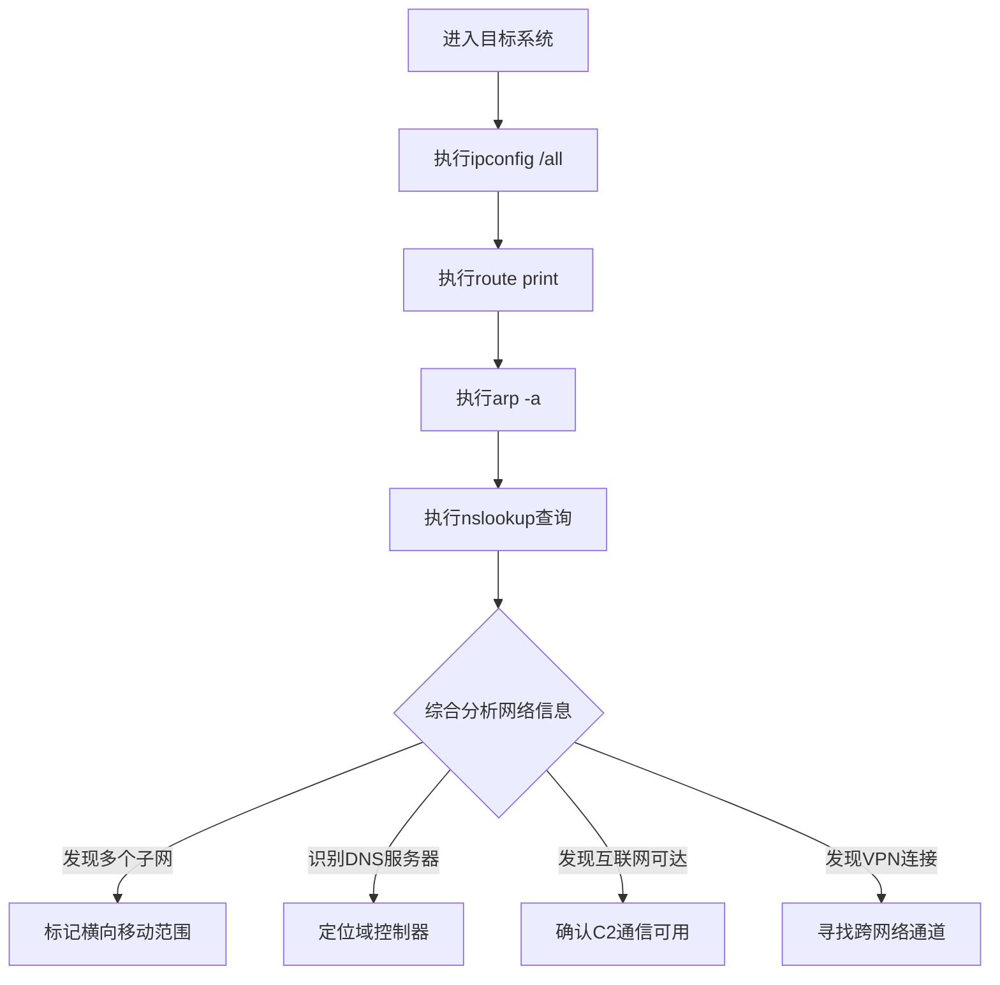

# 系统网络配置发现 (T1016)

## 一句话通俗理解

就像看自己家的门牌号和周围邻居——攻击者查看电脑的网络设置来了解自己在网络中的位置。

## 难度等级

- ⭐ 初级（新手可学）

## 技术描述

系统网络配置发现（T1016）是MITRE ATT&CK框架中的一种发现技术。

**通俗解释：**
每台电脑连接网络时都有自己的身份证——IP地址，还有通讯录——DNS服务器、路由表等。攻击者入侵后，首先会查看这些网络配置信息，就像你搬进新家后看门牌号、看社区地图一样。通过这些信息，攻击者可以了解自己在网络中的位置、有哪些路可以走（路由表）、周围有哪些设备（ARP缓存），以及互联网是否畅通。

**技术原理：**
1. 攻击者执行网络配置查看命令（如 `ipconfig`、`route print`）
2. 系统读取网络接口配置、IP地址分配、DNS设置、路由表等内部数据
3. ARP缓存显示了最近通信过的设备IP和MAC地址映射关系
4. 攻击者通过这些信息判断网络规模、分段、出站能力和内部拓扑

**用途与影响：**
网络配置发现帮助攻击者：判断是否可以出站到互联网；发现内部子网和路由路径；识别DNS服务器和网关位置；了解网络分段情况；检测VPN和代理配置。

## 子技术列表

**该技术共有 3 个子技术：**

| 子技术ID | 中文名称 | 通俗解释 |
|----------|----------|----------|
| T1016.001 | Internet Connection Discovery | 测试系统能不能连上互联网 |
| T1016.002 | Wi-Fi Discovery | 查看WiFi网络配置和已保存的WiFi密码 |
| T1016.003 | Workstation Discovery | 发现网络中的工作站和其他计算设备 |

## 攻击流程

### 典型攻击流程

```
进入系统 --> 执行网络配置命令 --> 分析网络拓扑 --> 规划攻击路径
```



**步骤详解：**

1. **查看网络接口配置**
   - 通俗描述：查看电脑的网络名片
   - 技术细节：`ipconfig /all`（Windows）或 `ip addr`（Linux）
   - 常用工具：内置系统命令

2. **查看路由表**
   - 通俗描述：查看网络的交通地图
   - 技术细节：`route print`（Windows）或 `ip route`（Linux）
   - 常用工具：route.exe

3. **查看ARP缓存**
   - 通俗描述：查看最近和哪些设备有过来往
   - 技术细节：`arp -a`
   - 常用工具：arp.exe

4. **DNS查询**
   - 通俗描述：查看电话本确认网络中的服务位置
   - 技术细节：`nslookup <domain>`
   - 常用工具：nslookup.exe

## 真实案例

### 案例1：APT41 - 网络配置发现定位出口

- **时间**: 2024年-2025年
- **目标**: 美国政策研究机构
- **攻击组织**: APT41 (Winnti)
- **手法**: 在2025年针对美国政策机构的网络间谍活动中，APT41利用DLL侧加载获得初始访问后，执行 `ipconfig /all` 和 `route print` 命令收集网络配置信息。攻击者关注是否存在多个网络接口以及DNS后缀是否包含域信息。APT41还通过 `netsh interface ip show config` 查看所有接口配置，判断系统是否可以通过VPN访问外部资源。收集的网络配置通过加密C2信道回传。
- **影响**: 敏感政策研究数据被窃取
- **参考链接**: [HivePro - APT41 2025](https://hivepro.com/threat-advisory/apt41-cyber-espionage-campaign-targets-u-s-policy-institutions/)

### 案例2：Agenda (Qilin) - 网络配置用于跨平台加密

- **时间**: 2025年
- **目标**: 全球企业网络
- **攻击组织**: Agenda Ransomware
- **手法**: Agenda勒索软件攻击中，攻击者使用 `ipconfig /all` 收集网络配置信息。关注DNS服务器地址、默认网关和IP地址范围。使用 `route print` 查看路由表识别通往其他网段的路由路径。收集的信息用于规划Linux和Windows混合环境的勒索软件部署策略。
- **影响**: 多家企业遭受混合环境勒索加密
- **参考链接**: [Trend Micro - Agenda 2025](https://www.trendmicro.com/en/research/25/j/agenda-ransomware-deploys-linux-variant-on-windows-systems.html)

### 案例3：MuddyWater - Teams欺骗中的网络发现

- **时间**: 2026年初
- **目标**: 美国建筑公司
- **攻击组织**: MuddyWater
- **手法**: MuddyWater通过Microsoft Teams社会工程获得屏幕共享访问后，在受害者系统上执行 `ipconfig /all`、`nslookup` 和 `ping` 命令。获取IP配置、DNS服务器和默认网关信息，使用 `nslookup` 查询域控制器地址。这些调查帮助绘制了目标内部网络拓扑图。
- **影响**: 凭证被窃取、内网被渗透
- **参考链接**: [Rapid7 - MuddyWater 2026](https://www.rapid7.com/blog/post/tr-muddying-tracks-state-sponsored-shadow-behind-chaos-ransomware/)

### 案例4：RansomHub - 密码喷洒中的路由发现

- **时间**: 2024年-2025年
- **目标**: 全球企业
- **攻击组织**: RansomHub
- **手法**: RansomHub攻击者通过RDP密码喷洒获得初始访问后，使用 `ipconfig`、`route` 和 `ping` 命令发现网络配置。使用 `route print` 检查路由表，使用 `ping` 探测相邻子网中的活跃主机，使用 `tracert` 跟踪网络路径。结果用于规划横向移动。
- **影响**: 多行业组织遭受数据加密和勒索
- **参考链接**: [The DFIR Report - RansomHub 2025](https://thedfirreport.com/2025/06/30/hide-your-rdp-password-spray-leads-to-ransomhub-deployment/)

## 红队视角

> ⚠️ **免责声明**：以下内容仅用于合法的安全测试、渗透测试和教育目的。未经授权对他人系统进行测试是违法行为。

### 实战技巧

1. **使用PowerShell收集网络配置**
   `Get-NetIPAddress`、`Get-NetRoute`、`Get-DnsClientServerAddress` 可获取更丰富的网络配置信息。

2. **检测互联网连接的多重方法**
   - `Invoke-WebRequest -Uri http://www.msftncsi.com/ncsi.txt`
   - `Test-NetConnection -ComputerName 8.8.8.8 -Port 443`
   - 通过DNS解析外部域名判断

3. **WiFi配置收集**
   使用 `netsh wlan show profiles` 查看已保存WiFi，再用 `key=clear` 获取明文密码。

### 常用工具

| 工具名称 | 用途 | 平台 | 链接 |
|----------|------|------|------|
| ipconfig | 查看IP配置 | Windows | 内置命令 |
| route print | 查看路由表 | Windows | 内置命令 |
| arp -a | 查看ARP缓存 | 跨平台 | 内置命令 |
| netsh | 网络配置管理 | Windows | 内置命令 |
| ifconfig | 查看IP配置 | Linux/macOS | 内置命令 |

### 注意事项

- 执行网络配置命令在Windows中属于正常管理活动
- 大量互联网可达性探测可能触发告警
- VPN/WiFi密码提取需要管理员权限

## 蓝队视角

### 检测要点

1. **异常的ipconfig /all调用**
   - 日志来源：Sysmon Event ID 1、Windows Security Event ID 4688
   - 异常特征：非交互式进程执行网络配置命令

2. **互联网可达性探测**
   - 日志来源：防火墙日志、DNS日志
   - 关注字段：对多个外部IP地址的HTTP/HTTPS请求
   - 异常特征：从非浏览器进程对外部可达性测试端点发起请求

### 监控建议

- 监控netsh命令的异常执行
- 关注Linux系统中/etc/resolv.conf的异常读取
- 使用EDR检测同一主机执行多个网络配置命令的进程链

## 检测建议

### 网络层检测

**检测方法：** 监控DNS查询和对外部可达性测试端点的访问。

### 主机层检测

**Windows事件ID：**
- 事件ID 4688：进程创建（监控ipconfig、route、arp、nslookup）
- 事件ID 4104：PowerShell脚本内容

**具体命令示例：**
```bash
Get-WinEvent -FilterHashtable @{LogName='Security';Id=4688} | Where-Object {$_.Message -match 'ipconfig'}
```

### 应用层检测

**Sigma规则示例：**
```yaml
title: Network Configuration Discovery via Ipconfig
status: experimental
description: Detects execution of ipconfig /all for network discovery
logsource:
    category: process_creation
    product: windows
detection:
    selection:
        Image|endswith: '\ipconfig.exe'
        CommandLine|contains: '/all'
    condition: selection
level: low
tags:
    - attack.t1016
```

## 缓解措施

### 优先级1：关键措施

**措施名称：** 限制非管理用户执行网络配置命令

**具体实施步骤：**
1. 配置AppLocker限制命令执行
2. 对PowerShell Remoting实施JEA控制

### 优先级2：重要措施

**措施名称：** 网络分段

**具体实施步骤：**
1. 实施网络分段限制攻击者的扫描范围
2. 配置防火墙规则阻止不必要的出站连接探测

### 优先级3：建议措施

**措施名称：** 监控敏感网络命令

**具体实施步骤：**
1. 启用Windows Audit Process Creation
2. 使用EDR检测异常网络配置查询模式

### MITRE ATT&CK 缓解措施映射

| 缓解措施ID | 缓解措施名称 | 适用性 | 说明 |
|------------|-------------|--------|------|
| M1030 | Network Segmentation | 适用 | 限制攻击者的网络可见性 |
| M1035 | Limit Access to Resource Over Network | 适用 | 控制网络资源访问 |
| M1047 | Audit | 适用 | 启用网络命令审计 |

## 动手实验

> ⚠️ **重要提示**：所有实验必须在隔离的实验室环境中进行，禁止对未授权的真实系统进行测试。

### 实验环境准备

**所需工具：** Windows VM、内置网络命令

### 实验1：网络配置探测（初级）

**实验目标：** 学习使用网络配置发现命令。

**实验步骤：**
1. 执行 `ipconfig /all` 查看完整网络配置
2. 执行 `route print` 查看路由表
3. 执行 `arp -a` 查看ARP缓存
4. 执行 `nslookup 8.8.8.8` 测试DNS解析

**预期结果：** 看到系统的网络配置详细信息。

**学习要点：** 理解基本的网络配置发现命令。

## 术语解释

| 术语 | 英文原名 | 通俗解释 |
|------|----------|----------|
| IP地址 | IP Address | 电脑在网络中的门牌号 |
| DNS | Domain Name System | 将域名翻译成IP地址的电话本 |
| 路由表 | Routing Table | 网络中的交通地图，告诉数据包怎么走 |
| ARP缓存 | ARP Cache | 记录IP地址和物理地址对应关系的便签 |
| 网关 | Gateway | 连接不同网络的门口 |
| 子网掩码 | Subnet Mask | 划分网络大小的标尺 |

## 参考资料

### 官方文档

- [MITRE ATT&CK - T1016](https://attack.mitre.org/techniques/T1016/)
- [MITRE ATT&CK - T1016.001](https://attack.mitre.org/techniques/T1016/001/)

### 安全报告

- [HivePro - APT41 Campaign 2025](https://hivepro.com/threat-advisory/apt41-cyber-espionage-campaign-targets-u-s-policy-institutions/)
- [Rapid7 - MuddyWater 2026](https://www.rapid7.com/blog/post/tr-muddying-tracks-state-sponsored-shadow-behind-chaos-ransomware/)

### 工具与资源

- [PowerShell Networking Cmdlets](https://learn.microsoft.com/en-us/powershell/module/nettcpip/)
- [MITRE CAR - Internet Connection Discovery](https://car.mitre.org/analytics/CAR-2013-05-002/)
