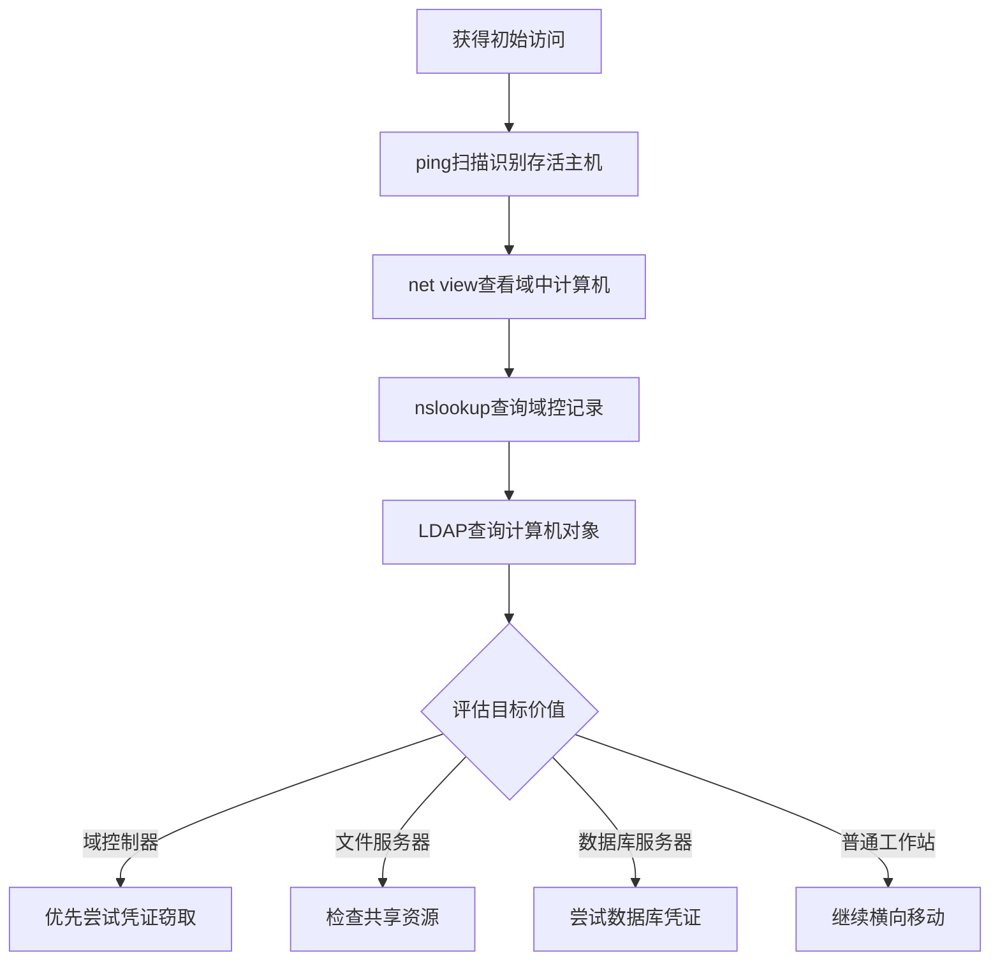

# 远程系统发现 (T1018)

## 一句话通俗理解

就像看看邻居家有没有亮灯——攻击者扫描周围哪些电脑在线，寻找可以入侵的目标。

## 30秒速查卡

| 维度 | 你需要知道的 |
|------|-------------|
| 这是什么？ | 攻击者使用 `net view`、`nslookup`、`nltest`、BloodHound/SharpHound 扫描网络中的其他系统，构建内网拓扑图 |
| 为什么危险？ | 这是横向移动的前置步骤，攻击者通过发现域控制器、文件服务器、数据库服务器等高价值目标来规划攻击路径 |
| 谁需要关心？ | SOC分析师、AD管理员、网络运维、任何需要检测内网侦察行为的安全人员 |
| 你的第一步防御 | 监控 `net view`、`nltest /dclist`、LDAP 高频枚举查询的异常执行，建立正常IT运维的网络发现频率基线 |
| 如果只做一件事 | 对短时间内从同一主机执行多个网络发现命令（net view + nslookup + nltest）的行为立即告警，这是典型的攻击链组合 |

## 难度等级

- ⭐⭐ 中级（需要一定基础）

## 技术描述

远程系统发现（T1018）是MITRE ATT&CK框架中的一种发现技术。

**通俗解释：**
攻击者入侵一台电脑后，不会满足于只在这一台电脑上活动——他们会想知道周围还有哪些电脑，就像小偷潜入一栋楼后会探头看看隔壁房间有没有人。远程系统发现就是攻击者用来探测网络中其他电脑的技术。

**技术原理：**
1. 攻击者使用网络扫描工具或命令探测子网中的其他主机
2. 通过DNS查询、LDAP查询、NetBIOS枚举、SMB枚举等方式获取计算机列表
3. 使用 `net view`、`nslookup`、`ping`、`nltest` 等命令发现域中的系统
4. 更高级的发现使用BloodHound/SharpHound通过LDAP查询获取完整的AD环境信息

**用途与影响：**
远程系统发现帮助攻击者：定位域控制器和其他关键服务器；发现SQL服务器、文件服务器等高价值目标；构建网络拓扑图；为横向移动选择跳板主机。

## 子技术列表

**该技术没有子技术。**

## 攻击流程

### 典型攻击流程

```
立足点 --> 扫描子网 --> 识别系统角色 --> 选择横向移动目标
```



**步骤详解：**

1. **ICMP扫描发现存活主机**
   - 通俗描述：挨个ping每个IP地址，看哪些电脑在线
   - 技术细节：`for /L %i in (1,1,254) do ping -n 1 192.168.1.%i`
   - 常用工具：ping、Advanced IP Scanner

2. **网络共享枚举**
   - 通俗描述：查看网络上有哪些电脑分享了文件
   - 技术细节：`net view` 列出域中的所有计算机
   - 常用工具：net.exe

3. **DNS查询发现服务器**
   - 通俗描述：查询DNS服务器获取域中各种服务的地址
   - 技术细节：`nslookup -type=SRV _ldap._tcp.dc._msdcs.&lt;domain&gt;`
   - 常用工具：nslookup.exe

4. **LDAP枚举**
   - 通俗描述：通过AD的通讯录查找所有计算机
   - 技术细节：`(&(objectClass=computer)(operatingSystem=*server*))`
   - 常用工具：AdFind、PowerView

## 真实案例

### 案例1：Lynx勒索软件 - 网络发现映射内网

- **时间**: 2025年
- **目标**: 全球企业
- **攻击组织**: Lynx Ransomware
- **手法**: Lynx勒索软件操作者入侵后使用netscan扫描整个内网，随后通过RDP横向移动到域控制器。攻击者使用Active Directory Users and Computers创建伪装账户并添加到Domain Admins组。利用netscan的结果识别备份服务器和文件服务器作为加密目标。
- **影响**: 企业数据被加密和窃取
- **参考链接**: [The DFIR Report - Lynx Ransomware](https://thedfirreport.com/2025/12/17/cats-got-your-files-lynx-ransomware/)

### 案例2：APT29 (Nobelium) - DNS远程系统发现

- **时间**: 2020年-2024年
- **目标**: 美国政府机构
- **攻击组织**: APT29
- **手法**: APT29使用 `nslookup` 和PowerShell `Resolve-DnsName` 查询DNS服务器获取域内SRV记录定位域控制器。使用 `nltest /dclist` 获取域控制器列表，通过LDAP查询定位服务器系统。
- **影响**: 政府网络被长期渗透
- **参考链接**: [MITRE - APT29](https://attack.mitre.org/groups/G0143/)

### 案例3：MuddyWater - 远程系统发现用于横向移动

- **时间**: 2026年初
- **目标**: 美国建筑公司
- **攻击组织**: MuddyWater
- **手法**: MuddyWater通过Microsoft Teams获得初始访问后，执行 `net view` 和 `nslookup` 命令发现网络中的其他系统。识别的域控制器和文件服务器被作为RDP横向移动的目标。操作者通过这些发现结果快速定位了环境中的高价值资产。
- **影响**: 凭证被窃取、内部系统被访问
- **参考链接**: [Rapid7 - MuddyWater 2026](https://www.rapid7.com/blog/post/tr-muddying-tracks-state-sponsored-shadow-behind-chaos-ransomware/)

### 案例4：Conti - 域控制器定位

- **时间**: 2021年-2022年
- **目标**: 全球企业
- **攻击组织**: Conti
- **手法**: Conti勒索软件运营团队通过 `net group "Domain Controllers" /domain` 和 `nltest /dclist` 定位域控制器。一旦确定DC地址，立即转向这些系统执行凭证窃取和勒索软件分发。
- **影响**: 多行业遭受大规模勒索攻击
- **参考链接**: [MITRE - Conti](https://attack.mitre.org/software/S0575/)

## 红队视角

> ⚠️ **免责声明**：以下内容仅用于合法的安全测试、渗透测试和教育目的。未经授权对他人系统进行测试是违法行为。

### 实战技巧

1. **使用PowerView进行域发现**
   PowerView的 `Get-NetComputer` 可以通过LDAP查询获取域中所有计算机的详细信息。

2. **BloodHound自动化发现**
   使用SharpHound收集器自动收集AD环境中的计算机、用户、组和权限关系数据。

3. **使用nltest快速发现域控**
   `nltest /dclist:&lt;domain&gt;` 是最快获取域控制器列表的方法之一。

### 常用工具

| 工具名称 | 用途 | 平台 | 链接 |
|----------|------|------|------|
| net.exe | Windows网络管理命令 | Windows | 内置命令 |
| nslookup | DNS查询工具 | 跨平台 | 内置命令 |
| nltest | 域信任和域控查询 | Windows | 内置（需安装AD工具） |
| PowerView | PowerShell域发现脚本 | Windows | [GitHub](https://github.com/PowerShellMafia/PowerSploit) |
| SharpHound | BloodHound数据收集器 | Windows | [GitHub](https://github.com/BloodHoundAD/SharpHound) |
| Advanced IP Scanner | 网络扫描工具 | Windows | [官网](https://www.advanced-ip-scanner.com/) |

### 注意事项

- `net view` 需要在域环境中才能返回完整结果
- LDAP查询可能被域控制器上的审计策略记录
- BloodHound的SharpHound收集器可能被EDR检测

## 蓝队视角

### 检测要点

1. **net view和net group的异常使用**
   - 日志来源：Windows Security Event ID 4688
   - 异常特征：非管理员账户批量执行net命令

2. **LDAP查询异常**
   - 日志来源：Windows Event ID 1644（LDAP查询）
   - 关注字段：查询包含objectClass=computer等高频枚举

3. **网络扫描行为**
   - 日志来源：防火墙日志、IDS
   - 关注字段：同一源IP对多个目标IP的端口探测

### 监控建议

- 启用对LDAP查询的日志记录
- 监控nltest的异常使用
- 使用网络检测系统识别扫描行为

## 检测建议

### 网络层检测

**检测方法：** 监控内部子网的横向扫描流量。

### 主机层检测

**Windows事件ID：**
- 事件ID 4688：进程创建
- 事件ID 5140：文件共享访问（SMB枚举）
- 事件ID 1644：LDAP查询

### 应用层检测

**用人话说：** 这条规则在监控有人用 `nltest` 命令查询域控制器列表。攻击者为什么要找域控制器？因为域控制器是整个 Windows 域环境的"大脑"，控制着所有用户和计算机的认证。一旦拿到域控权限，攻击者就能控制整个网络。正常情况下，只有 AD 管理员在做运维时才会用 `nltest /dclist`，普通用户或非 AD 管理人员执行这个命令就值得怀疑。如果你看到有人先执行 `net view` 发现计算机，再用 `nltest` 查域控，这就是典型的攻击链：先摸清网络，再找核心目标。

**Sigma规则示例：**
```yaml
title: Domain Controller Discovery via Nltest
status: experimental
description: Detects domain controller discovery via nltest
logsource:
    category: process_creation
    product: windows
detection:
    selection:
        Image|endswith: '\nltest.exe'
        CommandLine|contains: '/dclist'
    condition: selection
level: medium
tags:
    - attack.t1018
```

## 缓解措施

### 优先级1：关键措施

**措施名称：** 实施网络分段

**具体实施步骤：**
1. 划分不同安全区域
2. 限制不同子网之间的横向通信
3. 配置防火墙规则限制扫描

### 优先级2：重要措施

**措施名称：** 限制LDAP查询权限

**具体实施步骤：**
1. 配置AD安全策略限制普通用户枚举计算机对象
2. 使用审计策略监控异常LDAP查询

### 优先级3：建议措施

**措施名称：** 禁用不必要协议

**具体实施步骤：**
1. 禁用NetBIOS和LLMNR
2. 限制mDNS和WPAD

### MITRE ATT&CK 缓解措施映射

| 缓解措施ID | 缓解措施名称 | 适用性 | 说明 |
|------------|-------------|--------|------|
| M1030 | Network Segmentation | 适用 | 限制横向移动范围 |
| M1028 | Operating System Configuration | 部分适用 | 禁用不必要网络协议 |
| M1018 | User Account Control | 部分适用 | 限制执行权限 |

## 动手实验

> ⚠️ **重要提示**：所有实验必须在隔离的实验室环境中进行，禁止对未授权的真实系统进行测试。

### 实验环境准备

**推荐靶场：** TryHackMe AD环境、Hack The Box

**所需工具：** Windows域环境VM、PowerShell

### 实验1：基本网络发现（初级）

**实验目标：** 学习使用Windows内置命令发现网络中的系统。

**实验步骤：**
1. 在域环境中执行 `net view` 查看域中计算机列表
2. 执行 `nslookup -type=all `<domain>`` 查看DNS记录
3. 执行 `ping -n 1 `<target>`` 测试连通性
4. 使用 `arp -a` 查看通信记录

**预期结果：** 看到域中其他计算机的信息。

**学习要点：** 理解基本的远程发现命令。

## 术语解释

| 术语 | 英文原名 | 通俗解释 |
|------|----------|----------|
| 域 | Domain | Windows网络中的管理组，像一个公司组织 |
| 域控制器 | Domain Controller | AD域的总服务器，管所有计算机和用户 |
| LDAP | Lightweight Directory Access Protocol | 访问AD目录服务的协议，像查电话本 |
| NetBIOS | Network Basic I/O System | 老式的网络名称解析协议 |
| SMB | Server Message Block | Windows文件共享和打印协议 |
| SRV记录 | Service Record | DNS中标识某种服务在哪台服务器的记录 |

## 参考资料

### 官方文档

- [MITRE ATT&CK - T1018](https://attack.mitre.org/techniques/T1018/)
- [Microsoft - Net View](https://learn.microsoft.com/en-us/windows-server/administration/windows-commands/net-view)

### 安全报告

- [Rapid7 - MuddyWater 2026](https://www.rapid7.com/blog/post/tr-muddying-tracks-state-sponsored-shadow-behind-chaos-ransomware/)
- [The DFIR Report - Lynx Ransomware](https://thedfirreport.com/2025/12/17/cats-got-your-files-lynx-ransomware/)

### 工具与资源

- [BloodHound](https://github.com/BloodHoundAD/BloodHound)
- [PowerView](https://github.com/PowerShellMafia/PowerSploit)
- [Advanced IP Scanner](https://www.advanced-ip-scanner.com/)
