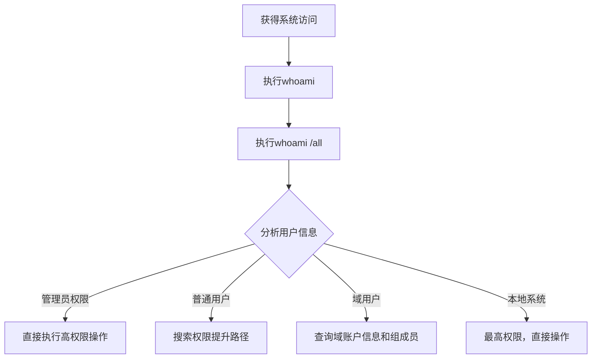

# 系统所有者/用户发现 (T1033)

## 一句话通俗理解

攻击者用whoami命令查看当前是谁在操作电脑——就像小偷进屋后先喊一声"有人吗"。

## 30秒速查卡

| 维度 | 你需要知道的 |
|------|-------------|
| 这是什么？ | 攻击者执行 `whoami`、`whoami /all`、`whoami /priv` 查看当前登录用户身份、所属组和拥有的特权，判断权限等级 |
| 为什么危险？ | 这是几乎所有攻击链的第一步，攻击者通过用户发现判断当前是普通用户还是管理员，决定是直接操作还是需要先提权 |
| 谁需要关心？ | SOC分析师、Windows管理员、任何需要检测早期入侵迹象的安全人员 |
| 你的第一步防御 | 监控 `whoami.exe` 的异常执行上下文，特别是从计划任务、服务进程或脚本宿主中执行的情况 |
| 如果只做一件事 | 对非IT人员的电脑上或非工作时间出现的 `whoami /all` 或 `whoami /priv` 执行立即告警，因为正常办公用户不需要查看完整权限信息 |

## 难度等级

- ⭐ 初级（新手可学）

## 技术描述

系统所有者/用户发现（T1033）是MITRE ATT&CK框架中的一种发现技术。

**通俗解释：**
攻击者入侵一台电脑后，第一个命令通常是 `whoami`——这个命令会告诉攻击者当前登录的用户名是什么。这就像小偷潜入一间办公室后，先看看桌上的名牌。攻击者需要知道：当前是普通用户还是管理员？是本地账户还是域账户？这决定了后面能做什么。

**技术原理：**
1. 攻击者在受感染系统上执行 `whoami` 命令查询当前用户
2. 使用 `whoami /all` 获取用户的所有组信息和权限
3. 使用 `whoami /priv` 查看当前用户拥有的特权
4. 还可以通过 `net config workstation`、`echo %username%` 等方式获取用户名
5. 在Linux中使用 `id`、`who`、`w` 等命令

**用途与影响：**
攻击者通过用户发现可以：判断权限等级（普通用户还是管理员）；确认是否在域环境中；定位高权限账户和特权；识别当前是否有其他用户在线；为权限提升和横向移动提供依据。

## 子技术列表

**该技术没有子技术。**

## 攻击流程

### 典型攻击流程

```
获得访问 --> 查询当前用户 --> 检查权限 --> 规划后续行动
```



**步骤详解：**

1. **查询当前用户**
   - 通俗描述：执行whoami看当前是谁
   - 技术细节：`whoami` 命令立即返回当前用户名和域名
   - 常用工具：whoami.exe（内置命令）

2. **检查用户权限**
   - 通俗描述：查看当前用户有哪些权限
   - 技术细节：`whoami /priv` 列出所有启用的特权
   - 常用工具：whoami.exe

3. **查看组成员**
   - 通俗描述：看这个用户属于哪些组
   - 技术细节：`whoami /groups` 列出所有组成员身份
   - 常用工具：whoami.exe

4. **规划后续行动**
   - 通俗描述：根据用户权限决定下一步
   - 技术细节：管理员直接操作，普通用户寻找提权路径
   - 常用工具：结合其他发现工具

## 真实案例

### 案例1：Conti勒索软件 - whoami确认权限

- **时间**: 2021年-2022年
- **目标**: 全球企业网络
- **攻击组织**: Conti
- **手法**: Conti勒索软件在部署前通过Cobalt Strike的BEACON执行 `whoami` 命令确认当前用户权限等级。如果返回的是 `nt authority\system` 或域管理员账户，Conti直接开始文件加密。如果是普通域用户，则先尝试通过Mimikatz窃取凭证提权后再执行加密操作。
- **影响**: 大规模勒索攻击导致业务中断
- **参考链接**: [MITRE - Conti](https://attack.mitre.org/software/S0575/)

### 案例2：MuddyWater - Teams欺骗中的身份确认

- **时间**: 2026年初
- **目标**: 美国建筑公司
- **攻击组织**: MuddyWater
- **手法**: MuddyWater操作者通过Microsoft Teams屏幕共享访问受害者系统后，远程执行 `whoami` 命令确认当前登录用户身份。然后使用 `whoami /groups` 检查该用户是否属于Domain Admins组。确认用户为域管理员后，攻击者立即使用该权限创建计划任务、部署远程管理工具（AnyDesk、DWAgent），并通过RDP横向移动到域控制器。
- **影响**: 凭证被窃取、内网被全面渗透
- **参考链接**: [Rapid7 - MuddyWater 2026](https://www.rapid7.com/blog/post/tr-muddying-tracks-state-sponsored-shadow-behind-chaos-ransomware/)

### 案例3：RansomHub - 用户发现用于身份验证

- **时间**: 2024年-2025年
- **目标**: 全球企业
- **攻击组织**: RansomHub
- **手法**: RansomHub攻击者通过RDP密码喷洒获得初始访问后，立即在每台入侵的机器上执行 `whoami`。通过对比不同系统上的用户信息，攻击者识别出哪些账户是域管理员，并利用这些信息规划后续的横向移动。`whoami /priv` 揭示的特权信息帮助攻击者判断哪些系统可以执行敏感操作。
- **影响**: 多行业遭受勒索加密
- **参考链接**: [The DFIR Report - RansomHub 2025](https://thedfirreport.com/2025/06/30/hide-your-rdp-password-spray-leads-to-ransomhub-deployment/)

### 案例4：APT29 - 用户身份验证

- **时间**: 2020年-2024年
- **目标**: 美国政府机构
- **攻击组织**: APT29
- **手法**: APT29在SolarWinds供应链攻击后，通过BEACON执行 `whoami` 验证每个被访问系统的用户上下文。他们将 `whoami` 输出与之前收集的凭证信息对比，确认凭证有效性。APT29还使用 `whoami /groups` 检查用户是否拥有敏感的AD组成员身份。
- **影响**: 政府网络被长期渗透
- **参考链接**: [MITRE - APT29](https://attack.mitre.org/groups/G0143/)

## 红队视角

> ⚠️ **免责声明**：以下内容仅用于合法的安全测试、渗透测试和教育目的。未经授权对他人系统进行测试是违法行为。

### 实战技巧

1. **使用whoami /all查看完整信息**
   `whoami /all` 一次性显示用户名、SID、组信息和所有特权，比单独执行多个命令更高效。

2. **通过环境变量获取用户名**
   `echo %username%` 和 `echo %userdomain%` 可以不调用whoami.exe获取信息，减少检测面。

3. **检查令牌信息**
   在PowerShell中使用 `[System.Security.Principal.WindowsIdentity]::GetCurrent()` 获取完整的令牌信息。

### 常用工具

| 工具名称 | 用途 | 平台 | 链接 |
|----------|------|------|------|
| whoami | 查询当前用户和权限 | Windows | 内置命令 |
| id | 查询用户和组ID | Linux/macOS | 内置命令 |
| who/w | 查看登录用户 | Linux/macOS | 内置命令 |
| net config workstation | 查看工作站配置和用户 | Windows | 内置命令 |

### 注意事项

- whoami命令在Windows中属于低风险活动，很少被监控
- 但结合其他发现命令的链式行为需要隐蔽执行
- 在Linux中使用 `id` 和 `who` 同样能获取用户信息

## 蓝队视角

### 检测要点

1. **whoami的异常执行上下文**
   - 日志来源：Sysmon Event ID 1、Windows Security Event ID 4688
   - 异常特征：由计划任务、服务进程或脚本宿主执行whoami
   - 异常特征：在短时间内从同一主机执行多次whoami

2. **whoami /all的特定关注**
   - 日志来源：PowerShell ScriptBlock Logging
   - 关注字段：命令行包含`/all`、`/priv`、`/groups`参数
   - 异常特征：与group policy discovery等其他命令结合

### 监控建议

- 建立whoami执行的基线（正常IT管理频率）
- 使用Sysmon记录所有whoami执行的命令行参数
- 关注whoami与其他发现命令的组合模式

## 检测建议

### 网络层检测

**检测方法：** 监控远程用户枚举行为的网络流量特征，特别关注通过 SMB/RPC 协议查询当前登录用户的异常行为。

**具体规则/命令示例：**
```
# 检测内部网络中针对多个主机的 SMB 会话枚举（如使用 PsExec 上下文中的 whoami）
# 关注同一 source IP 在同一时间窗口内对多个目标 IP 发起的 SMB RPC 查询
cat smb_command.log | grep -i "user" | awk '{print $3}' | sort | uniq -c | sort -nr | head -10
```

### 主机层检测

**Windows事件ID：**
- 事件ID 4688：进程创建（监控whoami.exe执行）
- Sysmon Event ID 1：进程创建

**具体命令示例：**
```bash
Get-WinEvent -FilterHashtable @{LogName='Security';Id=4688} | Where-Object {$_.Message -match 'whoami'}
```

### 应用层检测

**用人话说：** 这条规则在监控有人执行 `whoami` 命令。whoami 本身是个很常见的命令，IT 运维人员经常用。但攻击者入侵后第一件事往往就是执行 whoami，看看自己是什么权限。关键判断标准是"谁在什么情况下执行"：如果是 IT 管理员在管理服务器，那是正常操作；但如果一个普通员工的电脑上突然有计划任务或后台进程执行了 whoami，或者凌晨有人在多台机器上连续执行 whoami，那就是攻击者在"摸底"，看看自己拿到了什么权限，接下来该怎么做。

**Sigma规则示例：**
```yaml
title: Whoami Execution
status: experimental
description: Detects execution of whoami for user discovery
logsource:
    category: process_creation
    product: windows
detection:
    selection:
        Image|endswith: '\whoami.exe'
    condition: selection
level: low
tags:
    - attack.t1033
```

## 缓解措施

### 优先级1：关键措施

**措施名称：** 实施应用程序白名单

**具体实施步骤：**
1. 使用AppLocker限制whoami.exe的执行上下文
2. 配置WDAC限制脚本执行权限

### 优先级2：重要措施

**措施名称：** 用户权限控制

**具体实施步骤：**
1. 移除不必要的管理员权限
2. 实施最小权限原则

### 优先级3：建议措施

**措施名称：** 监控与审计

**具体实施步骤：**
1. 启用进程创建审计
2. 建立whoami执行的基线报警

### MITRE ATT&CK 缓解措施映射

| 缓解措施ID | 缓解措施名称 | 适用性 | 说明 |
|------------|-------------|--------|------|
| M1026 | Privileged Account Management | 适用 | 减少高权限账户数量 |
| M1038 | Execution Prevention | 部分适用 | 限制whoami执行上下文 |
| M1047 | Audit | 适用 | 启用用户发现审计 |

## 动手实验

> ⚠️ **重要提示**：所有实验必须在隔离的实验室环境中进行，禁止对未授权的真实系统进行测试。

### 实验环境准备

**所需工具：** Windows VM

### 实验1：用户发现练习（初级）

**实验目标：** 学习使用whoami命令。

**实验步骤：**
1. 打开命令提示符，执行 `whoami`
2. 执行 `whoami /user` 查看用户SID
3. 执行 `whoami /groups` 查看组成员身份
4. 执行 `whoami /priv` 查看用户特权
5. 执行 `echo %username%` 通过环境变量获取用户名

**预期结果：** 看到当前用户的详细身份信息。

**学习要点：** 理解whoami命令的各种参数和输出。

## 术语解释

| 术语 | 英文原名 | 通俗解释 |
|------|----------|----------|
| SID | Security Identifier | Windows中每个用户和组的唯一编号 |
| 特权 | Privilege | 用户拥有的特殊权限，如关机、调试程序等 |
| 令牌 | Token | 用户登录时Windows发的身份证明 |
| 本地系统 | LocalSystem | Windows中最高权限的系统账户 |
| UAC | User Account Control | Windows的用户账户控制机制 |

## 参考资料

### 官方文档

- [MITRE ATT&CK - T1033](https://attack.mitre.org/techniques/T1033/)
- [Microsoft - Whoami](https://learn.microsoft.com/en-us/windows-server/administration/windows-commands/whoami)

### 安全报告

- [Rapid7 - MuddyWater 2026](https://www.rapid7.com/blog/post/tr-muddying-tracks-state-sponsored-shadow-behind-chaos-ransomware/)
- [The DFIR Report - RansomHub 2025](https://thedfirreport.com/2025/06/30/hide-your-rdp-password-spray-leads-to-ransomhub-deployment/)
