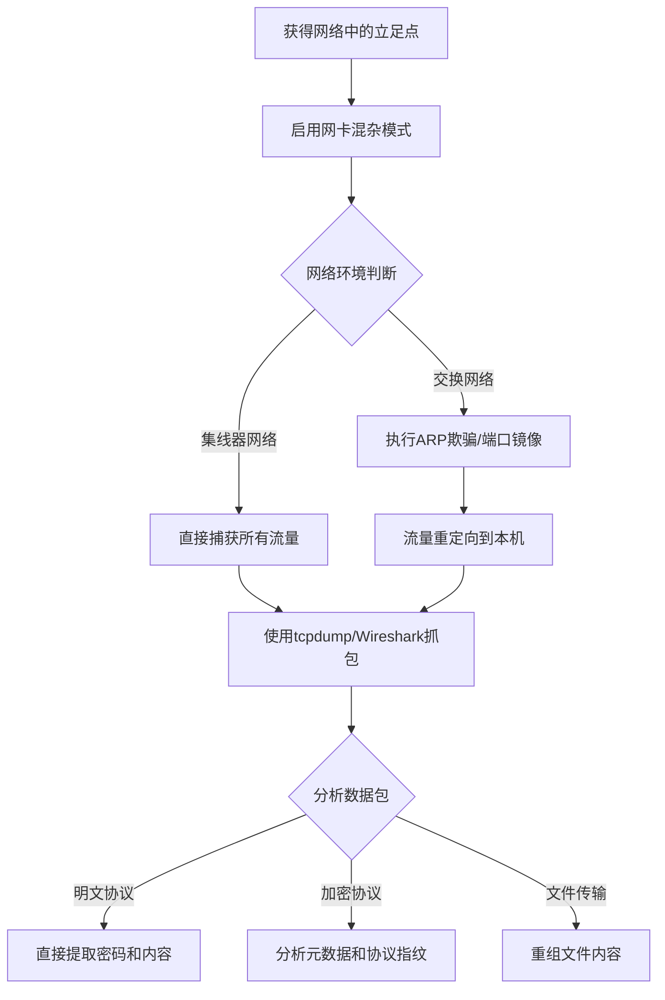

# 网络嗅探 (T1040)

## 一句话通俗理解

就像偷听别人打电话——攻击者捕获网络中的通信数据包，从中提取敏感信息。

## 30秒速查卡

| 维度 | 你需要知道的 |
|------|-------------|
| 这是什么？ | 攻击者将网卡设为混杂模式，使用 Wireshark/tcpdump 捕获网络流量，从明文协议中提取密码、会话Cookie等敏感信息 |
| 为什么危险？ | 网络嗅探能直接获取明文传输的凭证（HTTP、FTP、Telnet），攻击者无需入侵目标系统就能窃取敏感数据 |
| 谁需要关心？ | 网络安全团队、SOC分析师、任何需要检测ARP欺骗和异常抓包行为的安全人员 |
| 你的第一步防御 | 监控网卡混杂模式启用、ARP应答异常、Wireshark/tcpdump 等抓包工具的安装和执行 |
| 如果只做一件事 | 对非网络管理员电脑上安装 WinPcap/Npcap 或执行抓包工具的行为立即告警，因为正常业务不需要这些工具 |

## 难度等级

- ⭐⭐⭐ 高级（需要深入技术知识）

## 技术描述

网络嗅探（T1040）是MITRE ATT&CK框架中的一种发现技术。

**通俗解释：**
电脑之间通信时，数据会被切成小块（数据包）在网络中传输。如果攻击者能听到这些通信，就能看到别人在传输什么内容。就像在电话线上搭一根线就能偷听通话一样，网络嗅探就是在网络上偷听数据通信。

**技术原理：**
1. 攻击者在目标网络中获取一个有网络接口的系统控制权
2. 将网卡设置为"混杂模式"，使其能接收所有经过的数据包（而不只是发给自己的）
3. 使用抓包工具（如Wireshark、tcpdump）捕获网络流量
4. 从捕获的数据包中提取明文传输的敏感信息（密码、会话Cookie、文件内容等）
5. 在交换网络中需配合ARP欺骗或端口镜像等技术才能看到非本机流量

**用途与影响：**
攻击者通过网络嗅探可以：捕获网络中明文传输的密码和凭证；窃听邮件通信和即时消息；获取文件传输中的数据；分析网络协议和流量模式；收集网络拓扑信息。

## 子技术列表

**该技术没有子技术。**

## 攻击流程

### 典型攻击流程

```
获得可控主机 --> 配置网卡为混杂模式 --> 捕获流量 --> 提取敏感信息
```



**步骤详解：**

1. **获得立足点**
   - 通俗描述：先攻下一台能访问目标网络的主机
   - 技术细节：通过漏洞利用或横向移动获得目标网段中的主机控制权
   - 常用工具：Cobalt Strike、Metasploit

2. **启用混杂模式**
   - 通俗描述：让网卡能听到所有经过的网络通信
   - 技术细节：使用工具将网卡设置为promiscuous mode
   - 常用工具：tcpdump、Wireshark、WinPcap

3. **捕获流量**
   - 通俗描述：开始录制网络中的通信数据
   - 技术细节：设置抓包过滤规则，捕获感兴趣的流量
   - 常用工具：tcpdump、Wireshark、tshark

4. **提取信息**
   - 通俗描述：从录制的数据中找出密码等有用信息
   - 技术细节：使用协议分析器解析数据包内容
   - 常用工具：Wireshark、strings、NetworkMiner

## 真实案例

### 案例1：MuddyWater - 凭证嗅探

- **时间**: 2025年-2026年
- **目标**: 美国和中东组织
- **攻击组织**: MuddyWater
- **手法**: MuddyWater在入侵后部署自定义工具捕获网络流量。通过嗅探内部网络中的身份验证流量提取凭证。在某些情况下，操作者直接在横向移动过程中从被感染系统的内存和网络流量中捕获管理员登录凭证。
- **影响**: 凭证失窃导致横向移动扩大
- **参考链接**: [Rapid7 - MuddyWater 2026](https://www.rapid7.com/blog/post/tr-muddying-tracks-state-sponsored-shadow-behind-chaos-ransomware/)

### 案例2：FIN6 - POS网络嗅探

- **时间**: 2018年-2020年
- **目标**: 零售POS系统
- **攻击组织**: FIN6
- **手法**: FIN6在入侵POS网络后，在交换网络中部署ARP欺骗工具配合Wireshark捕获卡支付流量。攻击者从捕获的网络流量中提取信用卡磁道数据。FIN6使用自定义的嗅探脚本过滤特定端口的流量，将捕获的信用卡数据打包后通过C2信道外传。
- **影响**: 数百万张信用卡信息被窃取
- **参考链接**: [MITRE - FIN6](https://attack.mitre.org/groups/G0037/)

### 案例3：APT28 - 内网流量分析

- **时间**: 2018年-2020年
- **目标**: 全球政府机构
- **攻击组织**: APT28 (Fancy Bear)
- **手法**: APT28在入侵目标网络后部署嗅探工具捕获内部通信流量。通过分析流量模式识别邮件服务器、文件服务器和域控制器的IP地址。APT28特别关注SMTP和HTTP流量中的明文凭证传输。
- **影响**: 政府通信被监听
- **参考链接**: [MITRE - APT28](https://attack.mitre.org/groups/G0007/)

## 红队视角

> ⚠️ **免责声明**：以下内容仅用于合法的安全测试、渗透测试和教育目的。未经授权对他人系统进行测试是违法行为。

### 实战技巧

1. **使用tcpdump最小化抓包**
   `tcpdump -i eth0 -nn -s 0 port 21 or port 23 or port 80` 只捕获明文协议端口，减少数据量。

2. **ARP欺骗配合嗅探**
   在交换网络中使用 `arpspoof` 进行ARP欺骗，将目标主机的流量重定向到攻击者机器。

3. **使用PowerShell捕获流量**
   PowerShell的 `Get-NetAdapter` 配合 `New-NetEventSession` 可以捕获Windows中的网络流量。

### 常用工具

| 工具名称 | 用途 | 平台 | 链接 |
|----------|------|------|------|
| Wireshark | 图形化网络协议分析器 | 跨平台 | [wireshark.org](https://www.wireshark.org/) |
| tcpdump | 命令行抓包工具 | Linux/Unix | 内置(多数Linux) |
| tshark | Wireshark的命令行版本 | 跨平台 | [wireshark.org](https://www.wireshark.org/) |
| NetworkMiner | 网络取证工具 | Windows | [netresec.com](https://www.netresec.com/?page=NetworkMiner) |
| Cain & Abel | 密码恢复和嗅探工具 | Windows | [oxid.it](http://www.oxid.it/cain.html) |

### 注意事项

- 混杂模式在高流量环境中会产生大量数据
- 交换网络需要ARP欺骗才能嗅探非本机流量
- 实施ARP欺骗可能被网络检测系统捕获
- 越来越多网络通信采用加密协议（HTTPS、SSH）

## 蓝队视角

### 检测要点

1. **混杂模式检测**
   - 日志来源：EDR、网络设备日志
   - 关注字段：网卡状态变为混杂模式
   - 检测命令：`ip link show` 检查PROMISC标志

2. **ARP欺骗检测**
   - 日志来源：交换机日志、ARP流量监控
   - 关注字段：异常的ARP应答（同一IP对应多个MAC地址）
   - 工具：arpwatch、xarp

3. **抓包工具检测**
   - 日志来源：Sysmon Event ID 1、软件安装日志
   - 关注字段：Wireshark、tcpdump、WinPcap的安装或执行
   - 异常特征：非网络管理员的系统安装抓包工具

### 监控建议

- 部署ARP欺骗检测工具（如arpwatch）
- 监控网卡混杂模式的启用
- 限制非授权安装抓包工具
- 实施网络加密（HTTPS、SSH）减少明文流量

## 检测建议

### 网络层检测

**检测方法：** 监控ARP流量异常和混杂模式检测。

**ARP欺骗检测命令示例：**
```bash
# 使用arpwatch监控ARP变化
sudo arpwatch -i eth0
```

### 主机层检测

**Windows事件ID：**
- 事件ID 4688：进程创建（监控Wireshark、tcpdump执行）
- Sysmon Event ID 1：进程创建
- 软件安装日志：监控WinPcap/Npcap安装

**Linux检测命令：**
```bash
# 检查网卡是否处于混杂模式
ip link show | grep PROMISC
# 检查抓包进程
ps aux | grep tcpdump
```

### 应用层检测

**用人话说：** 这条规则在监控有人运行抓包工具（Wireshark、tcpdump 等）。抓包工具本身是合法的网络诊断工具，网络管理员经常用。但攻击者用它来做完全不同的事情——窃听网络中的密码和敏感数据。关键判断标准是：谁在用？在哪台机器上？正常情况下，抓包工具只应该出现在网络管理员的工作站上，而且是在授权的网络监控时段。如果普通员工的电脑上出现了 Wireshark，或者生产服务器上有人在跑 tcpdump，那就值得高度怀疑。攻击者用 ARP 欺骗配合抓包，能把整个网段的流量都引流到自己机器上。

**Sigma规则示例：**
```yaml
title: Network Sniffing Tool Execution
status: experimental
description: Detects execution of common network sniffing tools
logsource:
    category: process_creation
    product: windows
detection:
    selection:
        Image|endswith:
            - '\wireshark.exe'
            - '\tshark.exe'
            - '\tcpdump.exe'
            - '\dumpcap.exe'
    condition: selection
level: high
tags:
    - attack.t1040
```

## 缓解措施

### 优先级1：关键措施

**措施名称：** 实施网络加密

**具体实施步骤：**
1. 对所有内部通信启用加密协议（HTTPS、SSH、SMB加密）
2. 禁用明文协议（Telnet、FTP、HTTP）
3. 配置SMB签名和加密

### 优先级2：重要措施

**措施名称：** 网络分段和访问控制

**具体实施步骤：**
1. 实施网络微分段限制嗅探范围
2. 使用802.1X网络访问控制限制端口接入
3. 禁用交换机上的端口镜像未授权使用

### 优先级3：建议措施

**措施名称：** 监控和检测

**具体实施步骤：**
1. 部署网络异常检测系统
2. 监控ARP欺骗行为
3. 限制管理员权限上的抓包工具安装

### MITRE ATT&CK 缓解措施映射

| 缓解措施ID | 缓解措施名称 | 适用性 | 说明 |
|------------|-------------|--------|------|
| M1041 | Encrypt Sensitive Information | 适用 | 加密网络通信防止嗅探 |
| M1030 | Network Segmentation | 适用 | 限制嗅探器可达范围 |
| M1037 | Filter Network Traffic | 部分适用 | 使用ACL限制流量捕获 |

## 动手实验

> ⚠️ **重要提示**：所有实验必须在隔离的实验室环境中进行，禁止对未授权的真实系统进行测试。

### 实验环境准备

**推荐靶场：** TryHackMe Network Security模块

**所需工具：**
- Linux VM（Kali推荐）
- Windows VM（作为目标）
- tcpdump、Wireshark

### 实验1：tcpdump基础抓包（初级）

**实验目标：** 学习使用tcpdump捕获网络流量。

**实验步骤：**
1. 在Linux VM上启动tcpdump：
   ```bash
   sudo tcpdump -i eth0 -nn
   ```
2. 从另一台机器ping本机
3. 观察tcpdump输出中的ICMP包
4. 使用 `-X` 参数查看数据包内容

**预期结果：** 看到网络中的ICMP请求和响应数据包。

**学习要点：** 理解tcpdump的基本用法和数据包结构。

## 术语解释

| 术语 | 英文原名 | 通俗解释 |
|------|----------|----------|
| 嗅探 | Sniffing | 在网络上监听并捕获数据包 |
| 混杂模式 | Promiscuous Mode | 网卡的一种模式，能接收所有经过的数据包 |
| 数据包 | Packet | 网络通信中的最小数据单元 |
| ARP欺骗 | ARP Spoofing | 伪造地址解析协议应答，把流量引导到攻击者 |
| 明文 | Plaintext | 未加密的数据，可以直接阅读 |
| 协议分析 | Protocol Analysis | 分析数据包内容理解通信含义 |

## 参考资料

### 官方文档

- [MITRE ATT&CK - T1040](https://attack.mitre.org/techniques/T1040/)
- [Wireshark Documentation](https://www.wireshark.org/docs/)
- [tcpdump Manual](https://www.tcpdump.org/manpages/tcpdump.1.html)

### 安全报告

- [Rapid7 - MuddyWater 2026](https://www.rapid7.com/blog/post/tr-muddying-tracks-state-sponsored-shadow-behind-chaos-ransomware/)

### 工具与资源

- [Wireshark](https://www.wireshark.org/)
- [tcpdump](https://www.tcpdump.org/)
- [NetworkMiner](https://www.netresec.com/?page=NetworkMiner)
