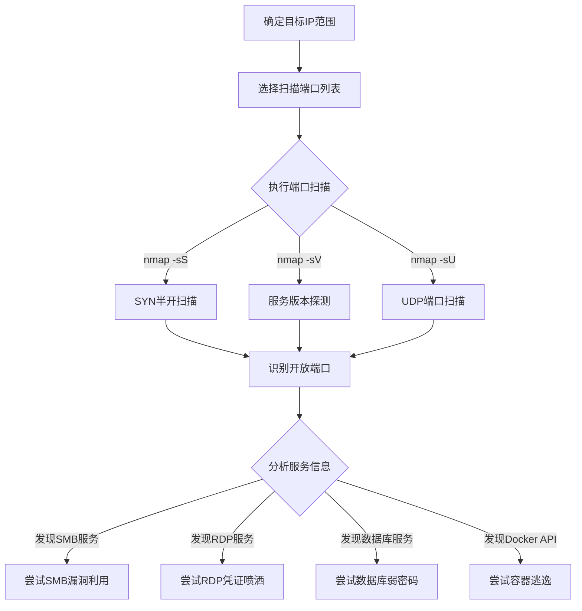

# 网络服务扫描 (T1046)

## 一句话通俗理解

就像小偷挨家挨户敲门看哪扇门没锁——攻击者扫描哪些端口开放、运行了什么服务。

## 难度等级

- ⭐⭐ 中级（需要一定基础）

## 技术描述

网络服务扫描（T1046）是MITRE ATT&CK框架中的一种发现技术。

**通俗解释：**
电脑上的每个网络服务（如Web服务、远程桌面、文件共享）就像房子的一扇门，每个门都有一个门牌号（端口号）。攻击者入侵后，会扫描其他电脑上有哪些门是开着的（端口开放），以及门后面是什么服务。

**技术原理：**
1. 攻击者对目标IP地址的端口范围发起TCP/UDP连接请求
2. 根据响应判断端口是否开放以及运行的服务类型
3. 使用 `nmap -sV` 进行服务版本探测，识别具体软件和版本号
4. 常见目标端口包括：22（SSH）、3389（RDP）、445（SMB）、1433（MSSQL）、3306（MySQL）、6379（Redis）、2375（Docker API）

**用途与影响：**
攻击者通过服务扫描可以：发现运行了哪些网络服务；识别服务版本号寻找已知漏洞；定位数据库、Web、远程管理等高价值服务；评估攻击面的广度和深度。

## 子技术列表

**该技术没有子技术。**

## 攻击流程

### 典型攻击流程

```
确定目标IP --> 选择端口范围 --> 执行扫描 --> 分析结果 --> 针对性攻击
```



**步骤详解：**

1. **确定扫描目标**
   - 通俗描述：确定要扫描哪些IP地址
   - 技术细节：根据网络配置发现结果确定IP段
   - 常用工具：ipconfig、route print

2. **端口扫描**
   - 通俗描述：逐个测试端口是否开放
   - 技术细节：使用nmap等工具发送探测包并分析响应
   - 常用工具：nmap、masscan、Advanced IP Scanner

3. **服务识别**
   - 通俗描述：确定开放端口后面是什么服务
   - 技术细节：使用nmap -sV进行服务指纹识别
   - 常用工具：nmap

4. **漏洞匹配**
   - 通俗描述：将服务版本与已知漏洞数据库对比
   - 技术细节：结合漏洞数据库（CVE、Exploit-DB）匹配
   - 常用工具：searchsploit、NSE脚本

## 真实案例

### 案例1：Agenda (Qilin) - 勒索软件前的网络扫描

- **时间**: 2025年
- **目标**: 全球企业
- **攻击组织**: Agenda Ransomware
- **手法**: Agenda勒索软件攻击者使用NetScan工具扫描内网中的SMB（445）、RDP（3389）和WinRM（5985）端口。通过扫描结果识别可供横向移动的目标系统。攻击者还专门扫描了备份服务器（Veeam）和虚拟化平台（ESXi）的服务端口，确保在勒索加密前能覆盖所有关键系统。
- **影响**: 跨平台勒索加密导致业务中断
- **参考链接**: [Trend Micro - Agenda 2025](https://www.trendmicro.com/en/research/25/j/agenda-ransomware-deploys-linux-variant-on-windows-systems.html)

### 案例2：MuddyWater - 横向移动端口扫描

- **时间**: 2026年初
- **目标**: 美国建筑公司
- **攻击组织**: MuddyWater
- **手法**: MuddyWater操作者通过Teams屏幕共享获得访问后，在内部网络执行端口扫描。识别开放的RDP端口（3389）后，使用窃取的凭证通过RDP横向移动到域控制器和其他服务器。扫描发现的关键服务端口直接引导了后续的横向移动路径选择。
- **影响**: 内网被全面渗透
- **参考链接**: [Rapid7 - MuddyWater 2026](https://www.rapid7.com/blog/post/tr-muddying-tracks-state-sponsored-shadow-behind-chaos-ransomware/)

### 案例3：Lazarus Group - 内网端口扫描

- **时间**: 2020年-2024年
- **目标**: 加密货币交易所
- **攻击组织**: Lazarus
- **手法**: Lazarus使用MATA框架中的扫描器模块对内网IP段进行TCP端口扫描。重点关注22、80、443、445、3389、8080、8443等端口。扫描结果用于识别运行Web服务、远程管理和数据库服务的主机，为横向移动提供目标清单。
- **影响**: 多国加密货币平台被入侵
- **参考链接**: [Securelist - Lazarus MATA Framework](https://securelist.com/mata-multi-platform-cyber-framework/102140/)

### 案例4：TeamTNT - 云环境端口扫描

- **时间**: 2020年-2022年
- **目标**: 云托管环境
- **攻击组织**: TeamTNT
- **手法**: TeamTNT使用Masscan和Zmap高速扫描2375（Docker API）、6443（Kubernetes API）、9200（Elasticsearch）等端口。发现开放的Docker API后立即尝试容器部署和逃逸。
- **影响**: 数千个云主机被植入挖矿程序
- **参考链接**: [Cisco Talos - TeamTNT](https://blog.talosintelligence.com/teamtnt-cloud-activity/)

## 红队视角

> ⚠️ **免责声明**：以下内容仅用于合法的安全测试、渗透测试和教育目的。未经授权对他人系统进行测试是违法行为。

### 实战技巧

1. **隐蔽扫描技术**
   使用 `nmap -sS`（SYN半开扫描）减少完整连接留下的日志。配合 `-T1` 或 `--scan-delay` 降低扫描速度。

2. **PowerShell端口扫描**
   使用 `Test-NetConnection` 或 `TcpClient` 进行最小化的端口探测，减少使用第三方工具。

3. **关注非标准端口**
   除了常见端口，关注8080、8443、9200、27017等Web管理台和数据库端口。

### 常用工具

| 工具名称 | 用途 | 平台 | 链接 |
|----------|------|------|------|
| Nmap | 端口扫描和网络探测 | 跨平台 | [nmap.org](https://nmap.org/) |
| Masscan | 大规模端口扫描 | 跨平台 | [GitHub](https://github.com/robertdavidgraham/masscan) |
| Advanced IP Scanner | 图形化网络扫描 | Windows | [官网](https://www.advanced-ip-scanner.com/) |
| PowerShell | Test-NetConnection | Windows | 内置 |
| NetScan | 网络扫描工具 | Windows | [官网](https://www.softperfect.com/products/networkscanner/) |

### 注意事项

- 端口扫描会在网络设备上留下大量连接日志
- 某些IDS/IPS配置了端口扫描检测规则
- 在非授权环境中执行端口扫描是违法行为

## 蓝队视角

### 检测要点

1. **大量TCP连接尝试**
   - 日志来源：防火墙日志、Windows Event ID 5156
   - 关注字段：同一源IP向多个目标IP的同一端口发起连接
   - 异常特征：短时间内大量SYN包或连接失败记录

2. **扫描工具检测**
   - 日志来源：Sysmon Event ID 1、EDR
   - 关注字段：nmap、masscan、Advanced IP Scanner的执行
   - 异常特征：非网络管理员运行扫描工具

### 监控建议

- 配置IDS/IPS端口扫描检测规则
- 监控nmap等扫描工具的进程创建
- 使用网络流量分析工具识别扫描行为

## 检测建议

### 网络层检测

**Snort/Suricata规则示例：**
```
alert tcp any any -> $HOME_NET any (msg:"Nmap SYN Scan"; flags:S; threshold:type both, track by_src, count 10, seconds 2; sid:1000003; rev:1;)
```

### 主机层检测

**Windows事件ID：**
- 事件ID 5156：WFP允许连接
- 事件ID 5157：WFP阻止连接
- Sysmon Event ID 3：网络连接

### 应用层检测

**Sigma规则示例：**
```yaml
title: Nmap Execution
status: experimental
description: Detects execution of nmap
logsource:
    category: process_creation
    product: windows
detection:
    selection:
        Image|endswith: '\nmap.exe'
    condition: selection
level: high
tags:
    - attack.t1046
```

## 缓解措施

### 优先级1：关键措施

**措施名称：** 网络分段和最小暴露

**具体实施步骤：**
1. 将关键服务限制在管理子网
2. 使用防火墙规则限制端口访问

### 优先级2：重要措施

**措施名称：** 启用端口扫描检测

**具体实施步骤：**
1. 配置IDS/IPS的扫描检测规则
2. 部署网络流量分析工具

### 优先级3：建议措施

**措施名称：** 服务加固

**具体实施步骤：**
1. 关闭不必要的端口和服务
2. 使用身份验证保护管理端口

### MITRE ATT&CK 缓解措施映射

| 缓解措施ID | 缓解措施名称 | 适用性 | 说明 |
|------------|-------------|--------|------|
| M1030 | Network Segmentation | 适用 | 限制扫描范围 |
| M1031 | Network Intrusion Prevention | 适用 | 检测和阻止扫描 |
| M1042 | Disable or Remove Feature or Program | 适用 | 关闭不必要服务 |

## 动手实验

> ⚠️ **重要提示**：所有实验必须在隔离的实验室环境中进行，禁止对未授权的真实系统进行测试。

### 实验环境准备

**所需工具：** Kali Linux VM、Windows目标VM、nmap

### 实验1：基本端口扫描（初级）

**实验目标：** 学习使用nmap进行端口扫描。

**实验步骤：**
1. 从Kali执行 `nmap -sS 192.168.x.x` 对目标进行SYN扫描
2. 执行 `nmap -sV 192.168.x.x` 进行服务版本探测
3. 执行 `nmap -p 80,443,445,3389 192.168.x.x` 扫描特定端口

**预期结果：** 看到目标主机的开放端口和服务版本。

**学习要点：** 理解端口扫描的基本方法和输出解读。

## 术语解释

| 术语 | 英文原名 | 通俗解释 |
|------|----------|----------|
| 端口 | Port | 网络服务的门牌号，范围0-65535 |
| SYN扫描 | SYN Scan | 不完成TCP连接，只发第一个握手包 |
| 服务指纹 | Service Fingerprint | 每种服务的独特标识，像人的指纹 |
| 开放端口 | Open Port | 某个端口上运行着服务正在监听 |
| 防火墙 | Firewall | 网络中的守门人，控制哪些流量能通过 |

## 参考资料

### 官方文档

- [MITRE ATT&CK - T1046](https://attack.mitre.org/techniques/T1046/)
- [Nmap Documentation](https://nmap.org/docs.html)

### 安全报告

- [Trend Micro - Agenda 2025](https://www.trendmicro.com/en/research/25/j/agenda-ransomware-deploys-linux-variant-on-windows-systems.html)
- [Rapid7 - MuddyWater 2026](https://www.rapid7.com/blog/post/tr-muddying-tracks-state-sponsored-shadow-behind-chaos-ransomware/)
- [Cisco Talos - TeamTNT](https://blog.talosintelligence.com/teamtnt-cloud-activity/)

### 工具与资源

- [Nmap](https://nmap.org/)
- [Masscan](https://github.com/robertdavidgraham/masscan)
- [Advanced IP Scanner](https://www.advanced-ip-scanner.com/)
