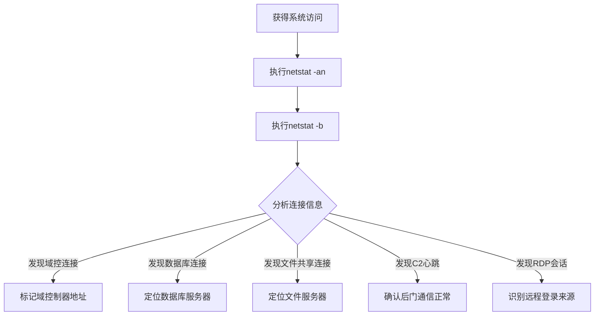

# 系统网络连接发现 (T1049)

## 一句话通俗理解

查看电脑当前和谁在通话——攻击者使用netstat查看所有网络连接，了解系统在跟哪些地址通信。

## 30秒速查卡

| 维度 | 你需要知道的 |
|------|-------------|
| 这是什么？ | 攻击者执行 `netstat -an`、`netstat -b`、`Get-NetTCPConnection` 查看当前所有网络连接和监听端口，识别与域控、数据库、文件服务器的通信 |
| 为什么危险？ | 通过网络连接发现，攻击者能识别系统正在与哪些关键服务器通信，从而定位横向移动目标和高价值资产 |
| 谁需要关心？ | SOC分析师、网络运维、任何需要检测内网侦察行为的安全人员 |
| 你的第一步防御 | 监控 `netstat.exe` 的异常执行上下文，特别是从非交互式进程（服务、计划任务）中执行的情况 |
| 如果只做一件事 | 对短时间内在多台主机上执行 netstat 的行为立即告警，这是攻击者在构建网络连接拓扑图的典型特征 |

## 难度等级

- ⭐ 初级（新手可学）

## 技术描述

系统网络连接发现（T1049）是MITRE ATT&CK框架中的一种发现技术。

**通俗解释：**
当你用电脑时，后台有很多程序在跟互联网上的其他电脑"通话"——浏览器在加载网页、邮件客户端在收信、聊天软件在收发消息。`netstat` 命令可以列出所有这些正在进行的通话记录，攻击者可以用它来了解系统的通信情况。

**技术原理：**
1. 攻击者在系统上执行 `netstat` 命令
2. `netstat -an` 列出所有TCP和UDP连接及监听端口
3. `netstat -b` 显示每个连接对应的程序名
4. `netstat -r` 显示路由表
5. 通过分析连接信息，攻击者可以识别出通信模式、连接的目标系统和运行的服务

**用途与影响：**
攻击者通过网络连接发现可以：识别与哪些IP地址有通信（发现相邻系统）；查看监听端口了解运行的服务；检测与外部C2服务器的连接（验证后门是否正常）；发现内部服务器（如数据库、域控）的地址和端口。

## 子技术列表

**该技术没有子技术。**

## 攻击流程

### 典型攻击流程

```
执行netstat --> 分析连接 --> 识别目标 --> 规划横向移动
```



**步骤详解：**

1. **执行netstat**
   - 通俗描述：输入netstat命令查看所有网络连接
   - 技术细节：`netstat -an` 显示所有连接和监听端口
   - 常用工具：netstat.exe（内置）

2. **查看对应程序**
   - 通俗描述：查看每个连接是哪个程序建立的
   - 技术细节：`netstat -b`（需管理员权限）或 `netstat -ano`（显示PID）
   - 常用工具：netstat.exe

3. **分析结果**
   - 通俗描述：从输出中找出有用的网络信息
   - 技术细节：识别可信和可疑的外部连接
   - 常用工具：手动分析

## 真实案例

### 案例1：RansomHub - netstat用于目标识别

- **时间**: 2024年-2025年
- **目标**: 全球企业
- **攻击组织**: RansomHub
- **手法**: RansomHub攻击者在入侵后使用 `netstat -an` 和 `netstat -b` 查看所有网络连接。通过netstat输出识别哪些系统与其他服务器有活跃连接。发现连接到MSSQL、Exchange、Veeam备份服务的会话后，标记这些服务器为加密目标。
- **影响**: 备份和关键业务系统被加密
- **参考链接**: [The DFIR Report - RansomHub 2025](https://thedfirreport.com/2025/06/30/hide-your-rdp-password-spray-leads-to-ransomhub-deployment/)

### 案例2：Lazarus - 网络连接用于C2确认

- **时间**: 2020年-2024年
- **目标**: 加密货币平台
- **攻击组织**: Lazarus
- **手法**: Lazarus的恶意软件在受感染系统上使用 `netstat -an` 检查当前网络连接状态。如果发现与C2服务器的连接断开，恶意软件会尝试重新建立连接。Lazarus还通过netstat检查是否有多余的连接（可能表示有其他攻击者或安全工具连接）。
- **影响**: 平台数据被窃取
- **参考链接**: [Securelist - Lazarus](https://securelist.com/operation-synchole-watering-hole-attacks-by-lazarus/116326/)

### 案例3：Conti - 网络连接用于横向移动

- **时间**: 2021年-2022年
- **目标**: 全球企业
- **攻击组织**: Conti
- **手法**: Conti勒索软件在横向移动前使用 `netstat -rn` 查看路由表，确定哪些网络可达。使用 `netstat -an` 识别与文件服务器和域控制器的连接。这些信息帮助Conti选择加密策略的部署路径。
- **影响**: 大规模勒索感染
- **参考链接**: [MITRE - Conti](https://attack.mitre.org/software/S0575/)

## 红队视角

> ⚠️ **免责声明**：以下内容仅用于合法的安全测试、渗透测试和教育目的。未经授权对他人系统进行测试是违法行为。

### 实战技巧

1. **使用netstat -ano查看PID**
   通过 `netstat -ano` 显示每个连接对应的进程PID，再用 `tasklist /fi "pid eq X"` 找到具体程序。

2. **查看监听端口**
   `netstat -an | find "LISTENING"` 查看所有监听端口，了解系统运行了哪些服务。

3. **PowerShell替代**
   `Get-NetTCPConnection` 和 `Get-NetUDPEndpoint` 提供更丰富的连接信息。

### 常用工具

| 工具名称 | 用途 | 平台 | 链接 |
|----------|------|------|------|
| netstat | 显示网络连接和监听端口 | 跨平台 | 内置命令 |
| ss | 套接字统计工具 | Linux | 内置 |
| lsof -i | 显示进程的网络连接 | Linux/macOS | 内置 |
| Get-NetTCPConnection | PowerShell网络连接cmdlet | Windows | 内置 |
| TCPView | Sysinternals连接查看工具 | Windows | [Sysinternals](https://learn.microsoft.com/en-us/sysinternals/downloads/tcpview) |

### 注意事项

- netstat命令输出量大，需要结合过滤条件
- `netstat -b` 需要管理员权限
- 正常的系统进程也会建立大量连接

## 蓝队视角

### 检测要点

1. **netstat的异常执行**
   - 日志来源：Sysmon Event ID 1
   - 异常特征：由非交互式进程（服务、计划任务）执行netstat
   - 异常特征：与C2通信结合的时间点

2. **异常的连接模式**
   - 日志来源：Windows Security Event ID 5156
   - 关注字段：非标准端口的外部连接
   - 异常特征：连接到已知恶意IP

### 监控建议

- 使用Sysmon Event ID 3记录所有网络连接
- 监控netstat.exe的执行上下文
- 结合防火墙日志分析异常连接模式

## 检测建议

### 网络层检测

**检测方法：** 监控网络连接枚举行为本身的流量特征，特别关注 netstat.exe 在被远程调用（如通过 WMI/PsExec）时的网络连接模式。

**具体规则/命令示例：**
```
# 检测同一主机在短时间内对多个远程系统执行 netstat 查询的横向移动行为
# 关注 WMI 远程调用中与网络连接枚举相关的 DCE-RPC 流量
# 使用 Zeek 分析 conn 日志，检测非管理主机对远程系统执行的网络状态查询
```

### 主机层检测

**Windows事件ID：**
- 事件ID 4688：进程创建
- Sysmon Event ID 1：进程创建
- Sysmon Event ID 3：网络连接

**具体命令示例：**
```bash
Get-WinEvent -FilterHashtable @{LogName='Security';Id=4688} | Where-Object {$_.Message -match 'netstat'}
```

### 应用层检测

**用人话说：** 这条规则在监控有人执行 netstat 命令查看网络连接。netstat 是 Windows 内置的网络诊断工具，IT 运维人员经常用。但攻击者用它来做侦察——看看这台电脑正在和哪些服务器通信，从而判断网络中有哪些高价值目标（域控、数据库、备份服务器）。关键判断标准是"谁在什么情况下执行"：如果是 IT 人员在排查网络问题，那是正常操作；但如果一个后台进程或计划任务突然执行了 netstat，或者有人在短时间内在多台机器上连续执行 netstat，那就是攻击者在"画地图"，搞清楚内网的连接关系。

**Sigma规则示例：**
```yaml
title: Netstat Execution for Network Connection Discovery
status: experimental
description: Detects execution of netstat to enumerate network connections
logsource:
    category: process_creation
    product: windows
detection:
    selection:
        Image|endswith: '\netstat.exe'
        CommandLine|contains:
            - '-an'
            - '-b'
            - '-ano'
    condition: selection
level: low
tags:
    - attack.t1049
```

## 缓解措施

### 优先级1：关键措施

**措施名称：** 限制netstat执行权限

**具体实施步骤：**
1. 使用AppLocker限制netstat.exe的执行上下文
2. 仅允许管理员执行网络诊断命令

### 优先级2：重要措施

**措施名称：** 网络连接审计

**具体实施步骤：**
1. 启用Windows防火墙日志
2. 配置Sysmon记录网络连接

### 优先级3：建议措施

**措施名称：** 终端检测

**具体实施步骤：**
1. 使用EDR监控异常的netstat执行模式
2. 分析netstat执行时间与C2通信时间的关联

### MITRE ATT&CK 缓解措施映射

| 缓解措施ID | 缓解措施名称 | 适用性 | 说明 |
|------------|-------------|--------|------|
| M1038 | Execution Prevention | 部分适用 | 限制netstat执行 |
| M1047 | Audit | 适用 | 启用网络连接审计 |
| M1031 | Network Intrusion Prevention | 部分适用 | 检测异常网络连接 |

## 动手实验

> ⚠️ **重要提示**：所有实验必须在隔离的实验室环境中进行，禁止对未授权的真实系统进行测试。

### 实验环境准备

**所需工具：** Windows VM

### 实验1：netstat使用练习（初级）

**实验目标：** 学习使用netstat查看网络连接。

**实验步骤：**
1. 打开命令提示符，执行 `netstat -an`
2. 执行 `netstat -ano` 查看含PID的连接
3. 执行 `netstat -an | find "ESTABLISHED"` 查看已建立的连接
4. 执行 `netstat -rn` 查看路由表

**预期结果：** 看到系统所有的网络连接和监听端口。

**学习要点：** 理解netstat输出中的状态含义。

## 术语解释

| 术语 | 英文原名 | 通俗解释 |
|------|----------|----------|
| 监听 | LISTENING | 某个程序在等待连接，像门卫在守着门口 |
| 已建立 | ESTABLISHED | 两个电脑之间的连接已建立，在通话中 |
| TIME_WAIT | TIME_WAIT | 连接已关闭，但还在等最后的确认 |
| PID | Process Identifier | 每个运行程序的唯一编号 |
| 路由表 | Routing Table | 网络交通地图 |
| 端口 | Port | 网络服务的门牌号 |

## 参考资料

### 官方文档

- [MITRE ATT&CK - T1049](https://attack.mitre.org/techniques/T1049/)
- [Microsoft - Netstat](https://learn.microsoft.com/en-us/windows-server/administration/windows-commands/netstat)

### 安全报告

- [The DFIR Report - RansomHub 2025](https://thedfirreport.com/2025/06/30/hide-your-rdp-password-spray-leads-to-ransomhub-deployment/)

### 工具与资源

- [TCPView - Sysinternals](https://learn.microsoft.com/en-us/sysinternals/downloads/tcpview)
- [PowerShell NetTCPConnection](https://learn.microsoft.com/en-us/powershell/module/nettcpip/get-nettcpconnection)
