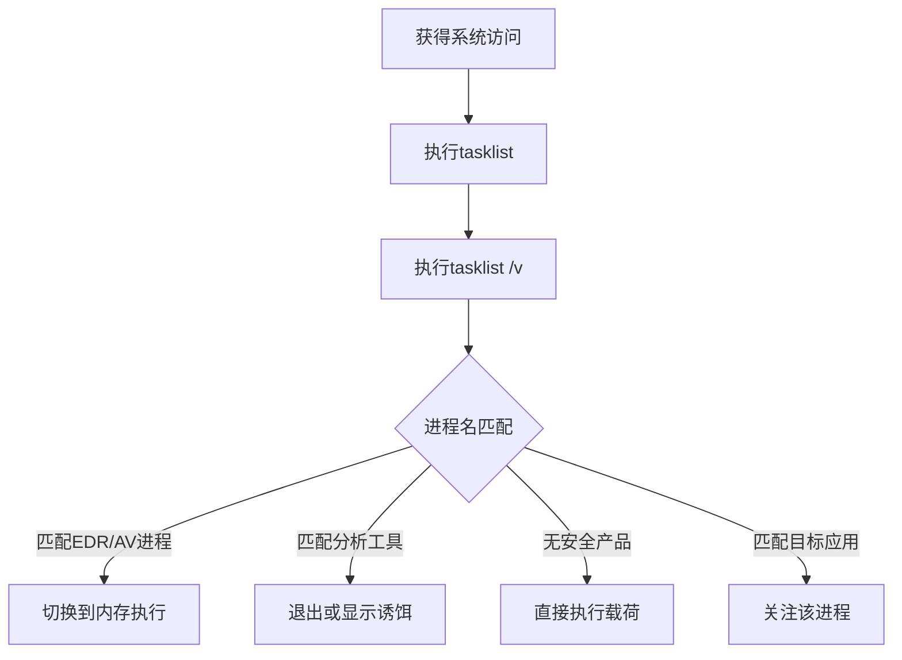

# 进程发现 (T1057)

## 一句话通俗理解

查看电脑上正在运行哪些程序——攻击者检查进程列表来发现安全软件、分析工具和目标应用。

## 30秒速查卡

| 维度 | 你需要知道的 |
|------|-------------|
| 这是什么？ | 攻击者使用 `tasklist`、`Get-Process` 或 `CreateToolhelp32Snapshot` API 枚举所有运行进程，匹配安全产品（EDR/AV）和分析工具名称 |
| 为什么危险？ | 进程发现是攻击者规避检测的关键步骤，发现安全产品后会选择内存执行、进程注入等方式绕过；发现分析工具后会退出或显示诱饵 |
| 谁需要关心？ | SOC分析师、EDR运维、威胁狩猎团队、任何需要检测反沙箱和反分析行为的安全人员 |
| 你的第一步防御 | 监控 `tasklist` 与 `findstr` 的管道链式执行，特别是匹配安全产品名称的行为 |
| 如果只做一件事 | 对后台进程或计划任务中执行进程枚举并匹配 `defender`、`crowdstrike`、`sentinel` 等关键词的行为立即告警 |

## 难度等级

- ⭐ 初级（新手可学）

## 技术描述

进程发现（T1057）是MITRE ATT&CK框架中的一种发现技术。

**通俗解释：**
电脑上每个运行的程序都对应一个"进程"，就像流水线上的每个工位。攻击者入侵后，会像车间主管巡视一样查看所有在运行的进程，看看有没有安全软件在巡逻（防病毒）、有没有分析工具在工作（检测器）、以及有没有感兴趣的目标程序在运行（数据库、邮件服务器）。

**技术原理：**
1. 攻击者使用 `tasklist` 命令列出所有运行中的进程
2. 使用 `tasklist /v` 获取更详细的进程信息
3. PowerShell中 `Get-Process` 可以获取更丰富的进程对象信息
4. 通过Windows API `CreateToolhelp32Snapshot`、`Process32First`/`Process32Next` 进行编程枚举
5. 在Linux中使用 `ps aux`、`top`、`htop`

**用途与影响：**
进程发现帮助攻击者：识别安全产品进程（决定规避策略）；发现分析环境进程（沙箱检测）；定位目标应用（浏览器、邮件客户端、数据库）；判断系统繁忙程度（选择执行时机）。

## 子技术列表

**该技术没有子技术。**

## 攻击流程

### 典型攻击流程

```
执行tasklist --> 匹配安全产品列表 --> 调整攻击行为 --> 继续行动
```



**步骤详解：**

1. **枚举进程**
   - 通俗描述：列出所有运行的程序
   - 技术细节：`tasklist` 或 `Get-Process`
   - 常用工具：tasklist.exe、PowerShell

2. **筛选目标**
   - 通俗描述：从列表中找出有用的进程
   - 技术细节：匹配安全产品、目标应用的关键词
   - 常用工具：findstr、Where-Object

3. **调整行为**
   - 通俗描述：根据发现结果决定下一步
   - 技术细节：发现EDR时使用进程注入
   - 常用工具：Cobalt Strike、Mimikatz

## 真实案例

### 案例1：Conti勒索软件 - 进程发现停止安全服务

- **时间**: 2021年-2022年
- **目标**: 全球企业
- **攻击组织**: Conti
- **手法**: Conti勒索软件在部署前使用 `Get-Process` 枚举所有进程。检查 `WinDefend`、`sense`、`cbdefense` 等安全产品进程。如果检测到安全服务正在运行，Conti使用 `net stop` 尝试停止这些进程。进程发现帮助Conti在加密前绕过安全防御。
- **影响**: 多行业大规模勒索事件
- **参考链接**: [MITRE - Conti](https://attack.mitre.org/software/S0575/)

### 案例2：Lazarus - 沙箱检测与进程分析

- **时间**: 2020年-2024年
- **目标**: 加密货币交易所
- **攻击组织**: Lazarus
- **手法**: Lazarus恶意软件通过 `CreateToolhelp32Snapshot` API遍历进程，与沙箱工具进程名（vmtoolsd.exe、procmon.exe、wireshark.exe）比对。发现分析工具后立即退出或显示诱饵内容。在2024年Operation SyncHole中，Lazarus使用进程发现定位数据库服务进程。
- **影响**: 多平台被长期渗透
- **参考链接**: [Securelist - Lazarus SyncHole](https://securelist.com/operation-synchole-watering-hole-attacks-by-lazarus/116326/)

### 案例3：RansomHub - 进程发现用于EDR规避

- **时间**: 2024年-2025年
- **目标**: 全球企业
- **攻击组织**: RansomHub
- **手法**: RansomHub附属组织在每台入侵的机器上执行 `tasklist /v`。将进程列表与已知安全产品清单比对。发现CrowdStrike、SentinelOne等EDR进程时，攻击者选择通过服务启动而非进程注入的方式执行载荷以规避行为检测。
- **影响**: 多行业遭受勒索加密
- **参考链接**: [The DFIR Report - RansomHub 2025](https://thedfirreport.com/2025/06/30/hide-your-rdp-password-spray-leads-to-ransomhub-deployment/)

### 案例4：MuddyWater - 进程验证后门状态

- **时间**: 2026年初
- **目标**: 美国建筑公司
- **攻击组织**: MuddyWater
- **手法**: MuddyWater操作者在部署DWAgent后门后，使用tasklist确认后门进程正在运行。他们还检查是否有异常进程表示系统已被其他攻击者控制或有安全响应团队正在分析。
- **影响**: 凭证被窃取、内网被渗透
- **参考链接**: [Rapid7 - MuddyWater 2026](https://www.rapid7.com/blog/post/tr-muddying-tracks-state-sponsored-shadow-behind-chaos-ransomware/)

## 红队视角

> ⚠️ **免责声明**：以下内容仅用于合法的安全测试、渗透测试和教育目的。未经授权对他人系统进行测试是违法行为。

### 实战技巧

1. **使用Get-Process识别安全产品**
   `Get-Process | Where-Object {$_.ProcessName -match 'cb|sense|defender|crowdstrike|sentinel'}` 快速筛选。

2. **检查进程路径验证工具**
   使用 `wmic process where "name='procname.exe'" get executablepath` 获取进程路径，验证是否为合法工具。

3. **检测调试器**
   使用 `tasklist /v` 查看进程名中包含dbg、olly、x64dbg等的进程。

### 常用工具

| 工具名称 | 用途 | 平台 | 链接 |
|----------|------|------|------|
| tasklist | 命令行进程查看器 | Windows | 内置命令 |
| Get-Process | PowerShell进程管理cmdlet | Windows | 内置 |
| ps aux | Linux进程查看 | Linux/macOS | 内置命令 |
| Process Explorer | Sysinternals进程工具 | Windows | [Sysinternals](https://learn.microsoft.com/en-us/sysinternals/downloads/process-explorer) |

### 注意事项

- tasklist在Windows中属于正常管理活动
- 但结合安全产品进程名匹配可能被EDR行为分析检测
- 使用WMI查询进程需要特定权限

## 蓝队视角

### 检测要点

1. **tasklist的异常使用**
   - 日志来源：Sysmon Event ID 1
   - 异常特征：非管理员用户的tasklist执行
   - 异常特征：tasklist输出通过管道传递给findstr匹配安全产品名

2. **PowerShell进程查询**
   - 日志来源：PowerShell ScriptBlock Logging
   - 关注字段：Get-Process配合Where-Object筛选
   - 异常特征：进程名匹配条件包含安全产品名称

### 监控建议

- 监控tasklist.exe与findstr.exe的管道链式执行
- 启用PowerShell ScriptBlock Logging
- 关注短时间内从同一主机执行多次tasklist的行为

## 检测建议

### 网络层检测

**检测方法：** 监控远程进程枚举的网络流量特征，特别关注通过 WMI/RPC 协议查询远程系统进程列表的异常流量模式。

**具体规则/命令示例：**
```
# 检测通过 WMI 远程执行 tasklist 或 Get-Process 的流量模式
# 关注同一 source IP 对多个 target IP 发起 WMI 查询进程的横向移动特征
# 使用 Zeek 检测 DCE-RPC 流量中与 WMI (Win32_Process) 相关的异常事件
```

### 主机层检测

**Windows事件ID：**
- 事件ID 4688：进程创建
- 事件ID 4104：PowerShell脚本内容
- Sysmon Event ID 1：进程创建

**用人话说：** 这条规则在监控有人执行 `tasklist` 命令查看进程列表。tasklist 本身是合法的系统管理工具，IT 运维人员经常用。但攻击者用它来做完全不同的事情——看看这台电脑上有没有装杀毒软件、EDR、Wireshark 等安全工具。如果发现有安全产品在运行，攻击者就会选择更隐蔽的方式执行恶意代码（比如内存执行、进程注入）；如果发现有分析工具（沙箱），攻击者就会退出或显示假的正常行为。关键判断标准是：谁在查？查完之后做了什么？如果有人执行 tasklist 后紧接着就执行了可疑命令，那就是攻击者在"踩点"。

**Sigma规则示例：**
```yaml
title: Process Discovery via Tasklist
status: experimental
description: Detects tasklist execution for process discovery
logsource:
    category: process_creation
    product: windows
detection:
    selection:
        Image|endswith: '\tasklist.exe'
    condition: selection
level: low
tags:
    - attack.t1057
```

## 缓解措施

### 优先级1：关键措施

**措施名称：** 应用程序白名单

**具体实施步骤：**
1. 配置AppLocker限制tasklist.exe使用
2. 限制PowerShell脚本执行

### 优先级2：重要措施

**措施名称：** 隐藏安全产品进程

**具体实施步骤：**
1. 使用内核模式保护防止进程枚举
2. 考虑使用内核回调保护进程列表

### 优先级3：建议措施

**措施名称：** 行为监控

**具体实施步骤：**
1. 监控tasklist与findstr的组合使用
2. 使用EDR检测进程枚举后的行为变化

### MITRE ATT&CK 缓解措施映射

| 缓解措施ID | 缓解措施名称 | 适用性 | 说明 |
|------------|-------------|--------|------|
| M1038 | Execution Prevention | 部分适用 | 限制进程枚举工具 |
| M1040 | Behavior Prevention on Endpoint | 适用 | 检测异常进程枚举行为 |
| M1026 | Privileged Account Management | 适用 | 限制过多用户权限 |

## 动手实验

> ⚠️ **重要提示**：所有实验必须在隔离的实验室环境中进行，禁止对未授权的真实系统进行测试。

### 实验环境准备

**所需工具：** Windows VM

### 实验1：进程发现练习（初级）

**实验目标：** 学习tasklist和Get-Process的使用。

**实验步骤：**
1. 执行 `tasklist` 查看所有进程
2. 执行 `tasklist /v` 查看详细进程信息
3. 执行 `tasklist /fi "status eq running"` 筛选运行中进程
4. 在PowerShell中执行 `Get-Process | Sort-Object CPU -Descending | Select-Object -First 10`

**预期结果：** 看到系统上所有运行中的进程信息。

**学习要点：** 理解进程发现的基本命令和输出。

## 术语解释

| 术语 | 英文原名 | 通俗解释 |
|------|----------|----------|
| 进程 | Process | 正在运行的程序实例，像流水线上正在工作的工位 |
| PID | Process ID | 每个进程的唯一编号 |
| 线程 | Thread | 进程中的执行单元，一个进程可以有多个线程 |
| 句柄 | Handle | 进程对系统资源的引用 |
| CPU使用率 | CPU Usage | 进程占用处理器时间的百分比 |

## 参考资料

### 官方文档

- [MITRE ATT&CK - T1057](https://attack.mitre.org/techniques/T1057/)
- [Microsoft - Tasklist](https://learn.microsoft.com/en-us/windows-server/administration/windows-commands/tasklist)

### 安全报告

- [Securelist - Lazarus SyncHole](https://securelist.com/operation-synchole-watering-hole-attacks-by-lazarus/116326/)
- [Rapid7 - MuddyWater 2026](https://www.rapid7.com/blog/post/tr-muddying-tracks-state-sponsored-shadow-behind-chaos-ransomware/)

### 工具与资源

- [Sysinternals Process Explorer](https://learn.microsoft.com/en-us/sysinternals/downloads/process-explorer)
- [PowerShell Get-Process](https://learn.microsoft.com/en-us/powershell/module/microsoft.powershell.management/get-process)
