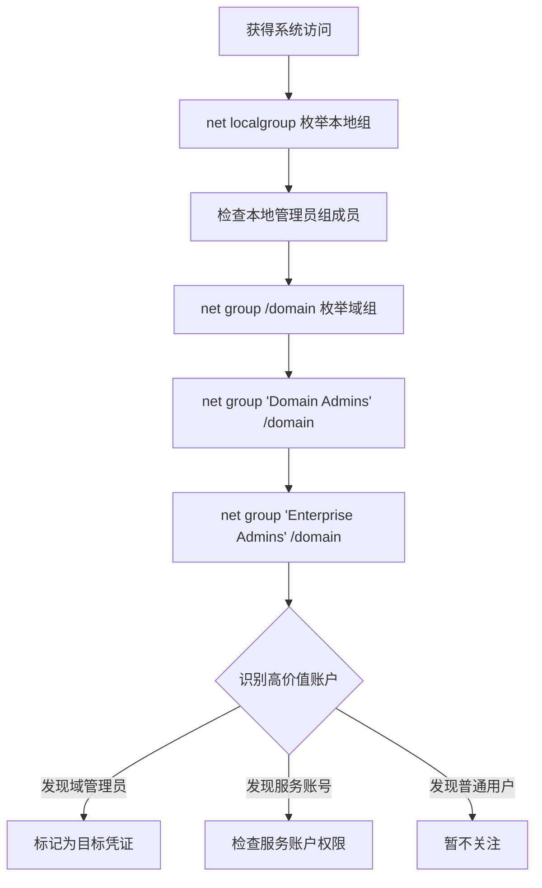

# 权限组发现 (T1069)

## 一句话通俗理解

查看公司里有哪些部门（组）以及谁在管钥匙——攻击者枚举用户组和权限信息。

## 30秒速查卡

| 维度 | 你需要知道的 |
|------|-------------|
| 这是什么？ | 攻击者使用 `net localgroup`、`net group "Domain Admins" /domain`、`Get-ADGroupMember` 枚举本地组、域组及成员，定位 Domain Admins、Enterprise Admins 等高权限组 |
| 为什么危险？ | 权限组是攻击者的"寻宝图"——Domain Admins 组成员就是最有价值的凭证目标；嵌套组关系可能暴露隐藏的高权限路径；服务账户组可能有数据库或域控访问权限 |
| 谁需要关心？ | SOC分析师、AD管理员、蓝队威胁狩猎、任何需要检测组枚举行为的安全人员 |
| 你的第一步防御 | 监控 `net group "Domain Admins" /domain` 的执行；审计 LDAP 查询中对 group 类对象的批量枚举；配置 SIEM 告警规则 |
| 如果只做一件事 | 对查询 `Domain Admins`、`Enterprise Admins`、`Schema Admins` 等敏感组成员的命令立即告警——这是攻击者在"找钥匙保管员" |

## 难度等级

- ⭐⭐ 中级（需要一定基础）

## 技术描述

权限组发现（T1069）是MITRE ATT&CK框架中的一种发现技术。

**通俗解释：**
在公司里，IT管理员会给不同的人分配不同的权限——财务可以看账本、人事可以看工资、IT可以修电脑。攻击者入侵后，会像翻看公司的组织架构图一样，查看系统上有哪些安全组、每个组有哪些成员，从中找到最关键的管理员组。

**技术原理：**
1. 攻击者使用 `net localgroup` 查看本地组和成员
2. 使用 `net group` / `net group "Domain Admins" /domain` 查看域组
3. 使用PowerShell `Get-LocalGroup`、`Get-ADGroupMember` 获取详细组信息
4. 通过LDAP查询AD中的组对象和成员

**用途与影响：**
攻击者通过权限组发现可以：找到Domain Admins、Enterprise Admins等高权限组；识别服务账户和特权账户；了解权限层次结构；确定哪些账户有远程访问权限；定位可以窃取凭证的目标。

## 子技术列表

**该技术共有 3 个子技术：**

| 子技术ID | 中文名称 | 通俗解释 |
|----------|----------|----------|
| T1069.001 | Local Groups | 查看本机上的用户组和成员 |
| T1069.002 | Domain Groups | 查看域中的安全组和成员 |
| T1069.003 | Cloud Groups | 查看云平台中的组和权限 |

## 攻击流程

### 典型攻击流程

```
获得立足点 --> 枚举本地组 --> 枚举域组 --> 识别高权限账户
```



**步骤详解：**

1. **枚举本地组**
   - 通俗描述：查看本机上有哪些用户组
   - 技术细节：`net localgroup` 列出所有本地组
   - 常用工具：net.exe

2. **检查管理员组**
   - 通俗描述：看谁是本地管理员
   - 技术细节：`net localgroup Administrators` 查看管理员组成员
   - 常用工具：net.exe

3. **枚举域组**
   - 通俗描述：查看整个公司网络中的组
   - 技术细节：`net group /domain` 列出所有域组
   - 常用工具：net.exe

4. **查找高权限组**
   - 通俗描述：找到最高权限的管理员组
   - 技术细节：`net group "Domain Admins" /domain`
   - 常用工具：net.exe

## 真实案例

### 案例1：The Gentlemen勒索软件 - 域组枚举

- **时间**: 2025年
- **目标**: 全球企业
- **攻击组织**: The Gentlemen
- **手法**: The Gentlemen勒索软件攻击者使用batch脚本批量查询60多个域用户账户。使用 `net group "Domain Admins" /domain` 和 `net group "Enterprise Admins" /domain` 枚举高权限组成员。攻击者还查询 `itgateadmin` 等自定义特权组。通过枚举快速定位了域管理员和非标准特权组的成员账户。
- **影响**: 多组织遭受勒索和数据泄露
- **参考链接**: [Trend Micro - The Gentlemen 2025](https://www.trendmicro.com/en/research/25/i/unmasking-the-gentlemen-ransomware.html)

### 案例2：RansomHub - 权限组发现定位DA

- **时间**: 2024年-2025年
- **目标**: 全球企业
- **攻击组织**: RansomHub
- **手法**: RansomHub攻击者在压缩内网环境中使用 `net group "Domain Admins" /domain` 枚举域管理员组成员。确定哪些账户是域管理员后，攻击者通过Mimikatz从这些账户登录过的系统上窃取凭证。使用发现的域管理员凭证进行RDP横向移动到域控制器。
- **影响**: 多行业组织遭受勒索加密
- **参考链接**: [The DFIR Report - RansomHub 2025](https://thedfirreport.com/2025/06/30/hide-your-rdp-password-spray-leads-to-ransomhub-deployment/)

### 案例3：MuddyWater - 组成员身份确认

- **时间**: 2026年初
- **目标**: 美国建筑公司
- **攻击组织**: MuddyWater
- **手法**: MuddyWater在通过Teams获得访问后，使用 `whoami /groups` 查看当前用户的组成员身份。确认用户属于Domain Admins组后，攻击者直接使用该账户进行RDP横向移动。如果他们发现用户权限不足，则先通过凭证窃取获取更高权限。
- **影响**: 内网被全面渗透
- **参考链接**: [Rapid7 - MuddyWater 2026](https://www.rapid7.com/blog/post/tr-muddying-tracks-state-sponsored-shadow-behind-chaos-ransomware/)

### 案例4：Lynx勒索软件 - 权限枚举用于账户创建

- **时间**: 2025年
- **目标**: 全球企业
- **攻击组织**: Lynx Ransomware
- **手法**: Lynx攻击者枚举Domain Admins组成员后，使用Active Directory Users and Computers创建与现有账户相似的新账户（如"administratr"），添加到Domain Admins组。这些伪装账户用于隐蔽的后门访问。
- **影响**: 企业数据被加密和窃取
- **参考链接**: [The DFIR Report - Lynx 2025](https://thedfirreport.com/2025/12/17/cats-got-your-files-lynx-ransomware/)

## 红队视角

> ⚠️ **免责声明**：以下内容仅用于合法的安全测试、渗透测试和教育目的。未经授权对他人系统进行测试是违法行为。

### 实战技巧

1. **PowerShell枚举域组**
   `Get-ADGroup -Filter * -Properties Members | Select-Object Name, Members` 获取所有组和成员。

2. **使用PowerView高效枚举**
   `Get-NetGroup "Domain Admins"` 和 `Get-NetGroupMember "Domain Admins"` 快速获取组信息。

3. **关注嵌套组**
   域组可能嵌套在其他组中，使用 `Get-ADGroupMember -Recursive` 展开所有嵌套成员。

### 常用工具

| 工具名称 | 用途 | 平台 | 链接 |
|----------|------|------|------|
| net.exe | 本地和域组管理 | Windows | 内置命令 |
| Get-ADGroupMember | AD组查询 | Windows | RSAT工具 |
| PowerView | PowerShell域发现 | Windows | [GitHub](https://github.com/PowerShellMafia/PowerSploit) |
| BloodHound | AD权限关系分析 | 跨平台 | [GitHub](https://github.com/BloodHoundAD/BloodHound) |

### 注意事项

- net group需要在域环境中使用
- 非域管理员枚举域组可能受权限限制
- AD查询可能触发域控制器上的审计告警

## 蓝队视角

### 检测要点

1. **net group的异常使用**
   - 日志来源：Windows Security Event ID 4688
   - 关注字段：net group命令的频繁执行
   - 异常特征：非管理员用户枚举Domain Admins组

2. **LDAP组查询**
   - 日志来源：Windows Event ID 1644
   - 关注字段：包含group、member的LDAP查询
   - 异常特征：短时间内大量组查询

3. **PowerShell AD模块调用**
   - 日志来源：PowerShell ScriptBlock Logging
   - 关注字段：Get-ADGroup、Get-ADGroupMember调用
   - 异常特征：非管理员PowerShell会话执行AD枚举

### 监控建议

- 启用对net group命令的审计
- 监控对Domain Admins等敏感组的枚举
- 使用AD审计策略记录LDAP查询

## 检测建议

### 网络层检测

**检测方法：** 监控权限组枚举相关的网络流量，特别关注 LDAP 查询中的组对象枚举模式和 SMB/RPC 远程组查询流量。

**具体规则/命令示例：**
```
# 检测 LDAP 查询中频繁列举组成员的事件（如查询 Domain Admins、Enterprise Admins 等敏感组）
# 关注短时间内从非域控制器发起的密集 LDAP 组查询
# 使用 Zeek 分析 ldap_search 日志，过滤包含 "member" 和 "groupType" 的非基线查询
```

### 主机层检测

**Windows事件ID：**
- 事件ID 4688：进程创建（监控net.exe）
- 事件ID 4104：PowerShell脚本（监控AD模块调用）

**用人话说：** 这条规则在监控有人查询 Domain Admins 组成员。攻击者为什么要查这个？因为 Domain Admins 是 Active Directory 中权限最高的组——它的成员可以登录域中任何一台电脑、修改任何配置、访问任何数据。攻击者拿到一个 Domain Admin 账户就等于拿到了整个域的"万能钥匙"。所以他们一定会先查"谁是域管"，然后对这些账户进行重点攻击（Mimikatz 窃取凭证、Kerberoasting、Pass-the-Hash）。正常情况下，只有 AD 管理员在做权限审计时才会查这个。如果你看到有人在非工作时间查询 Domain Admins 成员，那就是攻击者在"找最有价值的目标"。

**Sigma规则示例：**
```yaml
title: Domain Admin Group Enumeration
status: experimental
description: Detects attempts to enumerate Domain Admins group
logsource:
    category: process_creation
    product: windows
detection:
    selection:
        CommandLine|contains: 'Domain Admins'
    condition: selection
level: high
tags:
    - attack.t1069
```

## 缓解措施

### 优先级1：关键措施

**措施名称：** 限制组枚举权限

**具体实施步骤：**
1. 配置AD安全策略限制普通用户枚举组成员
2. 移除不必要的用户特权

### 优先级2：重要措施

**措施名称：** 监控敏感组查询

**具体实施步骤：**
1. 启用对Domain Admins组查询的审计
2. 配置SIEM告警规则

### 优先级3：建议措施

**措施名称：** 最小权限原则

**具体实施步骤：**
1. 减少Domain Admins组成员数量
2. 实施分层管理模型

### MITRE ATT&CK 缓解措施映射

| 缓解措施ID | 缓解措施名称 | 适用性 | 说明 |
|------------|-------------|--------|------|
| M1026 | Privileged Account Management | 适用 | 限制特权账户数量 |
| M1028 | Operating System Configuration | 适用 | 限制组查询权限 |

## 动手实验

> ⚠️ **重要提示**：所有实验必须在隔离的实验室环境中进行，禁止对未授权的真实系统进行测试。

### 实验环境准备

**所需工具：** Windows域环境VM

### 实验1：权限组枚举（初级）

**实验目标：** 学习使用net命令枚举组信息。

**实验步骤：**
1. 执行 `net localgroup` 查看所有本地组
2. 执行 `net localgroup Administrators` 查看本地管理员组
3. 在域环境中执行 `net group /domain` 查看所有域组
4. 执行 `net group "Domain Admins" /domain` 查看域管理员
5. 执行 `net group "Domain Computers" /domain` 查看域计算机

**预期结果：** 看到本地和域的组及成员信息。

**学习要点：** 理解net命令的组枚举功能。

## 术语解释

| 术语 | 英文原名 | 通俗解释 |
|------|----------|----------|
| 组 | Group | 一组用户的集合，像公司的部门 |
| Domain Admins | 域管理员 | AD域中最高权限的管理员组 |
| 本地组 | Local Group | 仅影响本机的用户组 |
| 域组 | Domain Group | 影响整个AD域的用户组 |
| LDAP | Lightweight Directory Access Protocol | 访问AD的协议 |
| 嵌套组 | Nested Group | 组里包含其他组，像公司里部门下有小组 |

## 参考资料

### 官方文档

- [MITRE ATT&CK - T1069](https://attack.mitre.org/techniques/T1069/)
- [Microsoft - Net Group](https://learn.microsoft.com/en-us/windows-server/administration/windows-commands/net-group)
- [Microsoft - Net Localgroup](https://learn.microsoft.com/en-us/windows-server/administration/windows-commands/net-localgroup)

### 安全报告

- [Trend Micro - The Gentlemen 2025](https://www.trendmicro.com/en/research/25/i/unmasking-the-gentlemen-ransomware.html)
- [Rapid7 - MuddyWater 2026](https://www.rapid7.com/blog/post/tr-muddying-tracks-state-sponsored-shadow-behind-chaos-ransomware/)

### 工具与资源

- [BloodHound](https://github.com/BloodHoundAD/BloodHound)
- [PowerView](https://github.com/PowerShellMafia/PowerSploit)
