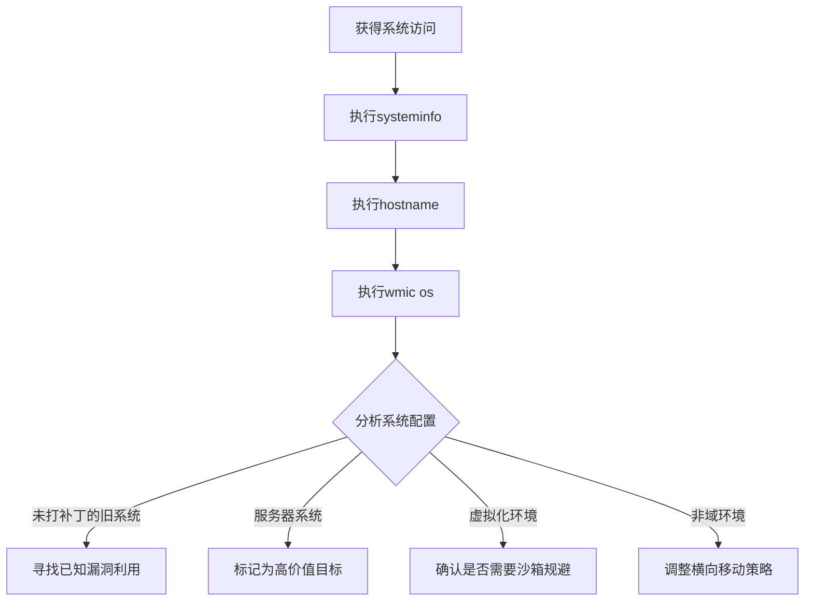

# 系统信息发现 (T1082)

## 一句话通俗理解

查看电脑的详细配置信息——攻击者用systeminfo了解操作系统版本、CPU、内存等。

## 30秒速查卡

| 维度 | 你需要知道的 |
|------|-------------|
| 这是什么？ | 攻击者执行 `systeminfo`、`wmic os get`、`hostname` 获取操作系统版本、补丁级别、系统架构、计算机名等配置信息 |
| 为什么危险？ | 系统信息帮助攻击者判断系统是否已打补丁（寻找已知漏洞）、是服务器还是工作站（决定价值）、是否为虚拟机（沙箱检测） |
| 谁需要关心？ | SOC分析师、系统管理员、威胁狩猎团队、任何需要检测早期侦察行为的安全人员 |
| 你的第一步防御 | 监控 `systeminfo.exe` 和 WMI `Win32_OperatingSystem`、`Win32_ComputerSystem` 查询的异常执行 |
| 如果只做一件事 | 对短时间内从同一主机执行多次系统信息查询（systeminfo + hostname + wmic）的行为立即告警，这是典型的攻击链组合 |

## 难度等级

- ⭐ 初级（新手可学）

## 前置知识检查

**读这个文件需要什么？**

- [ ] 系统信息（System Information）：电脑的硬件和软件配置详情，就像人的身高体重和血型一样是电脑的"体征"
- [ ] 操作系统（Operating System）：电脑的基本系统软件（如Windows、Linux），就像人的身体一样是其他软件运行的基础
- [ ] 命令行（Command Line）：用文字而不是图标来操作电脑的方式，就像打电话而不是按电梯按钮

## 技术描述

系统信息发现（T1082）是MITRE ATT&CK框架中的一种发现技术。

**通俗解释：**
当我们买电脑时会看配置：什么操作系统、多大内存、多少硬盘。攻击者入侵后也做同样的事——用 `systeminfo` 命令查看电脑的详细配置。通过系统信息，攻击者可以判断：这台电脑是服务器还是普通PC？是Windows 10还是Windows Server？有没有打最新的补丁？

**过渡段：** 上面的比喻帮你建立了对系统信息发现的直观理解。现在从技术角度深入：攻击者并非只靠手工敲 systeminfo 来收集系统信息——他们会用脚本批量执行、通过WMI远程查询多台机器、甚至将系统信息收集命令嵌入恶意软件的初始阶段。不同操作系统、不同权限级别下，可用的系统信息收集手段也不同。理解这些技术细节，才能设计出有效的检测方案。

**技术原理：**
1. 攻击者执行 `systeminfo` 命令获取操作系统版本、补丁级别、系统类型等
2. 使用 `wmic os get` 获取操作系统详细信息
3. 使用 `hostname` 获取计算机名称
4. 在Linux中使用 `uname -a`、`hostnamectl`、`lscpu`

**用途与影响：**
系统信息发现帮助攻击者：判断操作系统版本寻找漏洞；确定系统是服务器还是工作站（决定价值）；收集机器名和域信息（用于横向移动）；评估系统配置选择恶意软件版本（32位/64位）；检测虚拟化环境。

## 子技术列表

**该技术没有子技术。**

## 攻击流程

### 典型攻击流程

```
执行systeminfo --> 分析配置 --> 匹配漏洞 --> 规划攻击
```



**步骤详解：**

1. **查询系统信息**
   - 通俗描述：用systeminfo看电脑配置
   - 技术细节：`systeminfo | findstr /B /C:"OS" /C:"System"`
   - 常用工具：systeminfo.exe

2. **获取主机名**
   - 通俗描述：看电脑叫什么名字
   - 技术细节：`hostname`
   - 常用工具：hostname.exe

3. **获取详细配置**
   - 通俗描述：用WMI获取更多配置信息
   - 技术细节：`wmic computersystem get model,name,manufacturer`
   - 常用工具：wmic.exe

4. **分析利用**
   - 通俗描述：根据信息判断攻击策略
   - 技术细节：将系统版本与漏洞数据库匹配
   - 常用工具：searchsploit

## 真实案例

### 案例1：MuddyWater - 系统信息用于环境评估

- **时间**: 2026年初
- **目标**: 美国建筑公司
- **攻击组织**: MuddyWater
- **手法**: MuddyWater通过Teams屏幕共享获得受害者系统访问后，使用ipconfig、whoami等命令收集系统信息。虽然公开报告中未明确列出systeminfo，但操作者执行了多项系统发现命令评估受害者环境。系统信息用于判断系统是否为域控制器或关键服务器。
- **影响**: 凭证被窃取、内网被渗透
- **参考链接**: [Rapid7 - MuddyWater 2026](https://www.rapid7.com/blog/post/tr-muddying-tracks-state-sponsored-shadow-behind-chaos-ransomware/)

### 案例2：APT29 - 系统信息指纹

- **时间**: 2020年-2024年
- **目标**: 美国政府机构
- **攻击组织**: APT29
- **手法**: APT29在SolarWinds供应链攻击中使用`systeminfo`收集系统版本和补丁信息，使用`hostname`确认受感染主机标识，检查`$env:PROCESSOR_ARCHITECTURE`确定系统架构。收集的信息编码在C2通信元数据中。
- **影响**: 政府网络被长期渗透
- **参考链接**: [MITRE - APT29](https://attack.mitre.org/groups/G0143/)

### 案例3：Lazarus - 系统信息判断环境价值

- **时间**: 2020年-2024年
- **目标**: 加密货币交易所
- **攻击组织**: Lazarus
- **手法**: Lazarus恶意软件调用Windows API `GetSystemInfo`、`GetComputerNameEx`、`GetVersionEx`收集系统版本和计算机名。特别关注系统安装语言和键盘布局判断目标是否为韩国语系统。系统指纹作为引导加载程序的解密密钥。
- **影响**: 多国加密货币平台被入侵
- **参考链接**: [Securelist - Lazarus MATA](https://securelist.com/mata-multi-platform-cyber-framework/102140/)

### 案例4：APT41 - 多维系统探测

- **时间**: 2024年-2025年
- **目标**: 美国政策机构
- **攻击组织**: APT41
- **手法**: APT41在获取访问后使用`systeminfo`收集系统配置，通过`wmic os get locale`获取区域设置。收集CPU核心数和内存大小用于后续挖矿软件的部署决策。
- **影响**: 敏感数据被窃取
- **参考链接**: [HivePro - APT41 2025](https://hivepro.com/threat-advisory/apt41-cyber-espionage-campaign-targets-u-s-policy-institutions/)

## 红队视角

> ⚠️ **免责声明**：以下内容仅用于合法的安全测试、渗透测试和教育目的。未经授权对他人系统进行测试是违法行为。

### 实战技巧

1. **使用systeminfo /S查看详细信息**
   `systeminfo /S &lt;computer&gt;` 可以远程查询其他系统的信息。

2. **PowerShell获取系统信息**
   `Get-ComputerInfo` 提供了比systeminfo更丰富的系统信息。

3. **快速判断是否为虚拟机**
   检查systeminfo输出中的System Manufacturer字段，VMware/VirtualBox/Hyper-V都有特征。

### 常用工具

| 工具名称 | 用途 | 平台 | 链接 |
|----------|------|------|------|
| systeminfo | 系统信息查看 | Windows | 内置命令 |
| hostname | 查看计算机名 | 跨平台 | 内置命令 |
| wmic | WMI命令行 | Windows | 内置命令 |
| uname | 系统信息命令 | Linux/macOS | 内置命令 |
| Get-ComputerInfo | PowerShell系统信息 | Windows | 内置PowerShell |

### 注意事项

- systeminfo输出包含大量信息，需要针对性筛选
- 非管理员执行systeminfo的权限受限
- 系统信息可能包含敏感配置数据

## 蓝队视角

### 检测要点

1. **systeminfo的异常使用**
   - 日志来源：Sysmon Event ID 1
   - 异常特征：非管理员用户或服务进程执行systeminfo
   - 异常特征：短时间内从同一主机执行多次

2. **wmic系统查询**
   - 日志来源：WMI-Activity Event ID 5861
   - 关注字段：Win32_ComputerSystem、Win32_OperatingSystem查询
   - 异常特征：非管理员用户执行WMI系统查询

### 监控建议

- 启用进程创建审计监控systeminfo执行
- 监控WMI查询中的系统信息枚举
- 在SIEM中建立systeminfo执行基线

## 检测建议

### 网络层检测

**检测方法：** 监控远程系统信息枚举的网络流量，特别关注通过 WMI 查询操作系统版本、硬件配置等系统信息的异常流量模式。

**具体规则/命令示例：**
```
# 检测通过 WMI 远程执行 Win32_OperatingSystem、Win32_ComputerSystem 等查询的流量
# 关注同一主机在短时间内对多个远程系统执行 WMI 查询的行为
# 使用 Zeek 检测 DCE-RPC/UUID 中包含 WMI 接口标识的流量
```

### 主机层检测

**Windows事件ID：**
- 事件ID 4688：进程创建
- 事件ID 4104：PowerShell脚本
- Sysmon Event ID 1：进程创建

**用人话说：** 这条规则在监控有人执行 `systeminfo` 命令查看系统配置。systeminfo 是 Windows 内置的系统信息工具，IT 运维人员经常用。但攻击者入侵后第一件事往往就是执行 systeminfo，看看这台电脑是什么操作系统、打了哪些补丁、是服务器还是普通 PC。关键判断标准是：谁在什么情况下执行？如果是 IT 人员在管理服务器，那是正常操作；但如果一个普通员工的电脑上突然有后台进程执行了 systeminfo，或者凌晨有人在多台机器上连续执行 systeminfo，那就是攻击者在"摸底"，为后续的漏洞利用做准备。攻击者特别关注未打补丁的旧系统，因为这些系统有已知漏洞可以利用。

**Sigma规则示例：**
```yaml
title: System Information Discovery via Systeminfo
status: experimental
description: Detects systeminfo execution
logsource:
    category: process_creation
    product: windows
detection:
    selection:
        Image|endswith: '\systeminfo.exe'
    condition: selection
level: low
tags:
    - attack.t1082
```

## 缓解措施

### 优先级1：关键措施

**措施名称：** 限制非管理员执行系统信息命令

**具体实施步骤：**
1. 使用AppLocker限制systeminfo.exe
2. 控制WMI查询权限

### 优先级2：重要措施

**措施名称：** 审计系统信息访问

**具体实施步骤：**
1. 启用进程创建审计
2. 配置WMI审计

### 优先级3：建议措施

**措施名称：** 最小权限原则

**具体实施步骤：**
1. 减少管理员账户数量
2. 限制本地管理员权限

### MITRE ATT&CK 缓解措施映射

| 缓解措施ID | 缓解措施名称 | 适用性 | 说明 |
|------------|-------------|--------|------|
| M1026 | Privileged Account Management | 适用 | 限制过多管理员 |
| M1038 | Execution Prevention | 部分适用 | 限制命令执行 |
| M1047 | Audit | 适用 | 启用系统信息审计 |

## 动手实验

> ⚠️ **重要提示**：所有实验必须在隔离的实验室环境中进行，禁止对未授权的真实系统进行测试。

### 实验环境准备

**所需工具：** Windows VM

### 实验1：系统信息收集（初级）

**实验目标：** 学习使用systeminfo命令。

**实验步骤：**
1. 执行 `systeminfo` 查看完整系统信息
2. 执行 `hostname` 查看计算机名
3. 执行 `wmic os get Caption,Version,OSArchitecture`
4. 执行 `wmic computersystem get TotalPhysicalMemory`

**预期结果：** 看到操作系统的详细配置信息。

**学习要点：** 理解systeminfo和wmic的系统查询功能。

## 术语解释

| 术语 | 英文原名 | 通俗解释 |
|------|----------|----------|
| 系统信息 | System Information | 电脑的硬件和软件配置详情 |
| 操作系统 | Operating System | 电脑的基本系统软件，如Windows、Linux |
| 架构 | Architecture | 处理器的位数，32位或64位 |
| 补丁 | Patch | 修复软件问题的更新程序 |
| 主机名 | Hostname | 电脑在网络中的名字 |

## 参考资料

### 官方文档

- 📚 [MITRE ATT&CK - T1082](https://attack.mitre.org/techniques/T1082/) - 深入了解技术细节
- 📚 [Microsoft - Systeminfo](https://learn.microsoft.com/en-us/windows-server/administration/windows-commands/systeminfo) - 深入了解技术细节

### 安全报告

- 📰 [Securelist - Lazarus MATA Framework](https://securelist.com/mata-multi-platform-cyber-framework/102140/) - 真实攻击案例
- 📰 [HivePro - APT41 2025](https://hivepro.com/threat-advisory/apt41-cyber-espionage-campaign-targets-u-s-policy-institutions/) - 真实攻击案例

### 工具与资源

- 🔧 [PowerShell Get-ComputerInfo](https://learn.microsoft.com/en-us/powershell/module/microsoft.powershell.management/get-computerinfo) - 动手试试
