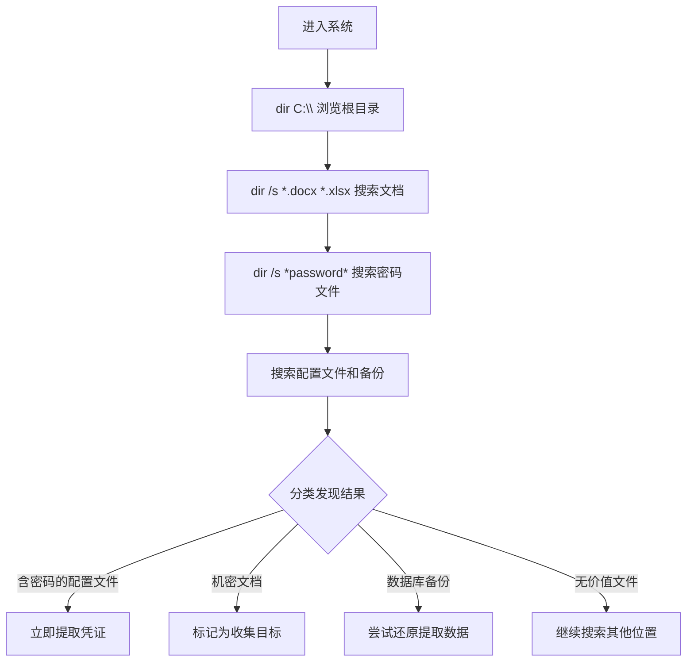

# 文件和目录发现 (T1083)

## 一句话通俗理解

就像小偷翻箱倒柜找值钱的东西——攻击者在文件系统中浏览文件夹结构，寻找敏感文件。

## 难度等级

- ⭐ 初级（新手可学）

## 技术描述

文件和目录发现（T1083）是MITRE ATT&CK框架中的一种发现技术。

**通俗解释：**
攻击者入侵电脑后，会像小偷一样翻看文件系统中的文件夹和文件。他们要找到：密码文件、配置文件、机密文档、数据库备份等有价值的资料。通过dir、ls等命令，攻击者可以快速浏览目录结构，定位感兴趣的文件。

**技术原理：**
1. 攻击者使用 `dir /s` 递归列出目录中的文件
2. 使用 `dir *.docx *.xlsx *.pdf /s` 搜索特定类型文件
3. 使用PowerShell `Get-ChildItem -Recurse` 进行更灵活的文件搜索
4. 在Linux中使用 `find / -name "*.conf"` 搜索配置文件
5. 搜索关键词如"password"、"secret"、"backup"等

**用途与影响：**
攻击者通过文件发现可以：找到包含凭证的配置文件；定位敏感文档（合同、报告、客户数据）；发现数据库备份文件；识别脚本和自动化工具；评估文件的商业价值。

## 子技术列表

**该技术没有子技术。**

## 攻击流程

### 典型攻击流程

```
浏览根目录 --> 搜索特定文件 --> 定位敏感内容 --> 标记收集目标
```



**步骤详解：**

1. **浏览目录结构**
   - 通俗描述：看电脑上有哪些文件夹
   - 技术细节：`dir C:\`、`dir D:\` 遍历驱动器
   - 常用工具：dir.exe、ls

2. **搜索特定文件**
   - 通俗描述：搜索感兴趣的文件类型
   - 技术细节：`dir *.docx *.pdf *.xlsx /s`
   - 常用工具：dir.exe、find

3. **搜索敏感关键词**
   - 通俗描述：搜索文件名中包含关键字的文件
   - 技术细节：`dir *password* *secret* *backup* /s`
   - 常用工具：dir.exe、findstr

4. **阅读目标文件**
   - 通俗描述：打开找到的敏感文件
   - 技术细节：`type`、`more` 或下载到攻击者机器
   - 常用工具：C2文件下载

## 真实案例

### 案例1：MuddyWater - 文件目录枚举

- **时间**: 2026年初
- **目标**: 美国建筑公司
- **攻击组织**: MuddyWater
- **手法**: MuddyWater操作者通过屏幕共享查看受害者桌面和文档目录，搜索VPN配置文件和凭证文件。攻击者指导受害者打开文件资源管理器浏览目录，手动寻找包含credentials.txt、cred.txt等敏感文件。他们还搜索了VPN配置文件夹中的.ovpn和.conf文件。
- **影响**: VPN凭证被窃取导致内网访问
- **参考链接**: [Rapid7 - MuddyWater 2026](https://www.rapid7.com/blog/post/tr-muddying-tracks-state-sponsored-shadow-behind-chaos-ransomware/)

### 案例2：RansomHub - 文件发现定位备份

- **时间**: 2024年-2025年
- **目标**: 全球企业
- **攻击组织**: RansomHub
- **手法**: RansomHub附属组织在入侵后使用 `dir /s *.bak *.vbk *.vib` 搜索备份文件。攻击者定位Veeam备份文件位置后，在勒索加密前先删除或加密备份文件。文件发现还用于搜索包含密码的脚本（.ps1、.bat、.cfg）。
- **影响**: 备份被破坏导致无法恢复
- **参考链接**: [The DFIR Report - RansomHub 2025](https://thedfirreport.com/2025/06/30/hide-your-rdp-password-spray-leads-to-ransomhub-deployment/)

### 案例3：APT29 - 系统文件发现

- **时间**: 2020年-2024年
- **目标**: 美国政府机构
- **攻击组织**: APT29
- **手法**: APT29在SolarWinds攻击中遍历目录结构搜索敏感文件。使用PowerShell `Get-ChildItem -Recurse` 搜索文档和配置文件目录。搜索关键词包括"pass"、"credential"、"backup"。
- **影响**: 数千组织的机密数据被窃取
- **参考链接**: [MITRE - APT29](https://attack.mitre.org/groups/G0143/)

### 案例4：Lazarus - 文件系统侦察

- **时间**: 2020年-2024年
- **目标**: 加密货币平台
- **攻击组织**: Lazarus
- **手法**: Lazarus的COPPERHEDGE后门包含30个命令，其中包括文件和目录枚举功能。攻击者遍历文件系统定位源代码仓库、加密货币钱包文件（wallet.dat）、API密钥文件等。
- **影响**: 加密货币资产被窃取
- **参考链接**: [Securelist - Lazarus SyncHole](https://securelist.com/operation-synchole-watering-hole-attacks-by-lazarus/116326/)

## 红队视角

> ⚠️ **免责声明**：以下内容仅用于合法的安全测试、渗透测试和教育目的。未经授权对他人系统进行测试是违法行为。

### 实战技巧

1. **搜索常见密码文件位置**
   `dir /s web.config *.config *.ini *.ps1 2>nul` 搜索常见配置和脚本文件。

2. **使用PowerShell递归搜索**
   `Get-ChildItem -Path C:\ -Include *password*,*cred*,*secret* -Recurse -ErrorAction SilentlyContinue`

3. **搜索最近修改的文件**
   `dir /s /o-d` 按修改时间排序，优先查看最近被修改的文件。

### 常用工具

| 工具名称 | 用途 | 平台 | 链接 |
|----------|------|------|------|
| dir | 目录列表命令 | Windows | 内置命令 |
| Get-ChildItem | PowerShell目录列表 | Windows | 内置 |
| ls/find | Linux文件搜索 | Linux/macOS | 内置命令 |
| TreeSize | 磁盘空间分析 | Windows | [官网](https://www.jam-software.com/treesize_free) |

### 注意事项

- 大规模文件搜索（全盘递归）消耗资源可能被检测
- 搜索操作在正常管理活动中常见，隐蔽性好
- 关注网络共享中的文件发现

## 蓝队视角

### 检测要点

1. **大规模文件搜索**
   - 日志来源：Sysmon Event ID 11（文件创建）
   - 关注字段：对大量目录的递归访问
   - 异常特征：短时间内对大量文件执行访问/读取操作

2. **PowerShell文件搜索**
   - 日志来源：PowerShell ScriptBlock Logging
   - 关注字段：Get-ChildItem -Recurse配合Incude关键词
   - 异常特征：搜索密码、凭证等关键词

### 监控建议

- 启用Sysmon文件访问日志
- 监控PowerShell中的递归文件搜索命令
- 关注对敏感目录（如桌面、文档）的批量访问

## 检测建议

### 网络层检测

**检测方法：** 监控远程文件和目录枚举的网络流量，特别关注 SMB 协议中异常的目录遍历模式以及通过 RPC/WMI 方式远程浏览文件系统的行为。

**具体规则/命令示例：**
```
# 检测 SMB 协议中针对大量共享目录的枚举操作（如 net view 后的文件遍历）
# 关注同一会话中短时间内 SMB TreeConnect 和 FindFirst2/FindNext2 请求的异常频率
# 使用 Zeek 分析 smb_files 日志，检测非基线模式的递归目录访问
```

### 主机层检测

**Windows事件ID：**
- 事件ID 4663：对象访问
- Sysmon Event ID 11：文件创建
- 事件ID 4104：PowerShell脚本

**Sigma规则示例：**
```yaml
title: Suspicious File Search Patterns
status: experimental
description: Detects searching for files with password or credential keywords
logsource:
    category: process_creation
    product: windows
detection:
    selection:
        CommandLine|contains:
            - '*password*'
            - '*cred*'
            - '*secret*'
            - '*backup*'
    condition: selection
level: medium
tags:
    - attack.t1083
```

## 缓解措施

### 优先级1：关键措施

**措施名称：** 敏感文件加密和保护

**具体实施步骤：**
1. 加密存储敏感配置文件
2. 使用NTFS权限限制文件访问

### 优先级2：重要措施

**措施名称：** 文件系统审计

**具体实施步骤：**
1. 启用对敏感目录的审计
2. 监控批量文件读取行为

### 优先级3：建议措施

**措施名称：** 数据分类

**具体实施步骤：**
1. 对敏感数据进行分类和标记
2. 实施数据防泄漏（DLP）策略

### MITRE ATT&CK 缓解措施映射

| 缓解措施ID | 缓解措施名称 | 适用性 | 说明 |
|------------|-------------|--------|------|
| M1041 | Encrypt Sensitive Information | 适用 | 加密敏感文件 |
| M1022 | Restrict File and Directory Permissions | 适用 | 限制文件访问 |

## 动手实验

> ⚠️ **重要提示**：所有实验必须在隔离的实验室环境中进行，禁止对未授权的真实系统进行测试。

### 实验环境准备

**所需工具：** Windows VM

### 实验1：文件发现练习（初级）

**实验目标：** 学习使用dir命令搜索文件。

**实验步骤：**
1. 执行 `dir C:\Users\ /s` 查看用户目录
2. 执行 `dir /s *.docx *.xlsx *.pdf` 搜索Office文档
3. 执行 `dir /s *password* *config* *backup*` 搜索敏感关键词

**预期结果：** 看到系统中各类文件的分布情况。

**学习要点：** 理解文件发现的命令和方法。

## 术语解释

| 术语 | 英文原名 | 通俗解释 |
|------|----------|----------|
| 目录 | Directory | 文件夹，用来存放文件的容器 |
| 递归 | Recursive | 一层一层地深入每个子目录 |
| 通配符 | Wildcard | *符号代表任意字符 |
| 文件系统 | File System | 管理文件和文件夹的系统 |
| UNC路径 | UNC Path | 网络共享的地址格式 |

## 参考资料

### 官方文档

- [MITRE ATT&CK - T1083](https://attack.mitre.org/techniques/T1083/)
- [Microsoft - Dir](https://learn.microsoft.com/en-us/windows-server/administration/windows-commands/dir)

### 安全报告

- [Rapid7 - MuddyWater 2026](https://www.rapid7.com/blog/post/tr-muddying-tracks-state-sponsored-shadow-behind-chaos-ransomware/)
- [The DFIR Report - RansomHub 2025](https://thedfirreport.com/2025/06/30/hide-your-rdp-password-spray-leads-to-ransomhub-deployment/)

### 工具与资源

- [PowerShell Get-ChildItem](https://learn.microsoft.com/en-us/powershell/module/microsoft.powershell.management/get-childitem)
