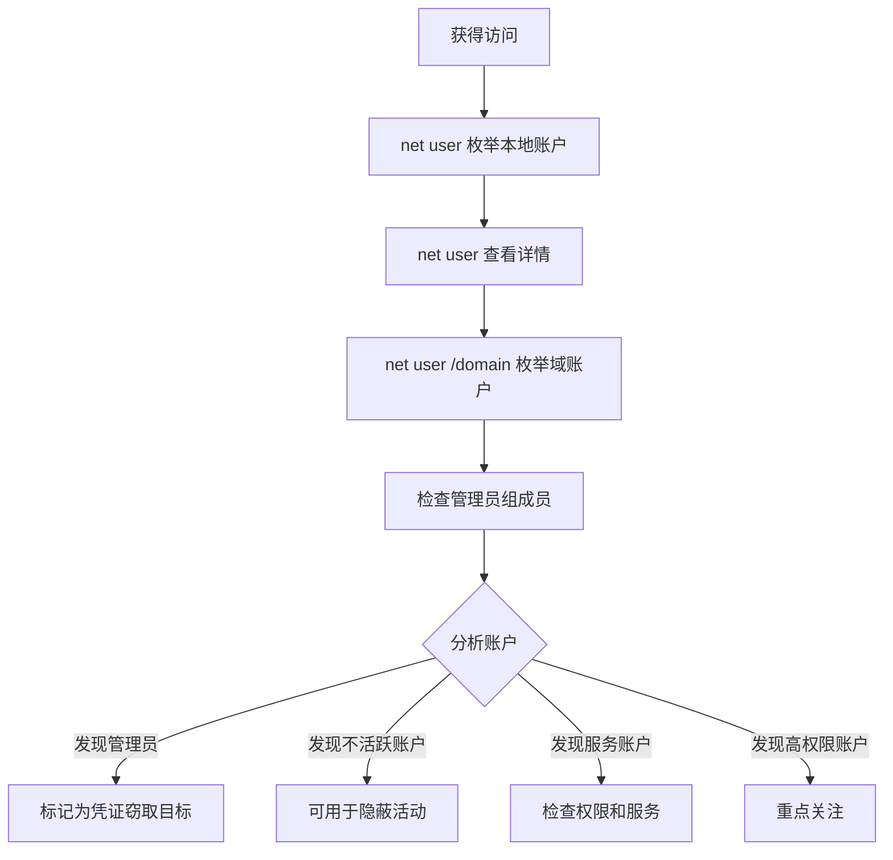

# 账户发现 (T1087)

## 一句话通俗理解

查看系统上有哪些用户账号——攻击者像翻阅员工名册一样枚举所有账户。

## 30秒速查卡

| 维度 | 你需要知道的 |
|------|-------------|
| 这是什么？ | 攻击者使用 `net user`、`net user /domain`、`Get-ADUser` 枚举本地和域用户账户，查看账户属性、组成员身份、最后登录时间、描述字段（可能包含密码提示） |
| 为什么危险？ | 账户枚举是攻击链的基础步骤——找到管理员账户作为凭证窃取目标、发现不活跃账户作为隐蔽入口、定位服务账户了解权限范围、获取完整用户名列表用于密码喷洒 |
| 谁需要关心？ | SOC分析师、AD管理员、蓝队威胁狩猎、任何需要检测账户枚举行为的安全人员 |
| 你的第一步防御 | 监控 `net user /domain` 的异常执行频率；审计 LDAP 查询中针对 user 类对象的批量枚举；配置账户枚举检测规则 |
| 如果只做一件事 | 对非 IT 管理人员执行 `net user /domain` 或短时间内对大量账户执行 `net user &lt;name&gt;` 查询立即告警——这是攻击者在"抄员工名册" |

## 难度等级

- ⭐ 初级（新手可学）

## 技术描述

账户发现（T1087）是MITRE ATT&CK框架中的一种发现技术。

**通俗解释：**
每台电脑上都有多个用户账户——管理员账户、普通用户账户、服务账户等。攻击者入侵后，会用 `net user` 命令查看系统上有哪些账户，就像小偷拿到公司员工名册一样，了解每个人的身份和权限。

**技术原理：**
1. 攻击者使用 `net user` 列出所有本地用户账户
2. 使用 `net user &lt;username&gt;` 查看特定用户的详细信息
3. 使用 `net user /domain` 列出所有域用户
4. 使用PowerShell `Get-LocalUser`、`Get-ADUser` 获取更丰富的用户信息

**用途与影响：**
账户发现帮助攻击者：识别管理员账户和普通用户；找到不活跃或禁用账户可用于隐蔽使用；发现服务账户和特权账户；了解命名规则和账户策略；定位高价值目标账户。

## 子技术列表

**该技术共有 4 个子技术：**

| 子技术ID | 中文名称 | 通俗解释 |
|----------|----------|----------|
| T1087.001 | Local Account | 查看本机上的用户账户 |
| T1087.002 | Domain Account | 查看域中的所有用户账户 |
| T1087.003 | Email Account | 查看邮件系统中的账户 |
| T1087.004 | Cloud Account | 查看云平台中的用户账户 |

## 攻击流程

### 典型攻击流程

```
枚举本地账户 --> 枚举域账户 --> 分析账户属性 --> 定位目标
```



**步骤详解：**

1. **枚举本地账户**
   - 通俗描述：查看本机上有哪些用户
   - 技术细节：`net user`
   - 常用工具：net.exe

2. **查看账户详情**
   - 通俗描述：查看特定用户的详细信息
   - 技术细节：`net user `<username>`` 获取账户属性
   - 常用工具：net.exe

3. **枚举域账户**
   - 通俗描述：查看整个公司网络中的用户
   - 技术细节：`net user /domain`
   - 常用工具：net.exe

4. **分析账户**
   - 通俗描述：判断哪些账户有价值
   - 技术细节：根据组成员审查和账户属性筛选
   - 常用工具：结合组发现命令

## 真实案例

### 案例1：The Gentlemen勒索软件 - 批量账户枚举

- **时间**: 2025年
- **目标**: 全球企业
- **攻击组织**: The Gentlemen
- **手法**: The Gentlemen攻击者使用batch脚本（1.bat）批量查询60多个域用户账户。脚本执行 `net user &lt;username&gt; /domain` 逐一检查每个账户的状态和属性。通过批量枚举，攻击者快速了解了域中所有用户账户的详细信息和组关系。
- **影响**: 多行业遭受勒索和数据泄露
- **参考链接**: [Trend Micro - The Gentlemen 2025](https://www.trendmicro.com/en/research/25/i/unmasking-the-gentlemen-ransomware.html)

### 案例2：MuddyWater - 账户发现确认身份

- **时间**: 2026年初
- **目标**: 美国建筑公司
- **攻击组织**: MuddyWater
- **手法**: MuddyWater通过Teams获得系统访问后，使用 `net user` 枚举本地和域用户账户。通过 `net user `<username>` /domain` 查看当前域用户的详细信息，确认其域成员身份和组归属。根据账户信息判断当前用户的权限级别。
- **影响**: 凭证被用于横向移动
- **参考链接**: [Rapid7 - MuddyWater 2026](https://www.rapid7.com/blog/post/tr-muddying-tracks-state-sponsored-shadow-behind-chaos-ransomware/)

### 案例3：RansomHub - 账户发现用于密码喷洒

- **时间**: 2024年-2025年
- **目标**: 全球企业
- **攻击组织**: RansomHub
- **手法**: RansomHub攻击者使用 `net user /domain` 获取域中所有用户列表。将枚举的用户名列表用于后续的密码喷洒攻击。攻击者特别关注不活跃账户和默认账户，因为这些账户的密码较少被修改。
- **影响**: 多组织凭证失窃
- **参考链接**: [The DFIR Report - RansomHub 2025](https://thedfirreport.com/2025/06/30/hide-your-rdp-password-spray-leads-to-ransomhub-deployment/)

### 案例4：APT29 - 域账户枚举

- **时间**: 2020年-2024年
- **目标**: 美国政府机构
- **攻击组织**: APT29
- **手法**: APT29使用 `net user /domain` 枚举域用户，使用PowerShell `Get-ADUser -Filter *` 获取更全面的用户信息。通过分析账户描述字段找到包含密码提示的账户、不活跃账户以及高权限账户。
- **影响**: 政府网络被长期渗透
- **参考链接**: [MITRE - APT29](https://attack.mitre.org/groups/G0143/)

## 红队视角

> ⚠️ **免责声明**：以下内容仅用于合法的安全测试、渗透测试和教育目的。未经授权对他人系统进行测试是违法行为。

### 实战技巧

1. **使用Get-ADUser枚举域用户**
   `Get-ADUser -Filter * -Properties * | Select-Object SamAccountName,Enabled,LastLogonDate,Description`

2. **搜索账户描述中的密码**
   检查账户描述字段是否包含明文密码，使用 `Get-ADUser -Filter * -Properties Description | Where-Object {$_.Description -ne $null}`

3. **查找不活跃账户**
   `net user `<name>`` 输出中包含"上次登录时间"，不活跃账户可作为隐蔽入口。

### 常用工具

| 工具名称 | 用途 | 平台 | 链接 |
|----------|------|------|------|
| net.exe | 用户和组管理 | Windows | 内置命令 |
| Get-LocalUser | PowerShell本地用户 | Windows | 内置 |
| Get-ADUser | PowerShell AD用户 | Windows | RSAT |
| PowerView | AD枚举脚本 | Windows | [GitHub](https://github.com/PowerShellMafia/PowerSploit) |

### 注意事项

- `net user /domain` 在非域环境中不可用
- 域用户枚举会被域控制器日志记录
- 批量账户查询可能触发账户锁定策略

## 蓝队视角

### 检测要点

1. **net user的异常使用**
   - 日志来源：Windows Security Event ID 4688
   - 关注字段：非管理员用户执行net user /domain
   - 异常特征：短时间内对大量账户执行查询

2. **批量账户查询**
   - 日志来源：域控制器安全日志
   - 关注字段：密集的LDAP用户查询
   - 异常特征：非基线模式的账户枚举

### 监控建议

- 监控net user命令的异常频率
- 启用对LDAP查询的审计
- 配置账户枚举检测规则

## 检测建议

### 网络层检测

**检测方法：** 监控账户枚举相关的网络流量，特别关注 LDAP 查询中针对用户对象的批量枚举行为以及 SMB/RPC 远程账户查询流量。

**具体规则/命令示例：**
```
# 检测 LDAP 查询中针对 user 类对象的批量基数枚举（如查询 baseDN 下的所有用户）
# 关注非域控制器主机发出的密集 LDAP 用户查询请求
# 使用 Zeek 分析 ldap_search 日志，过滤 baseObject 范围过大或属性列表异常的用户枚举查询
```

### 主机层检测

**Windows事件ID：**
- 事件ID 4688：进程创建（net.exe）
- 事件ID 4104：PowerShell脚本（AD模块调用）
- 事件ID 1644：LDAP查询

**用人话说：** 这条规则在监控有人用 `net user /domain` 列举域用户账户。攻击者为什么要查你的域里有哪些人？因为下一步就是密码喷洒——用弱密码（如 Company@2024）批量尝试所有账户登录。同时，攻击者还会关注不活跃账户（密码很少改）和服务账户（通常权限更高）。`net user `<username>` /domain` 还能查看单个账户的详细信息，包括描述字段——很多管理员会在描述里写密码提示（如 "backup account, pwd: Backup@123"）。正常情况下，只有 HR 做人员盘点或 AD 管理员做账户审计时才会批量查询。

**Sigma规则示例：**
```yaml
title: Domain Account Discovery via Net User
status: experimental
description: Detects domain account enumeration via net user
logsource:
    category: process_creation
    product: windows
detection:
    selection:
        CommandLine|contains: 'user /domain'
    condition: selection
level: medium
tags:
    - attack.t1087
```

## 缓解措施

### 优先级1：关键措施

**措施名称：** 限制账户枚举权限

**具体实施步骤：**
1. 配置AD安全策略限制普通用户枚举
2. 禁用不必要的匿名枚举

### 优先级2：重要措施

**措施名称：** 审计账户查询

**具体实施步骤：**
1. 启用对net user命令的审计
2. 配置AD审计策略

### 优先级3：建议措施

**措施名称：** 账户安全

**具体实施步骤：**
1. 禁用不活跃用户账户
2. 实施账户密码策略

### MITRE ATT&CK 缓解措施映射

| 缓解措施ID | 缓解措施名称 | 适用性 | 说明 |
|------------|-------------|--------|------|
| M1026 | Privileged Account Management | 适用 | 限制用户枚举 |
| M1028 | Operating System Configuration | 适用 | 禁用匿名枚举 |
| M1047 | Audit | 适用 | 启用账户查询审计 |

## 动手实验

> ⚠️ **重要提示**：所有实验必须在隔离的实验室环境中进行，禁止对未授权的真实系统进行测试。

### 实验环境准备

**所需工具：** Windows VM（域环境）

### 实验1：账户枚举（初级）

**实验目标：** 学习使用net user枚举账户。

**实验步骤：**
1. 执行 `net user` 查看所有本地用户
2. 执行 `net user Administrator` 查看管理员账户详情
3. 在域环境中执行 `net user /domain` 查看所有域用户
4. 执行 `net user `<username>` /domain` 查看特定域用户
5. 使用PowerShell `Get-LocalUser` 获取结构化的用户信息

**预期结果：** 看到所有用户账户及其属性。

**学习要点：** 理解net user的账户发现功能。

## 术语解释

| 术语 | 英文原名 | 通俗解释 |
|------|----------|----------|
| 本地账户 | Local Account | 只存在于本台电脑上的用户 |
| 域账户 | Domain Account | 存在于AD域中，可在域中任何电脑登录 |
| 服务账户 | Service Account | 专门用来运行后台服务的账户 |
| SID | Security Identifier | 用户的唯一编号 |
| UPN | User Principal Name | 用户登录名，如user@domain.com |

## 参考资料

### 官方文档

- [MITRE ATT&CK - T1087](https://attack.mitre.org/techniques/T1087/)
- [Microsoft - Net User](https://learn.microsoft.com/en-us/windows-server/administration/windows-commands/net-user)

### 安全报告

- [Trend Micro - The Gentlemen 2025](https://www.trendmicro.com/en/research/25/i/unmasking-the-gentlemen-ransomware.html)
- [Rapid7 - MuddyWater 2026](https://www.rapid7.com/blog/post/tr-muddying-tracks-state-sponsored-shadow-behind-chaos-ransomware/)

### 工具与资源

- [PowerShell Get-ADUser](https://learn.microsoft.com/en-us/powershell/module/activedirectory/get-aduser)
- [PowerView](https://github.com/PowerShellMafia/PowerSploit)
