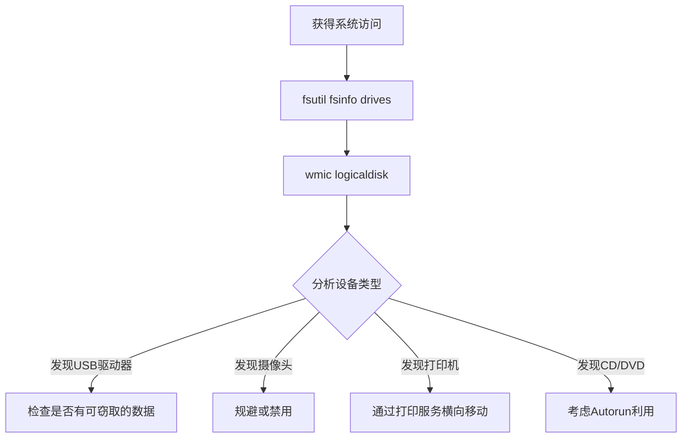

# 外围设备发现 (T1120)

## 一句话通俗理解

查看电脑上插了哪些外部设备——攻击者检查有没有U盘、打印机、摄像头等。

## 难度等级

- ⭐ 初级（新手可学）

## 技术描述

外围设备发现（T1120）是MITRE ATT&CK框架中的一种发现技术。

**通俗解释：**
电脑上可以连接各种外部设备：U盘、打印机、扫描仪、外置硬盘、摄像头等。攻击者入侵后，会查看电脑连接了哪些外设，就像小偷进屋后先看看有没有摄像头、有没有可插U盘的电脑。

**技术原理：**
1. 攻击者使用 `fsutil fsinfo drives` 查看所有驱动器
2. 使用 `wmic logicaldisk get description,name` 查看磁盘类型
3. 使用 `Get-PSDrive` 在PowerShell中查看驱动器
4. 使用设备管理器或 `pnputil` 枚举所有外设
5. 在Linux中使用 `lsusb`、`lspci` 查看USB和PCI设备

**用途与影响：**
外围设备发现帮助攻击者：检测是否有摄像头或录音设备（物理监控规避）；发现可移动存储设备（通过U盘窃取数据）；识别打印服务器（通过打印服务器横向移动）；确认CD/DVD驱动器（用于绕过安全控制）；发现生物识别设备。

## 子技术列表

**该技术没有子技术。**

## 攻击流程

### 典型攻击流程

```
枚举驱动器 --> 识别设备类型 --> 检查可用存储 --> 规划利用方式
```



**步骤详解：**

1. **枚举驱动器**
   - 通俗描述：查看电脑上有哪些盘符
   - 技术细节：`fsutil fsinfo drives`
   - 常用工具：fsutil.exe

2. **识别设备类型**
   - 通俗描述：判断每个盘符是什么类型
   - 技术细节：`wmic logicaldisk get description,name`
   - 常用工具：wmic.exe

3. **检查USB存储**
   - 通俗描述：看看有没有插着的U盘
   - 技术细节：检查驱动器类型为2（可移动磁盘）的设备
   - 常用工具：fsutil、wmic

## 真实案例

### 案例1：Stuxnet - USB设备传播

- **时间**: 2010年
- **目标**: 伊朗核设施
- **攻击组织**: 国家背景攻击者
- **手法**: Stuxnet蠕虫通过枚举系统中的USB驱动器来发现可移动存储设备。当检测到U盘插入时，Stuxnet自动将恶意代码复制到U盘上，通过USB设备在隔离网络中的物理隔离系统之间传播。外围设备发现是Stuxnet突破物理隔离（air-gap）的关键技术。
- **影响**: 伊朗核离心机被物理破坏
- **参考链接**: [MITRE - T1120](https://attack.mitre.org/techniques/T1120/)

### 案例2：USB盗窃数据场景

- **时间**: 2019年-2023年
- **目标**: 全球各行业
- **攻击组织**: 多个APT组织
- **手法**: 多个APT组织在获得内网访问后，通过外围设备发现检查目标系统是否连接了USB存储设备。如果发现有USB设备，攻击者将敏感数据复制到USB设备上，或通过USB设备将恶意软件带入隔离网络。
- **影响**: 数据通过物理手段被窃取
- **参考链接**: [CISA - USB Security](https://www.cisa.gov/usb-security)

## 红队视角

> ⚠️ **免责声明**：以下内容仅用于合法的安全测试、渗透测试和教育目的。未经授权对他人系统进行测试是违法行为。

### 实战技巧

1. **使用PowerShell枚举设备**
   `Get-PSDrive -PSProvider FileSystem` 获取所有文件系统驱动器。

2. **WMI查询可移动磁盘**
   `Get-WmiObject Win32_LogicalDisk -Filter "DriveType=2"` 专门查询USB驱动器。

3. **检查已安装的打印机**
   `wmic printer get name,default` 查看打印机配置。

### 常用工具

| 工具名称 | 用途 | 平台 | 链接 |
|----------|------|------|------|
| fsutil | 文件系统工具 | Windows | 内置命令 |
| wmic | WMI命令行 | Windows | 内置命令 |
| Get-PSDrive | PowerShell驱动器查看 | Windows | 内置 |
| lsusb | USB设备列表 | Linux | 内置 |
| system_profiler | 系统信息（含外设） | macOS | 内置命令 |

### 注意事项

- 外围设备发现通常不需要特殊权限
- USB设备历史记录在注册表中保留
- 某些安全软件会监控USB设备的插入

## 蓝队视角

### 检测要点

1. **异常的驱动器枚举**
   - 日志来源：Sysmon Event ID 1
   - 关注字段：fsutil、wmic logicaldisk的执行
   - 异常特征：非系统管理员执行设备枚举

2. **USB设备监控**
   - 日志来源：Windows Event ID 6416（设备安装）
   - 关注字段：新USB存储设备的插入
   - 异常特征：非工作时间或从非预期系统插入设备

### 监控建议

- 监控wmic logicaldisk的查询活动
- 启用USB设备插入的审计日志
- 实施USB设备控制策略限制可移动存储

## 检测建议

### 网络层检测

**检测方法：** 监控远程外围设备枚举的网络流量，特别关注通过 WMI 查询远程系统存储设备和外设连接的异常行为。

**具体规则/命令示例：**
```
# 检测通过 WMI 远程执行 Win32_LogicalDisk、Win32_USBController 等查询的流量
# 关注同一主机在短时间内对多个远程系统执行外设枚举查询的行为
# 使用 Zeek 检测 DCE-RPC 流量中与 WMI 相关的事件
```

### 主机层检测

**Windows事件ID：**
- 事件ID 4688：进程创建
- 事件ID 6416：设备安装
- Sysmon Event ID 1：进程创建

**Sigma规则示例：**
```yaml
title: Peripheral Device Discovery via WMIC
status: experimental
description: Detects enumeration of peripheral devices via wmic
logsource:
    category: process_creation
    product: windows
detection:
    selection:
        CommandLine|contains:
            - 'logicaldisk'
            - 'DriveType'
    condition: selection
level: low
tags:
    - attack.t1120
```

## 缓解措施

### 优先级1：关键措施

**措施名称：** USB设备控制

**具体实施步骤：**
1. 使用组策略禁用可移动存储设备
2. 部署端点DLP限制USB数据传输

### 优先级2：重要措施

**措施名称：** 外围设备审计

**具体实施步骤：**
1. 启用USB设备安装审计
2. 监控异常的设备枚举行为

### 优先级3：建议措施

**措施名称：** 设备白名单

**具体实施步骤：**
1. 只允许授权的USB设备
2. 使用设备控制软件管理外设

### MITRE ATT&CK 缓解措施映射

| 缓解措施ID | 缓解措施名称 | 适用性 | 说明 |
|------------|-------------|--------|------|
| M1034 | Network Segmentation | 部分适用 | 限制物理设备访问 |
| M1037 | Filter Network Traffic | 部分适用 | 限制WiFi等外设通信 |
| M1038 | Execution Prevention | 部分适用 | 限制AutoRun |

## 动手实验

> ⚠️ **重要提示**：所有实验必须在隔离的实验室环境中进行，禁止对未授权的真实系统进行测试。

### 实验环境准备

**所需工具：** Windows VM、USB设备（可选）

### 实验1：外围设备枚举（初级）

**实验目标：** 学习使用命令查看外围设备。

**实验步骤：**
1. 执行 `fsutil fsinfo drives` 查看所有驱动器
2. 执行 `wmic logicaldisk get description,name,size`
3. 执行 `wmic printer get name,default`
4. 在PowerShell中执行 `Get-PSDrive -PSProvider FileSystem`

**预期结果：** 看到所有连接到系统的设备信息。

**学习要点：** 理解外围设备发现的命令和方法。

## 术语解释

| 术语 | 英文原名 | 通俗解释 |
|------|----------|----------|
| 外围设备 | Peripheral Device | 连接到电脑的外部设备 |
| USB | Universal Serial Bus | 通用串行总线，最常用的外设接口 |
| 可移动磁盘 | Removable Disk | U盘、移动硬盘等可移动的存储设备 |
| 逻辑磁盘 | Logical Disk | 系统中看到的盘符（C:、D:等） |
| 设备类型 | DriveType | 磁盘的分类：本地、可移动、网络、光驱等 |

## 参考资料

### 官方文档

- [MITRE ATT&CK - T1120](https://attack.mitre.org/techniques/T1120/)
- [Microsoft - Fsutil](https://learn.microsoft.com/en-us/windows-server/administration/windows-commands/fsutil)
- [Microsoft - Wmic LogicalDisk](https://learn.microsoft.com/en-us/windows/win32/cimwin32provider/win32-logicaldisk)

### 安全报告

- [CISA - USB Security Guidance](https://www.cisa.gov/usb-security)
- [Stuxnet Analysis](https://en.wikipedia.org/wiki/Stuxnet)
