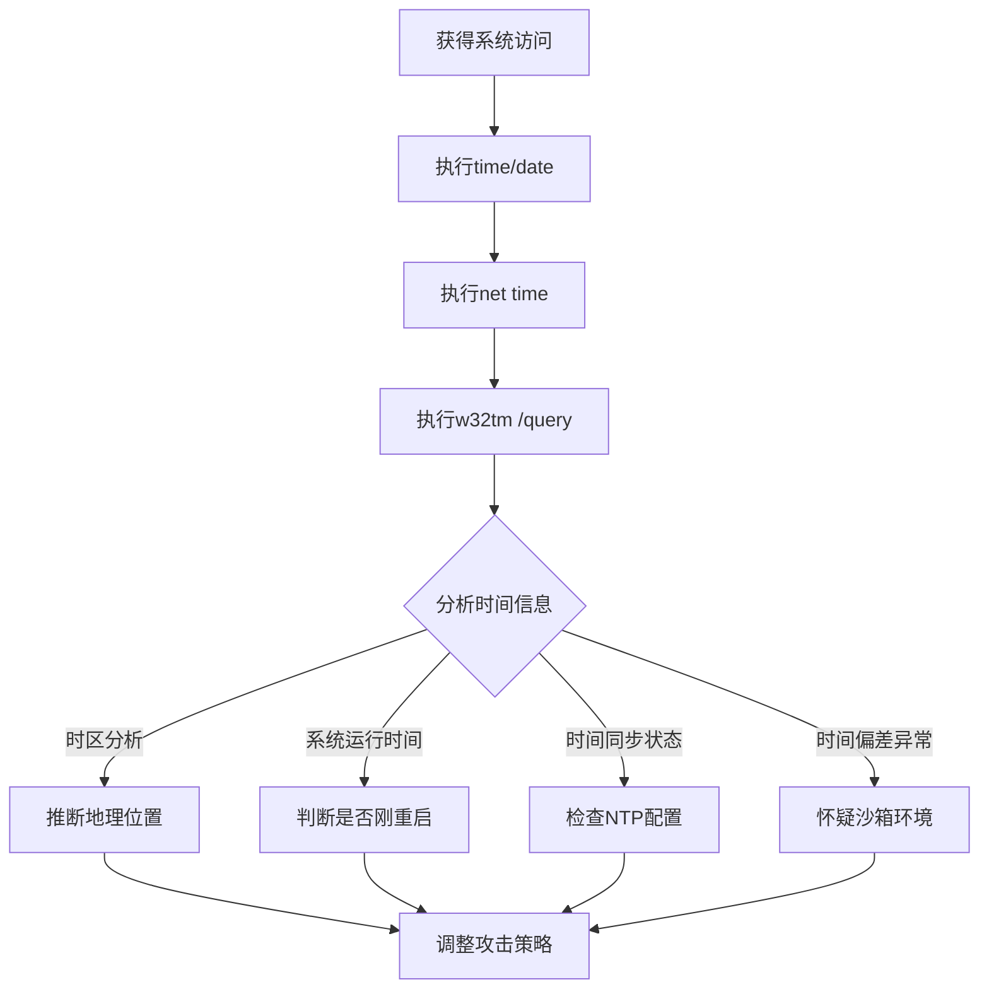

# 系统时间发现 (T1124)

## 一句话通俗理解

查看系统当前时间和时区设置——攻击者用 `net time` 或 `date` 命令了解当前时间，就像小偷进门后先看墙上的钟。

## 30秒速查卡

| 维度 | 你需要知道的 |
|------|-------------|
| 这是什么？ | 攻击者执行 `net time`、`time /t`、`w32tm /query /status` 获取系统时间、时区和时间同步状态，用于推断地理位置或检测沙箱环境 |
| 为什么危险？ | 系统时间信息帮助攻击者推断目标地理位置（时区分析）、判断是否在沙箱中运行（时间偏差检测）、以及同步 C2 通信延迟 |
| 谁需要关心？ | SOC分析师、威胁狩猎团队、任何需要检测反沙箱行为和自动化横向移动的安全人员 |
| 你的第一步防御 | 监控 `w32tm.exe` 和 `net time` 命令的异常执行，特别是短时间内从同一主机发起多次时间查询的行为 |
| 如果只做一件事 | 对后台进程或计划任务中执行时间查询的行为立即告警，因为正常业务流程很少需要手动查询系统时间 |

## 难度等级

- ⭐ 初级（新手可学）

## 技术描述

系统时间发现（T1124）是MITRE ATT&CK框架中的一种发现技术。

**通俗解释：**
生活中我们经常看手表或手机确认时间。攻击者入侵系统后也一样——用 `date`、`time`、`net time` 等命令查看系统当前时间。知道时间有什么用？攻击者可以判断系统在哪个时区（推测地理位置），计算系统运行了多久（判断是否刚重启或长期在线），以及检查时间同步设置（发现是否存在审计盲区）。

**技术原理：**
1. 在Windows中使用 `net time \\\\&lt;computername&gt;` 查看远程系统时间，或 `time /t` 查看本地时间
2. 使用 `w32tm /query /status` 检查Windows时间服务的同步状态和NTP配置
3. 使用PowerShell的 `Get-Date` 获取精确时间戳
4. 在Linux中使用 `date`、`timedatectl` 查看系统时间和时区

**用途与影响：**
攻击者利用系统时间信息：推断目标的地理位置（时区分析）；判断系统运行时长（刚重启可能是虚拟机）；检查系统时间是否准确（时间不一致可能导致日志审计失效）；计算C2通信的延迟和抖动；检测沙箱环境（沙箱通常使用特定的模拟时间）。

## 子技术列表

**该技术没有子技术。**

## 攻击流程

### 典型攻击流程

```
查询时间 --> 分析时区 --> 判断环境 --> 规划攻击
```



**步骤详解：**

1. **获取基本时间信息**
   - 通俗描述：执行 `time /t` 和 `date /t` 查看系统时间
   - 技术细节：`time /t` 显示当前时间，`date /t` 显示当前日期
   - 常用工具：time.exe, date.exe

2. **查询时间服务状态**
   - 通俗描述：检查Windows时间服务是否在运行
   - 技术细节：`w32tm /query /status` 显示时间同步源和状态
   - 常用工具：w32tm.exe

3. **分析时间信息**
   - 通俗描述：根据时区和时间同步信息做出判断
   - 技术细节：对照已知时区表识别地理位置，检查时间偏差
   - 常用工具：无（人工分析）

## 真实案例

### 案例1：Cobalt Strike - 系统时间用于信标同步

- **时间**: 2018年-2024年
- **目标**: 所有Cobalt Strike使用者攻击的目标
- **攻击组织**: 多种APT组织
- **手法**: Cobalt Strike的Beacon在初始执行后自动进行系统时间发现，使用Windows API `GetTickCount` 获取系统启动以来的毫秒数计算系统运行时间。Beacon还利用系统时间进行随机延迟（Jitter）计算以规避流量模式检测。长时间运行的Beacon暗示该系统可能是高价值持久驻留目标。时间同步信息还用于验证C2通信的时间窗口。
- **影响**: 攻击者能长期隐蔽驻留不被发现
- **参考链接**: [MITRE - Cobalt Strike](https://attack.mitre.org/software/S0154/)

### 案例2：TA505 - 系统时间绕过沙箱检测

- **时间**: 2019年-2020年
- **目标**: 全球金融机构、零售企业
- **攻击组织**: TA505
- **手法**: TA505相关的恶意软件（如Clop、Locky）在植入后执行系统时间查询，将 `GetTickCount` 返回值与预计实际时间比较。如果系统时间与C2服务器返回的时间差异过大（超过数小时），恶意软件判定自己在沙箱或虚拟化环境中运行，从而延迟执行恶意行为或自行终止，避免在分析环境中触发告警。
- **影响**: 恶意软件能有效规避沙箱分析，增加检测难度
- **参考链接**: [MITRE - TA505](https://attack.mitre.org/groups/G0092/)

### 案例3：TrickBot - 时间同步检测确保横向移动一致

- **时间**: 2019年-2022年
- **目标**: 全球企业网络
- **攻击组织**: TrickBot
- **手法**: TrickBot木马在启动后执行 `w32tm /query /status` 或通过Windows API查询NTP服务器配置和系统时间。TrickBot利用此信息校验Mimikatz等工具的时间戳日志，确保横向移动活动的时间记录与受感染主机的系统时间一致。不一致的时间可能导致检测系统将同一攻击活动关联到不同时间线，增加攻击者的混淆效果。
- **影响**: 攻击者能在内网中保持横向移动的时间一致性，避免被检测到
- **参考链接**: [MITRE - TrickBot](https://attack.mitre.org/software/S0266/)

### 案例4：AgentTesla - 时间信息反分析

- **时间**: 2020年-2023年
- **目标**: 全球个人和企业用户
- **攻击组织**: AgentTesla
- **手法**: AgentTesla信息窃取恶意软件在启动时使用 `GetSystemTime` 检测系统时间。如果系统时间被设置为早于2019年（常见沙箱的默认时间），AgentTesla会改变行为模式——延迟执行恶意操作或退出进程。此技术用于绕过自动沙箱分析环境，迫使分析师进行手动逆向，增加检测和分析成本。
- **影响**: 大量用户凭证和敏感信息被窃取
- **参考链接**: [MITRE - AgentTesla](https://attack.mitre.org/software/S0332/)

## 红队视角

> ⚠️ **免责声明**：以下内容仅用于合法的安全测试、渗透测试和教育目的。未经授权对他人系统进行测试是违法行为。

### 实战技巧

1. **远程查询系统时间**
   使用 `net time \\\\&lt;target&gt;` 可以远程查询其他系统的当前时间，比本地命令更隐蔽。

2. **通过WMI获取时间**
   `wmic os get localdatetime` 可以获取精确的系统时间戳，格式为YYYYMMDDHHMMSS。

3. **检测沙箱环境**
   比较 `GetTickCount` 返回值与系统时间差，如果系统时间显示运行很久但TickCount很小，可能是沙箱。

### 常用工具

| 工具名称 | 用途 | 平台 | 链接 |
|----------|------|------|------|
| net time | 查询系统时间 | Windows | 内置命令 |
| w32tm | 时间服务管理 | Windows | 内置命令 |
| Get-Date | PowerShell时间获取 | Windows | 内置PowerShell |
| date/timedatectl | Linux时间查看 | Linux | 内置命令 |

### 注意事项

- 时间查询命令通常不会触发告警，但大量集中的时间查询可能引起注意
- 在域环境中，域成员的时间通常与域控制器同步
- 某些安全产品会监控 `w32tm` 的异常使用

## 蓝队视角

### 检测要点

1. **异常的时间服务查询**
   - 日志来源：Sysmon Event ID 1（进程创建）
   - 关注字段：命令行参数中包含 `w32tm`、`net time`
   - 异常特征：非管理员用户执行时间服务查询

2. **批量时间查询**
   - 日志来源：Windows Event ID 4688
   - 关注字段：短时间内从同一主机发起多次时间查询
   - 异常特征：自动化的横向时间探查行为

### 监控建议

- 监控 `w32tm.exe` 和 `net.exe` 的异常子进程调用
- 关联分析时间查询与后续的横向移动行为
- 在SIEM中建立时间查询活动的基线

## 检测建议

### 网络层检测

**检测方法：** 监控系统时间查询相关的网络流量，特别关注 NTP 协议中的异常请求模式以及通过 SMB/RPC 远程查询系统时间的流量特征。

**具体规则/命令示例：**
```
# 检测非域控主机发出的异常 net time 查询（如横向移动中的时间同步探测）
# 关注 NTP 流量中非标准客户端的大规模时间同步请求
# 使用 Zeek 分析 ntp 日志，检测异常客户端 IP 发出的时间查询
```

### 主机层检测

**Windows事件ID：**
- 事件ID 4688：进程创建（监控time.exe、date.exe、w32tm.exe）
- 事件ID 4104：PowerShell脚本（监控Get-Date）
- Sysmon Event ID 1：进程创建

**用人话说：** 这条规则在监控有人执行 `net time` 命令查询系统时间。这个命令本身很简单，攻击者为什么要用？主要有两个目的：一是通过时区推断目标的地理位置（比如 UTC+8 很可能是中国），二是检测自己是不是在沙箱里（沙箱的时间往往和真实环境不一致）。正常情况下，IT 运维人员可能在排查时间同步问题时用这个命令，但普通用户或后台进程执行它就很可疑。如果你看到有人先执行 `net time`，紧接着就开始横向移动，那就是攻击者在确认自己的操作时间线是否一致。

**Sigma规则示例：**
```yaml
title: System Time Discovery via net time
status: experimental
description: Detects net time command execution
logsource:
    category: process_creation
    product: windows
detection:
    selection:
        CommandLine|contains: 'net time'
    condition: selection
level: low
tags:
    - attack.t1124
```

## 缓解措施

### 优先级1：关键措施

**措施名称：** 限制非管理员执行时间服务命令

**具体实施步骤：**
1. 使用AppLocker限制非管理员执行w32tm.exe
2. 限制非管理员查看系统时间设置的权限

### 优先级2：重要措施

**措施名称：** 审计时间查询活动

**具体实施步骤：**
1. 启用进程创建审计（Event ID 4688）
2. 在SIEM中配置时间查询异常检测规则

### 优先级3：建议措施

**措施名称：** 配置NTP安全设置

**具体实施步骤：**
1. 使用域控作为统一时间源
2. 配置防火墙阻止外部NTP查询

### MITRE ATT&CK 缓解措施映射

| 缓解措施ID | 缓解措施名称 | 适用性 | 说明 |
|------------|-------------|--------|------|
| M1026 | Privileged Account Management | 适用 | 限制过多管理员 |
| M1038 | Execution Prevention | 部分适用 | 限制命令执行 |
| M1047 | Audit | 适用 | 启用时间查询审计 |

## 动手实验

> ⚠️ **重要提示**：所有实验必须在隔离的实验室环境中进行，禁止对未授权的真实系统进行测试。

### 实验环境准备

**所需工具：** Windows VM

### 实验1：系统时间查询（初级）

**实验目标：** 学习使用基本的时间查询命令。

**实验步骤：**
1. 执行 `time /t` 查看当前时间
2. 执行 `date /t` 查看当前日期
3. 执行 `net time` 查看系统时间
4. 执行 `w32tm /query /status` 查看时间服务状态

**预期结果：** 看到系统当前时间和时间服务配置。

**学习要点：** 理解攻击者如何通过简单命令获取时间信息。

### 实验2：时间信息分析（中级）

**实验目标：** 学习通过时间信息判断系统环境。

**实验步骤：**
1. 执行 `w32tm /query /configuration` 查看时间同步配置
2. 执行 `systeminfo | findstr "System Boot Time"` 查看系统启动时间
3. 通过时区判断系统可能的地理位置

**预期结果：** 了解时间信息如何暴露系统的环境特征。

## 术语解释

| 术语 | 英文原名 | 通俗解释 |
|------|----------|----------|
| NTP | Network Time Protocol | 网络时间协议，让电脑自动从网络服务器同步时间的机制 |
| 时区 | Time Zone | 地球上不同地区的标准时间，如北京时间（UTC+8） |
| 信标 | Beacon | Cobalt Strike的恶意软件payload，与C2服务器通信 |
| Jitter | Jitter | 通信中故意加入的随机延迟，用于规避流量模式检测 |
| 沙箱 | Sandbox | 用于安全分析隔离环境，恶意软件常检测自己是否在其中 |

## 参考资料

### 官方文档

- [MITRE ATT&CK - T1124](https://attack.mitre.org/techniques/T1124/)
- [Microsoft - w32tm](https://learn.microsoft.com/en-us/windows-server/networking/windows-time-service/windows-time-service-tools-and-settings)

### 安全报告

- [MITRE - Cobalt Strike](https://attack.mitre.org/software/S0154/)
- [MITRE - TA505](https://attack.mitre.org/groups/G0092/)

### 工具与资源

- [PowerShell Get-Date](https://learn.microsoft.com/en-us/powershell/module/microsoft.powershell.utility/get-date)
- [Windows Time Service](https://learn.microsoft.com/en-us/windows-server/networking/windows-time-service/windows-time-service-overview)
