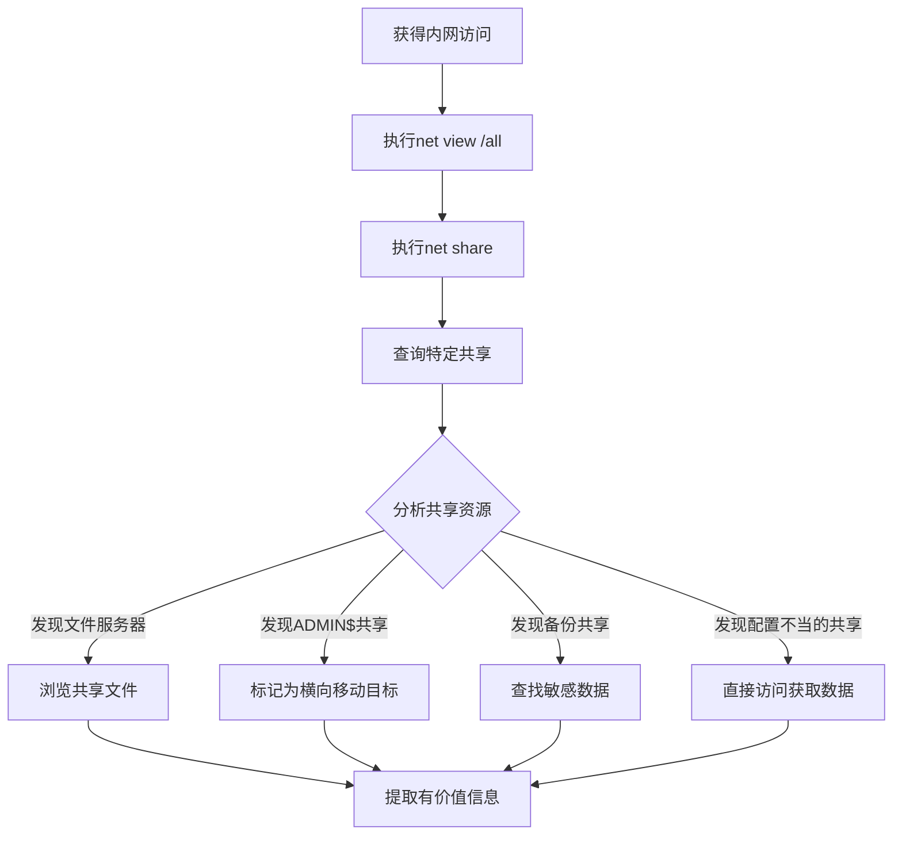

# 网络共享发现 (T1135)

## 一句话通俗理解

查看网络上共享的文件夹和资源——攻击者用 `net view` 扫描内网中哪些电脑共享了文件，就像小偷在楼道里逐个试门，看哪些门没锁。

## 30秒速查卡

| 维度 | 你需要知道的 |
|------|-------------|
| 这是什么？ | 攻击者使用 `net view`、`Get-SmbShare`、PowerView `Find-DomainShare` 扫描内网中所有开放的 SMB 共享文件夹，寻找敏感数据和横向移动入口 |
| 为什么危险？ | 网络共享发现是横向移动的关键步骤，攻击者通过共享文件夹定位敏感数据、发现管理共享（ADMIN$、C$）作为横向移动通道 |
| 谁需要关心？ | SOC分析师、AD管理员、网络运维、任何需要检测内网共享枚举行为的安全人员 |
| 你的第一步防御 | 监控 `net view` 命令的频繁执行和短时间内对多个 IP 的 SMB 连接（Event ID 5140） |
| 如果只做一件事 | 对短时间内从同一主机对大量不同 IP 发起 SMB 连接的行为立即告警，这是典型的网络共享枚举特征 |

## 难度等级

- ⭐⭐ 中级（需要一定基础）

## 技术描述

网络共享发现（T1135）是MITRE ATT&CK框架中的一种发现技术。

**通俗解释：**
公司在内网上经常设置共享文件夹，让员工方便地访问公共文件（如共享文档、项目资料、备份文件）。攻击者入侵后，会扫描内网上所有开放的共享资源——不仅查找敏感文件（如财务数据、客户信息），更重要的是寻找可供横向移动的入口。就像盗贼潜入大楼后，不会只偷一个房间，而是查看哪些办公室的门没锁、哪些柜子有值钱的东西。

**技术原理：**
1. 在Windows中使用 `net view` 查看网络上的所有计算机和共享资源
2. 使用 `net view \\\\&lt;computername&gt;` 查看指定电脑上的共享文件夹
3. 使用 `net share` 查看本机的共享资源
4. 使用PowerShell的 `Get-SmbShare` 获取SMB共享信息
5. 使用WMI查询 `SELECT * FROM Win32_Share` 枚举网络共享

**用途与影响：**
网络共享发现帮助攻击者：定位包含敏感数据的文件服务器；识别可供横向移动的目标系统；发现配置不当的管理共享（如ADMIN$、C$）；查找文件共享中的凭证文件（如密码本、配置文件）；判断内网中不同系统的角色和价值。

## 子技术列表

**该技术没有子技术。**

## 攻击流程

### 典型攻击流程

```
扫描共享 --> 定位文件服务器 --> 发现敏感数据 --> 横向移动
```



**步骤详解：**

1. **枚举网络共享**
   - 通俗描述：用 `net view` 查看网络上有哪些计算机和共享
   - 技术细节：`net view /all` 显示所有共享资源，包括隐藏的共享（如ADMIN$）
   - 常用工具：net.exe

2. **查询本地共享**
   - 通俗描述：查看当前系统开放了哪些共享
   - 技术细节：`net share` 列出本机所有共享目录
   - 常用工具：net.exe

3. **访问目标共享**
   - 通俗描述：查看特定计算机上的共享文件夹内容
   - 技术细节：`net view \\\\&lt;computername&gt;` 或 `dir \\\\&lt;computername&gt;\\`<share>``
   - 常用工具：net.exe, dir.exe

4. **提取有价值信息**
   - 通俗描述：在共享文件夹中搜索敏感文件
   - 技术细节：查找包含"password"、"backup"、"financial"等关键词的文件
   - 常用工具：dir, findstr

## 真实案例

### 案例1：APT29 - 网络共享枚举用于横向移动

- **时间**: 2020年-2021年
- **目标**: 美国政府机构、IT供应链（SolarWinds）
- **攻击组织**: APT29（Nobelium）
- **手法**: APT29在SolarWinds供应链攻击中使用TEARDROP后门进行广泛的网络共享发现。他们使用 `net view /all` 列出域中所有可用共享资源，特别关注包含"admin"、"data"、"backup"、"share"等关键词的管理共享。还使用PowerView脚本的 `Find-DomainShare` 函数搜索所有域共享，并将发现的文件服务器共享映射为网络驱动器以方便后续数据收集。发现的共享路径为后续的横向移动和数据窃取提供了精确目标。
- **影响**: 多个美国政府部门网络被长期渗透
- **参考链接**: [MITRE - APT29](https://attack.mitre.org/groups/G0143/)

### 案例2：APT41 - 共享资源探测与数据定位

- **时间**: 2019年-2020年
- **目标**: 全球科技、制药和游戏公司
- **攻击组织**: APT41（Winnti）
- **手法**: APT41使用自定义后门和Cobalt Strike进行网络共享发现。他们执行 `net view /all` 和 `net share` 命令枚举共享资源，特别针对文件服务器和备份服务器的共享资源，使用 `dir \\\\&lt;fileserver&gt;\\`<share>`` 浏览共享目录内容，寻找包含数据库备份、源代码仓库、财务数据和生产环境配置的共享路径。发现的共享信息被加密回传至C2，用于后续的分阶段数据提取。
- **影响**: 多家高科技公司敏感数据被窃取
- **参考链接**: [Mandiant - APT41](https://www.mandiant.com/resources/apt41-global-cyber-espionage)

### 案例3：Lazarus Group - 网络共享横向移动

- **时间**: 2019年-2022年
- **目标**: 加密货币交易所、防务公司
- **攻击组织**: Lazarus Group
- **手法**: Lazarus使用自定义恶意软件（如MATA、Dtrack）执行网络共享发现。Dtrack后门包含专门的文件收集模块，使用 `net view /all` 和 `NetShareEnum` API枚举网络共享资源。操作者手动输入 `net share` 和 `net use` 命令挂载发现的管理共享。在针对加密货币交易所的攻击中，他们特别关注跨网络段的数据服务器共享，定位交易数据库和钱包文件的存储位置。
- **影响**: 多国加密货币平台被入侵，资金被盗
- **参考链接**: [Securelist - Lazarus MATA](https://securelist.com/mata-multi-platform-cyber-framework/102140/)

### 案例4：FIN7 - 文件服务器共享发现

- **时间**: 2016年-2019年
- **目标**: 全球零售、餐饮和酒店POS系统
- **攻击组织**: FIN7（Carbanak）
- **手法**: FIN7在入侵POS网络后，使用Carbanak后门和PowerShell脚本枚举网络共享资源。他们使用 `net view` 扫描内网中的文件服务器，特别关注包含"pos"、"store"、"backoffice"、"payment"等关键字的服务器名称。还通过WMI远程查询 `SELECT * FROM Win32_Share` 批量获取共享配置。发现的POS软件配置文件和日志数据用于进一步定位支付卡数据处理系统。
- **影响**: 数百万张支付卡信息被窃取
- **参考链接**: [FireEye - FIN7](https://www.fireeye.com/blog/threat-research/2017/04/fin7-carbanak.html)

## 红队视角

> ⚠️ **免责声明**：以下内容仅用于合法的安全测试、渗透测试和教育目的。未经授权对他人系统进行测试是违法行为。

### 实战技巧

1. **使用PowerShell查找域共享**
   `Get-SmbShare` 和 `Get-WmiObject Win32_Share` 提供比 `net view` 更全面的共享信息。

2. **使用PowerView批量枚举**
   `Find-DomainShare -CheckShareAccess` 可以在Active Directory环境中自动搜索所有可访问的共享。

3. **快速探测共享是否可访问**
   使用 `dir \\\\`<target>`\\`<share>`` 测试对特定共享的访问权限，返回"访问被拒绝"表示共享存在但无权限。

### 常用工具

| 工具名称 | 用途 | 平台 | 链接 |
|----------|------|------|------|
| net view | 查看网络共享 | Windows | 内置命令 |
| net share | 查看本地共享 | Windows | 内置命令 |
| Get-SmbShare | PowerShell共享枚举 | Windows | 内置PowerShell |
| PowerView | AD共享枚举脚本 | Windows | GitHub |
| smbclient | SMB客户端 | Linux | 内置工具 |

### 注意事项

- `net view /all` 包括隐藏共享（如ADMIN$、C$、IPC$）
- 频繁的共享枚举可能触发EDR检测规则
- 某些共享需要管理员权限才能访问

## 蓝队视角

### 检测要点

1. **异常的net view执行**
   - 日志来源：Sysmon Event ID 1
   - 关注字段：`net view` 命令行的频繁执行
   - 异常特征：非管理员工作站频繁执行网络共享枚举

2. **SMB批量连接检测**
   - 日志来源：Windows Event ID 5140（网络共享对象已访问）
   - 关注字段：短时间内对多个IP的SMB连接
   - 异常特征：单个进程发起的批量共享访问

### 监控建议

- 监控 `net view` 和 `net share` 的异常执行
- 审计PowerShell `Get-SmbShare` 和 `Get-WmiObject Win32_Share` 的调用
- 关注短时间内对大量IP发起的SMB连接请求
- 使用Sysmon Event ID 3监控大量SMB出站连接（445端口）

## 检测建议

### 网络层检测

**检测方法：** 监控SMB协议中的异常连接模式。

**具体规则/命令示例：**
```bash
# 检测短时间内大量SMB连接
tcpdump -nn 'port 445 and not src net <internal_net>'
```

### 主机层检测

**Windows事件ID：**
- 事件ID 5140：网络共享对象已访问
- 事件ID 5143：网络共享已修改
- Sysmon Event ID 3：网络连接
- Sysmon Event ID 1：进程创建

**用人话说：** 这条规则在监控有人执行 `net view` 命令扫描网络共享。net view 是 Windows 内置的网络浏览工具，IT 运维人员偶尔会用它查看网络资源。但攻击者用它来做完全不同的事情——扫描内网中哪些电脑共享了文件夹，寻找包含敏感数据的文件服务器和可被利用的管理共享。关键判断标准是：谁在扫？扫多少？如果 IT 人员在维护时查看一两个共享，那是正常操作；但如果有人在短时间内用 `net view` 扫描了整个网段，或者在非工作时间执行，那就是攻击者在"踩点"，为后续的横向移动和数据窃取做准备。

**Sigma规则示例：**
```yaml
title: Network Share Discovery via net view
status: experimental
description: Detects net view command execution
logsource:
    category: process_creation
    product: windows
detection:
    selection:
        CommandLine|contains|all:
            - 'net'
            - 'view'
    condition: selection
level: medium
tags:
    - attack.t1135
```

## 缓解措施

### 优先级1：关键措施

**措施名称：** 限制SMB访问

**具体实施步骤：**
1. 使用Windows防火墙限制对445端口的入站访问
2. 仅允许必要的管理子网访问SMB服务

### 优先级2：重要措施

**措施名称：** 实施共享权限控制

**具体实施步骤：**
1. 删除不必要的管理共享（ADMIN$、C$）
2. 使用基于访问的枚举（ABE）限制共享可见性

### 优先级3：建议措施

**措施名称：** SMB加固

**具体实施步骤：**
1. 启用SMB签名防止中间人攻击
2. 禁用旧版SMB协议（SMB 1.0）

### MITRE ATT&CK 缓解措施映射

| 缓解措施ID | 缓解措施名称 | 适用性 | 说明 |
|------------|-------------|--------|------|
| M1026 | Privileged Account Management | 适用 | 限制过多管理员 |
| M1037 | Filter Network Traffic | 适用 | 限制SMB流量 |
| M1038 | Execution Prevention | 部分适用 | 限制命令执行 |
| M1047 | Audit | 适用 | 启用共享访问审计 |

## 动手实验

> ⚠️ **重要提示**：所有实验必须在隔离的实验室环境中进行，禁止对未授权的真实系统进行测试。

### 实验环境准备

**所需工具：** Windows VM（至少2台）或域环境

### 实验1：基本共享枚举（初级）

**实验目标：** 学习使用net命令查看和枚举共享资源。

**实验步骤：**
1. 执行 `net share` 查看本机共享
2. 执行 `net view` 查看网络计算机
3. 执行 `net view \\\\<target_computer>` 查看特定计算机的共享

**预期结果：** 看到本机和网络上的共享资源列表。

**学习要点：** 理解攻击者如何通过简单命令发现内网共享资源。

### 实验2：PowerShell共享枚举（中级）

**实验目标：** 使用PowerShell脚本自动化共享枚举。

**实验步骤：**
1. 执行 `Get-SmbShare` 查看SMB共享
2. 执行 `Get-WmiObject Win32_Share` 通过WMI获取共享信息
3. 使用 `gwmi Win32_Share -ComputerName `<target>`` 远程查询

**预期结果：** 通过多种方法获取共享信息，理解各自的优劣。

## 术语解释

| 术语 | 英文原名 | 通俗解释 |
|------|----------|----------|
| SMB | Server Message Block | 文件共享协议，Windows系统用来共享文件和打印机的标准方式 |
| 共享 | Share | 网络上公开的文件夹，其他电脑可以访问里面的文件 |
| 管理共享 | Admin Share | 系统自动创建的隐藏共享（如C$、ADMIN$），用于远程管理 |
| 横向移动 | Lateral Movement | 攻击者从已攻破的系统跳到网络中的其他系统 |
| NFS | Network File System | Linux系统使用的文件共享协议 |
| ABE | Access-Based Enumeration | 基于访问的枚举，用户只能看到自己有权限的共享 |

## 参考资料

### 官方文档

- [MITRE ATT&CK - T1135](https://attack.mitre.org/techniques/T1135/)
- [Microsoft - Net Share](https://learn.microsoft.com/en-us/windows-server/administration/windows-commands/net-share)

### 安全报告

- [Mandiant - APT41 Network Share Discovery](https://www.mandiant.com/resources/apt41-global-cyber-espionage)
- [Securelist - Lazarus MATA](https://securelist.com/mata-multi-platform-cyber-framework/102140/)
- [FireEye - FIN7 Carbanak](https://www.fireeye.com/blog/threat-research/2017/04/fin7-carbanak.html)

### 工具与资源

- [PowerShell Get-SmbShare](https://learn.microsoft.com/en-us/powershell/module/smbshare/get-smbshare)
- [PowerView](https://github.com/PowerShellMafia/PowerSploit/tree/master/Recon)
- [smbclient](https://www.samba.org/samba/docs/current/man-html/smbclient.1.html)
