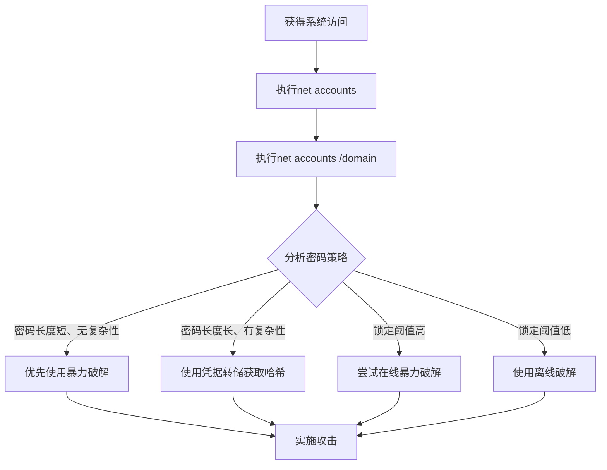

# 密码策略发现 (T1201)

## 一句话通俗理解

查看系统的密码规则要求——攻击者用 `net accounts /domain` 检查密码复杂度要求，就像小偷先看看门锁的级别，再决定用哪种开锁工具。

## 30秒速查卡

| 维度 | 你需要知道的 |
|------|-------------|
| 这是什么？ | 攻击者使用 `net accounts /domain`、`Get-ADDefaultDomainPasswordPolicy`、`secedit /export` 查询密码策略（长度、复杂度、锁定阈值），评估暴力破解可行性 |
| 为什么危险？ | 密码策略信息帮助攻击者决定攻击方式：策略宽松则暴力破解，策略严格则转用凭证转储（Mimikatz）或钓鱼 |
| 谁需要关心？ | SOC分析师、AD管理员、任何需要检测凭证攻击前期侦察行为的安全人员 |
| 你的第一步防御 | 监控 `net accounts /domain` 从非域控主机执行的异常行为，审计 PowerShell AD 策略查询命令 |
| 如果只做一件事 | 对非 AD 管理人员执行密码策略查询立即告警，因为正常业务不需要了解密码策略细节 |

## 难度等级

- ⭐ 初级（新手可学）

## 技术描述

密码策略发现（T1201）是MITRE ATT&CK框架中的一种发现技术。

**通俗解释：**
每个公司都有自己的密码规则——有的要求密码至少8位且包含特殊字符，有的只要求6位数字即可。攻击者入侵系统后，会先查看这些密码策略规则：如果密码要求很简单，就可以轻松进行暴力破解；如果密码要求很复杂，就需要用更高级的凭证窃取方法。就像小偷先摸清楚门锁的档次，再决定是用螺丝刀还是专业开锁器。

**技术原理：**
1. 使用 `net accounts /domain` 查看域密码策略（密码长度、复杂度、锁定阈值等）
2. 使用 `net accounts` 查看本地密码策略
3. 使用PowerShell的 `Get-ADDefaultDomainPasswordPolicy` 获取域密码策略
4. 使用 `secedit /export /cfg secpol.cfg` 导出安全策略配置
5. 在Linux中查看 `/etc/pam.d/common-password` 和 `/etc/login.defs`

**用途与影响：**
密码策略发现帮助攻击者：评估暴力破解的可行性（如果锁定阈值高，可以放心尝试）；优化密码破解策略（知道密码长度和复杂度要求后调整破解字典）；判断组织的安全成熟度（策略越严格，表示安全投入越大）；规划后续的凭证窃取方案（策略严格则优先使用凭证转储而非破解）。

## 子技术列表

**该技术没有子技术。**

## 攻击流程

### 典型攻击流程

```
查询策略 --> 分析参数 --> 选择攻击方式 --> 实施攻击
```



**步骤详解：**

1. **查询本地密码策略**
   - 通俗描述：用 `net accounts` 查看本地密码规则
   - 技术细节：`net accounts` 显示密码长度要求、锁定阈值等
   - 常用工具：net.exe

2. **查询域密码策略**
   - 通俗描述：用 `net accounts /domain` 查看域密码规则
   - 技术细节：`net accounts /domain` 从域控制器获取域策略
   - 常用工具：net.exe

3. **分析策略参数**
   - 通俗描述：根据密码规则选择合适的攻击方式
   - 技术细节：关注MinimumPasswordLength、LockoutThreshold等关键参数
   - 常用工具：无（人工分析）

4. **实施攻击**
   - 通俗描述：根据分析结果执行不同的凭证攻击
   - 技术细节：策略宽松时使用暴力破解，严格时使用凭据转储
   - 常用工具：Hashcat, Mimikatz

## 真实案例

### 案例1：APT29 - 域密码策略评估

- **时间**: 2020年-2021年
- **目标**: 美国政府机构、IT公司
- **攻击组织**: APT29（Nobelium）
- **手法**: APT29在SolarWinds攻击活动中使用BEACON后门执行 `net accounts /domain` 获取目标域的密码策略。他们分析策略参数包括密码最短长度（MinPwdLen）、密码最长使用期限（MaxPwdAge）和账户锁定阈值（LockoutThreshold）。如果密码最小长度短且无复杂度要求，则优先使用字典攻击而非暴力破解。他们还通过密码策略推断组织的安全成熟度，选择攻击难度较低的目标优先推进。
- **影响**: 多个政府机构网络被长期渗透
- **参考链接**: [MITRE - APT29](https://attack.mitre.org/groups/G0143/)

### 案例2：Cobalt Group - 锁定策略评估规避检测

- **时间**: 2018年-2019年
- **目标**: 全球银行、金融机构
- **攻击组织**: Cobalt Group
- **手法**: Cobalt Group在使用暴力破解进行横向移动前，通过 `net accounts /domain` 获取域的账户锁定策略。他们特别关注LockoutThreshold（锁定阈值）参数，如果阈值较高（10次以上），表示在触发锁定前有较大尝试空间。基于密码策略信息，他们精心选择密码猜测数量和间隔，在不超过锁定阈值的前提下最大化破解效率，同时避免触发账户锁定告警。
- **影响**: 多家银行和金融机构被成功入侵
- **参考链接**: [MITRE - Cobalt Group](https://attack.mitre.org/groups/G0080/)

### 案例3：Silent Librarian - 密码策略辅助凭证破解

- **时间**: 2018年-2020年
- **目标**: 全球高等教育机构
- **攻击组织**: Silent Librarian
- **手法**: Silent Librarian在获得初始访问后，通过PowerShell执行 `Get-ADDefaultDomainPasswordPolicy` 获取域默认密码策略。他们将策略参数中的密码历史记录和密码最短期限与窃取的哈希值关联分析，判断哪些历史密码可能仍然有效。在密码复杂度要求较低的教育机构目标中，配置了针对性的Hashcat规则进行快速破解。
- **影响**: 大量高校的学术研究数据被窃取
- **参考链接**: [MITRE - Silent Librarian](https://attack.mitre.org/groups/G0122/)

### 案例4：FIN6 - 组策略密码配置收集

- **时间**: 2017年-2019年
- **目标**: 全球零售POS系统
- **攻击组织**: FIN6
- **手法**: FIN6在POS环境的横向移动阶段使用 `secedit /export /cfg secpol.cfg` 命令导出包含密码策略的安全模板配置。他们特别关注是否启用了密码复杂性要求、最小密码长度和是否允许可逆加密存储密码等策略。利用POS环境中常见的较弱密码策略（如最小长度6位且无复杂度要求）指导针对POS系统默认账户和弱口令的攻击测试。
- **影响**: 数千家零售企业的支付系统被入侵
- **参考链接**: [Mandiant - FIN6](https://www.mandiant.com/resources/apt41-global-cyber-espionage)

## 红队视角

> ⚠️ **免责声明**：以下内容仅用于合法的安全测试、渗透测试和教育目的。未经授权对他人系统进行测试是违法行为。

### 实战技巧

1. **使用PowerShell获取详细策略**
   `Get-ADDefaultDomainPasswordPolicy` 提供比 `net accounts /domain` 更详细的策略参数。
   
2. **导出本地安全策略**
   `secedit /export /cfg secpol.cfg` 可以导出完整的本地安全策略配置。

3. **获取细粒度密码策略**
   `Get-ADFineGrainedPasswordPolicy` 获取针对特定用户组的细粒度策略。

### 常用工具

| 工具名称 | 用途 | 平台 | 链接 |
|----------|------|------|------|
| net accounts | 密码策略查询 | Windows | 内置命令 |
| secedit | 安全策略管理 | Windows | 内置命令 |
| Get-ADDefaultDomainPasswordPolicy | AD策略查询 | Windows | 内置PowerShell模块 |
| gpresult | 组策略结果 | Windows | 内置命令 |

### 注意事项

- `net accounts /domain` 需要域用户权限
- 频繁的策略查询可能在域控上留下大量日志
- 某些EDR产品会将策略查询标记为发现行为

## 蓝队视角

### 检测要点

1. **异常的策略查询**
   - 日志来源：Windows Event ID 4688
   - 关注字段：`net accounts`、`secedit` 的命令行执行
   - 异常特征：非管理员用户执行密码策略查询

2. **批量策略枚举**
   - 日志来源：Windows Event ID 4739（域策略已修改）
   - 关注字段：短时间内从同一主机多次查询
   - 异常特征：自动化的策略探测行为

### 监控建议

- 监控 `net accounts /domain` 命令从非域控制器执行
- 审计PowerShell `Get-ADDefaultDomainPasswordPolicy` 的异常调用
- 关联密码策略查询与后续的暴力破解尝试

## 检测建议

### 网络层检测

**检测方法：** 监控密码策略查询相关的网络流量，特别关注通过 SMB/RPC 远程查询域密码策略的异常行为以及 LDAP 查询中的策略属性枚举。

**具体规则/命令示例：**
```
# 检测通过 SMB 匿名会话远程查询密码策略的流量
# 关注 LDAP 查询中针对 domainPolicy、lockoutThreshold 等策略属性的枚举
# 使用 Zeek 分析 smb_command 和 ldap_search 日志，检测非基线模式的策略查询
```

### 主机层检测

**Windows事件ID：**
- 事件ID 4688：进程创建
- 事件ID 4104：PowerShell脚本
- 事件ID 4739：域策略已修改
- Sysmon Event ID 1：进程创建

**用人话说：** 这条规则在监控有人执行 `net accounts /domain` 查询域密码策略。这个命令会返回密码最短长度、复杂度要求、账户锁定阈值等信息。攻击者为什么要查这个？因为他们想评估暴力破解的可行性——如果密码要求很宽松（比如最短6位、无复杂度），他们就可以放心尝试密码喷洒；如果密码要求很严格，他们就会放弃暴力破解，转用 Mimikatz 突取内存中的密码哈希。关键判断标准是：谁在查？正常情况下，只有 AD 管理员在做密码策略审计时才会用这个命令，普通用户或非安全人员执行它就值得怀疑。

**Sigma规则示例：**
```yaml
title: Password Policy Discovery via net accounts
status: experimental
description: Detects net accounts /domain command execution
logsource:
    category: process_creation
    product: windows
detection:
    selection:
        CommandLine|contains|all:
            - 'net'
            - 'accounts'
            - '/domain'
    condition: selection
level: medium
tags:
    - attack.t1201
```

## 缓解措施

### 优先级1：关键措施

**措施名称：** 实施强密码策略

**具体实施步骤：**
1. 密码最小长度至少12位
2. 启用密码复杂性要求（大小写、数字、特殊字符）
3. 配置密码历史记录至少24个

### 优先级2：重要措施

**措施名称：** 配置账户锁定策略

**具体实施步骤：**
1. 设置5次失败后锁定30分钟
2. 启用复位账户锁定计数器

### 优先级3：建议措施

**措施名称：** 限制策略查询权限

**具体实施步骤：**
1. 仅允许管理员查询域密码策略
2. 审计所有策略查询行为

### MITRE ATT&CK 缓解措施映射

| 缓解措施ID | 缓解措施名称 | 适用性 | 说明 |
|------------|-------------|--------|------|
| M1026 | Privileged Account Management | 适用 | 限制策略查询权限 |
| M1027 | Password Policies | 适用 | 实施强密码策略 |
| M1036 | Account Use Policies | 适用 | 配置账户锁定 |
| M1047 | Audit | 适用 | 启用策略查询审计 |

## 动手实验

> ⚠️ **重要提示**：所有实验必须在隔离的实验室环境中进行，禁止对未授权的真实系统进行测试。

### 实验环境准备

**所需工具：** Windows VM（域环境更佳）

### 实验1：基本密码策略查询（初级）

**实验目标：** 学习使用net accounts查询密码策略。

**实验步骤：**
1. 执行 `net accounts` 查看本地密码策略
2. 执行 `net accounts /domain` 查看域密码策略（如为域环境）
3. 查看并理解各参数含义

**预期结果：** 看到密码长度要求、锁定阈值等策略参数。

**学习要点：** 理解密码策略各参数的含义及对攻击的影响。

### 实验2：PowerShell策略查询（中级）

**实验目标：** 使用PowerShell获取详细密码策略。

**实验步骤：**
1. 执行 `Get-ADDefaultDomainPasswordPolicy` 获取域默认策略
2. 执行 `secedit /export /cfg secpol.cfg` 导出安全策略
3. 分析导出的策略文件

**预期结果：** 获取比net accounts更详细的密码策略信息。

## 术语解释

| 术语 | 英文原名 | 通俗解释 |
|------|----------|----------|
| 密码策略 | Password Policy | 系统规定的密码规则，如最短长度、复杂度要求等 |
| 锁定阈值 | Lockout Threshold | 密码输错多少次后账户被锁定的设置 |
| 暴力破解 | Brute Force | 尝试所有可能的密码组合，直到找到正确密码 |
| 凭证转储 | Credential Dumping | 从系统中提取存储的密码哈希值 |
| 组策略 | Group Policy | Windows中用来集中管理计算机和用户设置的机制 |

## 参考资料

### 官方文档

- [MITRE ATT&CK - T1201](https://attack.mitre.org/techniques/T1201/)
- [Microsoft - Net Accounts](https://learn.microsoft.com/en-us/windows-server/administration/windows-commands/net-accounts)

### 安全报告

- [FireEye - SolarWinds Password Policy Discovery](https://www.fireeye.com/blog/threat-research/2020/12/sunburst-additional-technical-details.html)
- [CrowdStrike - Password Policy Enumeration](https://www.crowdstrike.com/blog/password-policy-enumeration/)

### 工具与资源

- [PowerShell Get-ADDefaultDomainPasswordPolicy](https://learn.microsoft.com/en-us/powershell/module/activedirectory/get-addefaultdomainpasswordpolicy)
- [Microsoft Security Compliance Toolkit](https://learn.microsoft.com/en-us/windows/security/threat-protection/security-compliance-toolkit-10)
