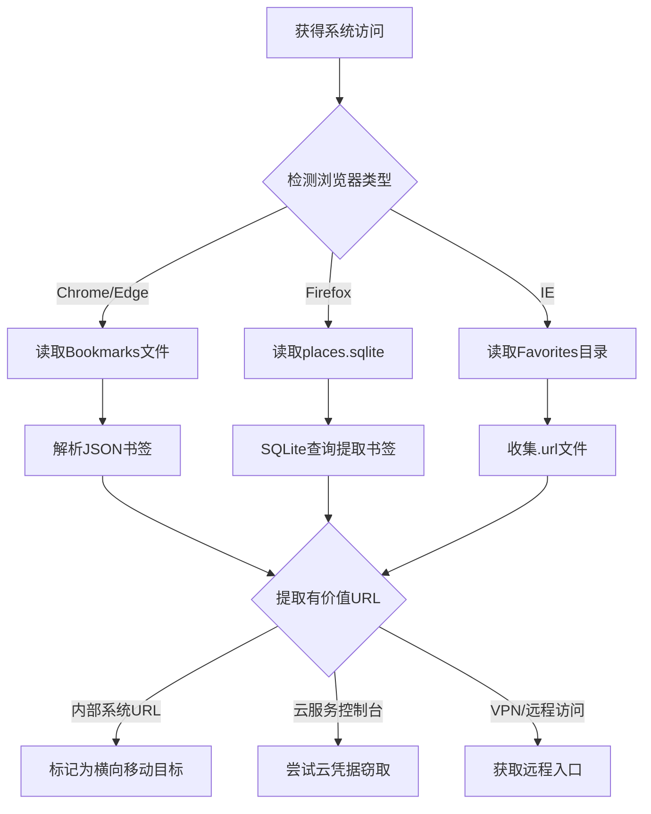

# 浏览器书签发现 (T1217)

## 一句话通俗理解

查看浏览器收藏夹里存了哪些网站——攻击者通过读取浏览器书签，发现用户常访问的内部系统入口（如公司邮箱、VPN、管理后台等）。

## 30秒速查卡

| 维度 | 你需要知道的 |
|------|-------------|
| 这是什么？ | 攻击者读取 Chrome 的 `Bookmarks` 文件（JSON）或 Firefox 的 `places.sqlite` 数据库，提取用户收藏的内部系统 URL（VPN、邮箱、ERP、云控制台） |
| 为什么危险？ | 书签暴露了用户最常用的内部系统入口，攻击者据此发现横向移动目标、云服务控制台、远程访问网关等高价值资产 |
| 谁需要关心？ | SOC分析师、数据安全团队、任何需要检测浏览器数据异常访问的安全人员 |
| 你的第一步防御 | 监控非浏览器进程对 `%LOCALAPPDATA%\Google\Chrome\User Data\Default\Bookmarks` 和 `places.sqlite` 的文件访问 |
| 如果只做一件事 | 对 PowerShell 或脚本进程中读取浏览器书签文件的行为立即告警，因为正常业务流程不需要读取这些文件 |

## 难度等级

- ⭐ 初级（新手可学）

## 技术描述

浏览器书签发现（T1217）是MITRE ATT&CK框架中的一种发现技术。

**通俗解释：**
我们平时会保存一些常用的网站到浏览器书签里，比如公司邮箱、考勤系统、人事系统等。攻击者入侵电脑后，会读取这些书签——因为书签里保存的往往是"重要的"、"内部使用的"、"需要登录的"网站，这些正好是攻击者想找的攻击目标。就像小偷翻看你的电话通讯录，从中找出对你最重要的人。

**技术原理：**
1. Chrome浏览器书签保存在 `%USERPROFILE%\\AppData\\Local\\Google\\Chrome\\User Data\\Default\\Bookmarks`（JSON格式）
2. Firefox书签保存在 `places.sqlite`（SQLite数据库）
3. Edge书签保存格式与Chrome相同（JSON格式）
4. IE收藏夹保存在 `%USERPROFILE%\\Favorites` 目录下的 `.url` 文件中
5. 攻击者通过文件读取或SQLite查询提取书签数据

**用途与影响：**
浏览器书签发现帮助攻击者：识别内部系统的访问入口（如VPN、邮箱、ERP系统）；发现云服务管理控制台（如AWS、Azure控制台）；了解企业内部使用的工具链（如Jira、Confluence、Jenkins）；寻找IT管理系统的URL（如vCenter、备份系统）；分析用户的行为习惯和工作内容。

## 子技术列表

**该技术没有子技术。**

## 攻击流程

### 典型攻击流程

```
定位浏览器 --> 读取书签文件 --> 解析书签 --> 提取有价值URL
```



**步骤详解：**

1. **定位浏览器书签文件**
   - 通俗描述：找到浏览器的书签保存位置
   - 技术细节：检查不同浏览器的默认书签存储路径
   - 常用工具：dir, find

2. **读取书签内容**
   - 通俗描述：打开书签文件查看保存的网站地址
   - 技术细节：Chrome/Edge为JSON格式，Firefox为SQLite数据库
   - 常用工具：type, Get-Content, sqlite3

3. **提取有价值URL**
   - 通俗描述：从书签中筛选出内部系统地址
   - 技术细节：过滤包含内部域名（`*.internal`、`*.corp`）和管理系统关键字的URL
   - 常用工具：findstr, Select-String

## 真实案例

### 案例1：APT29 - Chrome书签收集内部系统入口

- **时间**: 2020年-2021年
- **目标**: 美国政府机构、IT公司
- **攻击组织**: APT29（Nobelium）
- **手法**: APT29在SolarWinds攻击活动中通过BEACON后门读取Chrome浏览器的书签文件。他们解析JSON格式的书签结构，提取书签名称和URL，特别关注包含内部域名（如`*.internal`、`*.corp`、`*.intranet`）的书签条目。利用收集的书签信息发现目标组织使用的内部IT管理门户、VPN入口、HR系统、邮箱登录页和代码仓库系统，用于规划后续的横向移动和凭据收集策略。
- **影响**: 多个政府网络被长期渗透
- **参考链接**: [MITRE - APT29](https://attack.mitre.org/groups/G0143/)

### 案例2：Lazarus ZINC - 多浏览器书签收集

- **时间**: 2020年-2022年
- **目标**: 全球加密货币和区块链开发者
- **攻击组织**: ZINC（Lazarus子组织）
- **手法**: ZINC在针对区块链开发者的攻击中部署了定制的恶意软件，专门收集受害者的浏览器书签。恶意软件同时读取Chrome的 `Bookmarks` 文件和Firefox的 `places.sqlite` 数据库。在Firefox中通过SQLite查询提取书签标题和URL。ZINC特别关注加密货币交易所URL、钱包管理页面、DeFi平台入口和开发者文档URL，用于识别目标的加密货币相关活动并针对性的钓鱼攻击。
- **影响**: 多个加密货币平台被入侵，资金被盗
- **参考链接**: [Microsoft - ZINC](https://blogs.microsoft.com/on-the-issues/2021/04/21/zinc-chrome-bookmark-targeting/)

### 案例3：APT41 - 内部系统书签映射网络拓扑

- **时间**: 2019年-2020年
- **目标**: 全球科技、游戏和制药公司
- **攻击组织**: APT41（Winnti）
- **手法**: APT41在受害者IT管理员的工作站上收集浏览器书签，识别目标组织使用的内部运维系统入口。他们读取Chrome和Edge的书签文件，提取URL中包含 `/jenkins`、`/confluence`、`/jira`、`/gitlab`、`/vcenter` 和 `/owa` 等路径的条目，映射出目标组织的DevOps工具链和内部服务架构。书签中的VPN和远程桌面网关地址指导了APT41的横向移动路径选择。
- **影响**: 多家高科技公司敏感数据被窃取
- **参考链接**: [Mandiant - APT41](https://www.mandiant.com/resources/apt41-global-cyber-espionage)

## 红队视角

> ⚠️ **免责声明**：以下内容仅用于合法的安全测试、渗透测试和教育目的。未经授权对他人系统进行测试是违法行为。

### 实战技巧

1. **快速提取Chrome书签**
   PowerShell一行命令：`Get-Content "$env:LOCALAPPDATA\\Google\\Chrome\\User Data\\Default\\Bookmarks" | ConvertFrom-Json | Select-Object -ExpandProperty roots`

2. **提取Firefox书签**
   使用SQLite查询：`sqlite3 places.sqlite "SELECT moz_bookmarks.title, moz_places.url FROM moz_bookmarks JOIN moz_places ON moz_bookmarks.fk = moz_places.id"`

3. **批量收集**
   在横向移动后，从多台系统收集书签并进行交叉分析，发现高频出现的内部系统URL。

### 常用工具

| 工具名称 | 用途 | 平台 | 链接 |
|----------|------|------|------|
| type/Get-Content | 读取JSON书签 | Windows | 内置命令 |
| sqlite3 | 读取Firefox书签数据库 | 跨平台 | 开源 |
| ConvertFrom-Json | 解析JSON | PowerShell | 内置PowerShell |

### 注意事项

- Chrome书签文件可能在浏览器运行时被锁定
- Firefox的places.sqlite需要关闭Firefox才能直接读取
- 某些EDR会监控对浏览器数据目录的文件访问

## 蓝队视角

### 检测要点

1. **异常的浏览器书签文件读取**
   - 日志来源：Sysmon Event ID 11（文件创建/读取）
   - 关注字段：对 `Bookmarks` 或 `places.sqlite` 的文件访问
   - 异常特征：非浏览器进程读取浏览器书签文件

2. **批量书签收集**
   - 日志来源：Windows Event ID 4663（文件访问审计）
   - 关注字段：对 `%USERPROFILE%\\Favorites` 目录的批量访问
   - 异常特征：短时间内读取大量.url文件

### 监控建议

- 监控非浏览器进程对浏览器数据目录的读取
- 审计PowerShell脚本中的书签文件读取行为
- 关注对Firefox `places.sqlite` 的SQLite查询行为
- 使用Sysmon监控浏览器书签文件访问

## 检测建议

### 网络层检测

**检测方法：** 监控浏览器书签数据外泄相关的网络流量，特别关注书签数据被压缩打包后通过 HTTP/HTTPS 传输至外部 IP 的异常流量模式。

**具体规则/命令示例：**
```
# 检测浏览器书签文件（如 Bookmarks、places.sqlite）被非浏览器进程读取后的网络外传流量
# 关注内部主机向非预期外部 IP 发送文件大小与书签文件吻合的 HTTP POST 请求
# 使用 Zeek 分析 http 日志，检测 content-type 为 application/json 且数据量异常的外传行为
```

### 主机层检测

**Windows事件ID：**
- 事件ID 4688：进程创建
- 事件ID 4663：文件访问审计
- Sysmon Event ID 11：文件创建/读取

**用人话说：** 这条规则在监控有非浏览器程序去读取浏览器的书签文件。攻击者为什么要读你的书签？因为书签里保存了你最常访问的内部系统——公司邮箱、VPN 入口、ERP 系统、云服务控制台。这些正好是攻击者想找的横向移动目标。正常情况下，只有 Chrome、Firefox 这些浏览器本身才会去读 Bookmarks 文件。如果看到 PowerShell、cmd 或其他后台进程去读这个文件，那就是攻击者在"翻你的通讯录"，看看你平时都访问哪些重要系统。

**Sigma规则示例：**
```yaml
title: Browser Bookmark File Access
status: experimental
description: Detects non-browser process accessing bookmark files
logsource:
    category: file_event
    product: windows
detection:
    selection:
        TargetFilename|contains:
            - '\\Bookmarks'
            - '\\places.sqlite'
            - '\\Favorites\\'
    condition: selection
level: medium
tags:
    - attack.t1217
```

## 缓解措施

### 优先级1：关键措施

**措施名称：** 限制浏览器数据目录访问

**具体实施步骤：**
1. 配置AppLocker阻止非浏览器进程访问浏览器数据目录
2. 使用Windows Defender Application Control限制脚本执行

### 优先级2：重要措施

**措施名称：** 监控敏感文件访问

**具体实施步骤：**
1. 启用对浏览器书签文件的审计
2. 在EDR中配置书签文件访问检测规则

### 优先级3：建议措施

**措施名称：** 用户安全意识培训

**具体实施步骤：**
1. 教育用户不在书签中保存敏感系统URL
2. 使用受管浏览器策略统一管理书签

### MITRE ATT&CK 缓解措施映射

| 缓解措施ID | 缓解措施名称 | 适用性 | 说明 |
|------------|-------------|--------|------|
| M1022 | Restrict File and Directory Permissions | 适用 | 限制浏览器数据目录权限 |
| M1038 | Execution Prevention | 部分适用 | 限制脚本执行 |
| M1047 | Audit | 适用 | 启用文件访问审计 |

## 动手实验

> ⚠️ **重要提示**：所有实验必须在隔离的实验室环境中进行，禁止对未授权的真实系统进行测试。

### 实验环境准备

**所需工具：** Windows VM（安装Chrome/Firefox）

### 实验1：Chrome书签提取（初级）

**实验目标：** 学习读取和解析Chrome书签文件。

**实验步骤：**
1. 在Chrome中保存几个测试书签（如公司邮箱、内部系统）
2. 找到并打开 `%LOCALAPPDATA%\\Google\\Chrome\\User Data\\Default\\Bookmarks`
3. 使用PowerShell解析JSON：`Get-Content $bookmarkFile | ConvertFrom-Json`

**预期结果：** 看到书签的JSON结构和保存的URL。

**学习要点：** 理解Chrome书签的存储格式和解析方法。

### 实验2：Firefox书签提取（中级）

**实验目标：** 学习从Firefox SQLite数据库提取书签。

**实验步骤：**
1. 在Firefox中保存几个测试书签
2. 找到Firefox的配置文件目录
3. 使用sqlite3查询书签数据库

**预期结果：** 看到Firefox书签的标题和URL。

## 术语解释

| 术语 | 英文原名 | 通俗解释 |
|------|----------|----------|
| 书签 | Bookmark | 浏览器中保存的网站快捷方式，便于快速访问 |
| JSON | JSON | 一种轻量级的数据格式，Chrome用此格式保存书签 |
| SQLite | SQLite | 一种小型数据库引擎，Firefox用此保存书签 |
| URL | Uniform Resource Locator | 网址，网页的地址 |
| 横向移动 | Lateral Movement | 攻击者从已攻破的系统跳到网络中的其他系统 |

## 参考资料

### 官方文档

- [MITRE ATT&CK - T1217](https://attack.mitre.org/techniques/T1217/)
- [Chrome Bookmark File Location](https://www.chromium.org/user-experience/user-data-directory/)

### 安全报告

- [Microsoft - ZINC Chrome Bookmark Targeting](https://blogs.microsoft.com/on-the-issues/2021/04/21/zinc-chrome-bookmark-targeting/)
- [Kaspersky - Browser Bookmark Theft](https://securelist.com/browser-bookmark-theft-techniques/106137/)

### 工具与资源

- [sqlite3命令行工具](https://www.sqlite.org/cli.html)
- [PowerShell ConvertFrom-Json](https://learn.microsoft.com/en-us/powershell/module/microsoft.powershell.utility/convertfrom-json)
