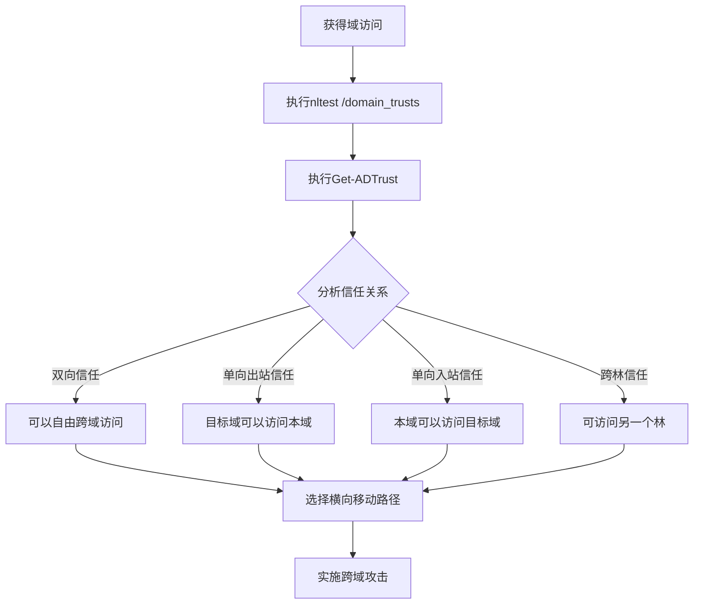

# 域信任发现 (T1482)

## 一句话通俗理解

查看域之间的信任关系——攻击者用 `nltest /domain_trusts` 了解域之间的连接方式，就像小偷摸清了大楼里哪些门可以直接通往另一栋楼。

## 难度等级

- ⭐⭐⭐ 高级（需要深入技术知识）

## 技术描述

域信任发现（T1482）是MITRE ATT&CK框架中的一种发现技术。

**通俗解释：**
在一个大公司里，不同的部门（如财务部、人事部、研发部）可能有各自的"域"（相当于独立的小王国）。为了让员工方便地在部门之间访问资源，域与域之间会建立"信任关系"（相当于互通的桥）。攻击者入侵一个域后，会查看这个域还信任哪些其他域——通过这些信任关系，他们可以像拿着通行证一样，从一个域直接跳到另一个域。

**技术原理：**
1. 使用 `nltest /domain_trusts` 枚举所有域信任关系，显示信任类型和方向
2. 使用PowerShell的 `Get-ADTrust` 和 `Get-ADForest` 获取详细信任属性
3. 通过.NET类 `([System.DirectoryServices.ActiveDirectory.Domain]::GetCurrentDomain()).GetAllTrustRelationships()` 编程枚举
4. 查询Active Directory中的 `trustedDomain` 对象获取信任属性

**用途与影响：**
域信任发现帮助攻击者：识别跨域横向移动路径；发现特权访问通道；定位敏感资源的存储位置；利用单向信任绕过安全控制；在组织合并后利用遗留的信任关系扩大攻击范围。

## 子技术列表

**该技术没有子技术。**

## 攻击流程

### 典型攻击流程

```
枚举信任 --> 分析方向 --> 规划路径 --> 跨域移动
```



**步骤详解：**

1. **枚举信任关系**
   - 通俗描述：用nltest查看域信任列表
   - 技术细节：`nltest /domain_trusts` 显示所有信任关系和信任类型
   - 常用工具：nltest.exe

2. **获取详细信任属性**
   - 通俗描述：用PowerShell获取信任的详细信息
   - 技术细节：`Get-ADTrust -Filter *` 获取信任方向、可传递性等属性
   - 常用工具：PowerShell ActiveDirectory模块

3. **分析攻击路径**
   - 通俗描述：找出可以利用的信任关系
   - 技术细节：重点关注单向信任和跨林信任，评估访问权限
   - 常用工具：BloodHound

4. **实施跨域攻击**
   - 通俗描述：通过信任关系进入其他域
   - 技术细节：使用Kerberos跨域身份验证、黄金票据等
   - 常用工具：Mimikatz, Rubeus

## 真实案例

### 案例1：APT29 - 域信任枚举扩展攻击范围

- **时间**: 2020年-2021年
- **目标**: 美国政府机构、IT公司
- **攻击组织**: APT29（Nobelium）
- **手法**: APT29在SolarWinds供应链攻击中使用BEACON后门执行 `nltest /domain_trusts` 枚举目标环境的域信任关系。他们分析信任类型和方向（入站、出站、双向），使用 `Get-ADTrust -Filter *` 获取详细信息。通过域信任发现，APT29识别出可以从当前域访问的其他域和资源，将攻击范围从IT环境扩展到包含敏感数据的业务域，实现跨域横向移动和数据窃取。
- **影响**: 多个美国政府部门网络被长期渗透
- **参考链接**: [MITRE - APT29](https://attack.mitre.org/groups/G0143/)

### 案例2：Wizard Spider - 跨信任勒索软件部署

- **时间**: 2020年-2021年
- **目标**: 全球企业网络（勒索软件受害者）
- **攻击组织**: Wizard Spider（Ryuk/Conti）
- **手法**: Wizard Spider在部署勒索软件前使用 `nltest /domain_trusts /all_trusts` 枚举所有跨域信任关系。他们特别关注单向信任关系，尤其是从被入侵的外围域指向包含关键业务系统的核心域的信任关系。利用域信任信息，使用 `winrs`、`wmic` 或PsExec通过Kerberos跨域身份验证将勒索软件部署到所有可访问域的系统，实现攻击范围最大化。
- **影响**: 多家大型企业被勒索，损失数千万美元
- **参考链接**: [CrowdStrike - Wizard Spider](https://www.crowdstrike.com/blog/ryuk-ransomware-domain-trust-abuse/)

### 案例3：Cobalt Group - 林信任关系发现

- **时间**: 2018年-2019年
- **目标**: 全球银行和金融机构
- **攻击组织**: Cobalt Group
- **手法**: Cobalt Group在入侵金融机构后，使用 `Get-ADForest` 和 `([System.DirectoryServices.ActiveDirectory.Forest]::GetCurrentForest()).GetAllTrustRelationships()` 枚举林级信任关系。他们发现根域和子域之间的关系，以及组织并购后遗留的跨林信任。通过ATA（跨林信任）分析不同安全域之间的访问路径，利用较弱的子域信任关系绕过严格的外围域安全控制，逐步渗透到持有核心业务数据的根域环境。
- **影响**: 多家金融机构被成功入侵
- **参考链接**: [MITRE - Cobalt Group](https://attack.mitre.org/groups/G0080/)

### 案例4：APT28 - 信任关系用于目标选择

- **时间**: 2016年-2019年
- **目标**: 全球政府、军事组织
- **攻击组织**: APT28（Fancy Bear）
- **手法**: APT28在枚举目标组织的域信任关系后，使用域信任信息确定后续攻击的目标域选择策略。他们通过 `nltest /domain_trusts` 获取信任列表后，分析不同信任域的安全控制强度。APT28优先选择与多个域具有信任关系的域控服务器作为跳板，利用跨林信任关系，从被入侵的外交部门域通过信任关系渗透到国防或情报部门的独立林中。
- **影响**: 多国政府和军事机构被渗透
- **参考链接**: [Mandiant - APT28](https://www.mandiant.com/resources/apt28-cross-forest-attack-paths)

## 红队视角

> ⚠️ **免责声明**：以下内容仅用于合法的安全测试、渗透测试和教育目的。未经授权对他人系统进行测试是违法行为。

### 实战技巧

1. **使用nltest快速枚举**
   `nltest /domain_trusts /all_trusts` 可以一次性查看所有信任关系。

2. **使用BloodHound分析**
   将域信任信息导入BloodHound，可视化分析跨域攻击路径。

3. **检测SID过滤**
   如果跨林信任启用了SID过滤，可能会导致跨域攻击失败，需要先检查。

### 常用工具

| 工具名称 | 用途 | 平台 | 链接 |
|----------|------|------|------|
| nltest | 域信任枚举 | Windows | 内置命令 |
| Get-ADTrust | AD信任查询 | Windows | 内置PowerShell模块 |
| BloodHound | 攻击路径分析 | 跨平台 | GitHub |
| SharpHound | BloodHound数据收集器 | Windows | GitHub |

### 注意事项

- `nltest` 需要域用户权限
- 频繁的信任枚举会在域控上留下大量LDAP查询日志
- 跨林信任的攻击路径可能需要额外的凭据

## 蓝队视角

### 检测要点

1. **异常的信任枚举**
   - 日志来源：Windows Event ID 4688
   - 关注字段：`nltest /domain_trusts` 命令的执行
   - 异常特征：非域控制器系统执行信任枚举

2. **LDAP信任对象查询**
   - 日志来源：Windows Event ID 4662（目录服务访问）
   - 关注字段：对 `trustedDomain` 对象的LDAP查询
   - 异常特征：非管理用户查询信任关系

### 监控建议

- 监控 `nltest.exe` 的异常执行，特别是来自非管理员的调用
- 审计PowerShell中 `Get-ADTrust` 和 `Get-ADForest` 的调用
- 监控域控日志中LDAP查询 `trustedDomain` 对象的行为
- 关联域信任发现与后续跨域Kerberos请求（Event ID 4769）

## 检测建议

### 网络层检测

**检测方法：** 监控域信任关系枚举的网络流量，特别关注通过 LSARPC 和 LDAP 协议查询域间信任关系的异常行为。

**具体规则/命令示例：**
```
# 检测 nltest /domain_trusts 命令执行后产生的 LSARPC 流量
# 关注 LDAP 查询中针对 trustedDomain 对象类和 interSiteTopology 属性的枚举
# 使用 Zeek 分析 dce_rpc 日志，检测包含 LsarQueryInformationPolicy 等 UUID 的信任查询流量
```

### 主机层检测

**Windows事件ID：**
- 事件ID 4688：进程创建（监控nltest.exe）
- 事件ID 4662：目录服务访问
- 事件ID 4769：Kerberos服务票据请求
- 事件ID 4706：创建信任域

**Sigma规则示例：**
```yaml
title: Domain Trust Discovery via nltest
status: experimental
description: Detects nltest domain trust enumeration
logsource:
    category: process_creation
    product: windows
detection:
    selection:
        CommandLine|contains|all:
            - 'nltest'
            - 'domain_trusts'
    condition: selection
level: high
tags:
    - attack.t1482
```

## 缓解措施

### 优先级1：关键措施

**措施名称：** 最小化信任关系

**具体实施步骤：**
1. 仅保留必要的域和林信任关系
2. 定期审查和清理遗留的信任关系

### 优先级2：重要措施

**措施名称：** 启用SID过滤

**具体实施步骤：**
1. 对跨林信任启用SID过滤（SID Filtering / Quarantine）
2. 实施选择性身份验证限制跨域访问用户范围

### 优先级3：建议措施

**措施名称：** 监控信任相关活动

**具体实施步骤：**
1. 启用信任相关事件的审计
2. 使用Microsoft Defender for Identity检测异常信任枚举

### MITRE ATT&CK 缓解措施映射

| 缓解措施ID | 缓解措施名称 | 适用性 | 说明 |
|------------|-------------|--------|------|
| M1026 | Privileged Account Management | 适用 | 限制策略查询权限 |
| M1047 | Audit | 适用 | 启用信任枚举审计 |
| M1018 | User Account Management | 适用 | 管理信任关系 |

## 动手实验

> ⚠️ **重要提示**：所有实验必须在隔离的实验室环境中进行，禁止对未授权的真实系统进行测试。

### 实验环境准备

**所需工具：** Windows VM（域环境，至少2个域/林）

### 实验1：基本信任枚举（初级）

**实验目标：** 学习使用nltest枚举域信任关系。

**实验步骤：**
1. 执行 `nltest /domain_trusts` 查看信任列表
2. 执行 `nltest /domain_trusts /all_trusts` 查看所有信任
3. 分析输出中的信任类型和方向

**预期结果：** 看到当前域的信任关系列表。

**学习要点：** 理解域信任的基本概念和查询方法。

### 实验2：PowerShell信任查询（中级）

**实验目标：** 使用PowerShell获取详细信任属性。

**实验步骤：**
1. 执行 `Get-ADTrust -Filter *` 获取所有信任
2. 执行 `Get-ADForest` 查看林信息
3. 执行 `(Get-ADForest).Trusts` 查看林信任

**预期结果：** 获取信任的详细属性，包括方向、传递性等信息。

## 术语解释

| 术语 | 英文原名 | 通俗解释 |
|------|----------|----------|
| 域 | Domain | Windows网络中的管理边界，就像公司的一个部门 |
| 域信任 | Domain Trust | 域之间的连接关系，允许用户从一个域访问另一个域的资源 |
| 林 | Forest | 一组域的集合，就像由多个部门组成的集团公司 |
| 信任方向 | Trust Direction | 信任关系的方向（单向/双向），就像单行道或双向道 |
| SID过滤 | SID Filtering | 防止跨林信任中用户权限提升的安全机制 |
| Kerberos | Kerberos | Windows使用的身份验证协议，用于域间验证 |

## 参考资料

### 官方文档

- [MITRE ATT&CK - T1482](https://attack.mitre.org/techniques/T1482/)
- [Microsoft - Nltest](https://learn.microsoft.com/en-us/windows-server/administration/windows-commands/nltest)

### 安全报告

- [CrowdStrike - Ryuk Domain Trust Abuse](https://www.crowdstrike.com/blog/ryuk-ransomware-domain-trust-abuse/)
- [Mandiant - APT28 Cross-Forest Attack Paths](https://www.mandiant.com/resources/apt28-cross-forest-attack-paths)
- [FireEye - SolarWinds Domain Trust Discovery](https://www.fireeye.com/blog/threat-research/2020/12/sunburst-additional-technical-details.html)

### 工具与资源

- [BloodHound](https://github.com/BloodHoundAD/BloodHound)
- [PowerShell ActiveDirectory Module](https://learn.microsoft.com/en-us/powershell/module/activedirectory/)
- [Microsoft Defender for Identity](https://learn.microsoft.com/en-us/defender-for-identity/)
