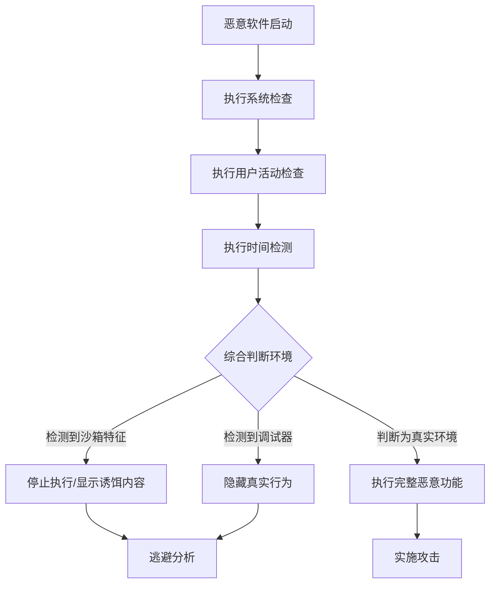

# 虚拟化/沙箱规避 (T1497)

## 一句话通俗理解

检测自己是否在虚拟机或分析环境里运行——恶意软件启动前先"探探周围"，如果发现自己在实验室的监控环境下，就装睡不动。

## 难度等级

- ⭐⭐⭐ 高级（需要深入技术知识）

## 技术描述

虚拟化/沙箱规避（T1497）是MITRE ATT&CK框架中的一种发现技术。

**通俗解释：**
安全分析师会把可疑软件放在"沙箱"（一个隔离的观察室）里运行，观察它的行为。聪明的恶意软件会先检查自己是否在这样一个观察室里——比如检查CPU是不是虚拟机的型号、检测有没有分析工具在运行、看看鼠标有没有人操作。如果发现自己在被观察，就装作无害或直接停止运行，让分析师白忙一场。就像小偷在行动前先观察四周有没有警察。

**技术原理：**
1. 硬件特征检测：检查CPU制造商、核心数、内存大小、MAC地址前缀
2. 进程检测：检查是否有Wireshark、Procmon、IDA Pro等分析工具运行
3. 用户交互检测：检查鼠标是否移动、键盘是否有输入
4. 时间检测：沙箱会加快运行速度，检测时间是否异常
5. 人工痕迹检测：检查文件系统和注册表中是否有用户活动的痕迹

**用途与影响：**
沙箱规避帮助恶意软件：避免被自动分析系统检测和分析；延长在真实环境中的存活时间；隐藏真实的恶意功能（如勒索加密、数据窃取）；提高逆向分析的难度和成本。

## 子技术列表

**该技术共有 3 个子技术：**

| 子技术ID | 中文名称 | 通俗解释 |
|----------|----------|----------|
| T1497.001 | 系统检查 | 检查CPU、BIOS、MAC地址等硬件特征判断是否在虚拟机中 |
| T1497.002 | 基于用户活动的检查 | 检查鼠标移动、键盘输入等用户行为判断是否在沙箱中 |
| T1497.003 | 基于时间的规避 | 通过Sleep调用和计时器检测时间是否被沙箱加速 |

<details>
<summary><strong>展开查看各子技术详细说明</strong></summary>

### T1497.001 - 系统检查

**通俗理解：** 检查电脑的硬件配置，看是否像一台虚拟机。

**详细说明：**
攻击者通过多种系统属性检测虚拟化环境：检查CPU制造商（`wmic cpu get manufacturer` 是否返回虚拟化厂商而非Intel/AMD）；检查BIOS序列号（VMware有特定特征）；检查MAC地址前缀（VMware: 00:50:56, VirtualBox: 08:00:27）；检查虚拟机专用进程（如 `vmtoolsd.exe`、`vboxservice.exe`）；检查注册表中的虚拟化痕迹。

### T1497.002 - 基于用户活动的检查

**通俗理解：** 检查电脑前是不是真的有一个人在操作。

**详细说明：**
真实用户会有不规则的鼠标移动、键盘输入和应用程序切换行为，而沙箱通常缺乏真实交互。检测方法包括：检查鼠标移动事件和时间间隔；检查键盘输入频率；检查浏览器历史记录和收藏夹；检查最近打开的文档列表；检查剪贴板内容；检查桌面上是否有真实用户放置的文件。

### T1497.003 - 基于时间的规避

**通俗理解：** 检查时间是否走得太快或太慢，判断是否在仿真环境。

**详细说明：**
沙箱通常加快系统时间以加速分析流程。检测方法包括：执行长时间 `Sleep()` 调用判断是否被加速；计算指令执行时间差判断CPU是否在仿真器中；检查系统运行时间（uptime）；使用 `QueryPerformanceCounter` 获取高精度时间用于比较。

</details>

## 攻击流程

### 典型攻击流程

```
执行检查 --> 检测环境 --> 判断是否沙箱 --> 选择行为
```



**步骤详解：**

1. **检测虚拟化痕迹**
   - 通俗描述：检查系统硬件特征判断是否在虚拟机中
   - 技术细节：检查CPU制造商、MAC地址前缀、BIOS信息
   - 常用工具：wmic, PowerShell

2. **检测用户交互**
   - 通俗描述：检查是否有真人操作电脑
   - 技术细节：监控鼠标移动、键盘输入、文档访问
   - 常用工具：Windows API（GetCursorPos等）

3. **检测时间异常**
   - 通俗描述：检查系统时间是否被加速
   - 技术细节：执行Sleep并测量实际耗时
   - 常用工具：GetTickCount, QueryPerformanceCounter

4. **执行恶意行为**
   - 通俗描述：确认是真实环境后执行攻击
   - 技术细节：解密payload、连接C2、执行勒索加密
   - 常用工具：自定义payload

## 真实案例

### 案例1：Emotet - 多维度虚拟化规避

- **时间**: 2018年-2023年
- **目标**: 全球企业网络（金融、政府、医疗）
- **攻击组织**: Emotet
- **手法**: Emotet银行木马使用复杂的沙箱检测技术。它首先执行系统检查（T1497.001），使用 `wmic` 查询CPU、内存、硬盘和BIOS信息，检测VMware/VirtualBox的特定硬件签名。然后执行用户行为检测（T1497.002），检查鼠标光标在60秒内是否被移动过。最后执行时间规避（T1497.003），通过多次10-30秒的Sleep调用测试时间是否被加速。如果任何检测被触发，Emotet停止执行恶意代码或解码诱饵PDF显示给分析师。
- **影响**: 全球数百万台计算机被感染
- **参考链接**: [MITRE - Emotet](https://attack.mitre.org/software/S0367/)

### 案例2：TrickBot - 沙箱时间检测

- **时间**: 2019年-2022年
- **目标**: 全球企业网络
- **攻击组织**: TrickBot
- **手法**: TrickBot木马在初始化过程中检查系统运行时间（uptime）。如果 `GetTickCount` 返回的毫秒数小于10分钟（600,000ms），判定系统为新启动的环境或沙箱，延迟执行核心恶意模块达数小时。TrickBot还检查 `NtQuerySystemInformation` 中的系统时间信息来检测时间是否被篡改。这些时间检测机制帮助TrickBot绕过自动沙箱和动态分析平台。
- **影响**: 大量企业网络被入侵，用于部署勒索软件
- **参考链接**: [MITRE - TrickBot](https://attack.mitre.org/software/S0266/)

### 案例3：Ursnif (Gozi) - 调试器检测

- **时间**: 2020年-2022年
- **目标**: 全球金融机构和企业
- **攻击组织**: Ursnif (Gozi)
- **手法**: Ursnif恶意软件在执行过程中通过 `NtQueryInformationProcess` 检查进程是否正在被调试。它还扫描PEB（进程环境块）的 `BeingDebugged` 标志位，检查是否存在硬件断点，并检查异常处理来检测分析工具。如果检测到调试环境，Ursnif将正常执行而非调用卸装代码，使分析人员难以观察其真实行为。
- **影响**: 金融机构的敏感数据被大量窃取
- **参考链接**: [MITRE - Ursnif](https://attack.mitre.org/software/S0386/)

### 案例4：挖矿恶意软件 - CI/CD沙箱规避

- **时间**: 2021年-2023年
- **目标**: CI/CD管道中的临时容器
- **攻击组织**: 加密货币挖矿团伙
- **手法**: 攻击者在使用暴露的CI/CD凭证在GitLab Runner容器中部署挖矿恶意软件时，挖矿程序包含沙箱规避逻辑。它检查容器是否在CI/CD分析环境中运行——检查环境变量（如 `CI=true`）、检查CPU核心数（少于4核则退出）、检查系统内存（小于2GB则退出）。如果在生产服务器上运行则启动挖矿进程；如果在CI/CD分析管道中运行则立即退出。
- **影响**: 云服务商的计算资源被非法占用
- **参考链接**: [MITRE - T1497](https://attack.mitre.org/techniques/T1497/)

## 红队视角

> ⚠️ **免责声明**：以下内容仅用于合法的安全测试、渗透测试和教育目的。未经授权对他人系统进行测试是违法行为。

### 实战技巧

1. **多维度检测组合**
   单一检测指标容易被绕过，组合3种以上的检测方法可大幅降低误报率。

2. **检查常见沙箱特征**
   - 检查MAC地址前缀：VMware(00:50:56, 00:0C:29)、VirtualBox(08:00:27)
   - 检查常见分析工具进程：Wireshark、Procmon、Process Explorer

3. **使用延迟执行**
   在获得系统访问后等待30分钟以上再执行恶意操作，大多数自动沙箱在10分钟内就结束分析。

### 常用工具

| 工具名称 | 用途 | 平台 | 链接 |
|----------|------|------|------|
| wmic | 硬件信息查询 | Windows | 内置命令 |
| GetTickCount | 系统运行时间检测 | Windows | Windows API |
| NtQueryInformationProcess | 调试器检测 | Windows | Windows API |
| PEB.BeingDebugged | 调试标志检查 | Windows | 进程环境块 |

### 注意事项

- 过于激进的沙箱检测可能导致合法环境误判
- 高级沙箱（如FireEye、Cuckoo 3）会隐藏虚拟化痕迹
- 某些EDR产品会监控沙箱检测行为本身

## 蓝队视角

### 检测要点

1. **异常的系统属性查询**
   - 日志来源：Sysmon Event ID 1
   - 关注字段：`wmic cpu`、`wmic bios` 等硬件信息查询
   - 异常特征：非管理员执行硬件信息查询

2. **长时间的Sleep行为**
   - 日志来源：进程行为监控
   - 关注字段：连续5分钟以上的Sleep调用
   - 异常特征：启动后长时间休眠然后突然执行恶意行为

### 监控建议

- 监控对虚拟化痕迹的异常查询（如 `wmic bios get serialnumber`）
- 检测长时间 `Sleep` 调用后的异常行为模式
- 使用EDR的行为分析功能检测沙箱规避的聚合行为

## 检测建议

### 网络层检测

**检测方法：** 监控虚拟化环境检测相关的网络流量，特别关注恶意软件在判断运行环境时发出的 VM 服务 DNS 查询以及沙箱特征 IP 的连接尝试。

**具体规则/命令示例：**
```
# 检测对 VM 服务特有 DNS 名称的查询（如与 VMWare/VirtualBox/Hyper-V 相关的反向 DNS 查询）
# 关注恶意代码向已知沙箱/分析环境特征 IP 发起的连接测试
# 使用 Zeek 分析 dns 日志，检测针对虚拟化平台相关域名的异常解析请求
```

### 主机层检测

**Windows事件ID：**
- 事件ID 4688：进程创建
- 事件ID 4104：PowerShell脚本
- Sysmon Event ID 1：进程创建

**Sigma规则示例：**
```yaml
title: Virtualization Detection via WMI
status: experimental
description: Detects WMI queries for virtualization detection
logsource:
    category: process_creation
    product: windows
detection:
    selection:
        CommandLine|contains|all:
            - 'wmic'
            - 'cpu'
            - 'manufacturer'
    condition: selection
level: medium
tags:
    - attack.t1497
```

## 缓解措施

### 优先级1：关键措施

**措施名称：** 使用高级沙箱技术

**具体实施步骤：**
1. 使用隐藏虚拟化痕迹的沙箱（如FireEye、Cuckoo 3）
2. 在沙箱中模拟真实用户交互行为

### 优先级2：重要措施

**措施名称：** 多层防护组合

**具体实施步骤：**
1. 不依赖单一沙箱检测
2. 结合EDR、网络检测和日志分析

### 优先级3：建议措施

**措施名称：** 针对沙箱规避的行为检测

**具体实施步骤：**
1. 监控长时间的Sleep调用
2. 检测Sleep后的异常行为

### MITRE ATT&CK 缓解措施映射

| 缓解措施ID | 缓解措施名称 | 适用性 | 说明 |
|------------|-------------|--------|------|
| M1040 | Behavior Prevention on Endpoint | 适用 | EDR行为检测 |
| M1041 | Encrypt Sensitive Information | 部分适用 | 加密敏感数据 |
| M1045 | Code Signing | 不适用 | - |

## 动手实验

> ⚠️ **重要提示**：所有实验必须在隔离的实验室环境中进行，禁止对未授权的真实系统进行测试。

### 实验环境准备

**所需工具：** Windows VM + 沙箱环境

### 实验1：检测虚拟化环境（初级）

**实验目标：** 学习使用wmic检测虚拟化特征。

**实验步骤：**
1. 执行 `wmic cpu get manufacturer` 查看CPU制造商
2. 执行 `wmic bios get serialnumber` 查看BIOS序列号
3. 执行 `ipconfig /all` 查看MAC地址

**预期结果：** 在VMware中看到VMware特定的硬件特征。

**学习要点：** 理解恶意软件如何检测虚拟化环境。

### 实验2：时间检测实验（中级）

**实验目标：** 使用PowerShell模拟时间基准检测。

**实验步骤：**
1. 执行 `$start = Get-Date; Start-Sleep -Seconds 10; $elapsed = (Get-Date) - $start` 计算实际耗时
2. 比较实际耗时与请求的Sleep时间

**预期结果：** 真实环境中实际耗时与Sleep时间基本一致。

## 术语解释

| 术语 | 英文原名 | 通俗解释 |
|------|----------|----------|
| 沙箱 | Sandbox | 隔离分析环境，像玻璃房子一样观察恶意软件的行为 |
| 虚拟化 | Virtualization | 用软件模拟计算机硬件，如VMware、VirtualBox |
| PEB | Process Environment Block | 进程环境块，Windows中存储进程信息的结构 |
| BIOS | Basic Input/Output System | 计算机的基本输入输出系统，存储底层硬件信息 |
| 调试器 | Debugger | 用来分析程序运行过程的工具，如IDA Pro、x64dbg |

## 参考资料

### 官方文档

- [MITRE ATT&CK - T1497](https://attack.mitre.org/techniques/T1497/)
- [MITRE ATT&CK - T1497.001](https://attack.mitre.org/techniques/T1497/001/)
- [MITRE ATT&CK - T1497.002](https://attack.mitre.org/techniques/T1497/002/)
- [MITRE ATT&CK - T1497.003](https://attack.mitre.org/techniques/T1497/003/)

### 安全报告

- [MITRE - Emotet](https://attack.mitre.org/software/S0367/)
- [MITRE - TrickBot](https://attack.mitre.org/software/S0266/)

### 工具与资源

- [Cuckoo Sandbox](https://cuckoosandbox.org/)
- [Joe Sandbox](https://www.joesandbox.com/)
- [Unprotect - Evasion Techniques](https://www.unprotect.it/)
