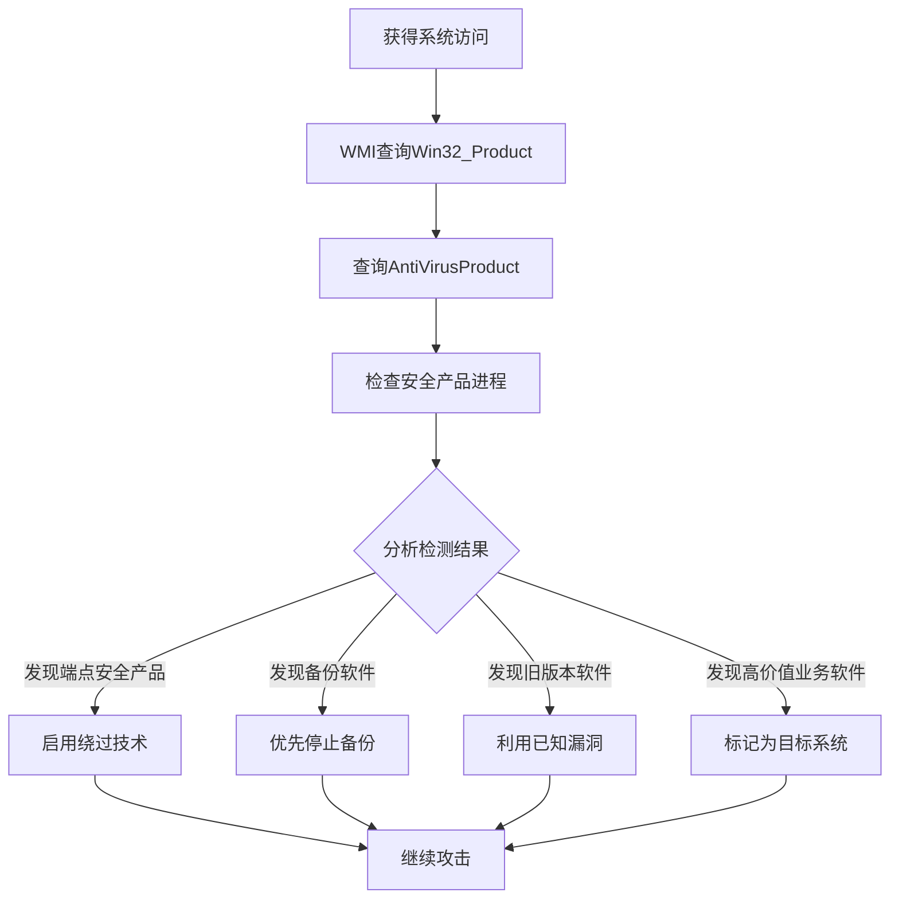

# 软件发现 (T1518)

## 一句话通俗理解

查看系统上安装了哪些软件——攻击者检查系统中安装的软件列表，特别关注安全产品的存在和版本，就像小偷先查看屋里有没有报警系统。

## 难度等级

- ⭐⭐ 中级（需要一定基础）

## 技术描述

软件发现（T1518）是MITRE ATT&CK框架中的一种发现技术。

**通俗解释：**
当攻击者入侵一台电脑后，首先会查看安装了哪些软件——不是出于好奇，而是有明确的动机：需要判断有没有杀毒软件（如果有就要绕过去），需要知道这台电脑是干什么用的（装了财务软件就是高价值目标），需要了解软件版本（旧版本可能有已知漏洞可以直接利用）。就像小偷潜入一栋楼后，先看看有没有报警系统、哪扇门可以撬开。

**技术原理：**
1. 使用WMI查询 `SELECT * FROM Win32_Product` 获取完整的软件安装列表
2. 通过注册表 `HKLM\SOFTWARE\Microsoft\Windows\CurrentVersion\Uninstall\` 遍历已安装程序
3. 查询 `root\SecurityCenter2` 命名空间获取安全产品信息
4. 检查安全产品进程名称列表（如 `MsMpEng.exe`、`bdagent.exe`）
5. 在Linux中使用 `dpkg -l`、`rpm -qa` 列出已安装软件包

**用途与影响：**
软件发现帮助攻击者：检测是否有EDR/AV产品并选择绕过策略；识别业务软件判断目标价值；查找已知漏洞的旧版本软件；发现开发工具（如OllyDbg、IDA）判断是否为分析环境；定位POS软件、备份软件等特定行业的系统。

## 子技术列表

**该技术共有 2 个子技术：**

| 子技术ID | 中文名称 | 通俗解释 |
|----------|----------|----------|
| T1518.001 | 安全软件发现 | 专门检测杀毒软件、EDR等安全产品的存在 |
| T1518.002 | 已安装软件 | 枚举系统上安装的所有软件列表 |

<details>
<summary><strong>展开查看各子技术详细说明</strong></summary>

### T1518.001 - 安全软件发现

**通俗理解：** 检查电脑上装了哪些杀毒软件和安全产品。

**详细说明：**
攻击者会专门枚举安全产品信息。通过WMI查询 `SELECT * FROM AntiVirusProduct`（root\SecurityCenter2）获取防病毒产品信息。检查安全产品进程（如MsMpEng.exe、bdagent.exe、ccSvcHst.exe）。检测结果用于决定是否停止运行恶意软件、隐藏行为或禁用安全产品。如果检测到高级EDR产品，攻击者可能选择更隐蔽的绕过技术。

### T1518.002 - 已安装软件

**通俗理解：** 查看电脑上安装了哪些应用程序。

**详细说明：**
攻击者通过多种方法获取完整的软件安装列表。使用WMI查询 `SELECT * FROM Win32_Product`，或遍历注册表 `HKLM\SOFTWARE\Microsoft\Windows\CurrentVersion\Uninstall\`。在Linux中使用 `dpkg -l`（Debian系）或 `rpm -qa`（Red Hat系）。macOS使用 `system_profiler SPApplicationsDataType`。软件列表帮助攻击者判断目标的价值和定位可利用的软件。

</details>

## 攻击流程

### 典型攻击流程

```
枚举软件 --> 检测安全产品 --> 分析版本 --> 选择攻击策略
```



**步骤详解：**

1. **查询已安装软件**
   - 通俗描述：用WMI查看安装了哪些程序
   - 技术细节：`wmic product get name,version,vendor`
   - 常用工具：wmic.exe, Get-WmiObject

2. **检测安全产品**
   - 通俗描述：查看是否有杀毒软件
   - 技术细节：查询 `root\SecurityCenter2` 命名空间
   - 常用工具：wmic.exe, PowerShell

3. **分析版本信息**
   - 通俗描述：查看软件版本判断是否有已知漏洞
   - 技术细节：关注Java、Adobe Reader、Office等软件的版本号
   - 常用工具：无（人工分析）

4. **调整攻击策略**
   - 通俗描述：根据检测结果选择攻击方法
   - 技术细节：有EDR则禁用，有旧软件则利用漏洞
   - 常用工具：自定义脚本

## 真实案例

### 案例1：APT29 - 安全产品规避

- **时间**: 2020年-2021年
- **目标**: 美国政府机构、IT供应链
- **攻击组织**: APT29（Nobelium）
- **手法**: APT29在SolarWinds攻击活动中大量使用安全软件发现技术。他们通过PowerShell脚本检查 `Get-WmiObject -Namespace root\SecurityCenter2 -Class AntiVirusProduct` 获取防病毒产品信息，通过查询 `Get-WmiObject Win32_Product` 获取完整的已安装软件列表。APT29特别关注是否有Carbon Black、CrowdStrike Falcon、Microsoft Defender ATP和SentinelOne等EDR产品的安装迹象。他们使用自定义脚本枚举安全产品的进程和服务状态，根据检测结果选择性启用或禁用恶意载荷模块的自动执行功能。
- **影响**: 多个美国政府部门网络被长期渗透
- **参考链接**: [FireEye - APT29](https://www.fireeye.com/blog/threat-research/2020/12/sunburst-additional-technical-details.html)

### 案例2：Wizard Spider - 安全产品规避与备份软件检测

- **时间**: 2019年-2022年
- **目标**: 全球企业勒索软件受害者
- **攻击组织**: Wizard Spider（Conti/TrickBot）
- **手法**: Wizard Spider旗下的BazarLoader和TrickBot木马通过枚举 `AntiVirusProduct` WMI类检测受感染系统上的安全产品。TrickBot维护一个超过80种安全产品进程和服务的检测列表。在Conti勒索软件部署阶段，检测到特定安全产品时尝试使用 `net stop` 停止相关服务。在部署勒索软件前，还会检查是否存在备份软件（如Veeam、SQL Server备份Agent）并优先停止它们，防止数据恢复。
- **影响**: 多家大型企业被勒索，损失数千万美元
- **参考链接**: [CrowdStrike - TrickBot](https://www.crowdstrike.com/blog/trickbot-security-product-evasion/)

### 案例3：Turla - 开发工具检测

- **时间**: 2018年-2020年
- **目标**: 全球政府、大使馆、研究机构
- **攻击组织**: Turla
- **手法**: Turla组织在渗透目标环境后，使用 `reg query HKLM\SOFTWARE\Microsoft\Windows\CurrentVersion\Uninstall\ /s` 递归遍历所有已安装软件的注册表键值。他们特别搜索包含"OllyDbg"、"IDA"、"Wireshark"、"VMware"、"VirtualBox"等分析工具或虚拟化软件名称的条目。Turla还使用WMI查询检测虚拟化环境。在确认系统是真实的生产环境而非安全分析沙箱后，Turla才会激活完整的间谍模块。
- **影响**: 多国政府和研究机构被长期渗透
- **参考链接**: [MITRE - Turla](https://attack.mitre.org/groups/G0010/)

### 案例4：FIN7 - POS软件发现

- **时间**: 2017年-2019年
- **目标**: 全球零售、酒店、餐饮行业
- **攻击组织**: FIN7
- **手法**: FIN7团队使用 `Get-WmiObject Win32_Product` 搜索POS系统相关软件，特别关注包含"POS"、"Aloha"、"Micros"、"Radiant"等关键词的软件。他们还检查远程管理工具（如LogMeIn、TeamViewer）的安装情况。发现的POS软件安装信息帮助FIN7精确定位可以部署内存抓取恶意软件的POS终端，存在POS相关软件的服务器被标记为高优先级目标。
- **影响**: 数百万张支付卡信息被窃取
- **参考链接**: [Mandiant - FIN7](https://www.mandiant.com/resources/blog/fin7-pos-targeting-software-discovery)

## 红队视角

> ⚠️ **免责声明**：以下内容仅用于合法的安全测试、渗透测试和教育目的。未经授权对他人系统进行测试是违法行为。

### 实战技巧

1. **快速检测安全产品**
   PowerShell一行命令：`Get-WmiObject -Namespace root\SecurityCenter2 -Class AntiVirusProduct | Select-Object displayName`

2. **枚举软件注册表**
   `Get-ChildItem HKLM:\SOFTWARE\Microsoft\Windows\CurrentVersion\Uninstall\ | Get-ItemProperty | Select-Object DisplayName, DisplayVersion`

3. **检测EDR进程**
   直接检查常见EDR进程名称：`Get-Process | Where-Object {$_.ProcessName -match "falcon|carbon|sentinel|crowdstrike"}`

### 常用工具

| 工具名称 | 用途 | 平台 | 链接 |
|----------|------|------|------|
| wmic | WMI查询工具 | Windows | 内置命令 |
| Get-WmiObject | PowerShell WMI | Windows | 内置PowerShell |
| Get-ChildItem | 注册表遍历 | Windows | 内置PowerShell |
| dpkg/rpm | Linux包管理 | Linux | 内置命令 |

### 注意事项

- `Win32_Product` WMI查询可能触发Windows Installer配置检查，较为显眼
- 安全产品枚举可能触发EDR的反检测机制
- 使用注册表查询比WMI查询更隐蔽

## 蓝队视角

### 检测要点

1. **异常的安全产品查询**
   - 日志来源：Windows Event ID 4688
   - 关注字段：WMI查询 `AntiVirusProduct` 类
   - 异常特征：非管理员或非系统进程查询安全产品信息

2. **批量软件枚举**
   - 日志来源：WMI-Activity Event ID 5861
   - 关注字段：对 `Win32_Product` 的查询
   - 异常特征：短时间内跨多个主机的软件枚举

### 监控建议

- 监控WMI查询 `AntiVirusProduct`、`FirewallProduct` 类
- 审计PowerShell `Get-WmiObject Win32_Product` 的使用
- 关注安全产品进程枚举后的异常行为

## 检测建议

### 网络层检测

**检测方法：** 监控远程软件枚举的网络流量，特别关注通过 WMI 查询已安装软件列表的异常流量模式。

**具体规则/命令示例：**
```
# 检测 WMI 远程查询 Win32_Product、Win32_InstalledSoftwareElement 等软件信息的流量
# 关注同一主机对多个远程系统执行 WMI 软件清单查询的横向移动行为
# 使用 Zeek 分析 dce_rpc 日志，检测 WMI 相关 UUID 的频繁调用
```

### 主机层检测

**Windows事件ID：**
- 事件ID 4688：进程创建
- 事件ID 5861：WMI活动
- 事件ID 4104：PowerShell脚本
- Sysmon Event ID 1：进程创建

**Sigma规则示例：**
```yaml
title: Security Software Discovery via WMI
status: experimental
description: Detects WMI queries for security software
logsource:
    category: process_creation
    product: windows
detection:
    selection:
        CommandLine|contains|all:
            - 'AntiVirusProduct'
    condition: selection
level: medium
tags:
    - attack.t1518
```

## 缓解措施

### 优先级1：关键措施

**措施名称：** 限制WMI查询权限

**具体实施步骤：**
1. 限制WMI脚本的远程执行权限
2. 对WMI命名空间实施访问控制

### 优先级2：重要措施

**措施名称：** 使用应用白名单

**具体实施步骤：**
1. 通过WDAC限制非授权PowerShell执行
2. 配置AppLocker控制WMI工具运行

### 优先级3：建议措施

**措施名称：** 启用WMI日志记录

**具体实施步骤：**
1. 记录所有WMI查询活动
2. 在SIEM中配置异常检测规则

### MITRE ATT&CK 缓解措施映射

| 缓解措施ID | 缓解措施名称 | 适用性 | 说明 |
|------------|-------------|--------|------|
| M1026 | Privileged Account Management | 适用 | 限制WMI查询权限 |
| M1038 | Execution Prevention | 适用 | 限制脚本执行 |
| M1047 | Audit | 适用 | 启用WMI审计 |

## 动手实验

> ⚠️ **重要提示**：所有实验必须在隔离的实验室环境中进行，禁止对未授权的真实系统进行测试。

### 实验环境准备

**所需工具：** Windows VM

### 实验1：软件列表枚举（初级）

**实验目标：** 学习使用不同方法枚举已安装软件。

**实验步骤：**
1. 执行 `wmic product get name,version` 获取软件列表
2. 执行PowerShell `Get-WmiObject Win32_Product | Select-Object Name, Version`
3. 通过注册表查看：`Get-ChildItem HKLM:\SOFTWARE\Microsoft\Windows\CurrentVersion\Uninstall\`

**预期结果：** 看到系统上安装的软件列表和版本。

**学习要点：** 理解不同方法的优劣和各自的检测风险。

### 实验2：安全产品检测（中级）

**实验目标：** 了解如何检测安全产品的存在。

**实验步骤：**
1. 执行 `Get-WmiObject -Namespace root\SecurityCenter2 -Class AntiVirusProduct`
2. 使用 `Get-Process` 检查常见安全产品进程

**预期结果：** 看到系统上安装的安全产品信息。

## 术语解释

| 术语 | 英文原名 | 通俗解释 |
|------|----------|----------|
| EDR | Endpoint Detection and Response | 端点检测和响应，高级的终端安全监控系统 |
| WMI | Windows Management Instrumentation | Windows管理工具，用来查询系统信息的接口 |
| 安全产品 | Security Software | 杀毒软件、防火墙等保护电脑安全的软件 |
| AV | Anti-Virus | 杀毒软件，传统的恶意软件检测工具 |

## 参考资料

### 官方文档

- [MITRE ATT&CK - T1518](https://attack.mitre.org/techniques/T1518/)
- [MITRE ATT&CK - T1518.001](https://attack.mitre.org/techniques/T1518/001/)
- [MITRE ATT&CK - T1518.002](https://attack.mitre.org/techniques/T1518/002/)

### 安全报告

- [FireEye - APT29 Security Software Discovery](https://www.fireeye.com/blog/threat-research/2020/12/sunburst-additional-technical-details.html)
- [CrowdStrike - TrickBot Security Product Evasion](https://www.crowdstrike.com/blog/trickbot-security-product-evasion/)

### 工具与资源

- [WMI AntiVirusProduct Class](https://learn.microsoft.com/en-us/windows/win32/wmisdk/antivirusproduct)
- [PowerShell Get-WmiObject](https://learn.microsoft.com/en-us/powershell/module/microsoft.powershell.management/get-wmiobject)
