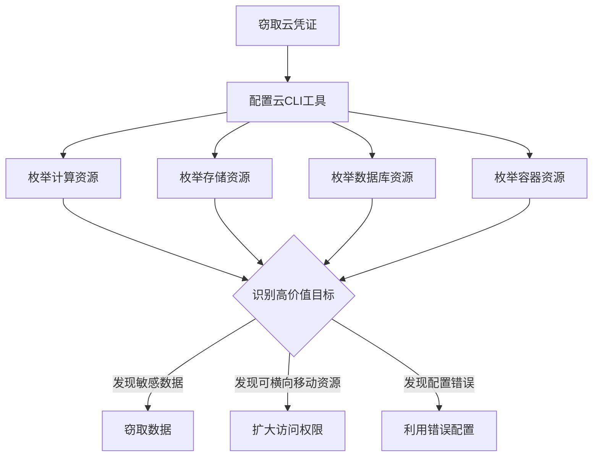

# 云服务发现 (T1526)

## 一句话通俗理解

枚举云平台上运行的服务——攻击者在获取云凭证后，用命令行查看云上有哪些虚拟机、数据库、存储桶等资源，就像拿到大楼的门禁卡后逐层查看每间房间里有什么。

## 30秒速查卡

| 维度 | 你需要知道的 |
|------|-------------|
| 这是什么？ | 攻击者使用 `aws ec2 describe-instances`、`aws s3 ls`、`aws rds describe-db-instances`、`az vm list` 枚举云上所有计算、存储、数据库资源，通过标签和名称识别高价值目标 |
| 为什么危险？ | 云服务枚举是攻击链的关键一步——找到包含敏感数据的数据库、公开访问的存储桶、配置错误的安全组、可滥用的 Lambda 函数 IAM 角色，直接决定后续攻击方向 |
| 谁需要关心？ | 云安全团队、SOC分析师、DevSecOps、任何需要检测云资源异常枚举的安全人员 |
| 你的第一步防御 | 监控 CloudTrail 中 `Describe*`/`List*` API 的异常批量调用；配置 AWS GuardDuty / Azure Defender 的异常检测；实施最小权限 IAM 策略 |
| 如果只做一件事 | 对单个 IAM 用户短时间内跨区域执行大量 `DescribeInstances` + `ListBuckets` 调用立即告警——这是攻击者在"全面摸底"你的云环境 |

## 难度等级

- ⭐⭐ 中级（需要一定基础）

## 技术描述

云服务发现（T1526）是MITRE ATT&CK框架中的一种发现技术。

**通俗解释：**
越来越多的企业将系统部署在云平台上（如AWS、Azure、GCP）。攻击者一旦窃取到云平台的访问凭证（如IAM密钥、控制台密码），就可以像云管理员一样使用API查询云上的所有资源——有多少台虚拟机、哪些数据库、存储了哪些文件、运行着哪些容器。这就像小偷拿到了大楼的管理员门禁卡，可以一间一间地查看每个房间里的物品。

**技术原理：**
1. 使用云服务商提供的CLI工具进行资源枚举
2. AWS中：`aws ec2 describe-instances`、`aws s3 ls`、`aws rds describe-db-instances`
3. Azure中：`az vm list`、`az storage account list`、`az resource list`
4. GCP中：`gcloud compute instances list`、`gcloud storage buckets list`
5. 通过云平台的REST API直接进行资源发现

**用途与影响：**
云服务发现帮助攻击者：识别高价值目标（包含敏感数据的数据库、存储桶）；发现配置错误（公开访问的存储桶、开放的安全组）；评估云环境规模（决定攻击范围和勒索金额）；寻找可横向移动的服务（如可通过Lambda函数访问其他资源）；定位特权服务账户。

## 子技术列表

**该技术没有子技术。**

## 攻击流程

### 典型攻击流程

```
获取凭证 --> 枚举云资源 --> 识别高价值目标 --> 数据窃取
```



**步骤详解：**

1. **配置云访问**
   - 通俗描述：用窃取的凭证配置云CLI工具
   - 技术细节：`aws configure` 配置访问密钥，或直接使用环境变量
   - 常用工具：AWS CLI, Azure CLI, gcloud

2. **枚举计算资源**
   - 通俗描述：查看云上有多少台服务器在运行
   - 技术细节：`aws ec2 describe-instances` 列出所有虚拟机
   - 常用工具：AWS CLI, Azure PowerShell

3. **枚举存储资源**
   - 通俗描述：查看云上的存储桶和文件
   - 技术细节：`aws s3 ls` 列出所有S3存储桶
   - 常用工具：AWS CLI, az storage

4. **识别目标**
   - 通俗描述：从发现的资源中筛选高价值目标
   - 技术细节：关注包含"prod"、"production"、"db"等标签的资源
   - 常用工具：无（人工分析）

## 真实案例

### 案例1：Scattered Spider - AWS云服务资源枚举

- **时间**: 2022年-2023年
- **目标**: 美国电信和科技企业
- **攻击组织**: Scattered Spider（UNC1878）
- **手法**: Scattered Spider在窃取AWS凭证后，通过AWS CLI执行资源枚举，使用 `aws ec2 describe-instances --region us-east-1` 列出所有EC2实例，`aws s3 ls` 列出S3存储桶，`aws rds describe-db-instances` 定位数据库。他们特别关注标记有"prod"、"production"、"critical"标签的资源，还枚举了Lambda函数和ECS容器以寻找可被滥用的IAM角色。
- **影响**: 多家大型科技公司数据被窃取
- **参考链接**: [MITRE - Scattered Spider](https://attack.mitre.org/groups/G1011/)

### 案例2：TeamTNT - Docker和容器服务发现

- **时间**: 2020年-2021年
- **目标**: 云基础设施（Docker、Kubernetes环境）
- **攻击组织**: TeamTNT
- **手法**: TeamTNT在入侵云服务器后，使用 `docker ps` 和 `docker info` 枚举运行中的容器和Docker配置。他们还通过Kubernetes API执行容器和服务发现。TeamTNT的恶意软件会扫描宿主机的Docker套接字，列出所有容器镜像，识别可挂载的数据卷和暴露的服务端口。容器发现结果用于部署加密货币挖矿恶意软件到尽可能多的容器中。
- **影响**: 大量云服务器被用于加密货币挖矿
- **参考链接**: [MITRE - TeamTNT](https://attack.mitre.org/groups/G0139/)

### 案例3：APT29 - Azure租户资源发现

- **时间**: 2021年-2022年
- **目标**: 全球政府机构、云服务提供商
- **攻击组织**: APT29（Nobelium）
- **手法**: APT29在针对云环境的攻击中使用Azure PowerShell cmdlet枚举Azure租户中的基础设施资源。他们使用 `Get-AzResource` 列出所有资源组和资源类型，使用 `Get-AzVM` 列举虚拟机的配置。还使用 `Get-AzStorageAccount` 和 `Get-AzStorageContainer` 枚举存储账户和容器。通过Azure Resource Graph API执行KQL查询跨订阅搜索资源，获取Azure环境的全貌。
- **影响**: 政府机构云环境被渗透
- **参考链接**: [Microsoft - Nobelium](https://www.microsoft.com/security/blog/2021/05/28/breaking-down-nobeliums-cloud-account-compromise/)

## 红队视角

> ⚠️ **免责声明**：以下内容仅用于合法的安全测试、渗透测试和教育目的。未经授权对他人系统进行测试是违法行为。

### 实战技巧

1. **使用云API遍历所有区域**
   AWS资源可能分布在多个区域，使用 `--region all` 或遍历所有区域确保完整发现。

2. **使用Resource Groups批量查询**
   AWS Resource Groups & Tag Editor 可以一次性查询所有类型的资源。

3. **检查云配置错误**
   特别关注S3存储桶的公共访问设置、安全组的入站规则等。

### 常用工具

| 工具名称 | 用途 | 平台 | 链接 |
|----------|------|------|------|
| AWS CLI | AWS资源枚举 | 跨平台 | aws.amazon.com/cli |
| Azure CLI | Azure资源枚举 | 跨平台 | docs.microsoft.com/cli |
| gcloud | GCP资源枚举 | 跨平台 | cloud.google.com/sdk |
| ScoutSuite | 多云审计工具 | 跨平台 | GitHub |

### 注意事项

- 云API调用都会被记录在CloudTrail/Audit Logs中
- 大规模的资源枚举可能触发云服务商的异常检测
- 某些资源枚举操作需要特定IAM权限

## 蓝队视角

### 检测要点

1. **异常的资源列举API调用**
   - 日志来源：AWS CloudTrail、Azure Activity Log
   - 关注字段：`DescribeInstances`、`ListBuckets`、`ListResources` 等API
   - 异常特征：非管理员角色批量列举资源

2. **跨区域资源扫描**
   - 日志来源：CloudTrail
   - 关注字段：同一凭证在短时间内访问多个区域
   - 异常特征：不常用的区域突然出现API调用

### 监控建议

- 监控云API调用日志中异常的资源列举操作
- 关注非管理员角色的 `Describe*` / `List*` API调用
- 使用AWS GuardDuty、Azure Defender for Cloud的异常检测功能
- 监控来自非预期地理位置的云API调用

## 检测建议

### 网络层检测

**检测方法：** 监控云服务枚举相关的网络流量，特别关注针对云平台元数据服务（如 AWS 169.254.169.254）的查询以及云服务 API 的批量调用行为。

**具体规则/命令示例：**
```
# 检测对云实例元数据服务（169.254.169.254）的异常 HTTP 请求
# 关注同一主机在短时间内对多个云服务 API 端点（如 ec2.*.amazonaws.com）的调用
# 使用 Zeek 分析 http 和 dns 日志，检测云服务 API 的异常枚举模式
```

### 应用层检测

**检测方法：** 监控云API调用日志中的资源枚举模式。

**具体命令示例：**
```bash
# AWS CloudTrail查询资源列举API
aws cloudtrail lookup-events --lookup-attributes AttributeKey=EventName,AttributeValue=DescribeInstances
```

**用人话说：** 这条规则在监控有人批量列举云资源。攻击者拿到云凭证后会做什么？先用 `DescribeInstances` 看有哪些虚拟机（特别是标记为 prod 的），再用 `ListBuckets` 看有哪些存储桶（找包含 backup、secret 的），然后用 `DescribeDBInstances` 找数据库。他们会重点关注：暴露公网的 EC2 实例、配置为公开访问的 S3 桶、标记为 "production" 的资源。正常情况下，运维人员在做资产盘点时可能偶尔调用这些 API，但单个用户短时间内跨多个服务批量调用就很可疑。CloudTrail 和 GuardDuty 可以自动检测这种异常模式。

**Sigma规则示例（CloudTrail）：**
```yaml
title: Cloud Resource Enumeration
status: experimental
description: Detects bulk resource enumeration in cloud
logsource:
    product: aws
    service: cloudtrail
detection:
    selection:
        EventName|contains:
            - 'DescribeInstances'
            - 'ListBuckets'
            - 'ListResources'
    condition: selection
level: medium
tags:
    - attack.t1526
```

## 缓解措施

### 优先级1：关键措施

**措施名称：** 实施最小权限IAM策略

**具体实施步骤：**
1. 限制用户仅拥有所需的最小资源读取权限
2. 使用IAM条件键控制 `List` 和 `Describe` 操作

### 优先级2：重要措施

**措施名称：** 启用云API审计

**具体实施步骤：**
1. 启用AWS CloudTrail、Azure Activity Log
2. 配置实时告警规则

### 优先级3：建议措施

**措施名称：** 条件访问策略

**具体实施步骤：**
1. 限制云管理门户仅允许从企业网络访问
2. 对所有管理员账户启用MFA

### MITRE ATT&CK 缓解措施映射

| 缓解措施ID | 缓解措施名称 | 适用性 | 说明 |
|------------|-------------|--------|------|
| M1026 | Privileged Account Management | 适用 | 限制云IAM权限 |
| M1037 | Filter Network Traffic | 适用 | 限制API访问来源 |
| M1047 | Audit | 适用 | 启用云API审计 |

## 动手实验

> ⚠️ **重要提示**：所有实验必须在隔离的实验室环境中进行，禁止对未授权的真实系统进行测试。

### 实验环境准备

**所需工具：** AWS/Azure免费账户或云实验环境

### 实验1：AWS资源枚举（初级）

**实验目标：** 使用AWS CLI枚举云资源。

**实验步骤：**
1. 配置AWS CLI：`aws configure`
2. 执行 `aws ec2 describe-instances` 查看EC2实例
3. 执行 `aws s3 ls` 列出S3存储桶
4. 执行 `aws rds describe-db-instances` 查看数据库

**预期结果：** 看到账户下的云资源列表。

**学习要点：** 理解攻击者如何通过CLI进行云资源发现。

### 实验2：Azure资源枚举（中级）

**实验目标：** 使用Azure PowerShell枚举资源。

**实验步骤：**
1. 连接Azure：`Connect-AzAccount`
2. 执行 `Get-AzResource` 列出所有资源
3. 执行 `Get-AzVM` 查看虚拟机

**预期结果：** 看到Azure订阅下的资源清单。

## 术语解释

| 术语 | 英文原名 | 通俗解释 |
|------|----------|----------|
| IAM | Identity and Access Management | 身份和访问管理，控制谁能访问云资源的系统 |
| 安全组 | Security Group | 云上的防火墙规则，控制入站和出站流量 |
| 存储桶 | Bucket | 云上的存储空间，用来存放文件（如AWS S3） |
| 区域 | Region | 云服务商在全球的数据中心位置 |
| CLI | Command Line Interface | 命令行工具，通过输入命令操作云服务 |

## 参考资料

### 官方文档

- [MITRE ATT&CK - T1526](https://attack.mitre.org/techniques/T1526/)
- [AWS CLI文档](https://aws.amazon.com/cli/)
- [Azure CLI文档](https://docs.microsoft.com/en-us/cli/azure/)

### 安全报告

- [CrowdStrike - Scattered Spider](https://www.crowdstrike.com/blog/scattered-spider-cloud-dashboard-access/)
- [Aqua Security - TeamTNT](https://blog.aquasec.com/teamtnt-container-discovery)

### 工具与资源

- [ScoutSuite - Cloud Security Audit](https://github.com/nccgroup/ScoutSuite)
- [AWS GuardDuty](https://aws.amazon.com/guardduty/)
- [Azure Defender for Cloud](https://learn.microsoft.com/en-us/azure/defender-for-cloud/)
