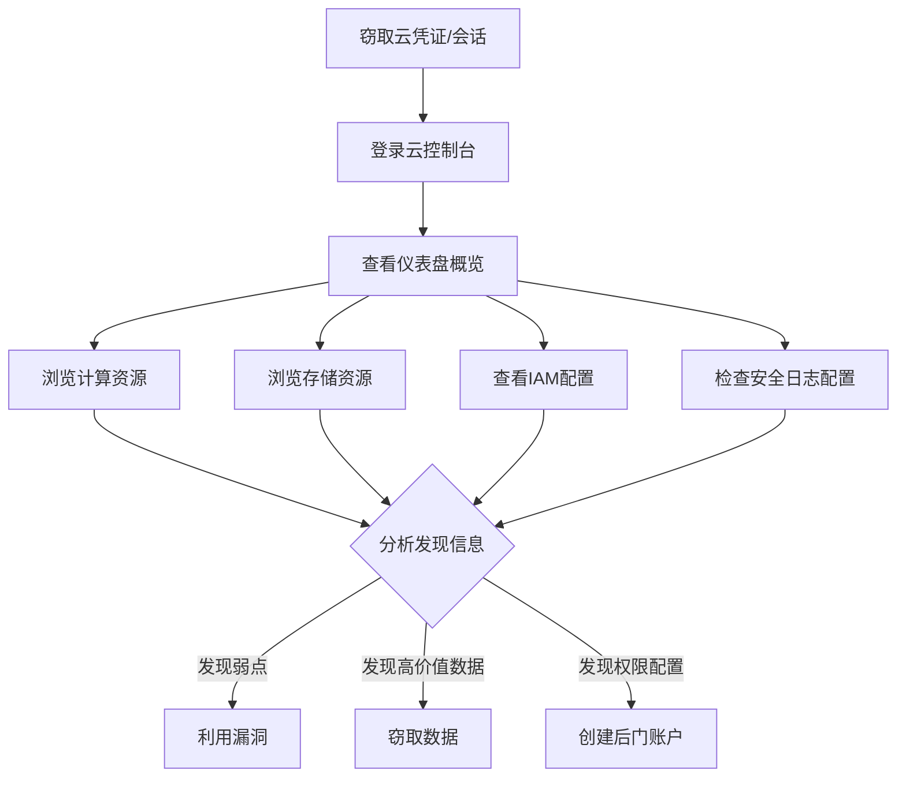

# 云服务仪表盘 (T1538)

## 一句话通俗理解

查看云平台的管理控制面板信息——攻击者登录云控制台的Web界面，就像小偷拿到管理员的账号密码后，直接打开大楼的中央监控室查看全局。

## 30秒速查卡

| 维度 | 你需要知道的 |
|------|-------------|
| 这是什么？ | 攻击者使用窃取的云管理员凭证或会话 Cookie 登录 AWS Management Console / Azure Portal / GCP Console 的 Web 界面，通过图形化 Dashboard 浏览所有云资源的全局概览 |
| 为什么危险？ | 云控制台提供"上帝视角"——一个页面就能看到所有虚拟机、存储桶、IAM 用户、安全配置，攻击者据此快速了解云环境全貌并规划攻击路径 |
| 谁需要关心？ | 云安全团队、SOC分析师、IAM管理员、任何需要检测云控制台异常登录的安全人员 |
| 你的第一步防御 | 对所有云控制台启用 MFA；监控控制台登录事件的地理位置和 User-Agent；配置条件访问策略限制控制台访问来源 IP |
| 如果只做一件事 | 对来自异常地理位置或非工作时间段的云控制台登录立即告警——这是攻击者"拿到钥匙"后准备进入"中央监控室"的信号 |

## 难度等级

- ⭐⭐ 中级（需要一定基础）

## 技术描述

云服务仪表盘（T1538）是MITRE ATT&CK框架中的一种发现技术。

**通俗解释：**
云服务商（如AWS、Azure、GCP）都提供了一个Web管理控制台——一个图形化的界面，可以看到云上所有资源的状态和使用情况。攻击者如果窃取到云平台的管理员账号（或者通过会话劫持获得已登录的会话），就可以直接打开这个控制台，像合法的管理员一样查看所有信息。这就像小偷拿到大楼管理员的钥匙卡后，直接走进中央监控室，所有楼层的情况尽收眼底。

**技术原理：**
1. 攻击者使用云服务商的Web管理控制台（AWS Management Console、Azure Portal、GCP Console）登录
2. 在控制台中查看EC2实例、S3存储桶、IAM用户和角色、VPC配置等
3. 也可以通过云平台API以编程方式获取Dashboard中可见的信息
4. 访问Dashboard通常需要具有有效云账号凭据或有效的会话Cookie
5. Dashboard提供全局概览，帮助攻击者快速了解云环境全貌

**用途与影响：**
云服务仪表盘访问帮助攻击者：获取云环境完整的资源配置和分布；查看IAM用户和权限配置；检查安全设置（如CloudTrail是否启用）；发现计费信息（估算资源价值）；定位高价值资源（如标记为"production"的服务）。

## 子技术列表

**该技术没有子技术。**

## 攻击流程

### 典型攻击流程

```
获取凭据 --> 登录控制台 --> 浏览资源 --> 规划攻击
```



**步骤详解：**

1. **获取云控制台访问**
   - 通俗描述：用窃取的凭证登录云管理控制台
   - 技术细节：使用钓鱼获取的密码、会话Cookie或窃取的IAM密钥
   - 常用工具：Web浏览器

2. **浏览资源概览**
   - 通俗描述：从仪表盘查看所有云资源的汇总
   - 技术细节：查看资源组、区域分布、服务健康状况
   - 常用工具：AWS Management Console, Azure Portal

3. **查看详细配置**
   - 通俗描述：深入查看各服务的详细设置
   - 技术细节：查看安全组规则、IAM策略、存储桶权限
   - 常用工具：云控制台各服务面板

4. **规划后续攻击**
   - 通俗描述：根据发现的弱点制定攻击计划
   - 技术细节：标记可访问的数据存储、可滥用的权限
   - 常用工具：无（人工分析）

## 真实案例

### 案例1：Scattered Spider - 云控制台大规模接管

- **时间**: 2022年-2023年
- **目标**: 云服务提供商、电信、科技公司
- **攻击组织**: Scattered Spider（UNC3944）
- **手法**: Scattered Spider通过大规模SMS钓鱼活动获取受害者的云服务管理凭据（特别是Okta管理员账户和AWS/Azure控制台登录凭据）。获得访问后登录AWS Management Console和Azure Portal查看云环境的完整配置。在Dashboard中检查S3存储桶列表和访问策略、EC2实例的安全组配置、IAM角色和策略分配、CloudTrail日志配置状态。他们还使用AWS控制台的"Resource Groups & Tag Editor"功能批量标记和组织发现的资源。
- **影响**: 多家大型科技公司被入侵，敏感数据被窃取
- **参考链接**: [CrowdStrike - Scattered Spider](https://www.crowdstrike.com/blog/scattered-spider-cloud-dashboard-access/)

### 案例2：APT29 - Azure管理门户枚举

- **时间**: 2020年-2021年
- **目标**: 美国政府机构、IT公司
- **攻击组织**: APT29（Nobelium）
- **手法**: APT29在SolarWinds攻击活动中获取了受害者Office 365和Azure环境的管理员权限。通过Azure Portal登录后，浏览Azure Active Directory的管理Dashboard查看用户列表、企业应用程序注册、条件访问策略和角色分配。他们还使用Azure管理API以编程方式枚举Azure订阅和相关资源。APT29特别关注Azure AD中的应用程序注册信息，寻找具有高权限的服务主体，以及检查联合身份验证配置以寻找创建后门的机会。
- **影响**: 多个政府机构云环境被渗透
- **参考链接**: [Microsoft - Nobelium](https://www.microsoft.com/security/blog/2021/05/28/breaking-down-nobeliums-cloud-account-compromise/)

### 案例3：TeamTNT - AWS控制台扫描

- **时间**: 2020年-2022年
- **目标**: 云托管环境
- **攻击组织**: TeamTNT
- **手法**: TeamTNT组织在获得AWS凭据后，使用AWS CLI和AWS Management Console进行资产发现。他们通过 `aws ec2 describe-instances` 枚举所有EC2实例，通过 `aws s3 ls` 列出所有S3存储桶。TeamTNT使用AWS Console的"Billing and Cost Management Dashboard"检查云账户的消费限额和免费层使用情况，判断账户的信用额度可支撑多长时间的挖矿操作。他们还通过"IAM Dashboard"查看账户的授权用户和角色，寻找可进一步利用的高权限凭证。
- **影响**: 大量云服务器被非法用于加密货币挖矿
- **参考链接**: [MITRE - TeamTNT](https://attack.mitre.org/groups/G0139/)

## 红队视角

> ⚠️ **免责声明**：以下内容仅用于合法的安全测试、渗透测试和教育目的。未经授权对他人系统进行测试是违法行为。

### 实战技巧

1. **使用Cloud Shell**
   云控制台通常提供内置的Cloud Shell（Web终端），可以直接在其中执行CLI命令，无需额外配置。

2. **利用Resource Graph**
   Azure Resource Graph支持KQL查询，可以跨订阅快速搜索特定资源。

3. **检查审计配置**
   在Dashboard中检查CloudTrail/Audit Logs配置，了解哪些操作被记录，为后续攻击规划隐匿方案。

### 常用工具

| 工具名称 | 用途 | 平台 | 链接 |
|----------|------|------|------|
| AWS Management Console | AWS图形化管理界面 | Web | aws.amazon.com/console |
| Azure Portal | Azure图形化管理界面 | Web | portal.azure.com |
| GCP Console | GCP图形化管理界面 | Web | console.cloud.google.com |
| Cloud Shell | Web终端 | Web | 各云平台内置 |

### 注意事项

- 访问云控制台的登录行为会被记录在登录日志中
- 某些控制台操作会触发额外的审计事件
- 控制台会话有超时设置，长时间无操作会自动登出

## 蓝队视角

### 检测要点

1. **异常的云控制台登录**
   - 日志来源：云登录日志（AWS CloudTrail ConsoleLogin）
   - 关注字段：登录IP、地理位置、User-Agent
   - 异常特征：来自非预期地理位置的登录、异常时间的登录

2. **批量资源浏览**
   - 日志来源：CloudTrail、Activity Log
   - 关注字段：短时间内多种资源的Describe/List操作
   - 异常特征：用户突然访问大量不常用的服务类型

### 监控建议

- 监控云控制台登录事件，关注异常的地理位置和User-Agent
- 监控登录后的批量资源列举行为
- 启用云平台的异常登录检测功能
- 关注控制台登录后的IAM用户创建和权限修改活动

## 检测建议

### 网络层检测

**检测方法：** 监控云服务管理控制台访问的网络流量，特别关注非预期来源 IP 或异常时间点的云控制台登录和 API 调用行为。

**具体规则/命令示例：**
```
# 检测云控制台（如 AWS Console、Azure Portal）来自异常地理位置的登录流量
# 关注云管理 API 在非工作时间段的批量调用行为
# 使用 CloudTrail 或 Azure Monitor 分析管理操作 API 的调用频率和来源 IP 异常
```

### 应用层检测

**检测方法：** 监控云控制台的登录和操作日志。

**AWS CloudTrail关键事件：**
- `ConsoleLogin`：控制台登录事件
- `DescribeInstances`：列举实例
- `ListBuckets`：列举存储桶
- `CreateUser`：创建IAM用户

**用人话说：** 这条规则在监控有人从内网 IP 登录云控制台。攻击者为什么要登录你的云控制台？因为控制台是"上帝视角"——登录后能看到所有资源的全局概览、IAM 用户和权限配置、安全组规则、CloudTrail 是否启用等。这条规则的逻辑是：正常情况下，内部管理员从内网登录控制台是合理的；但如果攻击者窃取了凭证从外部登录，SourceIPAddress 就不会是内网段（10.x、172.x、192.168.x）。所以这条规则反向检测——从内网登录是正常的，从外网登录才是异常。建议同时配置地理位置异常检测。

**Sigma规则示例：**
```yaml
title: Cloud Console Login from Unusual Location
status: experimental
description: Detects cloud console login from unusual geographic location
logsource:
    product: aws
    service: cloudtrail
detection:
    selection:
        EventName: ConsoleLogin
        SourceIPAddress:
            - '10.*'
            - '172.*'
            - '192.168.*'
    condition: selection
level: high
tags:
    - attack.t1538
```

## 缓解措施

### 优先级1：关键措施

**措施名称：** 对所有云控制台启用MFA

**具体实施步骤：**
1. 所有管理员账户必须使用MFA
2. 实施条件访问策略限制控制台访问来源

### 优先级2：重要措施

**措施名称：** 使用条件访问策略

**具体实施步骤：**
1. 仅允许从受信任的IP或合规设备访问云控制台
2. 配置会话超时策略

### 优先级3：建议措施

**措施名称：** 监控和审计

**具体实施步骤：**
1. 启用CloudTrail/Audit Logs监控所有控制台操作
2. 配置实时告警规则

### MITRE ATT&CK 缓解措施映射

| 缓解措施ID | 缓解措施名称 | 适用性 | 说明 |
|------------|-------------|--------|------|
| M1032 | Multi-factor Authentication | 适用 | 启用MFA |
| M1026 | Privileged Account Management | 适用 | 限制管理权限 |
| M1047 | Audit | 适用 | 启用审计日志 |

## 动手实验

> ⚠️ **重要提示**：所有实验必须在隔离的实验室环境中进行，禁止对未授权的真实系统进行测试。

### 实验环境准备

**所需工具：** AWS/Azure免费账户

### 实验1：探索云控制台（初级）

**实验目标：** 了解云服务控制台的基本布局和功能。

**实验步骤：**
1. 登录AWS Management Console（或Azure Portal）
2. 浏览Dashboard查看资源概览
3. 查看各服务面板（EC2、S3、IAM等）

**预期结果：** 了解云控制台提供的全局视图和导航方式。

**学习要点：** 理解攻击者登录控制台后能获取哪些信息。

### 实验2：通过控制台识别安全配置（中级）

**实验目标：** 通过控制台识别云环境的安全配置问题。

**实验步骤：**
1. 在IAM Dashboard查看用户和权限配置
2. 在CloudTrail Dashboard检查日志配置
3. 在S3控制台检查存储桶的公共访问设置

**预期结果：** 了解如何通过控制台发现配置问题。

## 术语解释

| 术语 | 英文原名 | 通俗解释 |
|------|----------|----------|
| 仪表盘 | Dashboard | 云控制台的首页概览，显示所有资源的汇总信息 |
| 控制台 | Console | 云服务商提供的Web管理界面 |
| CloudTrail | CloudTrail | AWS的审计日志服务，记录所有API调用 |
| 会话Cookie | Session Cookie | 浏览器中保存的登录状态，被窃取后可直接模拟登录 |
| 条件访问 | Conditional Access | 基于条件（如IP、设备状态）控制访问的策略 |

## 参考资料

### 官方文档

- [MITRE ATT&CK - T1538](https://attack.mitre.org/techniques/T1538/)
- [AWS Management Console](https://aws.amazon.com/console/)
- [Azure Portal](https://portal.azure.com/)

### 安全报告

- [CrowdStrike - Scattered Spider](https://www.crowdstrike.com/blog/scattered-spider-cloud-dashboard-access/)
- [Microsoft - Nobelium Cloud Compromise](https://www.microsoft.com/security/blog/2021/05/28/breaking-down-nobeliums-cloud-account-compromise/)
- [Unit42 - Cloud Console Abuse](https://unit42.paloaltonetworks.com/cloud-ransomware-attacks/)

### 工具与资源

- [AWS CloudTrail](https://aws.amazon.com/cloudtrail/)
- [Azure AD Identity Protection](https://learn.microsoft.com/en-us/azure/active-directory/identity-protection/)
- [GCP Access Transparency](https://cloud.google.com/access-transparency/)
