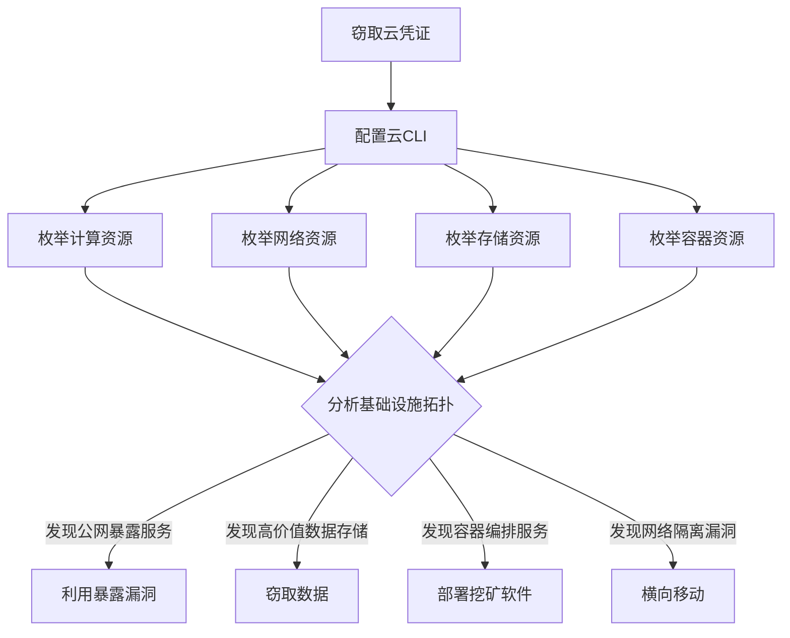

# 云基础设施发现 (T1580)

## 一句话通俗理解

枚举云环境中的基础设施资源——攻击者查看云上的虚拟机、网络、存储等基础设施配置，就像拿到大楼建筑图纸后详细了解每层的房间布局和线路走向。

## 难度等级

- ⭐⭐ 中级（需要一定基础）

## 技术描述

云基础设施发现（T1580）是MITRE ATT&CK框架中的一种发现技术。

**通俗解释：**
云基础设施包括计算资源（虚拟机）、网络资源（虚拟网络、防火墙规则）、存储资源（存储桶、磁盘）和容器资源（Kubernetes集群）。攻击者窃取云凭证后，会逐一枚举这些资源——不仅要知道有什么，更要知道它们之间的网络连接关系和配置情况。这就像拿到大楼的电气和网络布线图，搞清楚哪些房间之间有秘密通道。

**技术原理：**
1. 使用云CLI或API枚举基础设施资源
2. AWS中：`aws ec2 describe-instances`（虚拟机）、`aws s3 ls`（存储）、`aws rds describe-db-instances`（数据库）
3. Azure中：`az vm list`（虚拟机）、`az network vnet list`（网络）、`az aks list`（容器集群）
4. GCP中：`gcloud compute instances list`、`gcloud container clusters list`
5. Docker/Kubernetes中：`docker ps`、`kubectl get pods`

**用途与影响：**
云基础设施发现帮助攻击者：了解云环境的规模和拓扑；识别网络隔离和访问控制策略；发现暴露在公网的服务；定位存储敏感数据的资源；寻找可横向移动的路径；判断挖矿或勒索攻击的最佳目标。

## 子技术列表

**该技术没有子技术。**

## 攻击流程

### 典型攻击流程

```
获取凭证 --> 枚举基础设施 --> 分析拓扑 --> 选择攻击目标
```



**步骤详解：**

1. **枚举计算资源**
   - 通俗描述：查看云上有多少台服务器
   - 技术细节：`aws ec2 describe-instances` 列出所有虚拟机及其配置
   - 常用工具：AWS CLI, Azure CLI, gcloud

2. **枚举网络资源**
   - 通俗描述：查看云网络的隔离和安全配置
   - 技术细节：`aws ec2 describe-security-groups` 查看防火墙规则
   - 常用工具：AWS CLI, az network

3. **枚举存储资源**
   - 通俗描述：查看云上的存储设备
   - 技术细节：`aws s3 ls`、`aws rds describe-db-instances`
   - 常用工具：AWS CLI, az storage

4. **枚举容器资源**
   - 通俗描述：查看容器和Kubernetes集群
   - 技术细节：`kubectl get pods --all-namespaces`
   - 常用工具：kubectl, docker

## 真实案例

### 案例1：Scattered Spider - 多云基础设施枚举

- **时间**: 2022年-2023年
- **目标**: 全球科技、电信、游戏公司
- **攻击组织**: Scattered Spider
- **手法**: Scattered Spider在获得云环境初始访问后，系统性地枚举云基础设施资源。在AWS环境中使用 `aws ec2 describe-instances` 遍历所有区域的EC2实例，通过 `aws rds describe-db-instances` 枚举数据库实例，使用 `aws lambda list-functions` 发现Serverless函数。在Azure环境中，使用 `az resource list` 列举所有订阅中的资源类型。他们特别关注暴露的公网IP、开放的安全组规则和数据存储服务的配置。
- **影响**: 多家大型科技公司数据被窃取
- **参考链接**: [MITRE - Scattered Spider](https://attack.mitre.org/groups/G0132/)

### 案例2：TeamTNT - 容器基础设施发现

- **时间**: 2020年-2021年
- **目标**: 云原生环境、容器化应用
- **攻击组织**: TeamTNT
- **手法**: TeamTNT在入侵云环境后重点进行Docker容器基础设施发现。使用 `docker ps` 列出运行中的容器，`docker images` 列出所有镜像，`docker info` 获取Docker引擎配置。在AWS ECS环境中，使用 `aws ecs list-clusters` 和 `aws ecs list-tasks` 枚举容器编排服务。在Kubernetes环境中，使用 `kubectl get pods --all-namespaces` 和 `kubectl get nodes` 列出Pods和节点。还使用 `kubectl get secrets` 尝试提取敏感配置。容器发现结果用于部署挖矿恶意软件。
- **影响**: 大量云服务器被用于加密货币挖矿
- **参考链接**: [Aqua Security - TeamTNT](https://blog.aquasec.com/teamtnt-container-discovery)

### 案例3：APT29 - Azure资源发现

- **时间**: 2021年-2022年
- **目标**: 全球政府机构、云服务提供商
- **攻击组织**: APT29（Nobelium）
- **手法**: APT29在针对云环境的攻击中使用Azure PowerShell cmdlet和Microsoft Graph API枚举Azure租户中的基础设施资源。使用 `Get-AzResource` 列出所有资源组和资源类型，使用 `Get-AzVM` 列举虚拟机配置。还使用 `Get-AzStorageAccount` 和 `Get-AzStorageContainer` 枚举存储账户。通过Azure Resource Graph API执行KQL查询跨订阅搜索资源，获取Azure环境的全貌。
- **影响**: 政府机构云环境被渗透
- **参考链接**: [Microsoft - Nobelium](https://www.microsoft.com/security/blog/2021/05/28/breaking-down-nobeliums-cloud-account-compromise/)

### 案例4：Persistence Group - GCP基础设施探测

- **时间**: 2021年-2022年
- **目标**: 全球科技公司
- **攻击组织**: 持久化攻击者
- **手法**: 攻击者在入侵GCP项目后使用 `gcloud compute instances list` 和 `gcloud compute instances describe` 枚举所有计算实例及其元数据。通过 `gcloud compute firewall-rules list` 获取防火墙规则，识别对外暴露的服务端口。还使用 `gcloud iam service-accounts list` 枚举服务账户。发现具有 `compute.admin` 或 `iam.admin` 角色的服务账户后，利用其权限创建后门服务账户确保长期访问。
- **影响**: 企业云环境被长期后门化
- **参考链接**: [MITRE - Cloud Discovery](https://attack.mitre.org/tactics/TA0007/)

## 红队视角

> ⚠️ **免责声明**：以下内容仅用于合法的安全测试、渗透测试和教育目的。未经授权对他人系统进行测试是违法行为。

### 实战技巧

1. **使用Cloud Shell快速枚举**
   云控制台的Cloud Shell中已配置好认证，可直接执行CLI命令。

2. **使用Resource Graph跨订阅搜索**
   Azure Resource Graph支持快速跨订阅搜索特定资源类型。

3. **检查Kubernetes RBAC**
   使用 `kubectl auth can-i --list` 检查当前K8s权限，了解可以访问哪些资源。

### 常用工具

| 工具名称 | 用途 | 平台 | 链接 |
|----------|------|------|------|
| AWS CLI | AWS基础设施枚举 | 跨平台 | aws.amazon.com/cli |
| Azure CLI | Azure基础设施枚举 | 跨平台 | docs.microsoft.com/cli |
| gcloud | GCP基础设施枚举 | 跨平台 | cloud.google.com/sdk |
| kubectl | Kubernetes资源查询 | 跨平台 | kubernetes.io |
| docker | 容器管理 | 跨平台 | docker.com |

### 注意事项

- 云API调用会被记录在CloudTrail/Audit Logs中
- 大规模资源列举可能触发CSPM（云安全态势管理）告警
- 某些列举操作需要特定IAM权限，注意最小权限原则

## 蓝队视角

### 检测要点

1. **异常的云资源枚举**
   - 日志来源：AWS CloudTrail、Azure Activity Log
   - 关注字段：EC2 `DescribeInstances`、S3 `ListBuckets`、K8s `list pods`
   - 异常特征：非运维角色执行大规模资源列举

2. **跨服务类型枚举**
   - 日志来源：CloudTrail
   - 关注字段：同一凭证短时间内枚举多种服务
   - 异常特征：用户突然访问不相关的服务类型

### 监控建议

- 监控云API调用中异常的资源列举操作
- 关注非管理员角色的 `List*` / `Describe*` API调用
- 使用CSPM工具检测异常的API枚举模式
- 监控Kubernetes审计日志中的 `list`、`get` 操作

## 检测建议

### 网络层检测

**检测方法：** 监控云基础设施枚举相关的网络流量，特别关注针对云资源 API 的批量 Describe/List 调用行为以及异常的地理位置请求模式。

**具体规则/命令示例：**
```
# 检测云 API 的批量 Describe* 和 List* 调用（如 DescribeInstances、ListBuckets）
# 关注同一 IAM 用户或角色在短时间内枚举多个云服务资源的异常模式
# 使用 AWS CloudTrail 或 Azure Activity Log 分析 API 调用的时间序列和来源 IP
```

### 应用层检测

**检测方法：** 监控云API调用中的基础设施枚举操作。

**AWS CloudTrail关键事件：**
- `DescribeInstances`：枚举EC2实例
- `ListBuckets`：枚举S3存储桶
- `DescribeDBInstances`：枚举数据库
- `ListClusters`：枚举容器集群

**Sigma规则示例：**
```yaml
title: Cloud Infrastructure Enumeration
status: experimental
description: Detects bulk infrastructure enumeration
logsource:
    product: aws
    service: cloudtrail
detection:
    selection:
        EventName:
            - 'DescribeInstances'
            - 'DescribeDBInstances'
            - 'ListBuckets'
            - 'ListClusters'
    condition: selection
level: medium
tags:
    - attack.t1580
```

## 缓解措施

### 优先级1：关键措施

**措施名称：** 实施最小权限IAM策略

**具体实施步骤：**
1. 使用IAM条件键控制资源列举权限
2. 禁用全局资源扫描权限（如 `List*`、`Describe*` 通配权限）

### 优先级2：重要措施

**措施名称：** 启用基础设施审计

**具体实施步骤：**
1. 启用CloudTrail/Audit Logs
2. 使用AWS Config或Azure Policy监控配置变更

### 优先级3：建议措施

**措施名称：** 使用SCP限制组织级别权限

**具体实施步骤：**
1. 使用AWS Organizations SCPs限制大面积资源列举
2. 启用Azure PIM进行JIT权限提升

### MITRE ATT&CK 缓解措施映射

| 缓解措施ID | 缓解措施名称 | 适用性 | 说明 |
|------------|-------------|--------|------|
| M1026 | Privileged Account Management | 适用 | 限制IAM权限 |
| M1037 | Filter Network Traffic | 适用 | 限制API访问 |
| M1047 | Audit | 适用 | 启用基础设施审计 |

## 动手实验

> ⚠️ **重要提示**：所有实验必须在隔离的实验室环境中进行，禁止对未授权的真实系统进行测试。

### 实验环境准备

**所需工具：** AWS/Azure免费账户或Docker环境

### 实验1：AWS基础设施枚举（初级）

**实验目标：** 使用AWS CLI枚举云基础设施资源。

**实验步骤：**
1. 配置AWS CLI
2. 执行 `aws ec2 describe-instances` 查看虚拟机
3. 执行 `aws ec2 describe-security-groups` 查看安全组
4. 执行 `aws s3 ls` 查看存储桶

**预期结果：** 看到云基础设施的资源列表和配置。

**学习要点：** 理解攻击者如何通过CLI枚举云基础设施。

### 实验2：Kubernetes资源列举（中级）

**实验目标：** 了解Kubernetes环境中的资源枚举方法。

**实验步骤：**
1. 配置kubectl连接到K8s集群
2. 执行 `kubectl get nodes` 查看集群节点
3. 执行 `kubectl get pods --all-namespaces` 查看所有Pods
4. 执行 `kubectl get services --all-namespaces` 查看服务

**预期结果：** 看到K8s集群中的各类资源。

## 术语解释

| 术语 | 英文原名 | 通俗解释 |
|------|----------|----------|
| 基础设施 | Infrastructure | 云计算的基础组件，包括计算、网络、存储等 |
| IAM | Identity and Access Management | 身份和访问管理，控制谁能访问云资源的系统 |
| CSPM | Cloud Security Posture Management | 云安全态势管理，自动检测云配置问题的工具 |
| RBAC | Role-Based Access Control | 基于角色的访问控制，Kubernetes中的权限管理机制 |
| K8s | Kubernetes | 容器编排平台，管理容器化应用的部署和扩展 |

## 参考资料

### 官方文档

- [MITRE ATT&CK - T1580](https://attack.mitre.org/techniques/T1580/)
- [AWS CLI Documentation](https://aws.amazon.com/cli/)
- [Kubernetes Documentation](https://kubernetes.io/docs/home/)

### 安全报告

- [Aqua Security - TeamTNT](https://blog.aquasec.com/teamtnt-container-discovery)
- [Microsoft - Nobelium](https://www.microsoft.com/security/blog/2021/05/28/breaking-down-nobeliums-cloud-account-compromise/)
- [CrowdStrike - Scattered Spider](https://www.crowdstrike.com/blog/scattered-spider-cloud-activity/)

### 工具与资源

- [ScoutSuite](https://github.com/nccgroup/ScoutSuite)
- [kube-bench](https://github.com/aquasecurity/kube-bench)
- [AWS Config](https://aws.amazon.com/config/)
