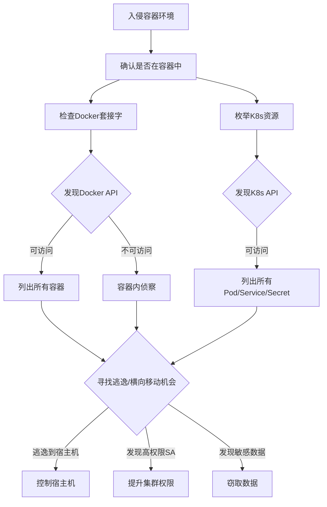

# 容器和资源发现 (T1613)

## 一句话通俗理解

查看容器环境中的信息和API——攻击者在云原生环境中用 `docker ps` 或 `kubectl get pods` 查看运行中的容器，就像小偷进入物流仓库后先查看有哪些包裹和货架。

## 难度等级

- ⭐⭐ 中级（需要一定基础）

## 技术描述

容器和资源发现（T1613）是MITRE ATT&CK框架中的一种发现技术。

**通俗解释：**
越来越多的应用运行在容器中（如Docker）和Kubernetes集群里。攻击者入侵容器环境后，会查看有哪些容器在运行、有哪些镜像可用、Kubernetes集群中有哪些Pod。为什么这么做？因为容器通常是微服务架构，一个容器可能只运行一个小应用组件，攻击者需要找到：哪个容器有漏洞可以逃逸到宿主机、哪个容器存有数据库密码、哪个服务账户有更高的权限。

**技术原理：**
1. 在Docker环境中：`docker ps` 列出容器，`docker images` 查看镜像，`docker info` 查看引擎配置
2. 在Kubernetes中：`kubectl get pods --all-namespaces` 列出所有Pod，`kubectl get nodes` 查看节点
3. 检查Docker套接字（`/var/run/docker.sock`）是否可访问
4. 通过读取 `/proc/1/cgroup` 判断是否运行在容器中
5. 检查环境变量中的 `KUBERNETES_SERVICE_HOST` 判断是否在K8s Pod中

**用途与影响：**
容器发现帮助攻击者：确认自身是否在容器中运行；定位其他容器和服务；寻找容器逃逸到宿主机的路径；发现高权限Service Account；利用配置错误的Docker API和Kubernetes API；部署挖矿容器到尽可能多的节点。

## 子技术列表

**该技术没有子技术。**

## 攻击流程

### 典型攻击流程

```
进入容器 --> 确认环境 --> 枚举资源 --> 寻找逃逸或横向移动
```



**步骤详解：**

1. **确认容器环境**
   - 通俗描述：检查自己是否运行在容器中
   - 技术细节：读取 `/proc/1/cgroup` 或检查 `/.dockerenv` 文件是否存在
   - 常用工具：cat, ls

2. **检查Docker API可访问性**
   - 通俗描述：查看能否连接到Docker管理接口
   - 技术细节：检查 `/var/run/docker.sock` 文件是否可读写
   - 常用工具：curl, docker

3. **枚举Kubernetes资源**
   - 通俗描述：查看K8s集群中有哪些资源
   - 技术细节：`kubectl get pods --all-namespaces`、`kubectl get secrets`
   - 常用工具：kubectl, curl

4. **寻找逃逸路径**
   - 通俗描述：尝试从容器中逃到宿主机
   - 技术细节：使用Docker套接字挂载宿主机根目录
   - 常用工具：docker, nsenter

## 真实案例

### 案例1：TeamTNT - 云原生容器发现与逃逸

- **时间**: 2020年-2022年
- **目标**: 全球云托管环境和Kubernetes集群
- **攻击组织**: TeamTNT
- **手法**: TeamTNT使用自动化脚本进行容器发现。首先检查 `/proc/1/cgroup` 和 `/.dockerenv` 文件判断是否在容器中。确认容器环境后尝试连接Docker套接字（`/var/run/docker.sock`），如果成功则执行 `docker ps` 列出所有容器，`docker images` 查看可用镜像，通过 `docker run` 挂载宿主机根目录实现容器逃逸。在Kubernetes环境中使用 `kubectl get pods` 枚举Pod，尝试获取高权限Service Account的Token提升权限。发现的容器资源信息用于部署加密货币挖矿容器负载。
- **影响**: 大量云服务器被用于加密货币挖矿
- **参考链接**: [MITRE - TeamTNT](https://attack.mitre.org/groups/G0139/)

### 案例2：SCARLETEEL - 针对Kubernetes的容器发现

- **时间**: 2022年
- **目标**: 云原生应用和微服务架构
- **攻击组织**: SCARLETEEL
- **手法**: SCARLETEEL通过入侵CI/CD管道或暴露的Web应用进入容器环境后，立即执行 `kubectl get nodes`、`kubectl get pods --all-namespaces` 和 `kubectl get services` 枚举集群中的Pod、节点和服务。使用 `kubectl cluster-info` 获取集群信息，使用 `kubectl get secrets` 尝试获取存储的敏感凭证。还枚举容器的环境变量以搜索AWS Access Keys等云凭证，用于规划进一步的横向移动和数据窃取。
- **影响**: 云原生应用环境被渗透，敏感数据被窃取
- **参考链接**: [Sysdig - SCARLETEEL](https://sysdig.com/blog/cloud-breach-eks-clusters/)

### 案例3：Kinsing - 容器逃逸活动

- **时间**: 2021年-2023年
- **目标**: 云原生工作负载
- **攻击组织**: Kinsing
- **手法**: Kinsing恶意软件针对暴露的Docker和Kubernetes环境。感染后执行容器内检查判断运行环境，包括读取 `/proc/1/cgroup` 确认容器上下文，检查 `/.dockerenv` 文件，以及查询环境变量 `KUBERNETES_SERVICE_HOST` 判断是否在Kubernetes Pod中。Kinsing尝试通过已挂载的Docker套接字执行 `docker ps` 和 `docker images`，从容器内部枚举宿主机上的其他容器。当发现同一宿主机上存在高价值容器（如数据库、Web服务器）时，尝试攻击这些容器以获得更多凭证或数据。
- **影响**: 大量容器环境被入侵用于挖矿
- **参考链接**: [Trend Micro - Kinsing](https://www.trendmicro.com/vinfo/us/security/news/cybercrime-and-digital-threats/kinsing-malware-container-escape)

## 红队视角

> ⚠️ **免责声明**：以下内容仅用于合法的安全测试、渗透测试和教育目的。未经授权对他人系统进行测试是违法行为。

### 实战技巧

1. **快速确认容器环境**
   检查 `/.dockerenv` 文件是否存在、`/proc/1/cgroup` 是否包含"docker"字符串。

2. **Docker套接字逃逸**
   如果 `/var/run/docker.sock` 可访问，执行 `docker run -v /:/mnt --privileged -it <image> /bin/bash` 挂载宿主机根目录。

3. **K8s Service Account令牌**
   默认情况下K8s会为Pod自动挂载Service Account令牌，路径：`/var/run/secrets/kubernetes.io/serviceaccount/token`

### 常用工具

| 工具名称 | 用途 | 平台 | 链接 |
|----------|------|------|------|
| docker | 容器管理 | Linux | docker.com |
| kubectl | K8s集群管理 | 跨平台 | kubernetes.io |
| cURL | API访问 | 跨平台 | 内置工具 |
| kubeletctl | kubelet API扫描 | 跨平台 | GitHub |

### 注意事项

- Docker套接字挂载是严重的安全风险，生产环境应避免
- K8s默认会为Pod自动挂载Service Account令牌
- 某些容器运行时（如containerd）可能没有docker命令

## 蓝队视角

### 检测要点

1. **容器内执行管理命令**
   - 日志来源：Kubernetes审计日志、Falco运行时检测
   - 关注字段：`kubectl get pods`、`docker ps` 在容器内的执行
   - 异常特征：非CI/CD容器执行集群管理命令

2. **Docker套接字访问**
   - 日志来源：文件系统监控
   - 关注字段：对 `/var/run/docker.sock` 的访问
   - 异常特征：非Docker守护进程的进程访问套接字

### 监控建议

- 使用Falco等运行时安全工具检测容器内的命令执行
- 审计Kubernetes API日志中对Pod、Secret的LIST/GET操作
- 监控Docker套接字的文件访问
- 监控容器内读取 `/proc/1/cgroup` 等容器标识文件的行为

## 检测建议

### 网络层检测

**检测方法：** 监控容器环境枚举相关的网络流量，特别关注针对 Docker Daemon API、Kubernetes API Server 的未经授权访问以及容器注册表的异常查询。

**具体规则/命令示例：**
```
# 检测针对 Docker Daemon API（TCP 2375/2376）来自非信任网络的访问流量
# 关注 Kubernetes API Server 中来自未授权 ServiceAccount 的资源枚举请求
# 使用 Zeek 分析 http 日志，检测容器编排 API 的异常调用模式（如批量 pod/node list）
```

### 主机层检测

**监控工具：**
- Falco：容器运行时安全监控
- Kubernetes审计日志：API请求记录
- Sysdig：系统调用监控

**Falco规则示例：**
```yaml
- rule: Detect Docker Socket Mount in Container
  desc: Detect attempts to access Docker socket from a container
  condition: container and fd.name = /var/run/docker.sock
  output: Docker socket accessed by container (user=%user.name command=%proc.cmdline)
  priority: WARNING
  tags: [container, mitre_discovery, T1613]
```

### Sigma规则示例

**Sigma规则示例：**
```yaml
title: Kubernetes Resource Enumeration via Kubectl
status: experimental
description: 检测使用kubectl命令枚举Kubernetes集群资源，可能表明攻击者正在进行容器环境发现
logsource:
    category: process_creation
    product: linux
detection:
    selection:
        Image|endswith: '/kubectl'
        CommandLine|contains:
            - 'get pods'
            - 'get services'
            - 'get nodes'
            - 'get secrets'
    condition: selection
level: medium
tags:
    - attack.t1613
```

## 缓解措施

### 优先级1：关键措施

**措施名称：** 避免挂载Docker套接字

**具体实施步骤：**
1. 不在容器内挂载Docker套接字
2. 仅在必要的CI/CD代理容器中使用且严格控制

### 优先级2：重要措施

**措施名称：** K8s最小权限Service Account

**具体实施步骤：**
1. 禁用自动挂载API凭证（`automountServiceAccountToken: false`）
2. 启用Kubernetes RBAC限制资源LIST/GET权限

### 优先级3：建议措施

**措施名称：** 容器运行时安全

**具体实施步骤：**
1. 使用只读根文件系统
2. 去除不必要的Capabilities（特别是CAP_SYS_ADMIN）
3. 部署网络策略限制容器间通信

### MITRE ATT&CK 缓解措施映射

| 缓解措施ID | 缓解措施名称 | 适用性 | 说明 |
|------------|-------------|--------|------|
| M1047 | Audit | 适用 | 启用K8s审计日志 |
| M1038 | Execution Prevention | 适用 | 限制容器内命令执行 |
| M1018 | User Account Management | 适用 | 管理Service Account权限 |

## 动手实验

> ⚠️ **重要提示**：所有实验必须在隔离的实验室环境中进行，禁止对未授权的真实系统进行测试。

### 实验环境准备

**所需工具：** Docker环境、Minikube（K8s集群）

### 实验1：Docker容器发现（初级）

**实验目标：** 学习在Docker环境中进行容器发现。

**实验步骤：**
1. 执行 `docker ps` 查看运行中的容器
2. 执行 `docker images` 查看可用镜像
3. 执行 `docker info` 查看Docker引擎配置
4. 读取 `/proc/1/cgroup` 判断容器环境

**预期结果：** 看到容器环境的各种资源和配置信息。

**学习要点：** 理解攻击者如何在容器环境中进行侦察。

### 实验2：Kubernetes资源枚举（中级）

**实验目标：** 学习在K8s集群中枚举资源。

**实验步骤：**
1. 执行 `kubectl get nodes` 查看集群节点
2. 执行 `kubectl get pods --all-namespaces` 查看所有Pod
3. 执行 `kubectl get secrets` 查看密钥
4. 访问 `/var/run/secrets/kubernetes.io/serviceaccount/token` 查看SA令牌

**预期结果：** 看到K8s集群的详细资源信息。

## 术语解释

| 术语 | 英文原名 | 通俗解释 |
|------|----------|----------|
| 容器 | Container | 轻量级的虚拟化环境，像一个独立的软件运行包 |
| Pod | Pod | Kubernetes中最小的部署单元，可以包含一个或多个容器 |
| Docker套接字 | Docker Socket | Docker守护进程的API接口文件，控制了它可以控制所有容器 |
| Service Account | Service Account | Kubernetes中的服务账户，Pod用它来访问API服务器 |
| 容器逃逸 | Container Escape | 从容器内部突破到宿主机系统的攻击技术 |

## 参考资料

### 官方文档

- [MITRE ATT&CK - T1613](https://attack.mitre.org/techniques/T1613/)
- [Kubernetes Documentation](https://kubernetes.io/docs/home/)
- [Docker Documentation](https://docs.docker.com/)

### 安全报告

- [Cisco Talos - TeamTNT](https://blog.talosintelligence.com/teamtnt-cloud-activity/)
- [Sysdig - SCARLETEEL](https://sysdig.com/blog/cloud-breach-eks-clusters/)
- [Trend Micro - Kinsing](https://www.trendmicro.com/vinfo/us/security/news/cybercrime-and-digital-threats/kinsing-malware-container-escape)

### 工具与资源

- [Falco - Runtime Security](https://falco.org/)
- [kube-bench - K8s Security Benchmark](https://github.com/aquasecurity/kube-bench)
- [kube-hunter - K8s Penetration Testing](https://github.com/aquasecurity/kube-hunter)
