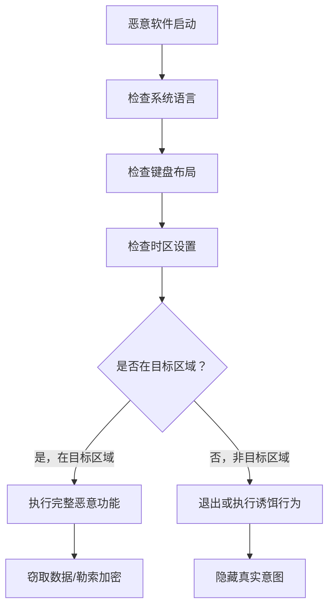

# 系统位置发现 (T1614)

## 一句话通俗理解

确定系统所处的物理或地理位置——攻击者通过检查系统语言、时区等信息判断电脑在哪个国家，就像通过口音能判断一个人来自哪里。

## 难度等级

- ⭐ 初级（新手可学）

## 技术描述

系统位置发现（T1614）是MITRE ATT&CK框架中的一种发现技术。

**通俗解释：**
很多恶意软件是有"目标"的——比如只攻击韩国的银行用户，或者只感染中东地区的政府机构。那么恶意软件怎么知道自己是不是在正确的目标电脑上呢？它通过检查系统语言、时区、键盘布局等信息来判断电脑的大致地理位置。就像通过一个人说的语言和口音，可以大概猜出他来自哪个国家。

**技术原理：**
1. 使用 `Get-WinSystemLocale` 获取系统区域设置
2. 使用 `Get-Culture` 或 `Get-UICulture` 获取用户语言设置
3. 查询注册表中的语言设置（`HKLM\...\Nls\Language\InstallLanguage`）
4. 检查键盘布局判断地区（如韩语键盘、日语键盘）
5. 查询时区（`Win32_TimeZone`）确认地理位置
6. 在Linux中检查 `$LANG` 环境变量或运行 `locale` 命令

**用途与影响：**
系统位置发现帮助攻击者：过滤非目标地区系统减少暴露（不在目标范围内直接退出）；确认目标系统在正确的国家和地区；调整恶意软件行为适配特定区域的语言和环境；避免在安全研究人员的蜜罐中触发恶意行为。

## 子技术列表

**该技术共有 1 个子技术：**

| 子技术ID | 中文名称 | 通俗解释 |
|----------|----------|----------|
| T1614.001 | 系统语言发现 | 通过系统语言和区域设置推断系统的大致地理位置 |

<details>
<summary><strong>展开查看各子技术详细说明</strong></summary>

### T1614.001 - 系统语言发现

**通俗理解：** 通过电脑的语言设置判断它在哪个国家。

**详细说明：**
攻击者通过系统语言和区域设置推断系统的大致地理位置。在Windows中使用 `Get-WinSystemLocale`、`Get-Culture` PowerShell cmdlet，或查询注册表中的语言设置。在Linux中检查 `$LANG` 环境变量。攻击者通过系统语言判断设备是否位于预期的目标地区，非目标地区的系统可能被跳过以降低检测风险。

</details>

## 攻击流程

### 典型攻击流程

```
检查语言 --> 检测时区 --> 判断地区 --> 决定行为
```



**步骤详解：**

1. **检查系统语言**
   - 通俗描述：查看系统的默认语言是什么
   - 技术细节：`Get-WinSystemLocale` 或 `Get-Culture`
   - 常用工具：PowerShell

2. **检查键盘布局**
   - 通俗描述：查看键盘设置判断地区
   - 技术细节：查询注册表 `HKCU\Keyboard Layout\Preload`
   - 常用工具：reg query

3. **检查时区**
   - 通俗描述：查看系统时区设置
   - 技术细节：`wmic TimeZone get Caption`
   - 常用工具：wmic.exe

4. **决定行为**
   - 通俗描述：根据位置判断是否执行恶意功能
   - 技术细节：匹配语言/时区与目标列表
   - 常用工具：无（代码逻辑）

## 真实案例

### 案例1：Lazarus Group - 语言感知恶意软件

- **时间**: 2019年-2022年
- **目标**: 韩国加密货币交易所、全球防务公司
- **攻击组织**: Lazarus Group
- **手法**: Lazarus组织在其恶意软件中嵌入系统语言判断逻辑。恶意代码调用 `GetSystemDefaultLangID` API获取系统默认语言ID，检查是否为韩语（0x0412）或英语。在针对韩国的攻击活动中，如果系统语言设置为韩语且在韩国IP范围内，恶意软件执行完整的键盘记录、屏幕捕获和文件窃取功能；如果语言不匹配则仅执行基本信息收集或直接退出。
- **影响**: 多国加密货币平台被入侵，资金被盗
- **参考链接**: [Kaspersky - Lazarus](https://securelist.com/lazarus-language-detection-and-targeting/102400/)

### 案例2：Kimsuky - 韩语系统确认

- **时间**: 2020年-2021年
- **目标**: 韩国统一部、外交机构
- **攻击组织**: Kimsuky
- **手法**: Kimsuky使用Visual Basic脚本检查受感染系统的键盘布局和系统语言。脚本通过读取注册表 `HKEY_CURRENT_USER\Keyboard Layout\Preload` 获取键盘布局，检查是否为韩语键盘。同时使用 `Get-WinSystemLocale` 检查系统区域设置。只有当系统语言和键盘布局均确认为韩语时，才执行第二阶段载荷，有效避免在非目标的蜜罐中暴露完整功能。
- **影响**: 韩国政府机构敏感信息被窃取
- **参考链接**: [CrowdStrike - Kimsuky](https://www.crowdstrike.com/blog/kimsuky-geographic-filtering-malware/)

### 案例3：Wizard Spider - 区域语言行为改变

- **时间**: 2019年-2021年
- **目标**: 全球多行业勒索软件受害者
- **攻击组织**: Wizard Spider（Conti/TrickBot）
- **手法**: Wizard Spider的Conti勒索软件和TrickBot木马具备区域语言检查功能以防止在独联体国家执行。恶意软件调用 `GetSystemDefaultLangID` 检查系统语言ID，维护排除语言列表包括俄语、乌克兰语、白俄罗斯语等。如果检测到系统语言为俄语系语言，勒索软件不会执行文件加密操作而是直接退出，避免在独联体国家触发执法行动。
- **影响**: 全球企业被勒索，但独联体国家豁免
- **参考链接**: [MITRE - Wizard Spider](https://attack.mitre.org/groups/G0102/)

## 红队视角

> ⚠️ **免责声明**：以下内容仅用于合法的安全测试、渗透测试和教育目的。未经授权对他人系统进行测试是违法行为。

### 实战技巧

1. **快速查看系统语言**
   PowerShell: `Get-WinSystemLocale | Select-Object Name`

2. **检查所有区域设置**
   `Get-Culture`、`Get-UICulture`、`Get-WinHomeLocation` 组合使用

3. **Linux区域设置**
   `echo $LANG` 或 `locale` 命令查看系统语言配置

### 常用工具

| 工具名称 | 用途 | 平台 | 链接 |
|----------|------|------|------|
| Get-WinSystemLocale | 查看系统区域 | Windows | 内置PowerShell |
| Get-Culture | 查看用户区域 | Windows | 内置PowerShell |
| GetSystemDefaultLangID | 获取系统语言ID | Windows | Windows API |
| locale | Linux区域设置 | Linux | 内置命令 |

### 注意事项

- 系统语言检测通常用于目标过滤，非目标系统可能只看到诱饵行为
- 有些恶意软件会使用多个维度（语言+时区+IP）综合判断位置
- 蜜罐系统可以配置非目标区域语言来触发恶意软件的隐藏行为

## 蓝队视角

### 检测要点

1. **异常的语言信息查询**
   - 日志来源：Sysmon Event ID 1
   - 关注字段：`Get-WinSystemLocale`、`Get-Culture` 的PowerShell调用
   - 异常特征：非管理员执行区域设置查询

2. **键盘布局读取**
   - 日志来源：注册表访问审计
   - 关注字段：读取 `Keyboard Layout\Preload` 键值
   - 异常特征：脚本或Office宏读取键盘布局

### 监控建议

- 监控对系统语言注册表的读取行为
- 审计PowerShell区域设置相关的cmdlet调用
- 关注恶意软件中读取区域设置后执行条件分支的行为模式
- 监控Linux系统中读取 `$LANG` 环境变量的行为

## 检测建议

### 网络层检测

**检测方法：** 监控系统位置发现相关的网络流量，特别关注通过 GeoIP API、Wi-Fi 定位服务或 DNS 位置查询获取系统物理位置信息的异常行为。

**具体规则/命令示例：**
```
# 检测内部主机向外部 GeoIP 服务（如 ip-api.com、ipinfo.io）发起的系统位置查询请求
# 关注 DNS 查询中的异常位置相关域名解析请求
# 使用 Zeek 分析 http 和 dns 日志，检测位置信息获取 API 的异常调用
```

### 主机层检测

**Windows事件ID：**
- 事件ID 4688：进程创建
- 事件ID 4104：PowerShell脚本
- Sysmon Event ID 1：进程创建

**Sigma规则示例：**
```yaml
title: System Language Discovery via PowerShell
status: experimental
description: Detects PowerShell commands checking system locale
logsource:
    category: process_creation
    product: windows
detection:
    selection:
        CommandLine|contains:
            - 'Get-WinSystemLocale'
            - 'Get-Culture'
            - 'GetSystemDefaultLangID'
    condition: selection
level: medium
tags:
    - attack.t1614
```

## 缓解措施

### 优先级1：关键措施

**措施名称：** 行为检测而非阻止

**具体实施步骤：**
1. 系统位置发现使用合法的系统API，难以完全阻止
2. 重点应放在检测和响应行为模式上

### 优先级2：重要措施

**措施名称：** API调用监控

**具体实施步骤：**
1. 监控地理相关的API调用链
2. 关联区域语言检查与后续的恶意行为

### 优先级3：建议措施

**措施名称：** 蜜罐混淆

**具体实施步骤：**
1. 在分析环境中配置非目标系统语言
2. 触发恶意软件的隐藏行为来观察完整功能

### MITRE ATT&CK 缓解措施映射

| 缓解措施ID | 缓解措施名称 | 适用性 | 说明 |
|------------|-------------|--------|------|
| M1040 | Behavior Prevention on Endpoint | 适用 | 行为模式检测 |
| M1047 | Audit | 适用 | 启用API调用审计 |

## 动手实验

> ⚠️ **重要提示**：所有实验必须在隔离的实验室环境中进行，禁止对未授权的真实系统进行测试。

### 实验环境准备

**所需工具：** Windows VM

### 实验1：查看系统位置设置（初级）

**实验目标：** 学习查看系统语言和区域设置。

**实验步骤：**
1. 执行 `Get-WinSystemLocale` 查看系统区域
2. 执行 `Get-Culture` 查看用户区域
3. 执行 `Get-UICulture` 查看UI语言
4. 执行 `wmic TimeZone get Caption` 查看时区

**预期结果：** 看到系统的语言、区域和时区设置。

**学习要点：** 理解恶意软件如何通过这些信息判断系统位置。

### 实验2：检查键盘布局（初级）

**实验目标：** 学习查看键盘布局设置。

**实验步骤：**
1. 执行 `reg query "HKCU\Keyboard Layout\Preload"` 查看键盘布局
2. 执行 `Get-WinHomeLocation` 查看Windows位置配置

**预期结果：** 看到键盘布局和位置配置信息。

## 术语解释

| 术语 | 英文原名 | 通俗解释 |
|------|----------|----------|
| 区域设置 | Locale | 系统和应用程序的语言和地区格式配置 |
| 键盘布局 | Keyboard Layout | 键盘按键对应的文字布局，不同语言有不同的布局 |
| 时区 | Time Zone | 地球上不同地区的标准时间差异 |
| 蜜罐 | Honeypot | 专门设置的诱捕系统，用来诱骗和检测攻击者 |
| API | Application Programming Interface | 应用程序编程接口，程序之间通信的约定 |

## 参考资料

### 官方文档

- [MITRE ATT&CK - T1614](https://attack.mitre.org/techniques/T1614/)
- [MITRE ATT&CK - T1614.001](https://attack.mitre.org/techniques/T1614/001/)
- [Microsoft - GetSystemDefaultLangID](https://learn.microsoft.com/en-us/windows/win32/api/winnls/nf-winnls-getsystemdefaultlangid)

### 安全报告

- [Kaspersky - Lazarus Language Detection](https://securelist.com/lazarus-language-detection-and-targeting/102400/)
- [CrowdStrike - Kimsuky Geographic Filtering](https://www.crowdstrike.com/blog/kimsuky-geographic-filtering-malware/)
- [FireEye - APT33 Geographic Targeting](https://www.fireeye.com/blog/threat-research/2019/09/apt33-geographic-region-filtering.html)

### 工具与资源

- [PowerShell Get-WinSystemLocale](https://learn.microsoft.com/en-us/powershell/module/international/get-winsystemlocale)
- [Win32_TimeZone WMI Class](https://learn.microsoft.com/en-us/windows/win32/cimwin32prov/win32-timezone)
