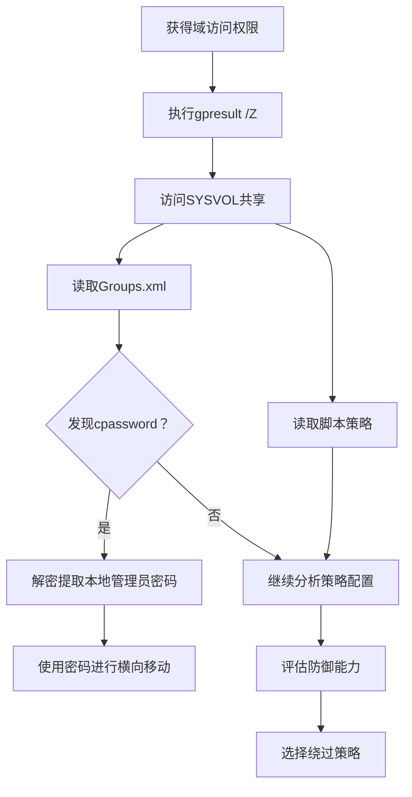

# 组策略发现 (T1615)

## 一句话通俗理解

查看域组策略配置信息——攻击者用 `gpresult` 或访问SYSVOL共享了解组织的安全设置，就像小偷先摸清大楼的安保制度和巡逻时间表。

## 30秒速查卡

| 维度 | 你需要知道的 |
|------|-------------|
| 这是什么？ | 攻击者使用 `gpresult /Z`、`Get-GPO`、访问 SYSVOL 共享读取组策略文件，分析安全审计配置、密码策略、软件部署策略，并搜索 Groups.xml 中的 cpassword（加密密码） |
| 为什么危险？ | 组策略暴露了组织的安全基线（审计策略、AppLocker 规则），Groups.xml 中的 cpassword 可被直接解密提取本地管理员密码——这是经典的横向移动入口 |
| 谁需要关心？ | SOC分析师、AD管理员、蓝队威胁狩猎、任何需要检测组策略异常访问的安全人员 |
| 你的第一步防御 | 监控 `gpresult /Z` 从非域控主机执行；审计 SYSVOL 共享的非域控访问（Event ID 5140）；从 Groups.xml 中移除所有 cpassword，使用 LAPS |
| 如果只做一件事 | 对非 IT 管理人员执行 `gpresult /Z` 或访问 SYSVOL 中的 Groups.xml 立即告警——这是攻击者在"偷公司安保制度" |

## 难度等级

- ⭐⭐ 中级（需要一定基础）

## 技术描述

组策略发现（T1615）是MITRE ATT&CK框架中的一种发现技术。

**通俗解释：**
组策略是Windows域环境中用来集中管理所有电脑和用户设置的机制——比如密码策略、软件安装、启动脚本等。攻击者入侵域环境后，会查看组策略配置来了解：组织的安全基线（审计策略、密码要求）、有没有部署杀毒软件和EDR、登录脚本中是否包含明文密码。最经典的是，早期Windows的组策略中有一个"隐藏的密码"漏洞（cpassword），攻击者可以直接从SYSVOL共享中提取域管理员密码。

**技术原理：**
1. 使用 `gpresult /Z` 获取应用到当前计算机的详细策略结果
2. 通过SYSVOL共享（`\\\\&lt;domain&gt;\\SYSVOL\\&lt;domain&gt;\\Policies\\`）直接读取组策略文件
3. 使用PowerShell的 `Get-GPO -All` 列出所有组策略对象
4. 使用 `Get-GPOReport` 导出详细的策略报告
5. 检查Groups.xml等首选项文件中的加密密码（cpassword）

**用途与影响：**
组策略发现帮助攻击者：了解目标的安全审计和防御配置；提取Groups.xml中存储的管理员密码（cpassword）；发现通过GPO分发的软件（可用于横向移动）；了解登录脚本和启动脚本的内容；评估组织安全成熟度选择攻击策略。

## 子技术列表

**该技术没有子技术。**

## 攻击流程

### 典型攻击流程

```
执行gpresult --> 访问SYSVOL --> 提取密码 --> 利用策略缺陷
```



**步骤详解：**

1. **获取组策略结果**
   - 通俗描述：用gpresult查看当前应用的策略
   - 技术细节：`gpresult /Z` 显示所有策略的详细配置
   - 常用工具：gpresult.exe

2. **访问SYSVOL共享**
   - 通俗描述：通过网络共享直接读取策略文件
   - 技术细节：`dir \\\\``&lt;domain&gt;``\\SYSVOL\\``&lt;domain&gt;``\\Policies\\`
   - 常用工具：net.exe, dir.exe

3. **提取策略凭据**
   - 通俗描述：检查Groups.xml中是否存储了密码
   - 技术细节：使用 `Get-GPPPassword` 解密cpassword字段
   - 常用工具：PowerShell脚本, gpp-decrypt

4. **分析安全配置**
   - 通俗描述：查看审计策略和安全设置
   - 技术细节：关注审计配置、软件限制策略、AppLocker设置
   - 常用工具：gpresult.exe

## 真实案例

### 案例1：APT29 - 组策略分析用于横向移动

- **时间**: 2020年-2021年
- **目标**: 美国政府机构、IT供应链
- **攻击组织**: APT29（Nobelium）
- **手法**: APT29在SolarWinds攻击活动中使用 `gpresult /Z` 获取详细的策略结果集，分析目标环境的安全策略配置。通过SYSVOL共享直接浏览组策略文件，寻找可能包含凭据的策略文件（特别是Groups.xml中的cpassword字段）。他们还评估组策略中的软件部署策略，识别通过GPO自动分发的软件和脚本，规划通过GPO传播的后门植入机会。
- **影响**: 多个美国政府部门网络被长期渗透
- **参考链接**: [Mandiant - APT29](https://www.mandiant.com/resources/apt29-group-policy-discovery)

### 案例2：FIN6 - 通过组策略发现服务账户密码

- **时间**: 2017年-2020年
- **目标**: 全球零售、餐饮、酒店POS系统
- **攻击组织**: FIN6
- **手法**: FIN6组织在入侵零售网络后，访问域控制器的SYSVOL共享以发现组策略中嵌入的本地管理密码。使用 `dir \\\\&lt;domain&gt;\\SYSVOL\\`<domain>`\\Policies\\` 递归遍历所有GPO目录，特别关注Groups.xml文件。使用解密工具破解cpassword字段，恢复出本地管理员密码，随后使用WMI和PsExec进行横向移动。
- **影响**: 数千家零售企业的支付系统被入侵
- **参考链接**: [FireEye - FIN6](https://www.fireeye.com/blog/threat-research/2019/01/fin7-group-policy-discovery.html)

### 案例3：APT3 - 组策略审计规避分析

- **时间**: 2015年-2018年
- **目标**: 美国防务承包商、航空航天
- **攻击组织**: APT3（Gothic Panda）
- **手法**: APT3使用 `gpresult /V` 和 `gpresult /Z` 获取详细的组策略报告，分析目标环境部署的审计策略和安全设置。特别关注审计账户登录事件、审计对象访问、审计进程跟踪等配置，以及Windows Defender和AppLocker的策略。通过了解哪些事件被审计、哪些应用执行被阻止，APT3调整其工具和后门行为以规避检测。
- **影响**: 美国防务承包商敏感数据被窃取
- **参考链接**: [MITRE - APT3](https://attack.mitre.org/groups/G0022/)

### 案例4：Ember Bear - SYSVOL策略凭据提取

- **时间**: 2021年-2022年
- **目标**: 乌克兰和东欧政府机构
- **攻击组织**: Ember Bear（UAC-0056）
- **手法**: Ember Bear组织使用自定义工具访问SYSVOL共享，枚举所有组策略对象。编写脚本遍历 `\\``&lt;domain&gt;``\\SYSVOL\\```<domain>```\\Policies\\` 下的所有策略目录，搜索包含加密密码的策略文件。使用公开工具（如 `Get-GPPPassword`）解密Groups.xml中的cpassword字段，将发现的本地管理员密码添加到凭证库中用于后续横向移动。
- **影响**: 东欧政府机构网络被渗透
- **参考链接**: [MITRE - Ember Bear](https://attack.mitre.org/groups/G0114/)

## 红队视角

> ⚠️ **免责声明**：以下内容仅用于合法的安全测试、渗透测试和教育目的。未经授权对他人系统进行测试是违法行为。

### 实战技巧

1. **快速提取Groups.xml密码**
   PowerShell一行命令：`Get-ChildItem -Path "\\\\&lt;domain&gt;\\SYSVOL\\&lt;domain&gt;\\Policies\\" -Recurse -Filter "Groups.xml" | Get-GPPPassword`

2. **使用gpresult获取完整策略**
   `gpresult /Z` 提供最详细的策略结果集，包括所有应用的GPO及其设置。

3. **SYSVOL遍历**
   通过 `dir /s \\\\`<dc>`\\SYSVOL\\`<domain>`\\Policies\\` 递归列出所有策略文件。

### 常用工具

| 工具名称 | 用途 | 平台 | 链接 |
|----------|------|------|------|
| gpresult | 查看组策略结果 | Windows | 内置命令 |
| Get-GPO | 列出所有GPO | Windows | 内置PowerShell模块 |
| Get-GPPPassword | 解密Groups.xml密码 | PowerShell | PowerSploit |
| gpp-decrypt | Linux端cpassword解密 | Linux | GitHub |

### 注意事项

- Windows 10/Server 2016+不再在Groups.xml中存储cpassword
- 访问SYSVOL需要域用户权限
- 频繁的SYSVOL读取可能触发异常检测

## 蓝队视角

### 检测要点

1. **异常gpresult执行**
   - 日志来源：Sysmon Event ID 1
   - 关注字段：`gpresult.exe` 的命令行参数
   - 异常特征：非管理员工作站执行gpresult /Z

2. **SYSVOL非域控访问**
   - 日志来源：Windows Event ID 5140
   - 关注字段：对SYSVOL共享的批量文件读取
   - 异常特征：非域控制器系统大量读取策略文件

### 监控建议

- 监控 `gpresult.exe` 的异常执行，特别是非IT人员的工作站
- 审计SYSVOL共享的非域控访问
- 监控PowerShell `Get-GPO` cmdlet的异常调用
- 关注解密Groups.xml中cpassword的工具执行

## 检测建议

### 网络层检测

**检测方法：** 监控组策略枚举相关的网络流量，特别关注通过 SMB 协议访问 SYSVOL 共享中的 GPO 模板文件以及 LDAP 查询中的组策略容器枚举行为。

**具体规则/命令示例：**
```
# 检测非域控主机对 SYSVOL 共享（\\domain\SYSVOL）中 GPO 文件的批量读取流量
# 关注 LDAP 查询中针对 CN=Policies,CN=System 容器的枚举操作
# 使用 Zeek 分析 smb_files 和 ldap_search 日志，检测组策略对象访问的异常模式
```

### 主机层检测

**Windows事件ID：**
- 事件ID 4688：进程创建（监控gpresult.exe）
- 事件ID 5140：网络共享对象已访问（监控SYSVOL访问）
- 事件ID 4104：PowerShell脚本（监控Get-GPO）

**用人话说：** 这条规则在监控有人执行 `gpresult` 查看组策略配置。攻击者为什么要查你的组策略？两个目的：一是了解安全基线——你开了哪些审计、有没有部署 AppLocker、EDR 策略是什么样的，这样攻击者就知道哪些行为会被记录、哪些工具会被阻止；二是找密码——早期 Windows 的 Groups.xml 文件里会存储本地管理员密码的加密版本（cpassword），这个加密是已知的 AES 密钥，任何人都能解密。虽然 Windows 10 以后已经修复了这个问题，但很多老环境还在用。正常情况下，只有 AD 管理员在做策略审计时才会用 `gpresult /Z`。

**Sigma规则示例：**
```yaml
title: Group Policy Discovery via gpresult
status: experimental
description: Detects gpresult command execution
logsource:
    category: process_creation
    product: windows
detection:
    selection:
        CommandLine|contains: 'gpresult'
    condition: selection
level: medium
tags:
    - attack.t1615
```

## 缓解措施

### 优先级1：关键措施

**措施名称：** 移除组策略中的存储密码

**具体实施步骤：**
1. 从Groups.xml和其他首选项文件中移除所有cpassword
2. 使用Microsoft LAPS管理本地管理员密码

### 优先级2：重要措施

**措施名称：** 限制SYSVOL访问

**具体实施步骤：**
1. 仅授权需要读取策略的管理员访问SYSVOL
2. 审计所有SYSVOL访问行为

### 优先级3：建议措施

**措施名称：** 定期审计组策略

**具体实施步骤：**
1. 定期检查组策略首选项文件是否包含凭据
2. 审核GPO的修改和读取操作

### MITRE ATT&CK 缓解措施映射

| 缓解措施ID | 缓解措施名称 | 适用性 | 说明 |
|------------|-------------|--------|------|
| M1026 | Privileged Account Management | 适用 | 限制SYSVOL访问 |
| M1027 | Password Policies | 适用 | 使用LAPS管理密码 |
| M1047 | Audit | 适用 | 启用策略访问审计 |

## 动手实验

> ⚠️ **重要提示**：所有实验必须在隔离的实验室环境中进行，禁止对未授权的真实系统进行测试。

### 实验环境准备

**所需工具：** Windows VM（域环境）

### 实验1：查看组策略结果（初级）

**实验目标：** 学习使用gpresult查看应用的策略。

**实验步骤：**
1. 执行 `gpresult /R` 查看策略摘要
2. 执行 `gpresult /Z` 查看详细策略
3. 执行 `gpresult /H report.html` 导出HTML报告

**预期结果：** 看到当前系统应用的组策略配置。

**学习要点：** 理解攻击者如何通过gpresult了解组织的安全配置。

### 实验2：SYSVOL浏览（中级）

**实验目标：** 了解通过SYSVOL查看策略文件的方法。

**实验步骤：**
1. 访问 `\\\\``&lt;domain&gt;``\\SYSVOL\\``<domain>``\\Policies\\`
2. 使用 `dir /s` 递归列出策略文件
3. 搜索Groups.xml文件

**预期结果：** 看到组策略文件的存储结构和内容。

## 术语解释

| 术语 | 英文原名 | 通俗解释 |
|------|----------|----------|
| 组策略 | Group Policy | Windows集中管理计算机和用户设置的机制，像一个公司的规章制度 |
| SYSVOL | System Volume | 域控制器上的共享文件夹，存储组策略文件和登录脚本 |
| GPO | Group Policy Object | 组策略对象，包含一组策略设置的集合 |
| cpassword | Cached Password | 早期Windows组策略中存储的加密密码（有已知解密方法） |
| RSoP | Resultant Set of Policy | 策略结果集，应用到计算机的所有策略的汇总 |
| LAPS | Local Administrator Password Solution | 微软的本地管理员密码管理工具 |

## 参考资料

### 官方文档

- [MITRE ATT&CK - T1615](https://attack.mitre.org/techniques/T1615/)
- [Microsoft - Group Policy](https://learn.microsoft.com/en-us/windows/security/threat-protection/security-policy-settings/group-policy-management)

### 安全报告

- [Mandiant - APT29 Group Policy Analysis](https://www.mandiant.com/resources/apt29-group-policy-discovery)
- [FireEye - FIN6 Group Policy Attack](https://www.fireeye.com/blog/threat-research/2019/01/fin7-group-policy-discovery.html)
- [CrowdStrike - GPP Password Decryption](https://www.crowdstrike.com/blog/group-policy-preferences-password-security/)

### 工具与资源

- [PowerShell GroupPolicy Module](https://learn.microsoft.com/en-us/powershell/module/grouppolicy/)
- [Get-GPPPassword (PowerSploit)](https://github.com/PowerShellMafia/PowerSploit)
- [Microsoft LAPS](https://www.microsoft.com/en-us/download/details.aspx?id=46899)
